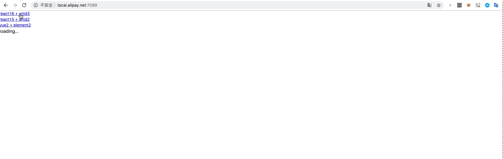

<p align="center">
  <a href="https://qiankun.umijs.org">
    
  </a>
</p>

<p align="center">
  <a href="https://www.npmjs.com/package/qiankun"></a>
  <a href="https://codecov.io/gh/umijs/qiankun"></a>
  <a href="https://www.npmjs.com/package/qiankun"></a>
  <a href="https://github.com/umijs/qiankun/actions/workflows/ci.yml"></a>
  <a href="https://github.com/umijs/dumi"></a>
</p>

# qiankun（乾坤）

> In Chinese, `qian(乾)` means heaven and `kun(坤)` earth. `qiankun` is the universe.

Qiankun enables you and your teams to build next-generation and enterprise-ready web applications leveraging [Micro Frontends](https://micro-frontends.org/). It is inspired by and based on [single-spa](https://github.com/CanopyTax/single-spa).

## 🤔 Motivation

A quick recap about the concept of `Micro Frontends`:

> Techniques, strategies and recipes for building a **modern web app** with **multiple teams** using **different JavaScript frameworks**. — [Micro Frontends](https://micro-frontends.org/)

Qiankun was birthed internally in our group during the time web app development by distributed teams had turned to complete chaos. We faced every problem micro frontend was conceived to solve, so naturally, it became part of our solution.

The path was never easy, we stepped on every challenge there could possibly be. Just to name a few:

- In what form do micro-apps publish static resources?
- How does the framework integrate individual micro-apps?
- How to ensure that sub-applications are isolated from one another (development independence and deployment independence) and runtime sandboxed?
- Performance issues? What about public dependencies?
- The list goes on long ...

After solving these common problems of micro frontends and lots of polishing and testing, we extracted the minimal viable framework of our solution, and named it `qiankun`, as it can contain and serve anything. Not long after, it became the cornerstone of hundreds of our web applications in production, and we decided to open-source it to save you the suffering.

**TLDR: Qiankun is probably the most complete micro-frontend solution you ever met🧐.**

## :sparkles: Features

Qiankun inherits many benefits from [single-spa](https://github.com/CanopyTax/single-spa):

- 📦 **Micro-apps Independent Deployment**
- 🛴 **Lazy Load**
- 📱 **Technology Agnostic**

And on top of these, it offers:

- 💃 **Elegant API**
- 💪 **HTML Entry Access Mode**
- 🛡 **Style Isolation**
- 🧳 **JS Sandbox**
- ⚡ **Prefetch Assets**
- 🔌 **[Umi Plugin](https://github.com/umijs/plugins/tree/master/packages/plugin-qiankun) Integration**

## 📦 Installation

```shell
$ yarn add qiankun  # or npm i qiankun
```

## 📖 Documentation

You can find the Qiankun documentation [on the website](https://qiankun.umijs.org/)

Check out the [Getting Started](https://qiankun.umijs.org/guide/getting-started) page for a quick overview.

The documentation is divided into several sections:

- [Tutorial](https://qiankun.umijs.org/cookbook)
- [API Reference](https://qiankun.umijs.org/api)
- [FAQ](https://qiankun.umijs.org/faq)
- [Community](https://qiankun.umijs.org/#-community)

## 💿 Examples

Inside the `examples` folder, there is a sample Shell app and multiple mounted Micro FE apps. To get it running, first clone `qiankun`:

```shell
$ git clone https://github.com/umijs/qiankun.git
$ cd qiankun
```

Now install and run the example:

```shell
$ yarn install
$ yarn examples:install
$ yarn examples:start
```

Visit `http://localhost:7099`.



## 🎯 Roadmap

See [Qiankun 3.0 Roadmap](https://github.com/umijs/qiankun/discussions/1378)

## 👥 Contributors

Thanks to all the contributors!

<a href="https://github.com/umijs/qiankun/graphs/contributors">
  
</a>

## 🎁 Acknowledgements

- [single-spa](https://github.com/CanopyTax/single-spa) What an awesome meta-framework for micro-frontends!
- [import-html-entry](https://github.com/kuitos/import-html-entry/) An assets loader that supports html entry.

## 📄 License

Qiankun is [MIT licensed](./LICENSE).
