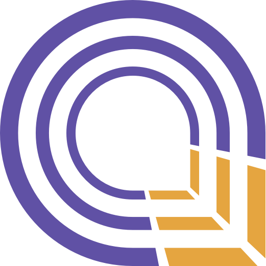
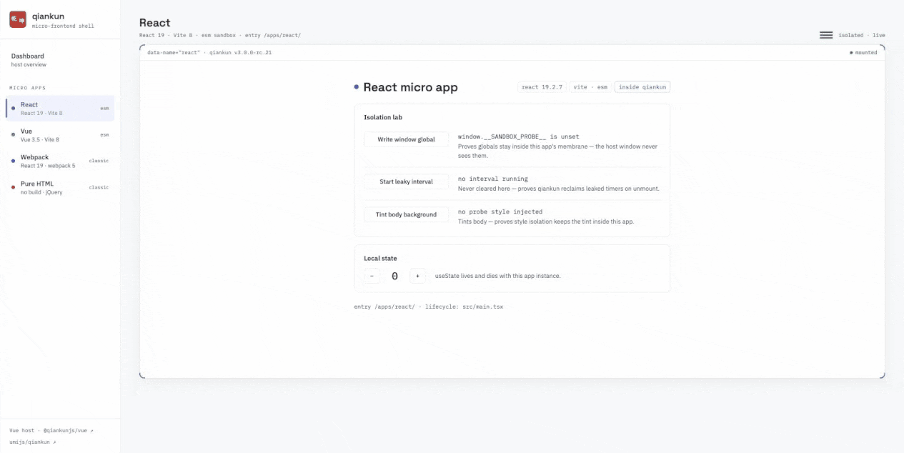

<p align="center">
  <a href="https://www.qiankunjs.com" target="_blank" rel="noopener noreferrer">
    
  </a>
</p>

<p align="center">
  <a href="https://www.npmjs.com/package/qiankun"></a>
  <a href="https://codecov.io/gh/umijs/qiankun"></a>
  <a href="https://www.npmjs.com/package/qiankun"></a>
  <a href="https://github.com/umijs/qiankun/actions/workflows/ci.yml"></a>
  <a href="./LICENSE"></a>
</p>

<p align="center">
  <a href="https://www.qiankunjs.com">Documentation</a> ·
  <a href="https://www.qiankunjs.com/guide/getting-started">Quick start</a> ·
  <a href="https://examples.qiankunjs.com">Live examples</a> ·
  <a href="https://github.com/umijs/qiankun/discussions/1378">Roadmap</a>
</p>

<p align="center">
  English · <a href="./README.zh-CN.md">简体中文</a>
</p>

# qiankun（乾坤）

> [!WARNING]
>
> 🚧 qiankun 3.0 is currently under active development — check out the [Roadmap](https://github.com/umijs/qiankun/discussions/1378) for details. Looking for qiankun 2.x? Its documentation lives at [v2.qiankun.umijs.org](https://v2.qiankun.umijs.org).

> In Chinese, `qian(乾)` means heaven and `kun(坤)` earth. `qiankun` is the universe.

Qiankun enables you and your teams to build next-generation and enterprise-ready web applications leveraging [Micro Frontends](https://micro-frontends.org/). It is inspired by and based on [single-spa](https://github.com/single-spa/single-spa).

## 🤔 Motivation

A quick recap about the concept of `Micro Frontends`:

> Techniques, strategies and recipes for building a **modern web app** with **multiple teams** using **different JavaScript frameworks**. — [Micro Frontends](https://micro-frontends.org/)

Qiankun was birthed internally in our group during the time web app development by distributed teams had turned to complete chaos. We faced every problem micro frontend was conceived to solve, so naturally, it became part of our solution.

The path was never easy, we stepped on every challenge there could possibly be. Just to name a few:

- In what form do micro-apps publish static resources?
- How does the framework integrate individual micro-apps?
- How to ensure that sub-applications are isolated from one another (development independence and deployment independence) and runtime sandboxed?
- Performance issues? What about public dependencies?
- The list goes on long ...

After solving these common problems of micro frontends and lots of polishing and testing, we extracted the minimal viable framework of our solution, and named it `qiankun`, as it can contain and serve anything. Not long after, it became the cornerstone of hundreds of our web applications in production, and we decided to open-source it to save you the suffering.

**TLDR: Qiankun is probably the most complete micro-frontend solution you ever met🧐.**

## ✨ Features

Qiankun inherits the fundamentals of [single-spa](https://github.com/single-spa/single-spa) — **independent deployment**, **lazy loading**, and a **technology-agnostic** host that never dictates a micro app's stack — and adds the pieces a real product needs:

- 📄 **HTML entry** — point qiankun at a URL, not a manifest of assets. The entry is streamed into the live document as it arrives, so a micro app starts rendering before its HTML has finished downloading.
- 🧳 **JS sandbox** — every micro app runs against a Proxy-membrane view of `window` and `document`, so globals, timers, listeners and dynamic DOM stay inside the app and are reclaimed on unmount. On by default.
- 📦 **Native ESM** — `<script type="module">` micro apps execute as real modules, routed through the membrane with dynamically injected import maps. Dynamic `import()` works, and so does a Vite dev server.
- 🛡 **Style isolation** — opt-in runtime scoping built on the CSS [`@scope`](https://developer.mozilla.org/docs/Web/CSS/@scope) at-rule, including external stylesheets. No rewriting your CSS, no Shadow DOM tax.
- ⚡ **Prefetch** — warm a micro app's assets while the user is still elsewhere, so the switch feels instant.
- 🧩 **UI bindings** — `<MicroApp />` components for [React](packages/ui-bindings/react) and [Vue](packages/ui-bindings/vue), with loader and error-boundary slots, so a micro app is just another component.
- 🔧 **Bundler plugins** — [one plugin](packages/bundler-plugin) for webpack 4/5 and Vite that marks the entry script and fixes the output library, replacing the boilerplate you used to hand-write.
- 🔬 **Standalone sandbox** — [`@qiankunjs/sandbox`](packages/sandbox) is usable on its own to contain any third-party script, with no micro-frontend framework attached.

## 🚀 Getting started

> [!NOTE]
>
> v3 ships under the `rc` tag while `latest` still points at 2.x. Install with an explicit `@rc` to get it.

The fastest path is the scaffolder, which generates a host or a micro app wired up correctly:

```shell
npm create qiankun@latest
```

Or add qiankun to an existing host application:

```shell
npm i qiankun@rc
```

Load a micro app into any container element, and keep the returned handle to unmount it:

```ts
import { loadMicroApp } from 'qiankun';

const microApp = loadMicroApp({
  name: 'react-app',
  entry: '//localhost:7100',
  container: document.getElementById('subapp-container'),
});

// when this part of the page goes away:
await microApp.unmount();
```

If a micro app's activation is fully determined by the URL, the route-driven `registerMicroApps` + `start` APIs are the alternative orchestration model.

A micro app only has to export the three lifecycle hooks:

```ts
let root;

export async function bootstrap() {}

export async function mount(props: { container: HTMLElement }) {
  root = render(props.container);
}

export async function unmount() {
  root.unmount();
}
```

That is the whole contract. See the [quick start](https://www.qiankunjs.com/guide/getting-started) for the bundler configuration each stack needs.

## 💿 Examples

Every example is deployed and browsable at **[examples.qiankunjs.com](https://examples.qiankunjs.com)** — two host shells (React and Vue) mounting the same four micro apps, each running with the JS sandbox and style isolation on, plus a [standalone sandbox lab](https://examples.qiankunjs.com/standalone-sandbox/). Every app carries an "isolation lab" that demonstrates what the sandbox actually contains: globals, leaked timers, and injected styles. The shells switch between English and 简体中文, and the choice travels to the micro apps as a prop — they re-render through the `update` lifecycle rather than remounting.

To run them locally:

```shell
git clone https://github.com/umijs/qiankun.git
cd qiankun
pnpm install
pnpm start:example
```

This builds the workspace packages and starts every app in parallel — open http://localhost:7099 for the React shell or http://localhost:7105 for the Vue one. See [examples/README.md](./examples/README.md) for what each app demonstrates.



## 📦 Packages

| Package | Version (click for changelogs) | Description |
| --- | :-- | --- |
| [qiankun](packages/qiankun) | [](packages/qiankun/CHANGELOG.md) | The framework: `registerMicroApps`, `loadMicroApp`, `start`, `prefetch` |
| [@qiankunjs/loader](packages/loader) | [](packages/loader/CHANGELOG.md) | Streaming HTML-entry loader |
| [@qiankunjs/sandbox](packages/sandbox) | [](packages/sandbox/CHANGELOG.md) | JS sandbox — usable standalone |
| [@qiankunjs/shared](packages/shared) | [](packages/shared/CHANGELOG.md) | Asset transpilers, fetch utilities, ESM-sandbox engine |
| [@qiankunjs/single-spa](packages/single-spa) | [](packages/single-spa/CHANGELOG.md) | Vendored [single-spa](https://github.com/single-spa/single-spa) fork the framework builds on |
| [@qiankunjs/react](packages/ui-bindings/react) | [](packages/ui-bindings/react/CHANGELOG.md) | `<MicroApp />` for React |
| [@qiankunjs/vue](packages/ui-bindings/vue) | [](packages/ui-bindings/vue/CHANGELOG.md) | `<MicroApp />` for Vue |
| [@qiankunjs/ui-shared](packages/ui-bindings/shared) | [](packages/ui-bindings/shared/CHANGELOG.md) | Shared internals of the UI bindings |
| [@qiankunjs/bundler-plugin](packages/bundler-plugin) | [](packages/bundler-plugin/CHANGELOG.md) | webpack 4/5 and Vite plugins for micro apps |
| [create-qiankun](packages/create-qiankun) | [](packages/create-qiankun/CHANGELOG.md) | Project scaffolder |

## 📖 Documentation

Full documentation lives at **[www.qiankunjs.com](https://www.qiankunjs.com)** (English and [简体中文](https://www.qiankunjs.com/zh-CN/)):

- [Quick start](https://www.qiankunjs.com/guide/getting-started) — a running micro-frontend in five minutes
- [Cookbook](https://www.qiankunjs.com/cookbook/) — style isolation, sandbox plugins, error handling, performance
- [API reference](https://www.qiankunjs.com/api/) — every option, typed
- [FAQ](https://www.qiankunjs.com/faq/) — the questions that come up most

Design decisions are recorded as RFCs under [docs/rfcs](./docs/rfcs).

## 🎯 Roadmap

qiankun 3.0 is under active development. The plan, and the discussion around it, is in the [3.0 Roadmap](https://github.com/umijs/qiankun/discussions/1378).

## 🤝 Contributing

[](https://deepwiki.com/umijs/qiankun)

Issues and pull requests are welcome. The repository is a pnpm monorepo that requires Node `^22.15 || >=24` and `pnpm@11`:

```shell
pnpm install         # install every workspace package
pnpm run build       # build packages and examples
pnpm run test        # unit tests (vitest, no build needed)
pnpm run test:e2e    # end-to-end tests (Playwright, against built output)
pnpm run ci          # what CI runs: build + eslint + prettier
```

Commits follow [Conventional Commits](https://www.conventionalcommits.org/) — releases and changelogs are derived from them, so do not hand-write changesets. [AGENTS.md](./AGENTS.md) documents the architecture, conventions and anti-patterns in depth.

## 👥 Contributors

Thanks to all the contributors!

<a href="https://github.com/umijs/qiankun/graphs/contributors">
  
</a>

## 🎁 Acknowledgements

- [single-spa](https://github.com/single-spa/single-spa) — what an awesome meta-framework for micro-frontends!
- [writable-dom](https://github.com/marko-js/writable-dom/) — utility to stream HTML content into a live document.

## 📄 License

Qiankun is [MIT licensed](./LICENSE).
