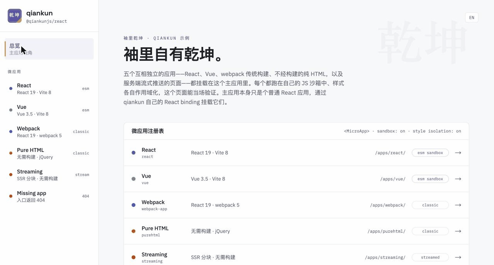

<p align="center">
  <a href="https://www.qiankunjs.com/zh-CN/" target="_blank" rel="noopener noreferrer">
    
  </a>
</p>

<p align="center">
  <a href="https://www.npmjs.com/package/qiankun"></a>
  <a href="https://codecov.io/gh/umijs/qiankun"></a>
  <a href="https://www.npmjs.com/package/qiankun"></a>
  <a href="https://github.com/umijs/qiankun/actions/workflows/ci.yml"></a>
  <a href="./LICENSE"></a>
</p>

<p align="center">
  <a href="https://www.qiankunjs.com/zh-CN/">文档</a> ·
  <a href="https://www.qiankunjs.com/zh-CN/guide/getting-started">快速上手</a> ·
  <a href="https://examples.qiankunjs.com">在线示例</a> ·
  <a href="https://github.com/umijs/qiankun/discussions/1378">路线图</a>
</p>

<p align="center">
  <a href="./README.md">English</a> · 简体中文
</p>

# qiankun（乾坤）

> [!WARNING]
>
> 🚧 qiankun 3.0 正在密集开发中，进展见[路线图](https://github.com/umijs/qiankun/discussions/1378)。在找 qiankun 2.x？它的文档在 [v2.qiankun.umijs.org](https://v2.qiankun.umijs.org)。

> 乾为天，坤为地，乾坤即宇宙——正如它的名字，qiankun 可以承载一切。

qiankun 是一个基于 [single-spa](https://github.com/single-spa/single-spa) 的[微前端](https://micro-frontends.org/)框架，帮助你和你的团队构建面向下一代的企业级 Web 应用。

## 🤔 为什么做 qiankun

先回顾一下「微前端」的定义：

> 一种由多个团队、以不同 JavaScript 技术栈协作构建现代 Web 应用的技术手段与策略。—— [Micro Frontends](https://micro-frontends.org/)

qiankun 诞生于我们内部大规模分布式团队协作陷入混乱的时期——微前端要解决的每一个问题，我们都真实遇到过，于是它自然而然成为了我们解法的一部分。

这条路并不好走，能踩的坑我们几乎都踩过一遍。随便举几个：

- 微应用的静态资源以什么形式发布？
- 框架怎样把一个个独立的微应用集成起来？
- 如何确保子应用之间彼此隔离（开发独立、部署独立），并且运行时相互沙箱化？
- 性能问题怎么办？公共依赖怎么处理？
- ……

在解决完这些微前端的通用问题、经过大量打磨和验证之后，我们把方案中最小可用的框架部分提取出来，命名为 `qiankun`——取其可承载一切之意。此后它成为了我们生产环境中数百个应用的基石，我们决定将它开源，让大家少走弯路。

**一句话总结：qiankun 可能是你见过最完善的微前端解决方案🧐。**

## ✨ 核心能力

qiankun 继承了 [single-spa](https://github.com/single-spa/single-spa) 的基本盘——**独立部署**、**按需加载**、主应用**不限制微应用技术栈**——并补齐了真实产品所需的那些部分：

- 📄 **HTML 入口** —— 接入一个 URL 即可，不需要维护资源清单。HTML 入口边下载边流式写入页面，微应用在 HTML 尚未下载完时就能开始渲染。
- 🧳 **JS 沙箱** —— 每个微应用运行在 `window` 和 `document` 的 Proxy 隔离膜视图之上：全局变量、定时器、事件监听和动态 DOM 都被约束在应用内部，卸载时统一回收。默认开启。
- 📦 **原生 ESM** —— `<script type="module">` 微应用以真正的模块方式执行，经隔离膜路由并配合动态注入的 import map。动态 `import()` 可用，Vite 开发服务器也可以直接接入。
- 🛡 **样式隔离** —— 基于 CSS [`@scope`](https://developer.mozilla.org/docs/Web/CSS/@scope) 规则的运行时作用域方案（可选开启），外链样式表同样覆盖。不需要改写你的 CSS，也没有 Shadow DOM 的额外负担。
- ⚡ **预加载** —— 在用户还停留在其他页面时提前加载微应用资源，切换时近乎即时。
- 🧩 **UI 绑定** —— 面向 [React](packages/ui-bindings/react) 和 [Vue](packages/ui-bindings/vue) 的 `<MicroApp />` 组件，自带加载态和错误边界插槽，微应用用起来就像一个普通组件。
- 🔧 **构建插件** —— [一个插件](packages/bundler-plugin)同时支持 webpack 4/5 与 Vite，自动标记入口脚本、修正产物库配置，替代过去手写的样板配置。
- 🔬 **独立沙箱** —— [`@qiankunjs/sandbox`](packages/sandbox) 可以脱离微前端框架单独使用，用来隔离任意第三方脚本。

## 🚀 快速上手

> [!NOTE]
>
> v3 目前发布在 `rc` 标签上，npm 的 `latest` 仍指向 2.x。安装时需显式指定 `@rc`。

最快的方式是使用脚手架，直接生成配置完整的主应用或微应用：

```shell
npm create qiankun@latest
```

也可以在现有主应用中直接安装：

```shell
npm i qiankun@rc
```

把微应用加载到任意容器元素中，并保存返回的实例句柄用于卸载：

```ts
import { loadMicroApp } from 'qiankun';

const microApp = loadMicroApp({
  name: 'react-app',
  entry: '//localhost:7100',
  container: document.getElementById('subapp-container'),
});

// 页面区域销毁前卸载微应用：
await microApp.unmount();
```

如果微应用的激活状态完全由 URL 决定，也可以使用路由驱动的 `registerMicroApps` + `start` 作为另一种编排方式。

微应用侧只需导出三个生命周期函数：

```ts
let root;

export async function bootstrap() {}

export async function mount(props: { container: HTMLElement }) {
  root = render(props.container);
}

export async function unmount() {
  root.unmount();
}
```

约定就这么多。各技术栈所需的构建配置见[快速上手](https://www.qiankunjs.com/zh-CN/guide/getting-started)。

## 💿 示例

所有示例都已部署在 **[examples.qiankunjs.com](https://examples.qiankunjs.com)**，可直接在线体验：两个主应用外壳（React 与 Vue）加载同一组四个微应用，全部开启 JS 沙箱和样式隔离，另有一个[独立沙箱实验室](https://examples.qiankunjs.com/standalone-sandbox/)。每个微应用都带有「隔离实验室」，直观演示沙箱到底隔离了什么：全局变量、泄漏的定时器、注入的样式。外壳支持中英文切换，语言选择会作为 prop 传递给微应用——它们通过 `update` 生命周期重新渲染，而不是重新挂载。

本地运行：

```shell
git clone https://github.com/umijs/qiankun.git
cd qiankun
pnpm install
pnpm start:example
```

该命令会构建 workspace 内的所有包并并行启动全部示例应用——React 外壳在 http://localhost:7099，Vue 外壳在 http://localhost:7105。各应用分别演示什么见 [examples/README.md](./examples/README.md)。



## 📦 包一览

| 包名 | 版本（点击查看更新日志） | 说明 |
| --- | :-- | --- |
| [qiankun](packages/qiankun) | [](packages/qiankun/CHANGELOG.md) | 框架本体：`registerMicroApps`、`loadMicroApp`、`start`、`prefetch` |
| [@qiankunjs/loader](packages/loader) | [](packages/loader/CHANGELOG.md) | 流式 HTML 入口加载器 |
| [@qiankunjs/sandbox](packages/sandbox) | [](packages/sandbox/CHANGELOG.md) | JS 沙箱，可独立使用 |
| [@qiankunjs/shared](packages/shared) | [](packages/shared/CHANGELOG.md) | 资源转译器、fetch 工具、ESM 沙箱引擎 |
| [@qiankunjs/single-spa](packages/single-spa) | [](packages/single-spa/CHANGELOG.md) | 框架底座：内置维护的 [single-spa](https://github.com/single-spa/single-spa) 分支 |
| [@qiankunjs/react](packages/ui-bindings/react) | [](packages/ui-bindings/react/CHANGELOG.md) | React 版 `<MicroApp />` |
| [@qiankunjs/vue](packages/ui-bindings/vue) | [](packages/ui-bindings/vue/CHANGELOG.md) | Vue 版 `<MicroApp />` |
| [@qiankunjs/ui-shared](packages/ui-bindings/shared) | [](packages/ui-bindings/shared/CHANGELOG.md) | UI 绑定的共享内部实现 |
| [@qiankunjs/bundler-plugin](packages/bundler-plugin) | [](packages/bundler-plugin/CHANGELOG.md) | 微应用侧的 webpack 4/5 与 Vite 插件 |
| [create-qiankun](packages/create-qiankun) | [](packages/create-qiankun/CHANGELOG.md) | 项目脚手架 |

## 📖 文档

完整文档见 **[www.qiankunjs.com](https://www.qiankunjs.com/zh-CN/)**（简体中文与 English）：

- [快速上手](https://www.qiankunjs.com/zh-CN/guide/getting-started) —— 5 分钟跑起来一个微前端
- [实用指南](https://www.qiankunjs.com/zh-CN/cookbook/) —— 样式隔离、沙箱插件、错误处理、加载优化
- [API 参考](https://www.qiankunjs.com/zh-CN/api/) —— 每个配置项都有类型
- [常见问题](https://www.qiankunjs.com/zh-CN/faq/) —— 出现频率最高的那些问题

设计决策以 RFC 形式沉淀在 [docs/rfcs](./docs/rfcs)。

## 🎯 路线图

qiankun 3.0 正在密集开发中，计划与相关讨论见 [3.0 路线图](https://github.com/umijs/qiankun/discussions/1378)。

## 🤝 参与贡献

[](https://deepwiki.com/umijs/qiankun)

欢迎提 issue 和 pull request。仓库是 pnpm monorepo，要求 Node `^22.15 || >=24` 和 `pnpm@11`：

```shell
pnpm install         # 安装所有 workspace 依赖
pnpm run build       # 构建 packages 与 examples
pnpm run test        # 单元测试（vitest，无需先构建）
pnpm run test:e2e    # 端到端测试（Playwright，基于构建产物）
pnpm run ci          # CI 跑的内容：build + eslint + prettier
```

提交信息遵循 [Conventional Commits](https://www.conventionalcommits.org/)——版本发布和更新日志都由提交信息自动生成，请勿手写 changeset。架构、约定与反模式的完整说明见 [AGENTS.md](./AGENTS.md)。

## 👥 贡献者

感谢每一位贡献者！

<a href="https://github.com/umijs/qiankun/graphs/contributors">
  
</a>

## 🎁 致谢

- [single-spa](https://github.com/single-spa/single-spa) —— 出色的微前端元框架！
- [writable-dom](https://github.com/marko-js/writable-dom/) —— 将 HTML 内容流式写入现存文档的工具库。

## 📄 协议

qiankun 基于 [MIT 协议](./LICENSE)发布。
