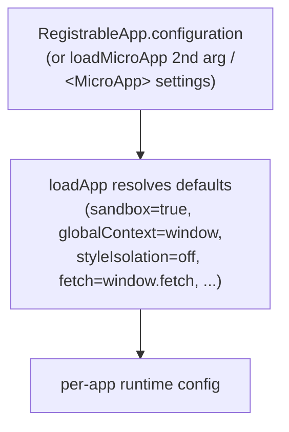

# AppConfiguration

`AppConfiguration` is the per-app configuration object in qiankun v3. It controls the JS sandbox, the global context the sandbox proxies, runtime CSS style isolation, and the low-level loader hooks (`fetch`, `streamTransformer`, `nodeTransformer`).

There is no `FrameworkConfiguration` type in v3. Configuration is set **per micro-app**, either through [`registerMicroApps`](/api/register-micro-apps) (the `configuration` field on each app) or as the second argument to [`loadMicroApp`](/api/load-micro-app). The `<MicroApp>` components expose it through their `settings` prop.

## Type

```ts
import type { LoaderOpts } from '@qiankunjs/loader';

export type AppConfiguration = Partial<
  Pick<LoaderOpts, 'fetch' | 'streamTransformer' | 'nodeTransformer'>
> & {
  sandbox?: boolean;
  globalContext?: WindowProxy;
  styleIsolation?: boolean;
};
```

Every field is optional. The table below lists each field with the default that `loadApp` resolves when the field is omitted.

| Field | Type | Default | Description |
| --- | --- | --- | --- |
| `sandbox` | `boolean` | `true` | Enable the Proxy-membrane JS sandbox (and, for `<script type="module">`, the ESM sandbox engine). Set `false` to run the micro-app directly against the real global. |
| `globalContext` | `WindowProxy` | `window` | The base global object the sandbox membrane proxies. Rarely changed. |
| `styleIsolation` | `boolean` | `false` | Enable runtime CSS isolation. Wraps the micro-app's styles in a CSS `@scope` block scoped to the app container. Opt-in. |
| `fetch` | `typeof window.fetch` | `window.fetch` | The `fetch` implementation used to load the entry HTML and every asset. qiankun wraps it with cache/retry/throw decorators (see below). |
| `streamTransformer` | `() => TransformStream<string, string>` | `undefined` | Optional transform inserted into the HTML entry's streaming pipeline. Receives the decoded HTML as a string stream. |
| `nodeTransformer` | `<T extends Node>(node: T, opts) => T` | internal `transpileAssets` transformer | Rewrites each script/link/style node as it is streamed into the container. Override only if you need custom asset rewriting. |

## Fields in detail

### sandbox

Defaults to `true`. When enabled, `loadApp` calls `createSandboxContainer`, which builds a Proxy-membrane `window`/`document` view for the micro-app and, when the entry ships `<script type="module">`, wires up the ESM sandbox engine. Each micro-app gets its own isolated global; writes to `window` inside the app are trapped by the membrane and never reach the host realm.

Set `sandbox: false` to execute the micro-app against the real global context — useful for a legacy app that cannot tolerate a proxied global, at the cost of isolation.

```ts
configuration: { sandbox: false }
```

`sandbox` is a plain boolean in v3. See the [gone in v3](#gone-in-v3) note about the old object form.

For how the membrane works, see [the JS sandbox](/concepts/js-sandbox) and [the ESM sandbox](/concepts/esm-sandbox).

### globalContext

Defaults to `window`. This is the base global that the sandbox membrane proxies. In an ordinary single-window setup you never set it; it exists for advanced hosting scenarios where the base realm is not the top-level `window`.

### styleIsolation

Defaults to `false` (off). When set to `true`, qiankun scopes the micro-app's CSS at runtime using the native CSS [`@scope`](https://developer.mozilla.org/en-US/docs/Web/CSS/@scope) at-rule. Internally `loadApp` derives:

```ts
const styleIsolationOpts = { appName, scopeRoot: `[data-name="${appName}"]` };
```

Every rule from the app's inline `<style>` and external `<link rel="stylesheet">` is wrapped in `@scope ([data-name="<appName>"]) { ... }`, where `data-name` is the attribute qiankun sets on the app container. External stylesheets are re-fetched and re-served as blob-`<link>`s so their contents can be scoped as well. `@keyframes` are renamed per app; `@font-face` and `@namespace` are intentionally kept global.

The scope selector is derived internally and cannot be customized.

::: warning Browser support and CORS
Style isolation relies on native CSS `@scope`, which is a recent browser feature — there is no polyfill in qiankun. Browsers without `@scope` support will not scope styles. Also, external stylesheets must be CORS-fetchable: on a fetch or transpile failure the stylesheet is dropped (never loaded unscoped) to preserve isolation.
:::

See [Style isolation](/concepts/style-isolation) for the mechanism and [Enable CSS style isolation](/cookbook/enable-style-isolation) for a walkthrough.

### fetch

Defaults to `window.fetch`. Whatever you pass is wrapped before use:

```ts
const enhancedFetch = makeFetchCacheable(makeFetchRetryable(makeFetchThrowable(fetch)));
```

- `makeFetchThrowable` — turns non-`ok` HTTP responses into thrown errors.
- `makeFetchRetryable` — retries transient network failures.
- `makeFetchCacheable` — deduplicates and caches responses, so the streaming loader's automatic asset preloading does not double-fetch.

Provide a custom `fetch` to inject credentials, headers, or a proxy. The wrapping is always applied on top of whatever you pass.

### streamTransformer

Defaults to `undefined`. When provided, its `TransformStream<string, string>` is spliced into the HTML entry's streaming pipeline after byte decoding and before qiankun's own tag rewriting. Use it to rewrite the entry HTML on the fly (for example, to inject or strip markup). Most apps never need this.

See [HTML-entry streaming loading](/concepts/html-entry-loading) for the pipeline.

### nodeTransformer

Defaults to an internal transformer built on `transpileAssets`, which rewrites each `<script>`, `<link>`, and `<style>` node — routing globals through the sandbox membrane, resolving module specifiers, and (when `styleIsolation` is on) scoping styles. Override this only if you need to customize how individual asset nodes are transformed as they stream into the container. Replacing it opts out of qiankun's default asset rewriting, so do so with care.

## Where configuration is passed

`AppConfiguration` is accepted in three places, all per-app.

::: code-group

```ts [registerMicroApps]
import { registerMicroApps, start } from 'qiankun';

registerMicroApps([
  {
    name: 'react-app',
    entry: '//localhost:7100',
    container: document.getElementById('subapp-container')!,
    activeRule: '/react',
    configuration: {
      sandbox: true,
      styleIsolation: true,
    },
  },
]);

start();
```

```ts [loadMicroApp]
import { loadMicroApp } from 'qiankun';

const microApp = loadMicroApp(
  {
    name: 'react-app',
    entry: '//localhost:7100',
    container: document.getElementById('subapp-container')!,
  },
  // second argument is the AppConfiguration
  {
    sandbox: true,
    styleIsolation: true,
  },
);
```

```tsx [MicroApp (React)]
import { MicroApp } from '@qiankunjs/react';

export default function App() {
  return (
    <MicroApp
      name="react-app"
      entry="//localhost:7100"
      settings={{ sandbox: true, styleIsolation: true }}
    />
  );
}
```

:::

The `container` is an `HTMLElement`, not a selector string. Pass a real element (for example `document.getElementById(...)` or a framework ref). The `<MicroApp>` components manage their own container internally, so you only supply `settings`.

## Precedence

In v3, the per-app `configuration` is effectively the entire configuration for that app. There is no framework-wide config merged in through `start()`.



Internally, `registerMicroApps` merges `{ ...frameworkConfiguration, ...configuration }` before calling `loadApp`. But `frameworkConfiguration` is a module-level empty object that is never populated in v3 — `start()` does not feed configuration into it. So in practice only the per-app `configuration` matters. Configure each app where you register it, or where you call `loadMicroApp`.

## Gone in v3

::: danger These 2.x options do not exist in v3
- **No `sandbox: { ... }` object.** `sandbox` is a plain boolean. There is no `strictStyleIsolation`, no `experimentalStyleIsolation`, and no Shadow DOM. Style isolation is the separate boolean `styleIsolation`, implemented with CSS `@scope`.
- **No style-isolation options besides `styleIsolation`.** The 2.x `sandbox.strictStyleIsolation` / `sandbox.experimentalStyleIsolation` knobs are gone.
- **No framework-wide config on `start()`.** [`start`](/api/start) accepts only single-spa's `{ urlRerouteOnly }`. The 2.x `prefetch`, `sandbox`, `singular`, `fetch`, `getPublicPath`, `getTemplate`, and `excludeAssetFilter` options are removed.
- **No `prefetch` or `singular` in `AppConfiguration`.** The streaming loader preloads assets automatically; [`prefetchApps`](/api/prefetch-apps) is deprecated. `singular` no longer exists.
- **No built-in global-state store.** `initGlobalState`, `onGlobalStateChange`, and `setGlobalState` are not part of v3. See [Share state and communicate between apps](/cookbook/communicate-between-apps).
:::

Migrating from qiankun 2.x? See [Migrate from qiankun 2.x](/cookbook/migrate-from-2x).

## Related

- [registerMicroApps](/api/register-micro-apps) — where per-app `configuration` is set for route-driven apps.
- [loadMicroApp](/api/load-micro-app) — the manual loader that takes `AppConfiguration` as its second argument.
- [start](/api/start) — framework bootstrap; note it only takes `{ urlRerouteOnly }`.
- [Types reference](/api/types) — full type surface, including `RegistrableApp` and `LoadableApp`.
- [Style isolation](/concepts/style-isolation) and [The JS sandbox](/concepts/js-sandbox) — the concepts behind `styleIsolation` and `sandbox`.
