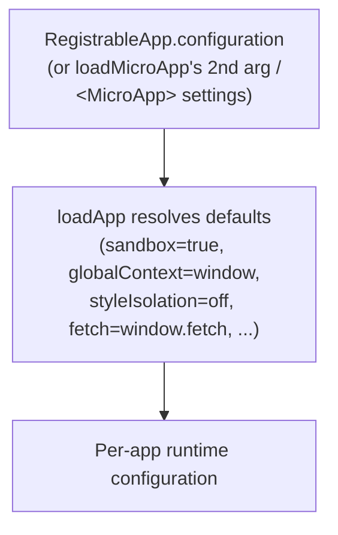

# AppConfiguration

`AppConfiguration` is qiankun v3's per-micro-app configuration object. It controls a handful of things: the JS sandbox, the global context the sandbox proxies, runtime CSS style isolation, and a few low-level loader hooks (`fetch`, `streamTransformer`, `nodeTransformer`).

There is no `FrameworkConfiguration` type in v3. Configuration is given **per micro-app** — either in [`registerMicroApps`](/api/register-micro-apps) (each app's `configuration` field) or as the second argument to [`loadMicroApp`](/api/load-micro-app). The `<MicroApp>` component exposes it through the `settings` prop.

## Type

```ts
import type { LoaderOpts } from '@qiankunjs/loader';

export type AppConfiguration = Partial<
  Pick<LoaderOpts, 'fetch' | 'streamTransformer' | 'nodeTransformer'>
> & {
  sandbox?: boolean;
  globalContext?: WindowProxy;
  styleIsolation?: boolean;
};
```

Every field is optional. The table below lists each one along with the default `loadApp` falls back to when it's omitted.

| Field | Type | Default | Description |
| --- | --- | --- | --- |
| `sandbox` | `boolean` | `true` | Enables the `Proxy`-membrane JS sandbox (and, for `<script type="module">`, the ESM sandbox engine). Set it to `false` to run the micro-app directly against the real global. |
| `globalContext` | `WindowProxy` | `window` | The base global object the sandbox membrane proxies. You rarely need to change this. |
| `styleIsolation` | `boolean` | `false` | Enables runtime CSS isolation, wrapping the micro-app's styles in a CSS `@scope` block scoped to the app container. Off by default; enable it when you need it. |
| `fetch` | `typeof window.fetch` | `window.fetch` | The `fetch` implementation used to load the entry HTML and every asset. qiankun wraps it with cache / retry / throw decorators (see below). |
| `streamTransformer` | `() => TransformStream<string, string>` | `undefined` | Optional transform spliced into the HTML entry streaming pipeline, operating on the decoded HTML string stream. |
| `nodeTransformer` | `<T extends Node>(node: T, opts) => T` | the built-in `transpileAssets` transformer | Rewrites each script / link / style node as it streams into the container. Leave it alone unless you need custom asset rewriting. |

## Fields in detail

### sandbox

Defaults to `true`. When enabled, `loadApp` calls `createSandboxContainer` to build a `Proxy`-membrane `window`/`document` view for the micro-app; when the entry carries a `<script type="module">`, it also wires up the ESM sandbox engine. Each micro-app gets its own isolated global, and anything the app writes to `window` is trapped by the membrane and never reaches the host realm.

Set `sandbox: false` and the micro-app runs directly against the real global context — useful for legacy apps that can't tolerate a proxied global, at the cost of isolation.

```ts
configuration: { sandbox: false }
```

In v3 `sandbox` is a plain boolean. For the old object form, see [Gone in v3](#gone-in-v3) below.

For how the membrane works, see [JS Sandbox](/concepts/js-sandbox) and [ESM Sandbox](/concepts/esm-sandbox).

### globalContext

Defaults to `window`. This is the base global the sandbox membrane proxies. In an ordinary single-window setup you never set it; it's there for advanced hosting scenarios where the base realm isn't the top-level `window`.

### styleIsolation

Defaults to `false` (off). Set it to `true` and qiankun scopes the micro-app's CSS at runtime with the native CSS [`@scope`](https://developer.mozilla.org/en-US/docs/Web/CSS/@scope) at-rule. Internally `loadApp` derives:

```ts
const styleIsolationOpts = { appName, scopeRoot: `[data-name="${appName}"]` };
```

Every rule in the micro-app's inline `<style>` and external `<link rel="stylesheet">` gets wrapped in `@scope ([data-name="<appName>"]) { ... }`, where `data-name` is the attribute qiankun stamps on the app container. External stylesheets are re-fetched and re-served as blob-`<link>`s so their contents can be scoped too. `@keyframes` are renamed per app; `@font-face` and `@namespace` are deliberately kept global.

The scoping selector is derived internally and can't be customized.

::: warning Browser support and CORS
Style isolation relies on native CSS `@scope`, a fairly new browser feature — there's no polyfill in qiankun. Browsers that don't support `@scope` won't scope the styles. External stylesheets must also be reachable over CORS: if a fetch or transpile fails, that stylesheet is dropped outright (rather than loaded unscoped), to preserve isolation.
:::

For the mechanism, see [Style Isolation](/concepts/style-isolation); for the how-to, see [Enable CSS Style Isolation](/cookbook/enable-style-isolation).

### fetch

Defaults to `window.fetch`. Whatever you pass in gets wrapped before use:

```ts
const enhancedFetch = makeFetchCacheable(makeFetchRetryable(makeFetchThrowable(fetch)));
```

- `makeFetchThrowable` — turns non-`ok` HTTP responses into thrown errors.
- `makeFetchRetryable` — retries transient network failures.
- `makeFetchCacheable` — deduplicates and caches responses, so the streaming loader doesn't re-fetch assets when it auto-prefetches them.

Pass a custom `fetch` to inject credentials, headers, or route through a proxy. The outer wrapping is always applied, whatever you pass in.

### streamTransformer

Defaults to `undefined`. When provided, its `TransformStream<string, string>` is spliced into the HTML entry's streaming pipeline, after byte decoding and before qiankun rewrites the tags itself. Use it to rewrite the entry HTML mid-stream (for instance, to inject or strip some markup). Most apps won't need it.

For the pipeline, see [HTML Entry Streaming](/concepts/html-entry-loading).

### nodeTransformer

Defaults to a built-in transformer built on `transpileAssets` that rewrites every `<script>`, `<link>`, and `<style>` node — routing global access through the sandbox membrane, resolving module specifiers, and (when `styleIsolation` is on) scoping styles. Don't override it unless you need to customize how each individual asset node is transformed as it streams into the container. Replacing it means giving up qiankun's default asset rewriting, so think it through first.

## Where to pass configuration

`AppConfiguration` can be received in three places, all per-micro-app.

::: code-group

```ts [registerMicroApps]
import { registerMicroApps, start } from 'qiankun';

registerMicroApps([
  {
    name: 'react-app',
    entry: '//localhost:7100',
    container: document.getElementById('subapp-container')!,
    activeRule: '/react',
    configuration: {
      sandbox: true,
      styleIsolation: true,
    },
  },
]);

start();
```

```ts [loadMicroApp]
import { loadMicroApp } from 'qiankun';

const microApp = loadMicroApp(
  {
    name: 'react-app',
    entry: '//localhost:7100',
    container: document.getElementById('subapp-container')!,
  },
  // the second argument is the AppConfiguration
  {
    sandbox: true,
    styleIsolation: true,
  },
);
```

```tsx [MicroApp (React)]
import { MicroApp } from '@qiankunjs/react';

export default function App() {
  return (
    <MicroApp
      name="react-app"
      entry="//localhost:7100"
      settings={{ sandbox: true, styleIsolation: true }}
    />
  );
}
```

:::

`container` is an `HTMLElement`, not a selector string. Pass a real element (e.g. `document.getElementById(...)` or a framework ref). The `<MicroApp>` component manages its own container internally, so you only supply `settings`.

## Precedence

In v3, a single app's `configuration` is effectively the app's entire configuration. No framework-level config gets merged in through `start()`.



Internally, `registerMicroApps` merges `{ ...frameworkConfiguration, ...configuration }` before calling `loadApp`. But `frameworkConfiguration` is a module-level empty object that's never populated in v3 — `start()` puts nothing into it. So in practice only the per-app `configuration` matters. Configure each app where you register it, or where you call `loadMicroApp`.

## Gone in v3 {#gone-in-v3}

::: danger These 2.x options don't exist in v3
- **No `sandbox: { ... }` object form.** `sandbox` is a plain boolean. There's no `strictStyleIsolation`, no `experimentalStyleIsolation`, and no Shadow DOM. Style isolation is a separate boolean, `styleIsolation`, implemented with CSS `@scope`.
- **No style-isolation options beyond `styleIsolation`.** The 2.x `sandbox.strictStyleIsolation` / `sandbox.experimentalStyleIsolation` switches are gone.
- **No framework-level config on `start()`.** [`start`](/api/start) only takes single-spa's `{ urlRerouteOnly }`. The 2.x `prefetch`, `sandbox`, `singular`, `fetch`, `getPublicPath`, `getTemplate`, and `excludeAssetFilter` options are all removed.
- **No `prefetch` or `singular` in `AppConfiguration`.** The streaming loader prefetches assets automatically; [`prefetchApps`](/api/prefetch-apps) is deprecated. `singular` no longer exists.
- **No built-in global state store.** `initGlobalState`, `onGlobalStateChange`, and `setGlobalState` are not part of v3. See [Share state and communicate between apps](/cookbook/communicate-between-apps).
:::

Migrating from qiankun 2.x? See [Migrate from qiankun 2.x](/cookbook/migrate-from-2x).

## Related

- [registerMicroApps](/api/register-micro-apps) — where route-driven apps set their per-app `configuration`.
- [loadMicroApp](/api/load-micro-app) — the manual loader that takes `AppConfiguration` as its second argument.
- [start](/api/start) — framework startup; note that it only accepts `{ urlRerouteOnly }`.
- [Type reference](/api/types) — the full type surface, including `RegistrableApp` and `LoadableApp`.
- [Style Isolation](/concepts/style-isolation) and [JS Sandbox](/concepts/js-sandbox) — the concepts behind `styleIsolation` and `sandbox`.
