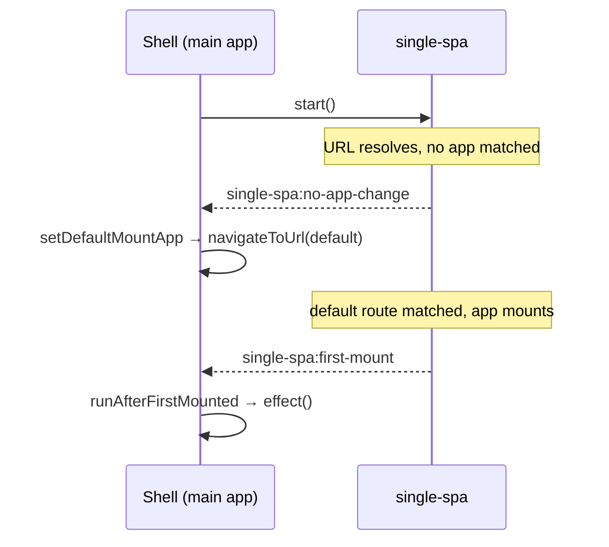

# setDefaultMountApp / runAfterFirstMounted

Two small side-effect helpers built on single-spa's lifecycle events. `setDefaultMountApp` redirects to a default route when nothing is mounted, and `runAfterFirstMounted` runs a callback once the first micro-app has mounted. Both are one-shot: their internal listeners self-remove after the first time they fire.

Import them from `qiankun`:

```ts
import { setDefaultMountApp, runAfterFirstMounted } from 'qiankun';
```

## setDefaultMountApp

```ts
function setDefaultMountApp(defaultAppLink: string): void
```

Navigates to `defaultAppLink` the first time single-spa reports that a URL change resolved to no mounted app. This is how you pick a landing route so the shell does not start on a blank page.

| Parameter | Type | Description |
| --- | --- | --- |
| `defaultAppLink` | `string` | The route to navigate to, for example `/home`. Passed to single-spa's `navigateToUrl`. |

How it works: on the `single-spa:no-app-change` event, if `getMountedApps()` returns an empty list, it calls `navigateToUrl(defaultAppLink)`. The listener removes itself after the first fire, so the redirect happens at most once. If a matching app is already mounted for the current URL, nothing happens.

Because it relies on route matching, `defaultAppLink` must resolve to a registered app whose `activeRule` covers that path. If it does not, single-spa will again report no app change and — since the listener has already unbound — no further navigation occurs.

::: tip One-shot by design
`setDefaultMountApp` only nudges the initial navigation. It is not a permanent fallback or a catch-all redirect for every unmatched route. For a persistent 404-style fallback, register a dedicated app or handle it in your shell's own router.
:::

### Example: land on a default route

Call it after registering your apps and before or after `start()`.

```ts
import { registerMicroApps, setDefaultMountApp, start } from 'qiankun';

registerMicroApps([
  {
    name: 'dashboard',
    entry: 'http://localhost:7101',
    container: document.getElementById('subapp')!,
    activeRule: '/dashboard',
  },
  {
    name: 'orders',
    entry: 'http://localhost:7102',
    container: document.getElementById('subapp')!,
    activeRule: '/orders',
  },
]);

// If the app boots on "/" with nothing matched, redirect to /dashboard.
setDefaultMountApp('/dashboard');

start();
```

## runAfterFirstMounted

```ts
function runAfterFirstMounted(effect: () => void): void
```

Runs `effect` once, the first time any micro-app finishes mounting. Use it to reveal the shell UI, hide a global loading indicator, or fire a one-time analytics event after the first app is on screen.

| Parameter | Type | Description |
| --- | --- | --- |
| `effect` | `() => void` | Callback invoked on the first `single-spa:first-mount` event. |

How it works: it subscribes to single-spa's `single-spa:first-mount` event, invokes `effect`, then removes its own listener so `effect` runs at most once. In development builds it also closes a `console.time` timing (`[qiankun] first app mounted`), giving you a first-mount duration in the console. This timing log is dev-only and has no effect in production.

### Example: hide a global loader after first mount

```ts
import { registerMicroApps, runAfterFirstMounted, start } from 'qiankun';

registerMicroApps([
  {
    name: 'dashboard',
    entry: 'http://localhost:7101',
    container: document.getElementById('subapp')!,
    activeRule: '/dashboard',
  },
]);

runAfterFirstMounted(() => {
  document.getElementById('global-loading')?.remove();
});

start();
```

## Event flow

Both helpers are thin wrappers over events single-spa dispatches on `window` during rerouting.



## Migrating from v2

Both helpers remain public and one-shot in v3. For removed global-state APIs and other breaking changes, use the [v3 migration guide](/cookbook/migrate-from-2x) as the source of truth.

## Related

- [registerMicroApps](/api/register-micro-apps) — register the apps these effects react to
- [start](/api/start) — begin single-spa rerouting so the events fire
- [Share state and communicate between apps](/cookbook/communicate-between-apps) — the v3 replacement for 2.x global state
- [Micro-app lifecycle and props](/concepts/lifecycle-and-props) — how mounting fits the wider lifecycle
