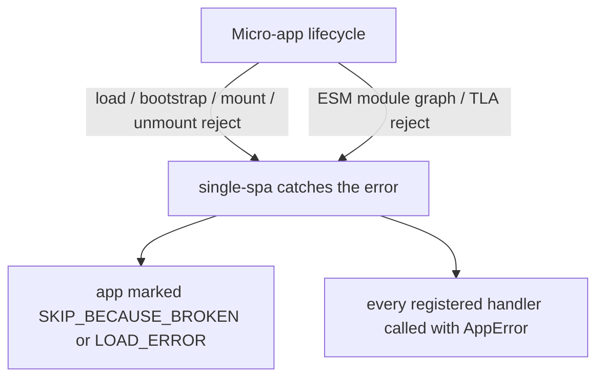

# addErrorHandler / removeErrorHandler

Register and unregister global error handlers. They fire whenever any micro-app throws during its load, bootstrap, mount, or unmount phase. Both functions are re-exported verbatim from [single-spa](https://single-spa.js.org/docs/api#adderrorhandler), so their behavior matches single-spa's error-handling chain exactly.

```ts
import { addErrorHandler, removeErrorHandler } from 'qiankun';
```

## Signatures

```ts
function addErrorHandler(handler: (err: AppError) => void): void;
function removeErrorHandler(handler: (err: AppError) => void): void;
```

`AppError` is single-spa's error shape — a standard `Error` with the name of the failing app or parcel attached:

```ts
type AppError = Error & {
  appOrParcelName: string;
};
```

`removeErrorHandler` unregisters by reference, so you must pass the same function object you originally registered.

::: info Pure re-export
qiankun does not wrap or rewrite these functions in any way. `packages/qiankun/src/apis/errorHandler.ts` is a single line: `export { addErrorHandler, removeErrorHandler } from 'single-spa';`. A handler you add through qiankun and one you add by importing directly from single-spa share the same registry.
:::

## Which errors reach here

A handler registered with `addErrorHandler` receives errors thrown by any micro-app — whether the app was registered through [`registerMicroApps`](/api/register-micro-apps) or loaded imperatively through [`loadMicroApp`](/api/load-micro-app) — across every lifecycle phase:

- **Load** — the HTML entry can't be fetched (network failure, non-2xx status code), the response body is empty, or no valid lifecycle object can be found in the entry's exports.
- **Bootstrap / mount / unmount** — the micro-app's own `bootstrap`, `mount`, or `unmount` function rejects.
- **ESM module graph failures** — for a `<script type="module">` entry handled by the [ESM sandbox](/concepts/esm-sandbox), any module that fails to fetch or evaluate, plus a rejected top-level `await` (TLA) anywhere in the module graph, is wired onto the entry's deferred and surfaces here rather than being silently dropped as an unhandled rejection.

When a micro-app throws while switching lifecycle states, single-spa marks it broken — `SKIP_BECAUSE_BROKEN` for a lifecycle failure, `LOAD_ERROR` for a load failure — and then calls each registered error handler in turn with the `AppError`. A broken app no longer participates in route-driven transitions; a `LOAD_ERROR` app is retried on the next route change.



## Example

Register the handler once, early in the host app's startup, either before or after calling [`start`](/api/start):

```ts
import { addErrorHandler, registerMicroApps, start } from 'qiankun';

addErrorHandler((err) => {
  // err is a standard Error; err.appOrParcelName tells you which app failed
  console.error(`[qiankun] "${err.appOrParcelName}" failed:`, err.message);

  // report to your monitoring service
  reportToSentry(err, { app: err.appOrParcelName });
});

registerMicroApps([
  { name: 'app1', entry: '//localhost:7100', container: document.querySelector('#subapp')!, activeRule: '/app1' },
]);

start();
```

To tear a handler down (say, across a hot-reload boundary or in tests), keep a reference to it and pass that to `removeErrorHandler`:

```ts
const handler = (err: AppError) => console.error(err);

addErrorHandler(handler);
// later
removeErrorHandler(handler);
```

::: warning Don't throw from a handler
An error thrown inside a handler re-enters single-spa's error-handling path. Keep handlers defensive — log, report, and return; don't throw from within.
:::

## Global handler vs. `<MicroApp>` error boundary

`addErrorHandler` is a **framework-level global** hook: one handler watches every registered app's failures and receives an `AppError` tagged with `appOrParcelName`. It renders nothing — it's for logging, monitoring, and telemetry reporting.

The [React](/ecosystem/react) and [Vue](/ecosystem/vue) versions of `<MicroApp>` provide a **component-level** error boundary instead. Because `<MicroApp>` wraps [`loadMicroApp`](/api/load-micro-app) for a single instance, it can catch that instance's load/bootstrap/mount rejection and render fallback UI in place:

- Enable the default error view with `autoCaptureError`, or pass a custom `errorBoundary` render prop (React) / `#error-boundary` slot (Vue).
- If you **don't** enable it, the component rethrows the error — in React it bubbles to the nearest React error boundary, in Vue it surfaces through `errorCaptured` / the global handler.

The two mechanisms are complementary. Use the global `addErrorHandler` for centralized reporting across all apps, and the `<MicroApp>` error boundary for a single instance's fallback UI. A single failure can reach both at once: single-spa notifies your global handler, and the component hands its rejected `mountPromise`/`loadPromise` to its own error boundary.

| Concern | `addErrorHandler` | `<MicroApp>` error boundary |
| --- | --- | --- |
| Scope | Global — every registered / loaded app | A single `<MicroApp>` instance |
| Purpose | Logging, monitoring, telemetry reporting | Rendering fallback UI in place |
| Input | `AppError` (`Error & { appOrParcelName }`) | The rejected lifecycle `Error` |
| How to enable | Always active once registered | `autoCaptureError` / custom `errorBoundary` |

## See also

- [Handling load and runtime errors](/cookbook/handle-errors) — an end-to-end approach to retries, fallback UI, and reporting.
- [`<MicroApp>` for React](/ecosystem/react) and [`<MicroApp>` for Vue](/ecosystem/vue) — component-level error boundaries.
- [Micro-app lifecycle and props](/concepts/lifecycle-and-props) — the phases that can fail.
- [ESM sandbox](/concepts/esm-sandbox) — how module-graph and TLA rejections get routed here.
