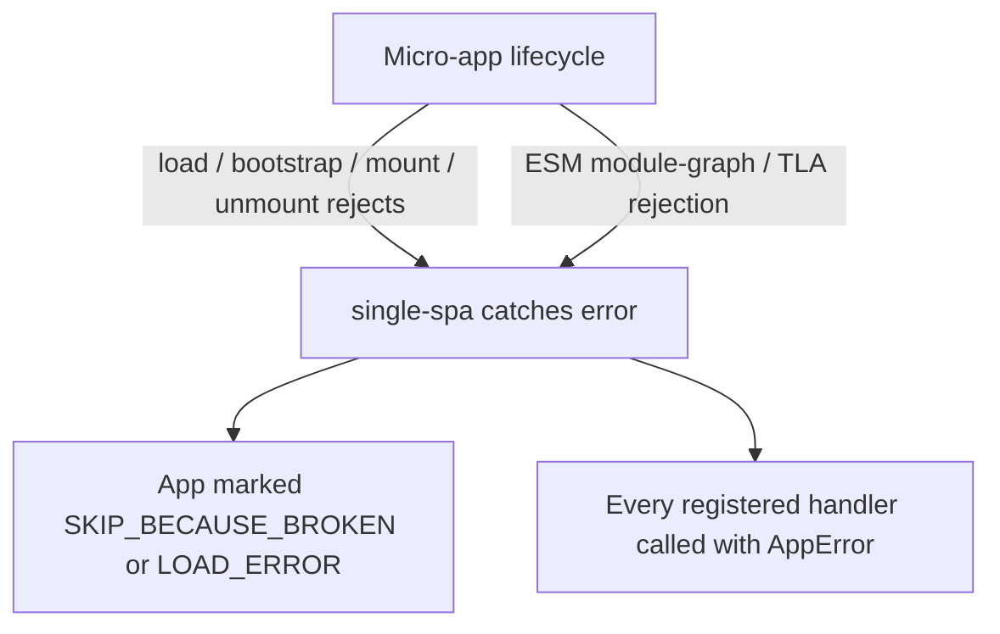

# addErrorHandler / removeErrorHandler

Register and unregister global error handlers that fire whenever any micro-app fails to load, bootstrap, mount, or unmount. Both functions are re-exported verbatim from [single-spa](https://single-spa.js.org/docs/api#adderrorhandler), so their behavior matches single-spa's error pipeline exactly.

```ts
import { addErrorHandler, removeErrorHandler } from 'qiankun';
```

## Signatures

```ts
function addErrorHandler(handler: (err: AppError) => void): void;
function removeErrorHandler(handler: (err: AppError) => void): void;
```

`AppError` is single-spa's error shape — a standard `Error` augmented with the name of the app or parcel that failed:

```ts
type AppError = Error & {
  appOrParcelName: string;
};
```

`removeErrorHandler` unregisters a handler by reference, so you must pass the same function object you registered.

::: info Pure re-export
qiankun does not wrap or transform these functions. `packages/qiankun/src/apis/errorHandler.ts` is literally `export { addErrorHandler, removeErrorHandler } from 'single-spa';`. Handlers you add through qiankun and handlers you add by importing directly from single-spa share the same registry.
:::

## What errors surface here

Handlers registered with `addErrorHandler` receive errors thrown by any app registered through [`registerMicroApps`](/api/register-micro-apps) or loaded imperatively through [`loadMicroApp`](/api/load-micro-app), across every lifecycle phase:

- **Load** — the HTML entry cannot be fetched (network failure, non-2xx status), the response body is empty, or no valid lifecycle object can be discovered from the entry's exports.
- **Bootstrap / mount / unmount** — the micro-app's own `bootstrap`, `mount`, or `unmount` function rejects.
- **ESM module-graph failures** — for `<script type="module">` entries handled by the [ESM sandbox](/concepts/esm-sandbox), a module that fails to fetch or evaluate, and top-level `await` (TLA) rejections in the module graph, are plumbed through to the entry deferred so they surface here rather than vanishing as an unhandled rejection.

When a micro-app throws during a lifecycle transition, single-spa moves that app into a broken status — `SKIP_BECAUSE_BROKEN` for a lifecycle failure or `LOAD_ERROR` for a load failure — and invokes every registered error handler with the `AppError`. A broken app stops participating in route-driven changes; a `LOAD_ERROR` app will be retried on the next route change.



## Example

Register a handler once, early in your main-app bootstrap, before or after calling [`start`](/api/start):

```ts
import { addErrorHandler, registerMicroApps, start } from 'qiankun';

addErrorHandler((err) => {
  // err is a standard Error; err.appOrParcelName tells you which app failed
  console.error(`[qiankun] "${err.appOrParcelName}" failed:`, err.message);

  // report to your monitoring service
  reportToSentry(err, { app: err.appOrParcelName });
});

registerMicroApps([
  { name: 'app1', entry: '//localhost:7100', container: document.querySelector('#subapp')!, activeRule: '/app1' },
]);

start();
```

To tear a handler down (for example in a hot-reload boundary or a test), keep a reference and pass it to `removeErrorHandler`:

```ts
const handler = (err: AppError) => console.error(err);

addErrorHandler(handler);
// later
removeErrorHandler(handler);
```

::: warning Handlers must not throw
An error thrown from inside your handler propagates back into single-spa's error path. Keep handlers defensive — log, report, and return.
:::

## Global handlers vs the `<MicroApp>` error boundary

`addErrorHandler` is a **global, framework-level** hook: one handler observes failures from every registered app and receives an `AppError` tagged with `appOrParcelName`. It does not render anything — it is for logging, monitoring, and telemetry.

The [`<MicroApp>` React](/ecosystem/react) and [Vue](/ecosystem/vue) components provide a **component-level** error boundary instead. Because `<MicroApp>` wraps [`loadMicroApp`](/api/load-micro-app) for a single instance, it can catch that instance's load/bootstrap/mount rejection and render fallback UI in place:

- Opt in with `autoCaptureError` for the default error view, or pass a custom `errorBoundary` render prop (React) / `#error-boundary` slot (Vue).
- If you do **not** opt in, the component re-throws the error — in React it reaches the nearest React error boundary, in Vue it surfaces through `errorCaptured` / the global handler.

The two mechanisms are complementary. Use a global `addErrorHandler` for centralized reporting across all apps, and the `<MicroApp>` error boundary for per-instance fallback UI. A single failure can reach both: single-spa notifies your global handlers, and the component surfaces the rejected `mountPromise`/`loadPromise` to its own boundary.

| Concern | `addErrorHandler` | `<MicroApp>` error boundary |
| --- | --- | --- |
| Scope | Global — all registered/loaded apps | A single `<MicroApp>` instance |
| Purpose | Logging, monitoring, telemetry | Render fallback UI in place |
| Input | `AppError` (`Error & { appOrParcelName }`) | The rejected lifecycle `Error` |
| Opt-in | Always active once registered | `autoCaptureError` / custom `errorBoundary` |

## See also

- [Handle load and runtime errors](/cookbook/handle-errors) — end-to-end recipes for retry, fallback UI, and reporting.
- [`<MicroApp>` for React](/ecosystem/react) and [`<MicroApp>` for Vue](/ecosystem/vue) — component-level error boundaries.
- [Micro-app lifecycle and props](/concepts/lifecycle-and-props) — the phases that can fail.
- [The ESM sandbox](/concepts/esm-sandbox) — how module-graph and TLA rejections are routed here.
