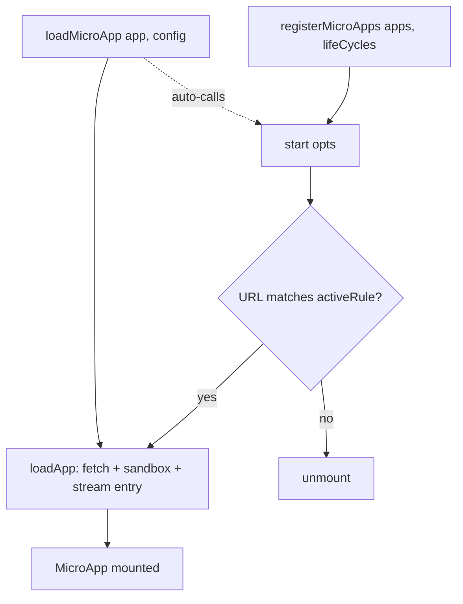

# API reference overview

Everything the `qiankun` package exports, grouped by role. Each symbol links to its own reference page for the full signature, options, and examples.

```ts
import {
  registerMicroApps,
  start,
  loadMicroApp,
  setDefaultMountApp,
  runAfterFirstMounted,
  addErrorHandler,
  removeErrorHandler,
  isRuntimeCompatible,
  prefetchApps,
} from 'qiankun';
```

Current version: `3.0.0-rc.21`.

## Public exports at a glance

| Export | Kind | Purpose |
| --- | --- | --- |
| [`registerMicroApps`](/api/register-micro-apps) | function | Register route-driven micro-apps; single-spa activates each one when its `activeRule` matches. |
| [`start`](/api/start) | function | Start the framework. Takes only single-spa's `StartOpts`. |
| [`loadMicroApp`](/api/load-micro-app) | function | Imperatively mount a micro-app now and get back a handle to control it. |
| [`setDefaultMountApp`](/api/effects) | function | Navigate to a default micro-app when no app is mounted. |
| [`runAfterFirstMounted`](/api/effects) | function | Run a callback once, after the first micro-app mounts. |
| [`addErrorHandler`](/api/error-handling) | function | Register a global error handler (re-exported from single-spa). |
| [`removeErrorHandler`](/api/error-handling) | function | Remove a previously registered error handler (re-exported from single-spa). |
| [`isRuntimeCompatible`](/api/is-runtime-compatible) | function | Probe whether the current browser supports the v3 runtime. |
| [`prefetchApps`](/api/prefetch-apps) | function | Deprecated. Warm the HTTP cache for a list of apps. |

## Signatures

```ts
function registerMicroApps<T extends ObjectType>(
  apps: Array<RegistrableApp<T>>,
  lifeCycles?: LifeCycles<T>,
): void;

function start(opts?: StartOpts): void; // StartOpts = { urlRerouteOnly?: boolean }

function loadMicroApp<T extends ObjectType>(
  app: LoadableApp<T>,
  configuration?: AppConfiguration,
  lifeCycles?: LifeCycles<T>,
): MicroApp;

function setDefaultMountApp(defaultAppLink: string): void;
function runAfterFirstMounted(effect: () => void): void;

function addErrorHandler(handler: (err: AppError) => void): void;
function removeErrorHandler(handler: (err: AppError) => void): void;

function isRuntimeCompatible(): boolean;

function prefetchApps(
  apps: AppMetadata[],
  fetch?: typeof window.fetch,
): void; // @deprecated in 3.0
```

## Registration

The declarative, route-driven entry point. You register a list of micro-apps once, then call `start()`; single-spa mounts and unmounts each app as the URL matches or stops matching its `activeRule`.

- [`registerMicroApps(apps, lifeCycles?)`](/api/register-micro-apps) — register apps. Apps are deduplicated by `name`; per-app config lives in each app's `configuration` field.
- [`start(opts?)`](/api/start) — start the framework and begin routing. In v3, `start` accepts only single-spa's `StartOpts` (see the [not in v3](#not-in-v3) note). It also warms the ESM-sandbox lexer.

## Imperative loading

For micro-apps that are not tied to a route — widgets, modals, or apps you mount and unmount on demand.

- [`loadMicroApp(app, configuration?, lifeCycles?)`](/api/load-micro-app) — mount immediately and return a [`MicroApp`](/api/types) handle (a single-spa parcel) exposing `mount`, `unmount`, `update`, `getStatus`, and the lifecycle promises. If `start()` has not run yet, `loadMicroApp` calls it for you.

## Lifecycle effects

One-shot helpers wired to single-spa routing events.

- [`setDefaultMountApp(defaultAppLink)`](/api/effects) — when no app is mounted, navigate to `defaultAppLink`. The listener self-removes after it fires once.
- [`runAfterFirstMounted(effect)`](/api/effects) — run `effect` once, the first time any micro-app mounts.

## Error handling

Re-exported verbatim from single-spa, so their behavior matches the single-spa API exactly.

- [`addErrorHandler(handler)`](/api/error-handling) — receive load and runtime errors for all apps.
- [`removeErrorHandler(handler)`](/api/error-handling) — detach a handler.

See the [error-handling cookbook](/cookbook/handle-errors) for patterns.

## Capability probe

- [`isRuntimeCompatible()`](/api/is-runtime-compatible) — returns `true` when the browser provides `Proxy`, `TransformStream`, and `URL.createObjectURL`, the three features the v3 runtime depends on. Use it to gate qiankun behind a fallback for older browsers.

## Deprecated

- [`prefetchApps(apps, fetch?)`](/api/prefetch-apps) — warms the HTTP cache by fetching each entry's HTML and its scripts and stylesheets during idle time.

::: warning Deprecated in 3.0
`prefetchApps` is deprecated. The streaming HTML-entry loader preloads assets automatically as it parses each entry, so manual prefetching is rarely needed. See [Optimize loading and preloading](/cookbook/optimize-loading). The `PrefetchStrategy` type is still exported for backward compatibility but is not consumed by any v3 API.
:::

## Types

The type surface is documented in full on the [Types reference](/api/types) page. The main entries:

| Type | Reference |
| --- | --- |
| `AppConfiguration` | [Configuration](/api/configuration) |
| `LifeCycles` / `LifeCycleFn` | [Lifecycle hooks](/api/lifecycles) |
| `RegistrableApp` | [registerMicroApps](/api/register-micro-apps) · [Types](/api/types) |
| `LoadableApp` | [loadMicroApp](/api/load-micro-app) · [Types](/api/types) |
| `MicroApp` (single-spa `Parcel`) | [Types](/api/types) |
| `AppMetadata`, `HTMLEntry`, `ObjectType`, `MicroAppLifeCycles`, `PrefetchStrategy` | [Types](/api/types) |

::: info Exported implementation state
`start` and `registerMicroApps` are colocated in the same module, which also exports two pieces of internal state — `started` (a boolean flag) and `microApps` (the live registry array). These are implementation details, not a supported API. Do not rely on them.

The `version` constant exists in the package source but is **not** re-exported from the entry barrel, so `import { version } from 'qiankun'` does not work.
:::

## Not in v3 {#not-in-v3}

qiankun 3.0 is a runtime rewrite, and several qiankun 2.x APIs and options were removed. The following do not exist in v3 — code that references them will not compile or will silently do nothing.

::: danger Removed in v3
**No built-in global state store.** `initGlobalState`, `onGlobalStateChange`, `setGlobalState`, and the `MicroAppStateActions` type are gone. Pass your own methods to a micro-app through `props` instead. See [Share state and communicate between apps](/cookbook/communicate-between-apps).

**No `FrameworkConfiguration` type.** Per-app configuration is typed as [`AppConfiguration`](/api/configuration), whose only fields are `fetch`, `streamTransformer`, `nodeTransformer`, `sandbox` (default `true`), `globalContext` (default `window`), and `styleIsolation` (default `false`). There is no `singular`, `prefetch`, `getPublicPath`, `getTemplate`, or `excludeAssetFilter`.

**`start()` takes only single-spa's `StartOpts`** — `{ urlRerouteOnly?: boolean }`. The 2.x qiankun `start` options (`prefetch`, `sandbox`, `singular`, `fetch`, `getPublicPath`, `getTemplate`, `excludeAssetFilter`) were removed. Configure the sandbox and loading per app via [`AppConfiguration`](/api/configuration) instead.

**Style isolation is a single boolean.** `sandbox: { strictStyleIsolation }`, `sandbox: { experimentalStyleIsolation }`, and Shadow DOM isolation are gone. v3 uses one boolean `styleIsolation` implemented with CSS `@scope`. See [Style isolation](/concepts/style-isolation).

**`entry` is a URL string** (`HTMLEntry = string`) — the 2.x `{ scripts, styles }` object form is gone. **`container` is an `HTMLElement`** (or a selector string resolved to one), not a bare selector stored on the config.
:::

## How the pieces fit together



## Related

- [Getting started](/guide/getting-started)
- [Architecture overview](/concepts/architecture)
- [Micro-app lifecycle and props](/concepts/lifecycle-and-props)
- [Migrate from qiankun 2.x](/cookbook/migrate-from-2x)
