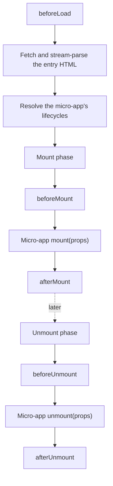

# Lifecycle hooks (LifeCycles)

Framework-level lifecycle hooks that let the main app observe and hook into every phase of a micro-app's load, mount, and unmount. Pass them to [`registerMicroApps`](/api/register-micro-apps) (where they apply to every app in that registration) or to [`loadMicroApp`](/api/load-micro-app) (where they apply only to that one instance).

Keep these straight: the hooks here are not the same as the bootstrap/mount/unmount a micro-app exports itself — for those, see [MicroAppLifeCycles](#microapplifecycles) below.

## Types

```ts
type ObjectType = Record<string, unknown>;

type LifeCycleFn<T extends ObjectType> = (
  app: LoadableApp<T>,
  global: WindowProxy,
) => Promise<void>;

type LifeCycles<T extends ObjectType> = {
  beforeLoad?: LifeCycleFn<T> | Array<LifeCycleFn<T>>;
  beforeMount?: LifeCycleFn<T> | Array<LifeCycleFn<T>>;
  afterMount?: LifeCycleFn<T> | Array<LifeCycleFn<T>>;
  beforeUnmount?: LifeCycleFn<T> | Array<LifeCycleFn<T>>;
  afterUnmount?: LifeCycleFn<T> | Array<LifeCycleFn<T>>;
};
```

`LoadableApp<T>` is the app description object, shaped like `{ name, entry, container, props? }`; see the [type reference](/api/types) for the full structure.

Each hook can be a single function or an array of functions. When you pass an array, qiankun runs them in order, awaiting each one before starting the next.

### The five hooks

| Hook | When it fires | Common use |
| --- | --- | --- |
| `beforeLoad` | Before the entry HTML is fetched and the micro-app's lifecycles are awaited | Show a global loading indicator, mark the start of a load |
| `beforeMount` | Before the micro-app's `mount` runs (within the mount phase) | Prepare shared context, seed initial values on the sandbox globals |
| `afterMount` | After the micro-app's `mount` resolves | Hide the loading indicator, run post-mount analytics |
| `beforeUnmount` | Before the micro-app's `unmount` runs | Persist state, tear down listeners on the main-app side |
| `afterUnmount` | After the micro-app's `unmount` resolves | Final cleanup, mark the end of a session |

## The second argument is a sandboxed window

::: danger The second argument is the proxied global, not the micro-app's exports
`global` (the second argument) is the **sandbox-proxied `WindowProxy`** — the `window` this micro-app sees as its own. It is neither the lifecycle object the micro-app exports nor the page's real `window`.

Reads and writes through `global` stay inside the isolation membrane: the micro-app sees them, but they don't leak into the host page, and they're reverted one by one when the app unmounts. Don't reach for the real `window` or `document.head` inside a hook — that bypasses the [JS sandbox](/concepts/js-sandbox) and can affect other apps.
:::

```ts
const lifeCycles = {
  beforeMount: async (app, global) => {
    // Correct: seed a value the micro-app reads off its own window.
    global.__APP_THEME__ = 'dark';
  },
};
```

The framework itself takes this path: the built-in addons set `global.__POWERED_BY_QIANKUN__` and `global.__INJECTED_PUBLIC_PATH_BY_QIANKUN__` on the proxied window during the `beforeLoad`/`beforeMount` phases, then remove them at `beforeUnmount`.

## Execution timing

`beforeLoad` runs in the body of `loadApp`, before the entry lifecycles are awaited. The other four hooks run inside the single-spa parcel's mount/unmount arrays, interleaved with the micro-app's own lifecycles.



The full mount order is: initialize / reuse the container → activate the sandbox → `beforeMount` → micro-app `mount({ ...props, container })` → `afterMount`. The full unmount order is: `beforeUnmount` → micro-app `unmount({ ...props, container })` → deactivate the sandbox → `afterUnmount` → clear the container.

::: info Built-in addons run before your hooks
For every hook, qiankun prepends its two built-in addons (`engineFlag` and `runtimePublicPath`) **in front of** the hooks you pass, then runs the whole chain in order. So by the time your `beforeMount` runs, `__POWERED_BY_QIANKUN__` and `__INJECTED_PUBLIC_PATH_BY_QIANKUN__` are already set. You can't run earlier than these addons.
:::

## Examples

Hooks passed to `registerMicroApps` are global — every app in that registration triggers them. Check the `app` argument to know which app is currently running.

::: code-group

```ts [main/src/index.ts]
import { registerMicroApps, start } from 'qiankun';

registerMicroApps(
  [
    {
      name: 'react-app',
      entry: 'http://localhost:7100',
      container: document.getElementById('subapp-container')!,
      activeRule: '/react',
    },
  ],
  {
    beforeLoad: async (app) => {
      console.log('[before load]', app.name);
    },
    beforeMount: async (app, global) => {
      console.log('[before mount]', app.name);
      global.__APP_THEME__ = 'dark';
    },
    afterMount: async (app) => {
      console.log('[after mount]', app.name);
    },
    beforeUnmount: async (app) => {
      console.log('[before unmount]', app.name);
    },
    afterUnmount: async (app) => {
      console.log('[after unmount]', app.name);
    },
  },
);

start();
```

:::

To run several functions in the same phase, pass an array — they run one after another:

```ts
registerMicroApps(apps, {
  beforeMount: [
    async (app) => console.log('[1]', app.name),
    async (app) => console.log('[2]', app.name),
  ],
});
```

With [`loadMicroApp`](/api/load-micro-app), the same `LifeCycles` object is the third argument and applies only to that instance:

```ts
import { loadMicroApp } from 'qiankun';

const microApp = loadMicroApp(
  {
    name: 'react-app',
    entry: 'http://localhost:7100',
    container: document.getElementById('subapp-container')!,
  },
  { sandbox: true },
  {
    afterMount: async (app) => {
      console.log('mounted', app.name);
    },
  },
);
```

## MicroAppLifeCycles: the lifecycles a micro-app exports itself {#microapplifecycles}

The `LifeCycles` above is the set of hooks on the **main-app** side, and it's not the same thing as `MicroAppLifeCycles`. The latter is the contract the **micro-app itself** exports from its entry; single-spa relies on it to drive that micro-app.

```ts
type MicroAppLifeCycles = {
  bootstrap: (props) => Promise<void>;
  mount: (props) => Promise<void>;
  unmount: (props) => Promise<void>;
  update?: (props) => Promise<void>;
};
```

qiankun discovers these exports from the entry: named ESM exports (`export async function mount() {}`), `export default { bootstrap, mount, unmount }`, or a global variable assigned by a classic/UMD entry script. `bootstrap`, `mount`, and `unmount` are required; `update` is optional and is only wired up when it's a function.

Each of these functions receives a `props` object that carries the props injected by single-spa, your `customProps` (the app's `props`), and — critically — a qiankun-injected `container: HTMLElement`. The micro-app must render into `props.container`; don't hard-code a selector.

```ts
// react-app/src/index.tsx (the micro-app)
export async function bootstrap() {}

export async function mount(props: { container: HTMLElement }) {
  const root = ReactDOM.createRoot(props.container.querySelector('#root')!);
  root.render(<App />);
}

export async function unmount(props: { container: HTMLElement }) {
  // tear down the app's own view
}
```

::: warning Two different lifecycle concepts
`LifeCycles` (what this page covers) are the hooks that attach the main app to a micro-app's phases; the functions receive `(app, global)`. `MicroAppLifeCycles` is what the micro-app exports itself; the functions receive `(props)`, which includes `container`. The two live on opposite sides of the boundary.
:::

For how props flow all the way down to the micro-app and how mount/unmount are orchestrated end to end, see [Micro-app lifecycle and props](/concepts/lifecycle-and-props).

## Related

- [registerMicroApps](/api/register-micro-apps) — the registration entry point for global `lifeCycles`
- [loadMicroApp](/api/load-micro-app) — per-instance `lifeCycles`
- [JS sandbox](/concepts/js-sandbox) — what `global` (the second argument) actually is
- [Type reference](/api/types) — `LoadableApp`, `MicroApp`, and related types
