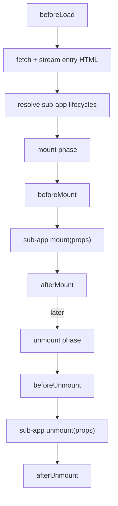

# Lifecycle hooks (LifeCycles)

Framework lifecycle hooks let the main app observe and react to each stage of a micro-app's load, mount, and unmount. You pass them to [`registerMicroApps`](/api/register-micro-apps) (where they apply globally to every registered app) or to [`loadMicroApp`](/api/load-micro-app) (where they apply to that one instance).

These hooks are distinct from the sub-app's own bootstrap/mount/unmount exports — see [MicroAppLifeCycles](#microapplifecycles-the-sub-apps-own-exports) below.

## Types

```ts
type ObjectType = Record<string, unknown>;

type LifeCycleFn<T extends ObjectType> = (
  app: LoadableApp<T>,
  global: WindowProxy,
) => Promise<void>;

type LifeCycles<T extends ObjectType> = {
  beforeLoad?: LifeCycleFn<T> | Array<LifeCycleFn<T>>;
  beforeMount?: LifeCycleFn<T> | Array<LifeCycleFn<T>>;
  afterMount?: LifeCycleFn<T> | Array<LifeCycleFn<T>>;
  beforeUnmount?: LifeCycleFn<T> | Array<LifeCycleFn<T>>;
  afterUnmount?: LifeCycleFn<T> | Array<LifeCycleFn<T>>;
};
```

`LoadableApp<T>` is the app descriptor — `{ name, entry, container, props? }`. See [the types reference](/api/types) for the full shape.

Each hook can be a single function or an array of functions. When it is an array, qiankun runs the functions in sequence, awaiting each before starting the next.

### The five hooks

| Hook | Fires | Typical use |
| --- | --- | --- |
| `beforeLoad` | Before the entry HTML is fetched and the sub-app's lifecycles are awaited | Show a global loading indicator, log the start of a load |
| `beforeMount` | Right before the sub-app's `mount` runs (inside the mount phase) | Prepare shared context, seed the sandbox global |
| `afterMount` | Right after the sub-app's `mount` resolves | Hide the loading indicator, run post-mount analytics |
| `beforeUnmount` | Right before the sub-app's `unmount` runs | Persist state, tear down main-app-side listeners |
| `afterUnmount` | Right after the sub-app's `unmount` resolves | Final cleanup, log the end of a session |

## The second argument is the sandboxed window

::: danger arg2 is the proxied global, not the sub-app's export
`global` (the second argument) is the **sandbox-proxied `WindowProxy`** that this micro-app sees as its own `window` — not the sub-app's exported lifecycle object, and not the real page `window`.

Reads and writes through `global` are scoped to the membrane: they are visible to the micro-app but do not leak to the host page, and they are unwound when the app unmounts. Never reach for the real `window` or `document.head` from inside a hook — that defeats the [JS sandbox](/concepts/js-sandbox) and can corrupt other apps.
:::

```ts
const lifeCycles = {
  beforeMount: async (app, global) => {
    // Correct: seed a value the micro-app reads off its own window.
    global.__APP_THEME__ = 'dark';
  },
};
```

The framework itself uses this exact mechanism: built-in addons set `global.__POWERED_BY_QIANKUN__` and `global.__INJECTED_PUBLIC_PATH_BY_QIANKUN__` on the proxied window during `beforeLoad`/`beforeMount`, and remove them on `beforeUnmount`.

## Execution timing

`beforeLoad` runs in the `loadApp` body, before the entry lifecycles are awaited. The other four hooks run inside the single-spa parcel's mount/unmount arrays, interleaved with the sub-app's own lifecycles.



The full mount ordering is: init/reload container → activate sandbox → `beforeMount` → sub-app `mount({ ...props, container })` → `afterMount`. The full unmount ordering is: `beforeUnmount` → sub-app `unmount({ ...props, container })` → deactivate sandbox → `afterUnmount` → clear container.

::: info Built-in addons run before your hooks
For each hook, qiankun concatenates two built-in addons (`engineFlag` and `runtimePublicPath`) **before** your user-supplied hooks, then runs the combined chain in order. So by the time your `beforeMount` runs, `__POWERED_BY_QIANKUN__` and `__INJECTED_PUBLIC_PATH_BY_QIANKUN__` are already set on `global`. You cannot run before the addons.
:::

## Examples

Hooks passed to `registerMicroApps` are global — they fire for every app registered in that call. The `app` argument tells you which app is currently in play.

::: code-group

```ts [main/src/index.ts]
import { registerMicroApps, start } from 'qiankun';

registerMicroApps(
  [
    {
      name: 'react-app',
      entry: 'http://localhost:7100',
      container: document.getElementById('subapp-container')!,
      activeRule: '/react',
    },
  ],
  {
    beforeLoad: async (app) => {
      console.log('[before load]', app.name);
    },
    beforeMount: async (app, global) => {
      console.log('[before mount]', app.name);
      global.__APP_THEME__ = 'dark';
    },
    afterMount: async (app) => {
      console.log('[after mount]', app.name);
    },
    beforeUnmount: async (app) => {
      console.log('[before unmount]', app.name);
    },
    afterUnmount: async (app) => {
      console.log('[after unmount]', app.name);
    },
  },
);

start();
```

:::

Pass an array to run several functions for one stage in order:

```ts
registerMicroApps(apps, {
  beforeMount: [
    async (app) => console.log('[1]', app.name),
    async (app) => console.log('[2]', app.name),
  ],
});
```

With [`loadMicroApp`](/api/load-micro-app), the same `LifeCycles` object is the third argument and scopes to that instance:

```ts
import { loadMicroApp } from 'qiankun';

const microApp = loadMicroApp(
  {
    name: 'react-app',
    entry: 'http://localhost:7100',
    container: document.getElementById('subapp-container')!,
  },
  { sandbox: true },
  {
    afterMount: async (app) => {
      console.log('mounted', app.name);
    },
  },
);
```

## MicroAppLifeCycles — the sub-app's own exports

`LifeCycles` above is the **main app's** hook set. It is different from `MicroAppLifeCycles`, which is the contract the **micro-app itself** must export from its entry so single-spa can drive it.

```ts
type MicroAppLifeCycles = {
  bootstrap: (props) => Promise<void>;
  mount: (props) => Promise<void>;
  unmount: (props) => Promise<void>;
  update?: (props) => Promise<void>;
};
```

qiankun discovers these from the entry: named ESM exports (`export async function mount() {}`), an `export default { bootstrap, mount, unmount }`, or a global that a classic/UMD entry script assigns. `bootstrap`, `mount`, and `unmount` are required; `update` is optional and only wired up when it is a function.

Each of these receives a `props` object that includes single-spa's injected props, your `customProps` (the app's `props`), and — critically — a qiankun-injected `container: HTMLElement`. The sub-app must render into `props.container`, not a hard-coded selector.

```ts
// react-app/src/index.tsx (the micro-app)
export async function bootstrap() {}

export async function mount(props: { container: HTMLElement }) {
  const root = ReactDOM.createRoot(props.container.querySelector('#root')!);
  root.render(<App />);
}

export async function unmount(props: { container: HTMLElement }) {
  // tear down the app's own view
}
```

::: warning Two different lifecycle concepts
`LifeCycles` (this page) hooks the main app into a micro-app's stages; its functions receive `(app, global)`. `MicroAppLifeCycles` is what the micro-app exports; its functions receive `(props)` including `container`. They are set on opposite sides of the boundary.
:::

For the end-to-end model of how props flow to the sub-app and how mount/unmount are sequenced, see [Micro-app lifecycle and props](/concepts/lifecycle-and-props).

## Related

- [registerMicroApps](/api/register-micro-apps) — where global `lifeCycles` are registered
- [loadMicroApp](/api/load-micro-app) — per-instance `lifeCycles`
- [The JS sandbox](/concepts/js-sandbox) — what `global` (arg2) actually is
- [Types reference](/api/types) — `LoadableApp`, `MicroApp`, and related types
