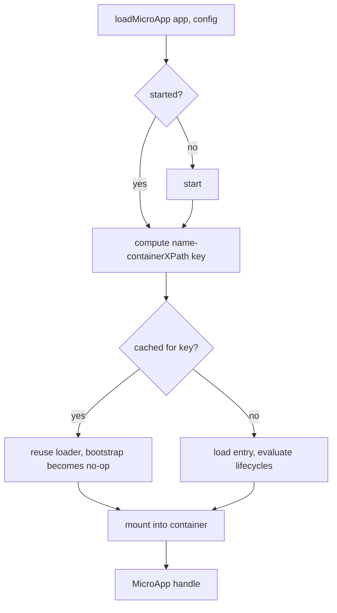

# loadMicroApp

Load and mount a micro-app imperatively into a DOM element you control, independent of routing. Use this when you want to embed a micro-app at a specific place in the page (a dialog, a tab, a panel) and manage its lifecycle yourself. For route-driven activation, use [registerMicroApps](/api/register-micro-apps) instead.

This is the same primitive the framework wrappers [`<MicroApp>` for React](/ecosystem/react) and [`<MicroApp>` for Vue](/ecosystem/vue) build on.

## Signature

```ts
function loadMicroApp<T extends ObjectType>(
  app: LoadableApp<T>,
  configuration?: AppConfiguration,
  lifeCycles?: LifeCycles<T>,
): MicroApp;
```

`loadMicroApp` returns a `MicroApp` handle (a single-spa Parcel) that you use to observe status and to unmount the app. It does not wait — the load and mount run asynchronously; await the promises on the returned handle to observe completion.

## Parameters

### `app: LoadableApp<T>`

Describes which micro-app to load and where to mount it.

| Field | Type | Required | Description |
| --- | --- | --- | --- |
| `name` | `string` | yes | Unique identifier for the micro-app instance. Combined with the container to form the memoization key (see [Behavior](#behavior)). |
| `entry` | `string` | yes | URL of the micro-app's HTML entry. Always a string — the 2.x object form (`{ scripts, styles }`) does not exist in v3. |
| `container` | `HTMLElement` | yes | The DOM element to render into. Must be an actual element, not a CSS-selector string. |
| `props` | `T` | no | Data passed through to the micro-app's lifecycle functions. |

```ts
type ObjectType = Record<string, unknown>;

type LoadableApp<T extends ObjectType> = {
  name: string;
  entry: string;
  container: HTMLElement;
  props?: T;
};
```

::: warning `container` must be an element
In qiankun v3, `container` is an `HTMLElement`, not a `string | HTMLElement`. Resolve the element yourself (`document.getElementById(...)`, a framework ref, etc.) before passing it. A selector string is a type error and will not work at runtime.
:::

### `configuration?: AppConfiguration`

Per-app options. All fields are optional; the defaults below are resolved internally.

| Option | Type | Default | Description |
| --- | --- | --- | --- |
| `sandbox` | `boolean` | `true` | Enables the Proxy-membrane [JS sandbox](/concepts/js-sandbox) and the [ESM sandbox](/concepts/esm-sandbox). Set `false` only for legacy apps that must run against the real global. |
| `globalContext` | `WindowProxy` | `window` | The base global the sandbox membrane proxies. |
| `styleIsolation` | `boolean` | `false` | Opt in to runtime CSS `@scope` [style isolation](/concepts/style-isolation), scoped to `[data-name="<name>"]`. |
| `fetch` | `typeof window.fetch` | `window.fetch` | Custom fetch for entry and asset requests. qiankun wraps it to be cacheable, retryable, and throwable. |
| `streamTransformer` | `() => TransformStream<string, string>` | — | Optional transform piped into the HTML stream. |
| `nodeTransformer` | `NodeTransformer` | internal default | Rewrites each script/link/style node before it hits live DOM. Override only for advanced cases. |

```ts
type AppConfiguration =
  Partial<Pick<LoaderOpts, 'fetch' | 'streamTransformer' | 'nodeTransformer'>> & {
    sandbox?: boolean;
    globalContext?: WindowProxy;
    styleIsolation?: boolean;
  };
```

See [AppConfiguration](/api/configuration) for the full reference.

::: info No `strict`/`experimentalStyleIsolation`, no `sandbox` object
v3 replaces the 2.x `sandbox: { strictStyleIsolation, experimentalStyleIsolation }` and Shadow DOM model with a plain boolean `sandbox` plus a separate boolean `styleIsolation` implemented via CSS `@scope`. The object forms do not exist.
:::

### `lifeCycles?: LifeCycles<T>`

Optional lifecycle hooks that run around this app's load, mount, and unmount. Each hook is a single function or an array of functions, and each receives `(app, global)` where `global` is the sandboxed window view.

```ts
type LifeCycleFn<T extends ObjectType> = (app: LoadableApp<T>, global: WindowProxy) => Promise<void>;

type LifeCycles<T extends ObjectType> = {
  beforeLoad?: LifeCycleFn<T> | Array<LifeCycleFn<T>>;
  beforeMount?: LifeCycleFn<T> | Array<LifeCycleFn<T>>;
  afterMount?: LifeCycleFn<T> | Array<LifeCycleFn<T>>;
  beforeUnmount?: LifeCycleFn<T> | Array<LifeCycleFn<T>>;
  afterUnmount?: LifeCycleFn<T> | Array<LifeCycleFn<T>>;
};
```

See [Lifecycle hooks](/api/lifecycles) for details.

## Return value

`loadMicroApp` returns a `MicroApp`, which is a single-spa Parcel handle:

```ts
type MicroApp = Parcel;

type Parcel = {
  mount(): Promise<null>;
  unmount(): Promise<null>;
  update?(customProps: object): Promise<any>;
  getStatus():
    | 'NOT_LOADED'
    | 'LOADING_SOURCE_CODE'
    | 'NOT_BOOTSTRAPPED'
    | 'BOOTSTRAPPING'
    | 'NOT_MOUNTED'
    | 'MOUNTING'
    | 'MOUNTED'
    | 'UPDATING'
    | 'UNMOUNTING'
    | 'UNLOADING'
    | 'SKIP_BECAUSE_BROKEN'
    | 'LOAD_ERROR';
  loadPromise: Promise<null>;
  bootstrapPromise: Promise<null>;
  mountPromise: Promise<null>;
  unmountPromise: Promise<null>;
};
```

| Member | Description |
| --- | --- |
| `mount()` | Mounts the parcel. loadMicroApp already mounts on load, so you rarely call this directly. |
| `unmount()` | Unmounts the app and triggers sandbox teardown and DOM cleanup. Always call this when you are done. |
| `update?(props)` | Present only if the micro-app exports an `update` lifecycle. Pushes new props to the running app. |
| `getStatus()` | Returns the current lifecycle status from the union above. |
| `loadPromise` | Resolves when the source has finished loading. |
| `bootstrapPromise` | Resolves when bootstrap has finished. |
| `mountPromise` | Resolves when mount has finished. Await this to know the app is on screen. |
| `unmountPromise` | Resolves when unmount has finished. |

::: warning Handle rejections
The promises reject if loading or mounting fails. Attach a `.catch` (or wrap in `try/await`) so failures do not surface as unhandled rejections.
:::

## Behavior

A few v3-specific behaviors are worth knowing.

- **Auto-starts the framework.** `loadMicroApp` calls [`start()`](/api/start) internally if it has not been started yet, so the main app's `pushState`/`replaceState` correctly dispatch `popstate`. You do not need to call `start()` first for imperative loading.
- **Instance key from container XPath.** Each instance is keyed by `${name}-${containerXPath}`, where the XPath is computed once from the container element.
- **Memoization per instance key.** If you load an app with the same `name` into the same DOM node again, the cached loader is reused: the source is not re-fetched, lifecycles are not re-evaluated, and `bootstrap` becomes a no-op on remount. Only mount/unmount run again.
- **Serialized on one container.** When multiple micro-apps share a container, a new mount waits on the previous instance's `unmountPromise` before mounting, so they never overlap.
- **Cleanup on unmount.** On `unmountPromise`, the instance removes itself from the per-container registry and the container DOM is cleared. Full teardown of the ESM realm and blob URLs happens on single-spa `unload`.



## Example

Resolve a container element, mount the app, then unmount it when you no longer need it.

```ts
import { loadMicroApp } from 'qiankun';

const container = document.getElementById('micro-app-slot');
if (!container) throw new Error('container not found');

const microApp = loadMicroApp(
  {
    name: 'app1',
    entry: 'http://localhost:7100',
    container,
    props: { userId: 42 },
  },
  { sandbox: true },
);

// wait until it is on screen
await microApp.mountPromise;
console.log(microApp.getStatus()); // 'MOUNTED'

// later, tear it down
await microApp.unmount();
```

For a legacy app that cannot run under isolation, disable the sandbox:

```ts
const microApp = loadMicroApp(
  { name: 'legacy-app', entry: 'http://localhost:7200', container },
  { sandbox: false },
);
```

::: tip Prefer the framework wrappers when you can
If your main app is React or Vue, [`<MicroApp>`](/ecosystem/react) manages the container ref, mount, prop updates, and unmount for you — it wraps this exact API. Reach for `loadMicroApp` directly when you need full manual control or you are not in a supported framework.
:::

## Related

- [registerMicroApps](/api/register-micro-apps) — route-driven activation instead of manual mounting.
- [start](/api/start) — auto-invoked by `loadMicroApp`, but call it explicitly for route-driven apps.
- [AppConfiguration](/api/configuration) — the full option reference.
- [Lifecycle hooks](/api/lifecycles) — the `LifeCycles` hooks.
- [Micro-app lifecycle and props](/concepts/lifecycle-and-props) — how props and lifecycles reach the sub-app.
- [Run multiple micro-app instances](/cookbook/run-multiple-instances) — patterns for multiple instances on a page.
