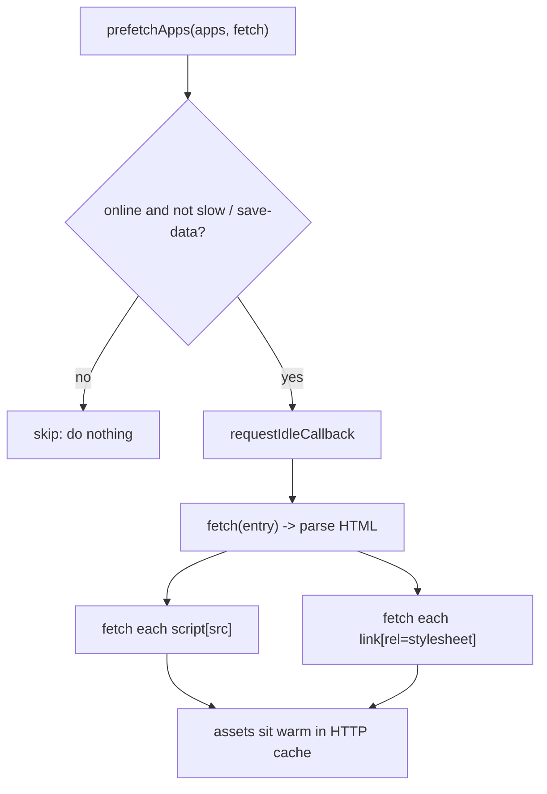

# prefetchApps (deprecated)

`prefetchApps` warms the browser HTTP cache for a list of micro-apps ahead of time. It is deprecated in qiankun 3.0 because the streaming HTML-entry loader already preloads assets automatically as it parses each entry. New code should not call it.

::: warning Deprecated in 3.0
`prefetchApps` is retained only for backward compatibility. There is no standalone `prefetch` export and no `start()`-level prefetch strategy in v3. Rely on the streaming loader's automatic preload instead — see [Optimize loading and preloading](/cookbook/optimize-loading).
:::

## Signature

```ts
function prefetchApps(
  apps: AppMetadata[],
  fetch?: typeof window.fetch,
): void
```

| Parameter | Type | Default | Description |
| --- | --- | --- | --- |
| `apps` | `AppMetadata[]` | — | Micro-apps to warm. Each item is `{ name: string; entry: string }`, where `entry` is the HTML entry URL. |
| `fetch` | `typeof window.fetch` | `window.fetch` | Custom fetch used to request the entry and its assets. Pass a decorated fetch if you need auth headers or a proxy. |

Returns `void`. Prefetching is fire-and-forget: the function schedules work and returns immediately.

`AppMetadata` is the shared shape used across the public API:

```ts
type AppMetadata = {
  name: string;
  entry: string; // HTML entry URL
};
```

## Why it is deprecated

In qiankun 2.x, prefetching was a first-class strategy: `start({ prefetch })` could eagerly download the assets of not-yet-active micro-apps to speed up later navigation.

v3 removes that need at the architecture level:

- The loader streams each HTML entry through `writable-dom` and starts fetching and evaluating `<script>` and `<link>` nodes the moment they appear in the stream, rather than waiting for the whole document. Assets are effectively preloaded as a side effect of loading.
- `start()` in v3 accepts only single-spa's `{ urlRerouteOnly }` — the 2.x `prefetch`, `sandbox`, `singular`, `fetch`, and template options are gone. There is no framework-level prefetch strategy to configure.
- There is no exported standalone `prefetch` function. The internal `prefetch()` helper is private; only `prefetchApps` is public.

Because of this, calling `prefetchApps` is rarely worthwhile. It logs a deprecation warning in development builds:

```text
[qiankun] prefetchApps is deprecated in 3.0; streaming loader performs automatic preload.
```

## What it still does if called

When invoked, `prefetchApps` iterates the `apps` array and, for each entry, schedules a cache-warming pass. The work is deferred to `requestIdleCallback` (with a `setTimeout` shim for browsers that lack it) so it never competes with foreground rendering.



For every entry it:

1. Fetches the entry HTML to warm the cache, then parses it with `DOMParser`.
2. Collects every `script[src]` and `link[rel="stylesheet"]`, resolves each URL against the entry, and fetches it inside its own `requestIdleCallback` tick. Fetch errors are swallowed.

It skips all of this — silently and per call — when the network is unsuitable:

- `navigator.onLine` is `false` (offline), or
- `navigator.connection.saveData` is set (data-saver mode), or
- the effective connection type is a slow cellular type (`2g`/`3g`) rather than `wifi`/`ethernet`.

Prefetching only warms the HTTP cache. It does not create a sandbox, evaluate scripts, or mount anything — a later `registerMicroApps`/`loadMicroApp` still performs the real load.

### Example

```ts
import { prefetchApps } from 'qiankun';

// Legacy usage — prefer relying on the streaming loader instead.
prefetchApps([
  { name: 'react-app', entry: 'https://cdn.example.com/react-app/' },
  { name: 'vue-app', entry: 'https://cdn.example.com/vue-app/' },
]);
```

With a custom fetch (for example, to attach an auth header):

```ts
prefetchApps(
  [{ name: 'react-app', entry: 'https://cdn.example.com/react-app/' }],
  (input, init) => fetch(input, { ...init, headers: { Authorization: token } }),
);
```

## PrefetchStrategy type

The `PrefetchStrategy` type is still exported for backward compatibility, but no public v3 API consumes it — `start()` no longer takes a `prefetch` option. Treat it as legacy.

```ts
type PrefetchStrategy =
  | boolean
  | 'all'
  | string[]
  | ((apps: AppMetadata[]) => { criticalAppNames: string[]; minorAppsName: string[] });
```

## Recommendation

Do not add `prefetchApps` to new applications. The streaming loader already preloads a micro-app's assets while it loads, so an explicit warm-up pass adds little and duplicates fetches. If you need to tune loading performance, see the [Optimize loading and preloading](/cookbook/optimize-loading) cookbook, which covers what the streaming loader does automatically and the levers that remain in v3.

## See also

- [start](/api/start) — v3 only accepts `{ urlRerouteOnly }`; no `prefetch` option.
- [registerMicroApps](/api/register-micro-apps) — the normal way to load route-driven micro-apps.
- [HTML-entry streaming loading](/concepts/html-entry-loading) — how automatic preload works.
- [Optimize loading and preloading](/cookbook/optimize-loading) — performance guidance.
- [Migrate from qiankun 2.x](/cookbook/migrate-from-2x) — replacing the 2.x prefetch strategy.
