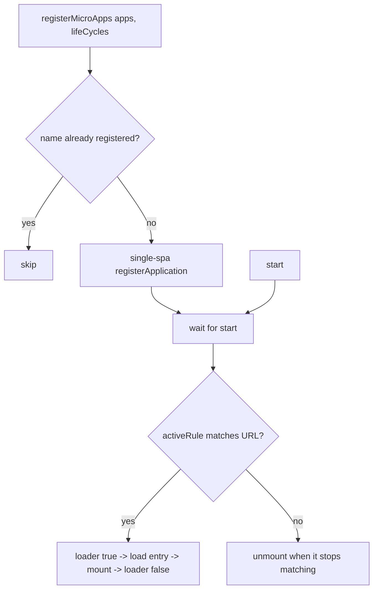

# registerMicroApps

Registers route-driven micro-apps against the main app. Each registered app is bound to an `activeRule`; qiankun mounts it when the URL matches and unmounts it when it stops matching. This is the primary way to wire micro-apps in v3 — for imperative, manually-controlled mounting use [loadMicroApp](/api/load-micro-app) instead.

## Signature

```ts
function registerMicroApps<T extends ObjectType>(
  apps: Array<RegistrableApp<T>>,
  lifeCycles?: LifeCycles<T>,
): void
```

`registerMicroApps` only records the apps and hands them to [single-spa](https://single-spa.js.org/). Nothing loads until you call [start](/api/start). Registration and activation are two separate steps:

```ts
import { registerMicroApps, start } from 'qiankun';

registerMicroApps(apps, lifeCycles);
start();
```

## Parameters

| Parameter | Type | Required | Description |
| --- | --- | --- | --- |
| `apps` | `Array<RegistrableApp<T>>` | Yes | The micro-apps to register. See [RegistrableApp fields](#registrableapp-fields). |
| `lifeCycles` | `LifeCycles<T>` | No | Global lifecycle hooks applied to every app in this call. See [Global lifecycle hooks](#global-lifecycle-hooks). |

## RegistrableApp fields

```ts
type RegistrableApp<T extends ObjectType> = {
  name: string;
  entry: string;                       // HTMLEntry
  container: HTMLElement;
  activeRule: string | ActivityFn | Array<string | ActivityFn>;
  props?: T;
  loader?: (loading: boolean) => void;
  configuration?: AppConfiguration;
};
```

| Field | Type | Required | Description |
| --- | --- | --- | --- |
| `name` | `string` | Yes | Unique app name. See the [name matching note](#the-name-must-match-the-sub-app-s-exported-global) — it should match the global/library the sub-app exposes. |
| `entry` | `string` | Yes | URL of the micro-app's HTML entry, for example `//localhost:7100`. In v3 `entry` is always a string (an HTML URL) — the 2.x object form `{ scripts, styles }` no longer exists. |
| `container` | `HTMLElement` | Yes | The DOM element the micro-app mounts into — an actual element, not a selector string. Pass a ref'd node or `document.getElementById(...)`. |
| `activeRule` | `string \| ActivityFn \| Array<string \| ActivityFn>` | Yes | When the app is active. Forwarded to single-spa's `activeWhen`. A string is a path prefix; a function `(location) => boolean` gives full control; an array matches if any entry matches. |
| `props` | `T` | No | Data passed to the micro-app on every lifecycle call (`bootstrap`/`mount`/`unmount`/`update`). |
| `loader` | `(loading: boolean) => void` | No | Called with `true` immediately before the app mounts and `false` after it finishes, so the host can drive a loading indicator. |
| `configuration` | `AppConfiguration` | No | Per-app runtime configuration: `sandbox`, `styleIsolation`, `fetch`, and more. See [AppConfiguration](/api/configuration) and the [per-app configuration note](#per-app-configuration-is-the-only-config-injection-point). |

::: info entry and container
`entry` must be served with permissive CORS headers, because qiankun fetches the HTML and its assets cross-origin. The `container` element must stay mounted for the lifetime of the registration — qiankun captures the element reference at registration time, so it must not be replaced, keyed, or unmounted by the host framework.
:::

### The `activeRule`

`activeRule` is single-spa's `activeWhen`. The most common form is a path prefix:

```ts
registerMicroApps([
  { name: 'react', entry: '//localhost:7100', container, activeRule: '/react' },
]);
```

For anything a prefix cannot express, use a function or an array:

```ts
registerMicroApps([
  {
    name: 'react',
    entry: '//localhost:7100',
    container,
    // active on /react as well as any /shop/* route
    activeRule: ['/react', (location) => location.pathname.startsWith('/shop/')],
  },
]);
```

## Global lifecycle hooks

The second argument applies to every app registered in the call. Each hook is a function (or array of functions) `(app, global) => Promise<void>`:

```ts
registerMicroApps(apps, {
  beforeLoad:    (app) => { console.log('[lifecycle] before load', app.name); return Promise.resolve(); },
  beforeMount:   (app) => { console.log('[lifecycle] before mount', app.name); return Promise.resolve(); },
  afterMount:    (app) => { console.log('[lifecycle] after mount', app.name); return Promise.resolve(); },
  beforeUnmount: (app) => { console.log('[lifecycle] before unmount', app.name); return Promise.resolve(); },
  afterUnmount:  (app) => { console.log('[lifecycle] after unmount', app.name); return Promise.resolve(); },
});
```

The second argument, `global`, is the micro-app's sandboxed `window` view (the Proxy membrane), not the real `window`. These framework-level hooks are distinct from the `bootstrap`/`mount`/`unmount` functions the sub-app itself exports. See [Lifecycle hooks](/api/lifecycles) and [Micro-app lifecycle and props](/concepts/lifecycle-and-props) for the full reference.

## Behavior

- **Deduplicated by `name`.** An app whose `name` is already registered is skipped, so calling `registerMicroApps` twice with overlapping apps is safe.
- **Registered to single-spa.** Each new app becomes a single-spa application with `activeWhen: activeRule` and `customProps: props`.
- **Activation awaits `start()`.** The internal loader waits until you call [start](/api/start) before it loads and mounts anything. Registration alone does nothing visible.
- **`loader` wraps mount.** When present, `loader(true)` runs before mount and `loader(false)` after, on every activation.
- **`lifeCycles` are global.** The hooks passed as the second argument run for every app in that call, in addition to the built-in addons that inject `__POWERED_BY_QIANKUN__` and `__INJECTED_PUBLIC_PATH_BY_QIANKUN__`.



## Example

A complete host setup: obtain a real container element, register each app with its own `configuration`, then call `start()` once.

::: code-group

```ts [main/src/register.ts]
import { registerMicroApps, start } from 'qiankun';

export function registerAll(
  container: HTMLElement,
  onLoading: (name: string, loading: boolean) => void,
): void {
  registerMicroApps([
    {
      name: 'react',
      entry: '//localhost:7100',
      container,
      activeRule: '/react',
      loader: (loading) => onLoading('react', loading),
      configuration: { sandbox: true, styleIsolation: true },
    },
    {
      name: 'vue',
      entry: '//localhost:7101',
      container,
      activeRule: '/vue',
      loader: (loading) => onLoading('vue', loading),
      configuration: { sandbox: true, styleIsolation: true },
    },
    {
      // registered name matches window['webpack-app'] exposed by the sub-app
      name: 'webpack-app',
      entry: '//localhost:7102',
      container,
      activeRule: '/webpack',
      loader: (loading) => onLoading('webpack-app', loading),
      configuration: { sandbox: true },
    },
  ]);

  start();
}
```

```tsx [main/src/App.tsx]
import { useEffect, useRef } from 'react';
import { registerAll } from './register';

export default function App() {
  const containerRef = useRef<HTMLDivElement>(null);

  useEffect(() => {
    if (containerRef.current) {
      registerAll(containerRef.current, (name, loading) => {
        console.log(`[${name}] loading: ${loading}`);
      });
    }
    // register once; the container must never be unmounted or keyed
  }, []);

  // one shared container element hosts every micro-app
  return <div ref={containerRef} id="subapp-stage" />;
}
```

:::

::: tip One container for many apps
A single container element can host every route-driven app, because only one app is active at a time. qiankun empties and re-fills the container as routes change. Whatever you pass, the element must remain in the DOM for the whole session.
:::

## Notes and caveats

### The `name` must match the sub-app's exported global

qiankun discovers the micro-app's lifecycle functions from the global (or library) it exposes. For classic (UMD / window-library) apps, the registered `name` must equal the key the sub-app writes to `window` — for example a sub-app that sets `window['webpack-app'] = { bootstrap, mount, unmount }` (or a Webpack build whose `output.library.name` is `webpack-app`) must be registered as `name: 'webpack-app'`. If the name does not match the exposed global, qiankun cannot find the lifecycles and throws a `QiankunError`.

ESM sub-apps expose their lifecycles as native `export`s, so the name is less load-bearing there, but keeping `name` aligned with the app's identity is still recommended. See [Micro-app lifecycle and props](/concepts/lifecycle-and-props) for the full lifecycle-discovery order.

### Per-app `configuration` is the only config injection point

In v3 there is no framework-wide configuration injected through `start()`. `start()` accepts only single-spa's `{ urlRerouteOnly? }`. Everything that used to be a global framework option — `sandbox`, `styleIsolation`, a custom `fetch` — is now set **per app** through `RegistrableApp.configuration`:

```ts
registerMicroApps([
  {
    name: 'react',
    entry: '//localhost:7100',
    container,
    activeRule: '/react',
    configuration: {
      sandbox: true,          // default true; Proxy-membrane JS isolation
      styleIsolation: true,   // default false; CSS @scope isolation
      // fetch: customFetch,  // optional custom fetch for this app's assets
    },
  },
]);
```

See [AppConfiguration](/api/configuration) for every field and default.

::: warning No 2.x start options
Options like `prefetch`, `sandbox: { strictStyleIsolation | experimentalStyleIsolation }`, `singular`, `getPublicPath`, and `getTemplate` were qiankun 2.x `start` options. They do not exist in v3. Style isolation is a single boolean `styleIsolation` implemented with CSS `@scope` — there is no Shadow DOM mode. Preloading is automatic via the streaming loader, so there is no `prefetch` strategy to configure. See [Migrate from qiankun 2.x](/cookbook/migrate-from-2x).
:::

::: info No built-in global state store
v3 does not ship `initGlobalState` / `onGlobalStateChange` / `setGlobalState`. To share state, pass your own methods or store into each app through `props`. See [Share state and communicate between apps](/cookbook/communicate-between-apps).
:::

## See also

- [start](/api/start) — activate the registered apps
- [loadMicroApp](/api/load-micro-app) — mount an app imperatively instead of by route
- [AppConfiguration](/api/configuration) — per-app `sandbox`, `styleIsolation`, `fetch`
- [Lifecycle hooks (LifeCycles)](/api/lifecycles) — the global hook reference
- [setDefaultMountApp / runAfterFirstMounted](/api/effects) — route/first-mount effects
- [Types reference](/api/types) — `RegistrableApp`, `LoadableApp`, `HTMLEntry`
