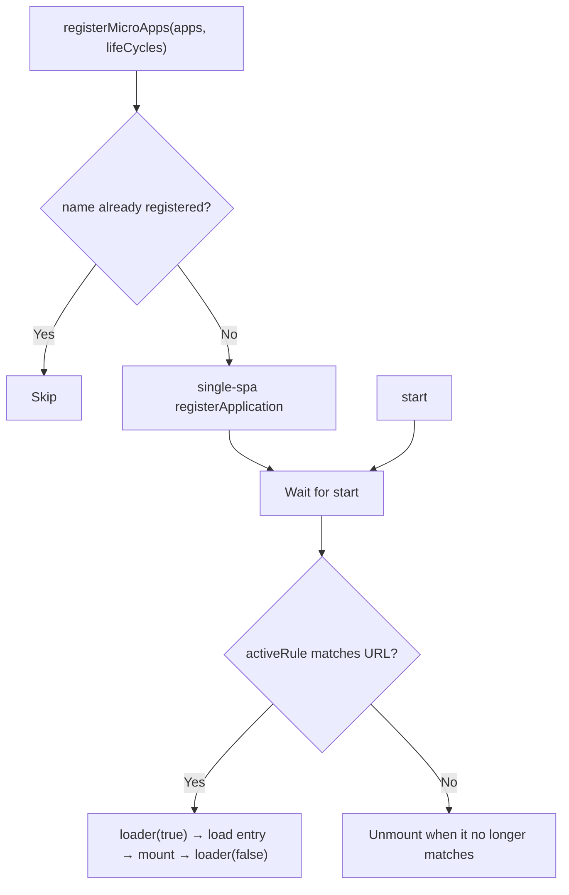

# registerMicroApps

Register micro-apps against the main app by route. Every registered app is bound to an `activeRule`; qiankun mounts it when the URL matches and unmounts it when it no longer does. This is the primary way to integrate micro-apps in v3 — if you want to control mounting manually and imperatively, use [loadMicroApp](/api/load-micro-app) instead.

## Signature

```ts
function registerMicroApps<T extends ObjectType>(
  apps: Array<RegistrableApp<T>>,
  lifeCycles?: LifeCycles<T>,
): void
```

`registerMicroApps` only records these apps and hands them off to [single-spa](https://single-spa.js.org/). Nothing loads until you call [start](/api/start). Registration and activation are two separate steps:

```ts
import { registerMicroApps, start } from 'qiankun';

registerMicroApps(apps, lifeCycles);
start();
```

## Parameters

| Parameter | Type | Required | Description |
| --- | --- | --- | --- |
| `apps` | `Array<RegistrableApp<T>>` | Yes | The micro-apps to register. See [RegistrableApp fields](#registrableapp-fields). |
| `lifeCycles` | `LifeCycles<T>` | No | Global lifecycle hooks applied to every app registered in this call. See [Global lifecycle hooks](#global-lifecycle-hooks). |

## RegistrableApp fields

```ts
type RegistrableApp<T extends ObjectType> = {
  name: string;
  entry: string;                       // HTMLEntry
  container: HTMLElement;
  activeRule: string | ActivityFn | Array<string | ActivityFn>;
  props?: T;
  loader?: (loading: boolean) => void;
  configuration?: AppConfiguration;
};
```

| Field | Type | Required | Description |
| --- | --- | --- | --- |
| `name` | `string` | Yes | The app's unique name. See [`name` must match the global the sub-app exposes](#name-must-match-the-global-the-sub-app-exposes) — it should equal the global variable / library name the sub-app exposes. |
| `entry` | `string` | Yes | The URL of the micro-app's HTML entry, e.g. `//localhost:7100`. In v3 `entry` is always a string (an HTML address); the 2.x `{ scripts, styles }` object form is gone. |
| `container` | `HTMLElement` | Yes | The DOM element the micro-app mounts into — a real element, not a selector string. Pass a node obtained from a ref, or `document.getElementById(...)`. |
| `activeRule` | `string \| ActivityFn \| Array<string \| ActivityFn>` | Yes | When the app activates; forwarded as-is to single-spa's `activeWhen`. A string is a path prefix; a function `(location) => boolean` gives you full control; an array activates when any entry matches. |
| `props` | `T` | No | Data passed to the micro-app on every lifecycle call (`bootstrap` / `mount` / `unmount` / `update`). |
| `loader` | `(loading: boolean) => void` | No | Called once with `true` right before mount and once with `false` after mount completes, so the main app can drive a loading indicator. |
| `configuration` | `AppConfiguration` | No | Per-app runtime configuration: `sandbox`, `styleIsolation`, `fetch`, and so on. See [AppConfiguration](/api/configuration) and [Per-app configuration is the only configuration entry point](#per-app-configuration-is-the-only-configuration-entry-point). |

::: info entry and container
`entry` must be served with permissive CORS response headers, because qiankun fetches this HTML and its assets cross-origin. The `container` element must stay in the page for the entire registration lifetime — qiankun captures a reference to this element at registration time, so it must not be replaced by the host framework, re-created via a key, or unmounted.
:::

### About `activeRule`

`activeRule` is single-spa's `activeWhen`. The most common form is a path prefix:

```ts
registerMicroApps([
  { name: 'react', entry: '//localhost:7100', container, activeRule: '/react' },
]);
```

When a prefix can't express what you need, reach for a function or an array:

```ts
registerMicroApps([
  {
    name: 'react',
    entry: '//localhost:7100',
    container,
    // active on /react as well as any /shop/* route
    activeRule: ['/react', (location) => location.pathname.startsWith('/shop/')],
  },
]);
```

## Global lifecycle hooks

The second argument applies to every app registered in this call. Each hook is a function (or array of functions) `(app, global) => Promise<void>`:

```ts
registerMicroApps(apps, {
  beforeLoad:    (app) => { console.log('[lifecycle] before load', app.name); return Promise.resolve(); },
  beforeMount:   (app) => { console.log('[lifecycle] before mount', app.name); return Promise.resolve(); },
  afterMount:    (app) => { console.log('[lifecycle] after mount', app.name); return Promise.resolve(); },
  beforeUnmount: (app) => { console.log('[lifecycle] before unmount', app.name); return Promise.resolve(); },
  afterUnmount:  (app) => { console.log('[lifecycle] after unmount', app.name); return Promise.resolve(); },
});
```

The second argument, `global`, is the micro-app's sandbox-isolated `window` view (the Proxy membrane), not the real `window`. These framework-level hooks are a different thing from the `bootstrap` / `mount` / `unmount` a sub-app exports itself. For the full story see [Lifecycle hooks](/api/lifecycles) and [Micro-app lifecycle and props](/concepts/lifecycle-and-props).

## Behavior

- **Deduplicated by `name`.** If an app's `name` is already registered, it is skipped, so calling `registerMicroApps` twice with overlapping apps is safe.
- **Registered with single-spa.** Each new app becomes a single-spa application, with `activeWhen` taken from `activeRule` and `customProps` from `props`.
- **Activation waits for `start()`.** The internal loader waits until you call [start](/api/start) before loading and mounting. Registration alone has no visible effect.
- **`loader` wraps the mount.** When a `loader` is provided, every activation runs `loader(true)` before mount and `loader(false)` after.
- **`lifeCycles` is global.** Hooks passed as the second argument run for every app in that call; on top of that, built-in addons inject `__POWERED_BY_QIANKUN__` and `__INJECTED_PUBLIC_PATH_BY_QIANKUN__`.



## Example

A complete main-app integration: get a real container element, give each app its own `configuration`, and call `start()` once at the end.

::: code-group

```ts [main/src/register.ts]
import { registerMicroApps, start } from 'qiankun';

export function registerAll(
  container: HTMLElement,
  onLoading: (name: string, loading: boolean) => void,
): void {
  registerMicroApps([
    {
      name: 'react',
      entry: '//localhost:7100',
      container,
      activeRule: '/react',
      loader: (loading) => onLoading('react', loading),
      configuration: { sandbox: true, styleIsolation: true },
    },
    {
      name: 'vue',
      entry: '//localhost:7101',
      container,
      activeRule: '/vue',
      loader: (loading) => onLoading('vue', loading),
      configuration: { sandbox: true, styleIsolation: true },
    },
    {
      // registered name matches window['webpack-app'] exposed by the sub-app
      name: 'webpack-app',
      entry: '//localhost:7102',
      container,
      activeRule: '/webpack',
      loader: (loading) => onLoading('webpack-app', loading),
      configuration: { sandbox: true },
    },
  ]);

  start();
}
```

```tsx [main/src/App.tsx]
import { useEffect, useRef } from 'react';
import { registerAll } from './register';

export default function App() {
  const containerRef = useRef<HTMLDivElement>(null);

  useEffect(() => {
    if (containerRef.current) {
      registerAll(containerRef.current, (name, loading) => {
        console.log(`[${name}] loading: ${loading}`);
      });
    }
    // register once; the container must never be unmounted or keyed
  }, []);

  // one shared container element hosts every micro-app
  return <div ref={containerRef} id="subapp-stage" />;
}
```

:::

::: tip One container for many apps
A single container element can host every route-driven app, because only one app is active at a time. On route changes qiankun clears the container and refills it. Whichever element you pass, it must stay in the DOM for the entire session.
:::

## Notes and pitfalls

### `name` must match the global the sub-app exposes

qiankun finds a sub-app's lifecycle functions through the global variable (or library) it exposes. For classically bundled apps (UMD / window library), the `name` you register must equal the key the sub-app writes onto `window` — for example, if a sub-app sets `window['webpack-app'] = { bootstrap, mount, unmount }` (or a Webpack build's `output.library.name` is `webpack-app`), you must register it as `name: 'webpack-app'`. If the name and the exposed global don't line up, qiankun can't find the lifecycles and throws a `QiankunError`.

ESM sub-apps expose their lifecycles via native `export`, so the name matters less there, but it's still recommended to keep `name` consistent with the app's own identifier. For the full lifecycle lookup order, see [Micro-app lifecycle and props](/concepts/lifecycle-and-props).

### Per-app configuration is the only configuration entry point

There is no framework-level global config injected through `start()` in v3. `start()` only takes single-spa's `{ urlRerouteOnly? }`. What used to be global framework options — `sandbox`, `styleIsolation`, a custom `fetch` — are now all set **per app** in `RegistrableApp.configuration`:

```ts
registerMicroApps([
  {
    name: 'react',
    entry: '//localhost:7100',
    container,
    activeRule: '/react',
    configuration: {
      sandbox: true,          // default true; Proxy-membrane JS isolation
      styleIsolation: true,   // default false; CSS @scope isolation
      // fetch: customFetch,  // optional custom fetch for this app's assets
    },
  },
]);
```

For each field and its default, see [AppConfiguration](/api/configuration).

::: warning No 2.x start options
`prefetch`, `sandbox: { strictStyleIsolation | experimentalStyleIsolation }`, `singular`, `getPublicPath`, and `getTemplate` were all qiankun 2.x `start` options, and none of them exist in v3. Style isolation is a single boolean `styleIsolation`, implemented under the hood with CSS `@scope` — there is no Shadow DOM mode. Prefetching is done automatically by the streaming loader, so there is no `prefetch` strategy to configure. See [Migrating from qiankun 2.x](/cookbook/migrate-from-2x).
:::

::: info No built-in global state library
v3 no longer ships `initGlobalState` / `onGlobalStateChange` / `setGlobalState`. To share state, pass your own methods or store to each app through `props`. See [Sharing state and communicating between apps](/cookbook/communicate-between-apps).
:::

## See also

- [start](/api/start) — activate registered apps
- [loadMicroApp](/api/load-micro-app) — mount an app imperatively rather than by route
- [AppConfiguration](/api/configuration) — per-app `sandbox`, `styleIsolation`, `fetch`
- [Lifecycle hooks (LifeCycles)](/api/lifecycles) — global hook reference
- [setDefaultMountApp / runAfterFirstMounted](/api/effects) — routing / first-mount side effects
- [Type reference](/api/types) — `RegistrableApp`, `LoadableApp`, `HTMLEntry`
