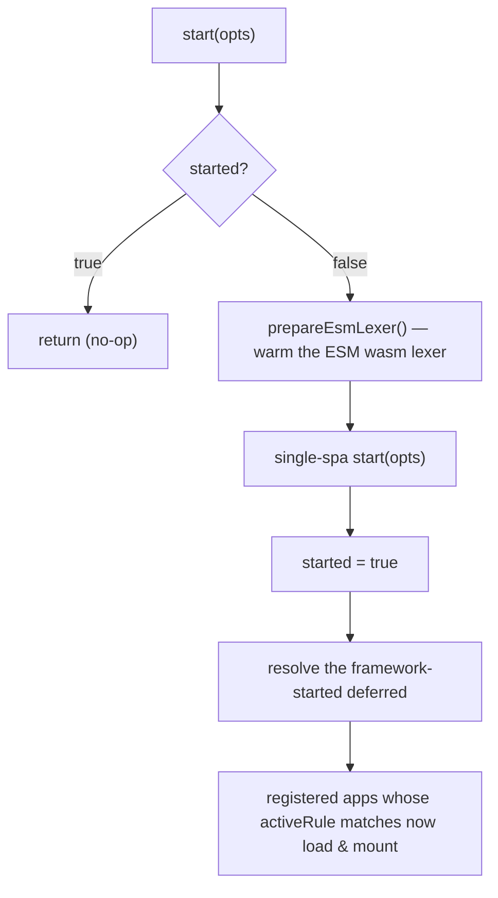

# start

Boots the qiankun runtime and hands control to single-spa's router. Call `start()` once, after you have registered your micro-apps with [registerMicroApps](/api/register-micro-apps), so single-spa begins matching the current URL against each app's `activeRule` and mounts the ones that match.

## Signature

```ts
function start(opts?: StartOpts): void
```

`StartOpts` is single-spa's own type. In qiankun v3 it exposes a single field:

| Option | Type | Default | Description |
| --- | --- | --- | --- |
| `urlRerouteOnly` | `boolean` | `false` | Forwarded straight to single-spa. When `true`, single-spa only reroutes when the URL actually changes, so `history.pushState` / `history.replaceState` calls that do not change the URL will not trigger a reroute. See the [single-spa API docs](https://single-spa.js.org/docs/api#start). |

```ts
import { registerMicroApps, start } from 'qiankun';

registerMicroApps([
  /* ... */
]);

start();
```

## What it does

`start()` performs four things, in order, and only on the first call:



1. Warms the ESM sandbox's WebAssembly lexer via `prepareEsmLexer()`, so the first micro-app to load does not pay the one-time instantiation cost. The transpiler pipeline awaits the same lexer again later as a safety net, so this is purely an optimization.
2. Calls single-spa's `start(opts)`, forwarding your `opts` unchanged.
3. Sets the internal `started` flag to `true`.
4. Resolves the internal framework-started deferred. Each app registered through `registerMicroApps` blocks on this deferred before it loads, so resolving it releases every matching app to begin loading and mounting.

::: tip Idempotent
`start()` is guarded by the internal `started` flag. Calling it more than once is safe and does nothing after the first call. It never throws on a repeat call.
:::

## `loadMicroApp` starts the framework for you

If you use [loadMicroApp](/api/load-micro-app) for manual, imperative mounting, you do not have to call `start()` yourself. `loadMicroApp` invokes `start()` automatically when the framework has not been started yet, so that the main app's `pushState` / `replaceState` navigations dispatch `popstate` correctly through single-spa.

You still call `start()` explicitly in the common route-driven setup, where apps are wired up with `registerMicroApps` and mounted based on the URL.

## 2.x options removed in v3

::: warning Breaking change from qiankun 2.x
In qiankun 2.x, `start()` accepted a large configuration object. In v3 the only accepted field is single-spa's `urlRerouteOnly`. The 2.x options below **do not exist** — they are commented out in the source and passing them has no effect:

`prefetch`, `sandbox`, `singular`, `fetch`, `getPublicPath`, `getTemplate`, `excludeAssetFilter`.

Where the behavior lives now:

| 2.x `start` option | v3 replacement |
| --- | --- |
| `prefetch` | The streaming HTML-entry loader preloads assets automatically. See [Optimize loading and preloading](/cookbook/optimize-loading). The legacy [prefetchApps](/api/prefetch-apps) API is deprecated. |
| `sandbox` (boolean or `{ strictStyleIsolation, experimentalStyleIsolation }`) | Per-app `sandbox` (boolean) and `styleIsolation` (boolean, CSS `@scope`) in [AppConfiguration](/api/configuration). |
| `singular` | Not configured globally. Multiple instances are supported per container — see [Run multiple micro-app instances](/cookbook/run-multiple-instances). |
| `fetch` | Per-app `fetch` in [AppConfiguration](/api/configuration). |
| `getPublicPath`, `getTemplate`, `excludeAssetFilter` | Removed. The HTML-entry loader and per-app `nodeTransformer` / `streamTransformer` cover these cases. |

See [Migrate from qiankun 2.x](/cookbook/migrate-from-2x) for the full migration path.
:::

## See also

- [registerMicroApps](/api/register-micro-apps) — register route-driven apps before calling `start()`.
- [loadMicroApp](/api/load-micro-app) — imperative mounting that auto-starts the framework.
- [AppConfiguration](/api/configuration) — per-app `sandbox`, `styleIsolation`, `fetch`, and transformer options.
- [The ESM sandbox](/concepts/esm-sandbox) — what the warmed wasm lexer is for.
