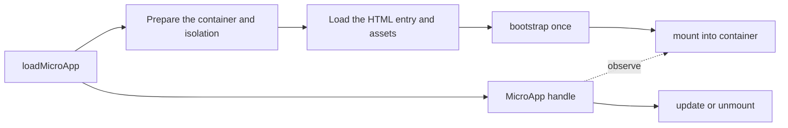

# Loading a micro-app instance

The primary way to use qiankun is to call [`loadMicroApp`](/api/load-micro-app) for a DOM element you control. One call starts one micro-app instance and returns a handle for observing and controlling it. You do not need to register a route or call `start()` first.

This page describes the public runtime model. Implementation details live in [Runtime orchestration internals](/internals/runtime-orchestration).

## Load your first instance

Resolve the container, call `loadMicroApp`, and keep the returned handle:

```ts
import { loadMicroApp } from 'qiankun';

const container = document.getElementById('report-slot');
if (!container) throw new Error('report-slot not found');

const reportApp = loadMicroApp({
  name: 'report-app',
  entry: 'https://reports.example.com/',
  container,
  props: { accountId: '42' },
});

await reportApp.mountPromise;

// When this part of the page is removed:
await reportApp.unmount();
```

`loadMicroApp` returns immediately while loading and mounting continue asynchronously. Use `mountPromise` when later work depends on the app being visible, and handle promise rejections like any other network or rendering failure.

## The runtime model

An instance moves through a small, predictable sequence:



The HTML entry tells qiankun which scripts and styles belong to the app. The entry exposes the app's lifecycle functions; qiankun calls them and supplies the host-owned container. JavaScript isolation is enabled by default, while [style isolation](/concepts/style-isolation) is opt-in.

## Who owns what

| qiankun owns | The micro-app owns |
| --- | --- |
| Fetching the HTML entry and its assets | Exporting valid lifecycle functions |
| Preparing the isolated runtime | Rendering only inside `props.container` |
| Calling lifecycle functions in order | Disposing its framework root and external side effects |
| Clearing the container during unmount | Treating mount and unmount as repeatable operations |

Removing the container from the page does not replace lifecycle cleanup. Start `unmount()` before discarding the handle and always handle its Promise. Await completion before removing the container when the host flow allows it; framework cleanup callbacks that cannot await should attach a rejection handler.

## Choose how activation is controlled

- **`loadMicroApp`** is the default: use it for panels, tabs, dialogs, dashboards, multiple instances, and any host-managed lifecycle.
- **React and Vue `<MicroApp>` components** wrap `loadMicroApp` and tie the handle to the component lifecycle. See the [React](/ecosystem/react) and [Vue](/ecosystem/vue) integrations.
- **[`registerMicroApps`](/api/register-micro-apps)** is an alternative when the URL should automatically decide which app is active. It is not required for imperative loading.

## Guarantees and boundaries

- `container` must be a live `HTMLElement`, not a selector string, and should not be shared with unrelated host content.
- The entry and its assets must be reachable from the browser; cross-origin deployments need the correct [CORS configuration](/concepts/html-entry-loading#cross-origin-and-deployment-boundaries).
- Isolation reduces accidental interference between applications. It is not a security boundary for untrusted code.
- `unmount()` triggers the app's cleanup lifecycle and clears its rendered DOM, but the app must still release resources qiankun does not own, such as host-store subscriptions and workers.

## Continue reading

- [Micro-app lifecycle and props](/concepts/lifecycle-and-props) — the contract behind the handle.
- [HTML entry](/concepts/html-entry-loading) — how one URL describes an application.
- [JavaScript isolation](/concepts/js-sandbox) and [Style isolation](/concepts/style-isolation) — guarantees and limits.
- [`loadMicroApp` API](/api/load-micro-app) — options, return value, and error handling.
