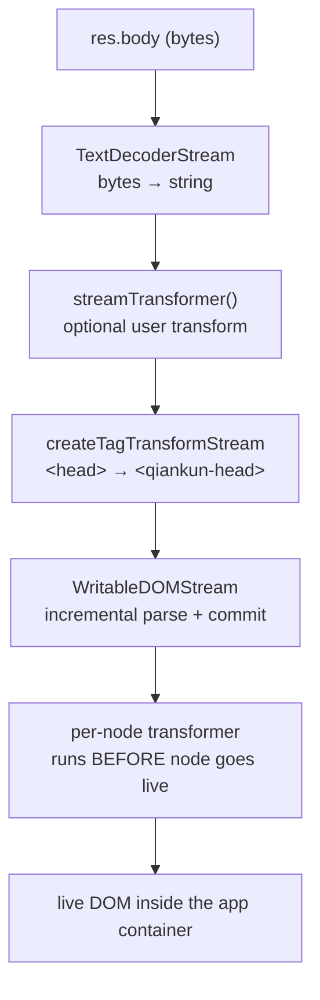

# HTML-entry streaming loading

Qiankun does not ask you to declare a manifest of scripts and stylesheets for each micro-app. You point it at the micro-app's `index.html` URL, and qiankun fetches that HTML, streams it, transpiles every asset node it contains, and commits the result into the app container incrementally. This page explains how that pipeline works, what contract the entry HTML must satisfy, and where the mechanism has known edges.

## What HTML-entry means

An `entry` in qiankun is a plain string — the URL of a micro-app's HTML document.

```ts
registerMicroApps([
  {
    name: 'app-react',
    entry: 'http://localhost:7101', // the micro-app's index.html
    container: '#subapp-container',
    activeRule: '/react',
  },
]);
```

That single URL is the whole integration surface. Qiankun treats the HTML document as the source of truth: whatever `<script>`, `<link>`, and `<style>` nodes the document declares are what the micro-app runs. There is no separate list of JS/CSS bundles to keep in sync with the build — when the micro-app rebuilds and its `index.html` references new hashed filenames, qiankun picks them up automatically on the next load.

This is the "HTML-entry" model: qiankun consumes the same HTML a browser would, but routes its assets through a sandbox and a transpiler instead of the real document. The whole flow is driven by `loadEntry(entry, container, opts)` in `packages/loader/src/index.ts`.

## The streaming pipeline

Qiankun does not download the entire HTML document, parse it into a string, and then insert it. It builds a genuine `ReadableStream` chain so that HTML is parsed and committed to live DOM incrementally, as bytes arrive off the network.

Given `res = await fetch(entry)` (where `fetch` is a decorated `window.fetch`, see [below](#the-decorated-fetch)), the response body flows through these stages:



In code the chain is (`packages/loader/src/index.ts`):

```ts
res.body
  .pipeThrough(new TextDecoderStream())        // bytes → string
  .pipeThrough(streamTransformer())            // optional, only if you supply one
  .pipeThrough(createTagTransformStream(...))  // <head> → <qiankun-head>
  .pipeTo(new WritableDOMStream(container, null, (clone) => { /* per-node hook */ }));
```

Each stage has a distinct job:

| Stage | Responsibility |
| --- | --- |
| `TextDecoderStream` | Decode raw bytes into a UTF-8 string stream. |
| `streamTransformer` | Optional. A user-supplied `() => TransformStream<string, string>` (the `streamTransformer` option on [AppConfiguration](/api/configuration)) to rewrite the raw HTML text before parsing — for example to patch hard-coded URLs. |
| `createTagTransformStream` | String-level tag rewriting. Used for [head virtualization](#head-virtualization). |
| `WritableDOMStream` | A fork of `writable-dom` (`packages/loader/src/writable-dom/`). Parses the incoming HTML incrementally, blocks on synchronous scripts and stylesheets so ordering is preserved, and preloads other assets while blocked. |

Because the sink writes into the container as chunks arrive, the micro-app's DOM begins to materialize before the full document has downloaded — the same progressive behavior a browser gives a top-level navigation.

### The per-node transformer

The third argument to `WritableDOMStream` is a callback invoked on **every node before it is moved from a detached parsing document into live DOM**. This ordering is the load-bearing detail: the node is rewritten while it is still inert, so a `<script>` never executes and a `<link>` never fetches against the real document before qiankun has had a chance to rewrite it.

Inside that callback qiankun calls `nodeTransformer(clone, transformerOpts)`. The default node transformer (`defaultNodeTransformer`) delegates to `transpileAssets`, which dispatches by tag name:

- `SCRIPT` → `transpileScript` — classic scripts are wrapped and pointed at a sandbox-scoped blob URL; module scripts are marked `data-esm="true"` and handed to the [ESM sandbox](/concepts/esm-sandbox) engine.
- `LINK` → `transpileLink` — external stylesheets and preloads, rewritten when [style isolation](/concepts/style-isolation) is enabled.
- `STYLE` → `transpileStyle` — only transpiled when `styleIsolation` is on; otherwise passed through untouched.

You can supply your own `nodeTransformer` via [AppConfiguration](/api/configuration) if you need to intercept nodes yourself, but the default already covers scripts, links, and styles.

## Head virtualization

A micro-app's `index.html` has a `<head>`. If qiankun inserted that `<head>` verbatim, and the micro-app later did `document.head.appendChild(...)` at runtime (which frameworks do constantly — injecting styles, preloading chunks), those nodes would land in the **real** `document.head` and leak across apps.

To prevent this, qiankun rewrites the head tag at the **string level**, before any DOM is built. `createTagTransformStream` is configured with exactly two replacements (`packages/loader/src/index.ts`):

```ts
{ tag: '<head>',  alt: '<qiankun-head>' }
{ tag: '</head>', alt: '</qiankun-head>' }
```

So the micro-app's `<head>...</head>` becomes a custom `<qiankun-head>...</qiankun-head>` element living **inside the app container**. The tag name is `qiankun-head` (`packages/sandbox/src/consts.ts`).

The sandbox's dynamic-append patchers then treat `<qiankun-head>` as the app's virtual head: when the sub-app appends to `document.head`, the patcher redirects the node into `container.querySelector('qiankun-head')` (`packages/sandbox/src/patchers/dynamicAppend/common.ts`) rather than the real `document.head`. Runtime head appends therefore stay scoped to the app container and are cleaned up when the app unmounts.

The replacement mechanism buffers stream chunks and does a single first-occurrence `String.prototype.replace`. If a chunk boundary splits the `<head>` tag, the transform holds the buffer until the next chunk completes it; once a replacement lands it flushes and clears the buffer.

## The entry-script contract

Among all the scripts in the HTML, qiankun needs to know which one is the micro-app's entry — the script whose export provides the [lifecycle functions](/concepts/lifecycle-and-props) (`bootstrap`, `mount`, `unmount`). That script is identified by an `entry` attribute.

```html
<script src="/app.js" entry></script>
```

The rules qiankun enforces while streaming (`packages/loader/src/index.ts`):

- **Exactly one entry script.** If a second external script also carries the `entry` attribute, `loadEntry` throws:

  > `QiankunError: You should not include more than 1 entry scripts in a single HTML entry`

- **Only external scripts can be the entry.** A script counts as external when it has a `src` or a `data-src` attribute. An inline script (no `src`/`data-src`) can never be the entry.

Three classification helpers drive this:

| Helper | Condition |
| --- | --- |
| `isExternalScript` | `tagName === 'SCRIPT'` and has `src` or `data-src` |
| `isEntryScript` | external and has the `entry` attribute |
| `isDeferScript` | external and has the `defer` attribute |

In practice you rarely add the `entry` attribute by hand. The [@qiankunjs/bundler-plugin](/ecosystem/bundler-plugin) marks the correct entry script for you at build time for both Webpack and Vite.

::: tip Where the attribute comes from
For a Webpack UMD build the entry attribute lands on the runtime/main bundle. For a Vite ESM build it lands on the `<script type="module">`. The plugin handles both — you do not hand-edit `index.html`.
:::

### Classic vs ESM entry resolution

The entry script can be resolved along one of two execution paths, chosen per script:

- **Classic** (`<script src="..." entry>`, a UMD/global build). Qiankun binds `onload`/`onerror` to the script. When it loads, the entry is resolved from the sandbox — see [app export discovery](#how-the-app-export-is-discovered) below.
- **ESM** (`<script type="module" ... entry>`). After transpilation the script carries `data-esm="true"` and is left **inert** — qiankun does not set its `src` to let the browser execute it. Execution is driven by the `EsmSandboxEngine` instead, and completion arrives via the engine's `entryNamespacePromise`. See [The ESM sandbox](/concepts/esm-sandbox) for how modules are fetched, rewritten, and evaluated.

Module scripts do not execute mid-stream. After the HTML stream finishes, qiankun calls `esmEngine.sealAndExecute()`, which runs all module scripts in document order. This matches how a browser defers `type="module"` scripts to after the document is parsed.

## Defer scripts and preloading while blocked

`WritableDOMStream` blocks on synchronous scripts and stylesheets to preserve execution order, but it does not stall on everything. While it is blocked waiting for one asset, it **preloads other assets** it has already seen in the stream, so the network stays busy.

Scripts marked `defer` (external + `defer` attribute) are handled specially: each defer script is given a `Deferred` and chained through an internal queue (`prepareDeferredQueue`), so it waits for the entry HTML to finish before it settles — again mirroring native `defer` semantics, where deferred scripts run after parsing completes and in order.

## How the app export is discovered

Once execution completes, qiankun has to read the micro-app's lifecycle object out of whatever the entry produced. This differs by path:

- **Classic path.** The entry script assigns a global (a UMD build assigns `window.<libraryName> = { bootstrap, mount, unmount }`). The sandbox membrane records the **last** global the script set as `latestSetProp`. When the classic entry script's `load` fires, `onEntryLoaded()` resolves the loader's promise with `sandbox.globalThis[sandbox.latestSetProp]`. The ordering here is deliberate — qiankun captures `latestSetProp` before invoking any listener the app itself attached, so the value is not clobbered.
- **ESM path.** The lifecycle object is the **entry module's namespace**. The engine resolves `entryNamespacePromise` with the module namespace (named exports `bootstrap`/`mount`/`unmount`, or an `export default { ... }`).

If the stream finishes and **no explicit `entry` script was found**, qiankun falls back:

- If there were ESM module scripts, the **last** module is treated as the entry (this matches a typical Vite `index.html`, which has a single `<script type="module" src="/src/main.ts">`).
- Otherwise it falls back to the classic `latestSetProp`.

The resolved value is then handed to `getLifecyclesFromExports`, which accepts the object itself, its `.default`, the `latestSetProp` global, or `window[appName]`, in that order. See [Micro-app lifecycle and props](/concepts/lifecycle-and-props) for the full resolution order and the required export shape.

::: warning Empty body
If the entry response has no body, `loadEntry` throws `QiankunError: The response body of entry ... is empty`. A blank or 204 response is not a valid micro-app entry.
:::

### The decorated fetch

The entry — and every asset the transpilers re-fetch — goes through a decorated `window.fetch`, composed as:

```ts
makeFetchCacheable(makeFetchRetryable(makeFetchThrowable(fetch)));
```

Cacheable is outermost (so repeat requests for the same URL are deduped), then retryable, then throwable (which turns a non-2xx response into a thrown error). You can replace the base `fetch` via the `fetch` option on [AppConfiguration](/api/configuration); qiankun still wraps whatever you pass with these three decorators.

## Known edges

The streaming loader is a pragmatic implementation of an ambitious idea; a few sharp corners are worth knowing.

- **Head replacement is a naive first-occurrence string replace.** The `<head>` → `<qiankun-head>` rewrite is a plain `String.prototype.replace` on the first occurrence. A `FIXME` in the source notes that non-standard HTML chunks lacking a `<head>` tag are not handled. Standard documents emitted by real bundlers are fine; hand-crafted or unusual HTML may not virtualize its head.
- **Body virtualization is not implemented.** The equivalent `<body>` → `<qiankun-body>` replacement exists in the source but is commented out, and head/body auto-completion is disabled. Only the head is virtualized; the body content is committed into the container directly.
- **`sandbox: false` disables the classic export mechanism.** The sandbox membrane is what records `latestSetProp`, and the ESM engine only exists when the sandbox is on. With `sandbox: false` there is no `latestSetProp` and no ESM-sandbox execution — you must rely on the `window[appName]` / default-export fallbacks for lifecycle discovery. See [The JS sandbox](/concepts/js-sandbox).

## See also

- [Architecture overview](/concepts/architecture) — where the loader sits in the load lifecycle.
- [The JS sandbox](/concepts/js-sandbox) — the membrane that captures `latestSetProp` and scopes dynamic head appends.
- [The ESM sandbox](/concepts/esm-sandbox) — how `type="module"` entries are fetched, rewritten, and executed.
- [Style isolation](/concepts/style-isolation) — how `<link>` and `<style>` nodes are transpiled during streaming.
- [Micro-app lifecycle and props](/concepts/lifecycle-and-props) — the export contract the entry must satisfy.
- [@qiankunjs/bundler-plugin](/ecosystem/bundler-plugin) — marks the entry script for you at build time.
