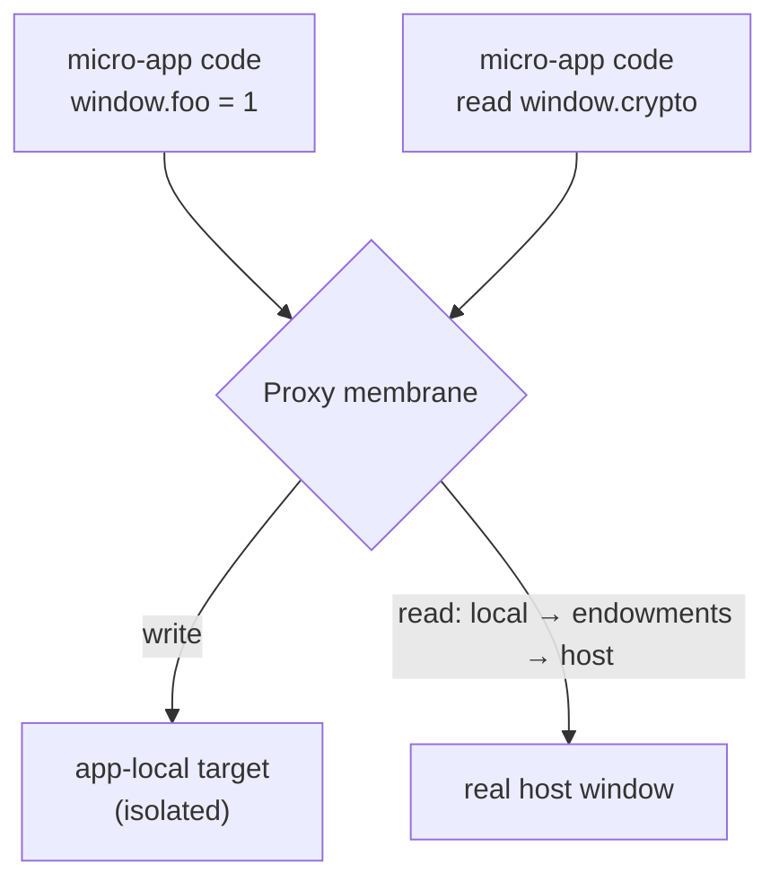

# The JS sandbox

Qiankun runs several micro-apps on one page. Without isolation, one app's `window.axios`, a stray `setInterval`, or a `window.addEventListener('resize', …)` would leak into the host and into every sibling app, and would survive after the app unmounts. The JS sandbox exists to prevent exactly this: it gives each micro-app its own virtual global scope and reverts every side effect when the app goes away.

This page explains the model, what it isolates, where it deliberately does not, and the single knob you use to control it. It is background reading — you do not need any of it to ship a micro-app, because the sandbox is on by default.

## The user-level model

Each micro-app gets its own virtual `window` (equivalently `globalThis` / `self`). It behaves like the real thing, with one asymmetry that is the whole point of the design:

- **Writes are local.** When the app runs `window.foo = 1` or a top-level `var foo`, the value lands on the app's own local target. The real `window` never sees it, and neither does any other micro-app.
- **Reads fall through.** When the app reads a global it never set — `window.localStorage`, `window.crypto`, `document` — the lookup resolves against the app's local target first, then a small set of qiankun-provided endowments, and finally falls through to the real host `window`. So the app still sees the genuine browser environment.

The result is a per-app namespace that looks complete but cannot pollute anything outside itself.



This asymmetry runs one way only. An app cannot pollute the host through writes, but it can still **read** anything on the real host `window` that it did not shadow. The sandbox contains side effects; it is not a security boundary.

## Two collaborating pieces

The sandbox is built from two parts, both in `packages/sandbox`.

### The membrane

The membrane (`core/membrane`) is a `Proxy` wrapping the host `window` — internally called the *incubator context*. It implements the read/write asymmetry above through its proxy traps, and it is the object the app sees as `window`. This proxied view is what qiankun hands to your micro-app: the `global` argument passed to lifecycle hooks is the membrane, and the runtime flags qiankun injects (`__POWERED_BY_QIANKUN__`, `__INJECTED_PUBLIC_PATH_BY_QIANKUN__`) are set on it, so your app reads them off its own `window`.

### The compartment

The membrane changes what `window.x` resolves to, but a classic UMD script also writes *bare* globals — `var foo = …` at top level, or referencing an undeclared `React`. Those do not go through `window` syntactically, so a Proxy alone cannot catch them. The compartment (`core/compartment`) closes that gap for classic scripts by wrapping the source before execution, conceptually:

```js
;(function () {
  with (this) {
    const { Array, /* …destructured intrinsics… */ } = this;
    /* original script source */
  }
}).bind(window.__compartment_globalThis__<N>__)();
```

The `with (this)` statement binds every bare global reference inside the script to the app's proxied `window`, and `this` is that membrane view. Qiankun runs this wrapped source through a **blob URL** so the browser executes it as a normal external script while it stays scoped to the sandbox. The `<N>` suffix is a per-instance counter, so two instances of the same app never collide on the same compartment slot.

Only classic scripts take this path. `<script type="module">` is handled by the [ESM sandbox](/concepts/esm-sandbox), a separate engine that reads the *same* membrane view (via `sandbox.getEsmGlobalsView()`) but rewrites modules with a lexer instead of wrapping them in `with`. Both paths share one global namespace per app.

## What gets isolated

### Global identities

Redirecting `window.x` is not enough — an app can also reach the real global through `self`, `globalThis`, `top`, or `parent`. The sandbox redefines these so they resolve to the sandbox realm, not the host:

| Identity | Behaviour inside the sandbox |
| --- | --- |
| `window`, `self` | Return the realm global (the membrane). |
| `globalThis` | Returns the realm global. |
| `top`, `parent` | Return the realm global — **unless** the host page is itself inside an iframe (see [Escape hatches](#boundaries-and-escape-hatches)). |
| `document` | Starts as the real `document`; patchers re-point DOM operations at the app's container. |
| `hasOwnProperty`, `eval` | Given sandbox-safe definitions. |

### Side effects, and their `free()`

Beyond identity, the sandbox tracks stateful side effects through **patchers** (`packages/sandbox/src/patchers`). Each patcher overrides a set of APIs on the sandboxed global and returns a `free()` closure. On unmount, every `free()` runs, undoing its side effects and restoring the native functions; it also returns a `rebuild` used to re-apply the override on the next mount.

| Patcher | Intercepts | Applied at |
| --- | --- | --- |
| `patchInterval` | `setInterval` / `clearInterval` — clears live timers on `free()` | Mounting |
| `patchWindowListener` | `window.addEventListener` / `removeEventListener` — removes leftover listeners | Mounting |
| `patchHistoryListener` | History-driven listeners | Mounting |
| `patchStandardSandbox` (dynamicAppend) | `appendChild` / `insertBefore` of `<script>` / `<style>` / `<link>` — redirects them into the app container instead of the real `document.head` | Bootstrapping **and** mounting |

Because every side effect is reverted through its `free()`, unmounting an app really does return the page to its prior state — and this is exactly why you **must** unmount. Skipping unmount leaks the timers, listeners, and injected DOM that `free()` would have cleaned up, which breaks both remounting and running multiple instances.

## What deliberately leaks

A few globals are intentionally *not* isolated — the membrane writes them straight through to the real host `window`. This is a whitelist (`core/membrane`):

```ts
const globalVariableWhiteList = ['System', '__cjsWrapper', /* + dev-only */];
```

- `System` and `__cjsWrapper` always leak. They exist to work around a SystemJS indirect-`eval` escape, and must be visible on the real window for module loading to resolve correctly.
- In development only — when `NODE_ENV` is `test`/`development` or `window.__QIANKUN_DEVELOPMENT__` is set — the whitelist also passes through `__REACT_ERROR_OVERLAY_GLOBAL_HOOK__`, `event`, `$RefreshReg$`, and `$RefreshSig$`. These are the React / Vite HMR and error-overlay hooks; letting them reach the host is what makes fast-refresh work in dev.

::: warning Do not rely on the whitelist for app state
These names genuinely reach the real `window` and are shared across apps. Treat the list as an implementation detail of module loading and dev tooling, not as a supported channel for sharing values between apps. To pass data between apps, use props (see [Share state and communicate between apps](/cookbook/communicate-between-apps)).
:::

## Native bindings and pass-throughs

Some browser APIs must keep their original `this`. Calling `fetch` through a Proxy would detach it from `window` and throw `Illegal invocation`. The sandbox handles this by re-binding such native functions to the real window before the app sees them (its `useNativeWindowForBindingsProps` set), so `window.fetch(...)` works normally inside the sandbox.

Separately, `requestAnimationFrame` and `cancelAnimationFrame` are passed straight through to the host (the `whitelistBOMAPIs` set) — they are frame-scheduling primitives with no per-app teardown to track, so isolating them would add cost without benefit.

## Multiple instances

Nothing is shared between micro-apps at the sandbox level. Every call into `loadApp` builds a **fresh `StandardSandbox`** — its own membrane and its own local target — so the same app loaded twice, or two different apps, run in fully independent global namespaces.

Each load gets an `instanceId` from a per-app counter (`genInstanceId(appName)`): the first instance is `1`, the second `2`, and so on. Two details make repeat instances work:

- The compartment's `<N>` counter guarantees each instance its own `__compartment_globalThis__<N>__` slot, so their wrapped classic scripts never overwrite each other.
- For `instanceId > 1`, qiankun clears the webpack chunk cache for that app (`removeWebpackChunkCacheWhenAppHaveMultiInstance`) so the second instance re-evaluates its bundle in its own sandbox instead of reusing modules the first instance already cached.

::: danger Always unmount every instance
Multi-instance relies entirely on the patcher `free()`s to release listeners, timers, and injected DOM. A leaked instance keeps its side effects alive and will corrupt the next mount. If you hold a `loadMicroApp` handle, call `unmount()` on it.
:::

See [Run multiple micro-app instances](/cookbook/run-multiple-instances) for the practical recipe.

## Lifecycle: active and inactive

The sandbox mirrors single-spa's mount/unmount:

- On **mount**, `sandbox.active()` **unlocks** the membrane. Bootstrapping-phase rebuilds are replayed, the mounting patchers are installed, and any dynamic stylesheets are re-attached.
- On **unmount**, every patcher `free()` runs (collecting rebuilds for next time), then `sandbox.inactive()` **locks** the membrane. While locked, global writes coming from the app are ignored (dev logs a warning).

::: info There is no snapshot diff
Some sandbox designs record every property on `window` at mount and diff-restore them at unmount. Qiankun v3 does **not** work this way. Isolation comes from writes never touching the real `window` in the first place, so there is nothing to diff back. The `SnapshotSandbox` type exists in the enum but is unimplemented — `createSandboxContainer` always constructs a `StandardSandbox`, in both the `Proxy`-present and `Proxy`-absent branches. In practice the v3 sandbox **requires** `Proxy`; there is no legacy fallback.
:::

## Boundaries and escape hatches

The sandbox is honest about where it stops. Know these before you depend on isolation:

- **Reads of untouched host globals are allowed.** An app can read anything on the real `window` it did not shadow. Isolation is one-directional (writes in, not reads out).
- **`top` / `parent` escape when the host is nested.** If the qiankun host page is itself embedded in an iframe, `top` and `parent` return the *real* top/parent windows rather than the sandbox realm — this is deliberate, so an app inside a nested host can still reach the outer frame.
- **Indirect `eval` caveat.** There is a known limitation where indirect `eval` inside the membrane can let SystemJS reach outside the sandbox scope. This is why `System` is whitelisted rather than isolated.
- **`onGlobalSet` is one-way.** The engine observes only membrane-mediated writes. If the host writes directly on the real `window` after an app's modules have already evaluated, the app's captured global bindings are not refreshed.

## The public knob

There is exactly one option, on [`AppConfiguration`](/api/configuration):

| Option | Type | Default | Description |
| --- | --- | --- | --- |
| `sandbox` | `boolean` | `true` | Enable the JS sandbox. Set `false` to run the app directly in the host's real global scope. |

```ts
import { registerMicroApps } from 'qiankun';

registerMicroApps([
  {
    name: 'app1',
    entry: 'https://app1.example.com',
    container: document.getElementById('subapp')!,
    activeRule: '/app1',
    configuration: {
      sandbox: true, // default — usually you can omit it
    },
  },
]);
```

::: warning `sandbox: false` disables ESM isolation too
The ESM sandbox engine is only constructed when `sandbox` is on. Turning the sandbox off also disables ESM-sandbox execution and the classic-script export mechanism, and the app shares the host's real globals with no isolation. Leave it on unless you have a specific reason not to.
:::

::: info Changed from qiankun 2.x
In v3, `sandbox` is a plain `boolean`. The 2.x object form — `sandbox: { strictStyleIsolation }` / `sandbox: { experimentalStyleIsolation }` and Shadow-DOM style isolation — does **not** exist. CSS isolation is now a separate boolean, [`styleIsolation`](/concepts/style-isolation), implemented with the CSS `@scope` at-rule. See [Migrate from qiankun 2.x](/cookbook/migrate-from-2x).
:::

## Related

- [The ESM sandbox](/concepts/esm-sandbox) — how `<script type="module">` is isolated through the same membrane.
- [Style isolation](/concepts/style-isolation) — the CSS `@scope` counterpart to JS isolation.
- [Architecture overview](/concepts/architecture) — where the sandbox sits in the load pipeline.
- [Micro-app lifecycle and props](/concepts/lifecycle-and-props) — mount/unmount, and why unmounting matters.
- [AppConfiguration](/api/configuration) — the full per-app option reference.
