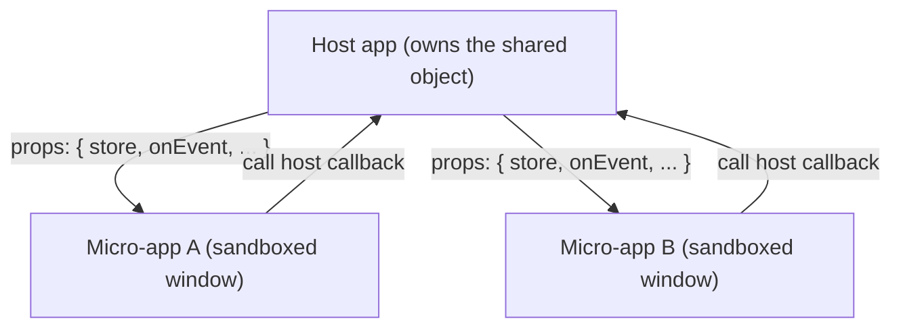

# Share state and communicate between apps

qiankun v3 has no built-in global-state store. You wire communication yourself by passing data and callbacks down as props, and by leaning on the browser primitives every app already shares. This page shows the patterns that hold up under the JS sandbox.

::: danger v3 removed the 2.x global-state API
`initGlobalState`, `onGlobalStateChange`, `setGlobalState`, and `MicroAppStateActions` do not exist in qiankun v3. They are not exported from any package. If you are migrating from 2.x, replace them with the prop-based patterns below. See [Migrate from qiankun 2.x](/cookbook/migrate-from-2x).
:::

## Why there is no shared global

The [JS sandbox](/concepts/js-sandbox) gives each micro-app its own `window`. A write the sub-app makes — `window.store = ...`, a top-level `var`, assigning a global — lands on the app's own membrane target, not the real `window`, so it is invisible to the host and to every other app. That isolation is the whole point of the sandbox, and it is why a magic global store cannot work in v3.

The consequence for communication is simple: **any shared value must live in the host and be handed to each micro-app explicitly.** The host owns the object; micro-apps receive a reference to it through props.



## Pass data down as props

Every way of loading a micro-app accepts a `props` object, and qiankun forwards it to the sub-app's `bootstrap`, `mount`, `unmount`, and `update` lifecycle functions (alongside single-spa's injected props and the qiankun-injected `container`).

::: code-group

```ts [registerMicroApps (route-driven)]
import { registerMicroApps, start } from 'qiankun';

registerMicroApps([
  {
    name: 'react-app',
    entry: '//localhost:7100',
    container: document.getElementById('subapp')!,
    activeRule: '/react',
    props: {
      user: { id: 42, name: 'Ada' },
      token: 'jwt-abc',
    },
  },
]);

start();
```

```ts [loadMicroApp (imperative)]
import { loadMicroApp } from 'qiankun';

const microApp = loadMicroApp({
  name: 'react-app',
  entry: '//localhost:7100',
  container: document.getElementById('subapp')!,
  props: {
    user: { id: 42, name: 'Ada' },
    token: 'jwt-abc',
  },
});
```

```tsx [MicroApp (React)]
import { MicroApp } from '@qiankunjs/react';

// Any prop that is not a reserved key (name, entry, settings,
// lifeCycles, wrapperClassName, className) is forwarded to the sub-app.
<MicroApp
  name="react-app"
  entry="//localhost:7100"
  user={{ id: 42, name: 'Ada' }}
  token="jwt-abc"
/>;
```

```vue [MicroApp (Vue)]
<script setup>
import { MicroApp } from '@qiankunjs/vue';
</script>

<template>
  <!-- Vue forwards props only through the dedicated appProps object -->
  <micro-app
    name="react-app"
    entry="//localhost:7100"
    :appProps="{ user: { id: 42, name: 'Ada' }, token: 'jwt-abc' }"
  />
</template>
```

:::

On the micro-app side, read the props from the lifecycle arguments:

```ts [micro-app entry]
export async function mount(props) {
  // props includes your custom props plus qiankun's container and
  // single-spa's injected props (name, singleSpa, mountParcel, ...)
  const { user, token, container } = props;
  render(container, { user, token });
}
```

::: tip React vs Vue prop passing
With `<MicroApp>` for React, any extra prop you pass is forwarded to the sub-app. With `<MicroApp>` for Vue there is no arbitrary-prop passthrough — you must use the dedicated `appProps` object prop. See [React binding](/ecosystem/react) and [Vue binding](/ecosystem/vue).
:::

## Push updates with microApp.update

Props are a snapshot taken at mount. To push new data after mount, call `update` on the parcel handle that `loadMicroApp` returns. qiankun forwards the new props to the sub-app's optional `update` lifecycle.

```ts
import { loadMicroApp } from 'qiankun';

const microApp = loadMicroApp({
  name: 'react-app',
  entry: '//localhost:7100',
  container: document.getElementById('subapp')!,
  props: { count: 0 },
});

// later, when host state changes:
await microApp.mountPromise;
await microApp.update?.({ count: 1 });
```

The sub-app opts in by exporting an `update` lifecycle:

```ts [micro-app entry]
export async function update(props) {
  // re-render with the new props
  rerender(props);
}
```

`update` is optional in the micro-app export contract — only `bootstrap`, `mount`, and `unmount` are required. If the sub-app does not export `update`, calling it is a no-op on the handle (the method is only present when the app provides it).

With the `<MicroApp>` components you never call `update` yourself. Changing a forwarded prop triggers `microApp.update` automatically: React deep-compares the extra props, and Vue deep-watches `appProps`.

::: warning Route-registered apps have no update handle
`registerMicroApps` does not return a per-app handle, so there is no ergonomic `update` for route-driven apps. For apps whose props change frequently at runtime, prefer `loadMicroApp` (or a `<MicroApp>` component), or pass a live object / callback whose contents the host mutates (next section) so the sub-app reads fresh values without a re-`update`.
:::

## Pass methods and a store down as props

Because props can hold functions and object references, the cleanest way to communicate is to build your shared store or event bus **in the host** and hand it to every micro-app. The host owns it; micro-apps read from it and call back into it. This survives the sandbox because the reference is passed in explicitly rather than reached for on a global.

### Callbacks: sub-app talks back to the host

```ts [host]
import { registerMicroApps, start } from 'qiankun';

function onSubAppEvent(payload: { type: string; data: unknown }) {
  // host reacts to something the sub-app did
  console.log('sub-app said', payload);
}

registerMicroApps([
  {
    name: 'react-app',
    entry: '//localhost:7100',
    container: document.getElementById('subapp')!,
    activeRule: '/react',
    props: { onEvent: onSubAppEvent },
  },
]);

start();
```

```ts [micro-app]
export async function mount(props) {
  props.onEvent?.({ type: 'ready', data: Date.now() });
  render(props.container, props);
}
```

### A shared observable store held by the host

Define a tiny store in the host, pass its handle down, and let each app subscribe. Any state library works — this is a dependency-free sketch:

```ts [host/store.ts]
type Listener<T> = (state: T) => void;

export function createStore<T extends object>(initial: T) {
  let state = initial;
  const listeners = new Set<Listener<T>>();
  return {
    get: () => state,
    set(patch: Partial<T>) {
      state = { ...state, ...patch };
      listeners.forEach((l) => l(state));
    },
    subscribe(listener: Listener<T>) {
      listeners.add(listener);
      return () => listeners.delete(listener); // return an unsubscribe
    },
  };
}
```

```ts [host/register.ts]
import { registerMicroApps, start } from 'qiankun';
import { createStore } from './store';

// the store lives in the host — the single source of truth
const store = createStore({ theme: 'light', user: null });

registerMicroApps([
  {
    name: 'react-app',
    entry: '//localhost:7100',
    container: document.getElementById('subapp')!,
    activeRule: '/react',
    props: { store }, // hand the same reference to every app
  },
]);

start();
```

```ts [micro-app]
let unsubscribe: (() => void) | undefined;

export async function mount(props) {
  const { store } = props;
  render(props.container, store.get());

  // react to host-driven changes
  unsubscribe = store.subscribe((state) => rerender(state));

  // push a change back up — every subscriber (host + other apps) sees it
  store.set({ theme: 'dark' });
}

export async function unmount() {
  unsubscribe?.(); // always clean up your subscription
  unsubscribe = undefined;
}
```

Every app that received the same `store` reference now shares one source of truth, and the host mediates it. An event bus (for example a small emitter, or a library you already use) works the same way: construct it in the host, pass the instance down as a prop.

::: warning Always unsubscribe on unmount
The sandbox reverts timers, listeners, and DOM side effects a micro-app made, but it does not know about a subscription you registered on a host-owned object. If you subscribe to a host store in `mount`, call the returned unsubscribe in `unmount`, or the host will keep holding a reference to your (now unmounted) app and leak it across remounts. See [Run multiple micro-app instances](/cookbook/run-multiple-instances).
:::

## Coordinate through routing

Micro-apps in a route-driven setup are activated by URL, so navigation is itself a communication channel — and it needs no shared object at all.

`activeRule` decides which app is mounted for a given path. Changing the URL from anywhere (host link, sub-app router, `history.pushState`) reroutes the whole page and mounts or unmounts apps to match.

```ts
registerMicroApps([
  {
    name: 'orders',
    entry: '//localhost:7100',
    container: document.getElementById('subapp')!,
    activeRule: '/orders', // mounted whenever the path starts with /orders
  },
  {
    name: 'billing',
    entry: '//localhost:7101',
    container: document.getElementById('subapp')!,
    activeRule: '/billing',
  },
]);
```

single-spa (which qiankun builds on) patches `history.pushState`/`replaceState` and emits a `single-spa:routing-event` after every reroute. The host — or any app — can listen for it to stay in sync with navigation, including qiankun-driven reroutes that `popstate` alone would miss:

```ts
function onRouteChange() {
  syncActiveNav(window.location.pathname);
}

// listen to both: popstate for back/forward, the single-spa event for pushState reroutes
window.addEventListener('popstate', onRouteChange);
window.addEventListener('single-spa:routing-event', onRouteChange);
```

To drive navigation from the host, push a new URL; the routing event and any `activeRule` transitions follow:

```ts
window.history.pushState(null, '', '/billing');
```

Query strings, path segments, and hash are all fair game for passing small, serializable coordination data between apps without any shared JS reference.

Other browser primitives every app shares — `localStorage`, `sessionStorage`, `BroadcastChannel`, `postMessage`, and `CustomEvent` on the real `window` — are also available for loosely-coupled messaging. They are not sandboxed globals, so both host and micro-apps see the same instance. Prefer props for anything structured or lifecycle-bound; reach for these when you specifically want fire-and-forget, cross-tab, or string-only channels.

## Boundaries to keep in mind

- **The sandbox isolates writes.** A micro-app cannot publish a value by assigning it to `window`; that write stays inside its own membrane. Communication has to go through a reference the host passed in, or through a genuinely shared browser primitive (storage, `BroadcastChannel`, events on the real window). See [The JS sandbox](/concepts/js-sandbox).
- **A shared store must live in the host.** Construct it once in the host and hand the same reference to each app via props. Do not expect a store created inside one micro-app to be reachable from another — their globals are separate realms.
- **Reads still fall through to the host window.** A micro-app can read anything on the real `window` it did not shadow, so host-provided read-only globals are visible. But do not rely on this for two-way state — writes will not flow back.
- **ESM-sandbox global propagation is one-way.** In the [ESM sandbox](/concepts/esm-sandbox), the engine keeps already-evaluated modules' global bindings in sync only for membrane-mediated writes (`onGlobalSet`). If the host writes directly to the real `window` after a micro-app's modules have evaluated, those modules will not see the change. Pass data through props and callbacks instead of mutating shared globals.
- **Always unmount, and always clean up subscriptions.** Props and the sandbox are torn down for you on unmount, but a subscription you registered on a host-owned store is not — return and call an unsubscribe. See [Micro-app lifecycle and props](/concepts/lifecycle-and-props).

## Related

- [Micro-app lifecycle and props](/concepts/lifecycle-and-props) — how props reach each lifecycle
- [registerMicroApps](/api/register-micro-apps) and [loadMicroApp](/api/load-micro-app) — where `props` is set
- [`<MicroApp>` for React](/ecosystem/react) and [`<MicroApp>` for Vue](/ecosystem/vue) — prop forwarding and `appProps`
- [The JS sandbox](/concepts/js-sandbox) — why globals are isolated
- [Migrate from qiankun 2.x](/cookbook/migrate-from-2x) — replacing the old global-state API
