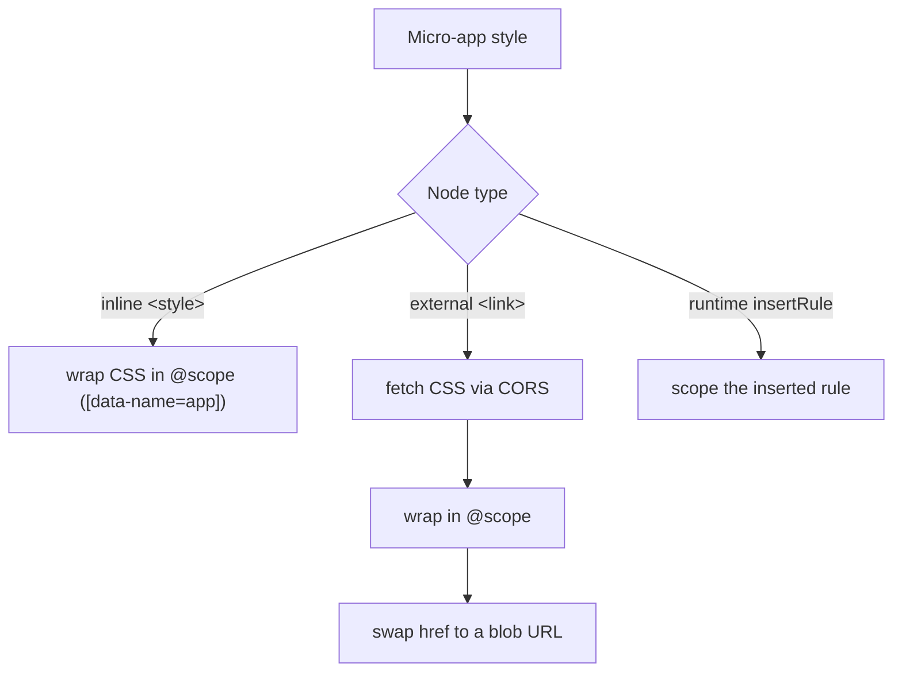

# Enable CSS style isolation

By default a micro-app's CSS is shared with the main app and every other micro-app on the page. This recipe turns on qiankun's runtime style isolation so a micro-app's rules cannot leak out to the rest of the page, and the page's rules cannot leak into the micro-app.

Style isolation is opt-in and off by default. You enable it per app with a single boolean, `styleIsolation: true`.

## Enable it

`styleIsolation` is a field of [`AppConfiguration`](/api/configuration), so you set it wherever you pass an app's configuration.

::: code-group

```ts [registerMicroApps]
import { registerMicroApps, start } from 'qiankun';

registerMicroApps([
  {
    name: 'app-vue',
    entry: '//localhost:7101',
    container: document.getElementById('subapp-container')!,
    activeRule: '/app-vue',
    configuration: {
      styleIsolation: true,
    },
  },
]);

start();
```

```ts [loadMicroApp]
import { loadMicroApp } from 'qiankun';

const microApp = loadMicroApp(
  {
    name: 'app-vue',
    entry: '//localhost:7101',
    container: document.getElementById('subapp-container')!,
  },
  {
    styleIsolation: true,
  },
);
```

```jsx [MicroApp (React)]
import { MicroApp } from '@qiankunjs/react';

export default function App() {
  return (
    <MicroApp
      name="app-vue"
      entry="//localhost:7101"
      settings={{ styleIsolation: true }}
    />
  );
}
```

```vue [MicroApp (Vue)]
<template>
  <MicroApp
    name="app-vue"
    entry="//localhost:7101"
    :settings="{ styleIsolation: true }"
  />
</template>

<script setup>
import { MicroApp } from '@qiankunjs/vue';
</script>
```

:::

For the `<MicroApp>` components the `settings` prop is an `AppConfiguration`, so setting `styleIsolation: true` on `settings` is the same knob as `configuration.styleIsolation`.

## What happens under the hood

When `styleIsolation` is on, every style the micro-app brings in is rewritten at load time so it only applies inside the app's container.



- **Scope root.** The app container carries a `data-name="<appName>"` attribute, and every rule is wrapped in a native CSS [`@scope`](https://developer.mozilla.org/en-US/docs/Web/CSS/@scope) block scoped to `[data-name="<appName>"]`. The resulting CSS looks like:

  ```css
  @scope ([data-name="app-vue"]) {
    .btn { color: rebeccapurple; }
  }
  ```

  The scope root is derived from the app name and **cannot be customized**.

- **Inline `<style>`** elements are rewritten in place: their `textContent` is replaced with the scoped version.

- **External `<link rel="stylesheet">`** stylesheets are re-fetched through qiankun's `fetch`, wrapped in `@scope`, and served back to the same `<link>` element as a `blob:` URL. The browser never loads the original unscoped sheet. The `<link>` node identity is preserved (the original URL is kept on `data-href`), so `load`/`error` handlers and `document.styleSheets` keep working.

- **Rules inserted at runtime** via `CSSStyleSheet.prototype.insertRule` are scoped as they are inserted.

## Requirements

::: warning Requires native CSS `@scope`
Style isolation is built entirely on native CSS `@scope`. There is no polyfill and no fallback. A browser that does not support `@scope` will not scope the styles, so the isolation simply will not take effect. Verify your target browsers support `@scope` before relying on this feature.
:::

::: warning External stylesheets must be CORS-fetchable
Because external `<link>` stylesheets are re-fetched as text and re-served as blobs, every external sheet the micro-app references must be reachable through a CORS-enabled request. This includes third-party CSS and any `@import`ed sheets. If a fetch or transpile fails, qiankun **drops that stylesheet entirely** (it is never loaded unscoped, to preserve isolation) and dispatches a synthetic `error` event on the `<link>`. A cross-origin sheet served without the right CORS headers will silently disappear. Serve fonts and third-party CSS with `Access-Control-Allow-Origin`.
:::

## Caveats to design around

::: info @font-face and @namespace stay global
`@font-face` and `@namespace` rules are intentionally hoisted out of the `@scope` block and kept global — scoping `@font-face` would break font loading. As a result these rules are **not isolated** and can collide across apps. Give font families app-unique names if two apps might define fonts with the same family name.
:::

::: info @keyframes are renamed
Each `@keyframes` name is prefixed with `__qk_<appName>_`, and `animation` / `animation-name` declarations that reference it are rewritten to match. This is static name-mangling: it only rewrites names that appear literally in the CSS. If your JavaScript constructs a keyframe name dynamically (for example by string concatenation) and assigns it to an element's `animation-name`, that reference will point at the original, now-renamed keyframe and the animation will not run. Avoid dynamically constructed keyframe names, or define those keyframes outside the isolated CSS.
:::

::: info Vite CSS-as-JS injection can be lost on remount
When a Vite-built app injects CSS through JavaScript (CSS-as-JS), the injection often runs once at module top level. On remount qiankun reuses the already-evaluated module, so top-level side effects do not run again and the styles can be missing the second time the app mounts. Put style injection somewhere that re-runs on each mount — for example inside the app's `mount` lifecycle — rather than at module top level. See [Make a Vite app qiankun-ready](/cookbook/prepare-a-vite-app).
:::

## Verify it

Load the micro-app and inspect it in your browser devtools:

1. Find the app container element and confirm it carries `data-name="<appName>"`.
2. Look at the micro-app's `<style>` elements (inside the virtualized `<qiankun-head>`): their rules should be wrapped in `@scope ([data-name="<appName>"]) { ... }`.
3. External stylesheets should show a `blob:` `href` on the `<link>`, with the original URL preserved on the `data-href` attribute.
4. Toggle a rule and confirm it no longer applies to elements outside the container.

## Related

- [Style isolation](/concepts/style-isolation) — how the `@scope` + blob-link mechanism works in depth.
- [HTML-entry streaming loading](/concepts/html-entry-loading) — how styles are transpiled as the entry streams in.
- [AppConfiguration](/api/configuration) — the full per-app configuration reference.
- [Migrate from qiankun 2.x](/cookbook/migrate-from-2x) — `styleIsolation` replaces 2.x's `strictStyleIsolation` / `experimentalStyleIsolation`.
