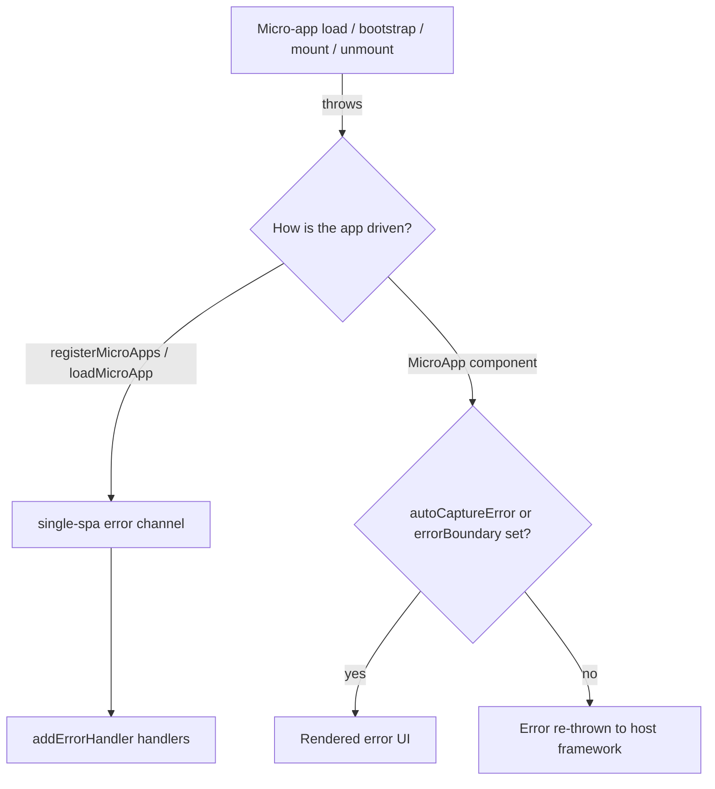

# Handle load and runtime errors

Micro-apps fail for reasons the shell cannot fully control: a bad deploy, a network blip, a CORS misconfiguration, a broken lifecycle export. This guide shows the two layers qiankun gives you to surface and recover from those failures — a global error handler for route-driven apps, and component-level error UI for `<MicroApp>` — plus the concrete error messages you will see and where they come from.

## Two layers of error handling



- Route-driven and imperative apps (`registerMicroApps`, `loadMicroApp`) route failures through single-spa. Register a handler with [`addErrorHandler`](/api/error-handling).
- The `<MicroApp>` components ([React](/ecosystem/react), [Vue](/ecosystem/vue)) surface load/bootstrap/mount errors as UI when you opt in, and otherwise re-throw them.

## Global handlers: addErrorHandler / removeErrorHandler

`addErrorHandler` and `removeErrorHandler` are re-exported straight from single-spa. They receive every error thrown while single-spa loads, bootstraps, mounts, or unmounts an application — including errors from qiankun's streaming loader, the JS sandbox, and the ESM module graph.

```ts [main/src/index.ts]
import { registerMicroApps, addErrorHandler, start } from 'qiankun';

registerMicroApps([
  {
    name: 'app1',
    entry: 'http://localhost:8000',
    container: document.getElementById('subapp-container')!,
    activeRule: '/app1',
  },
]);

addErrorHandler((err) => {
  // err.appOrParcelName — which app failed
  // err.message         — the underlying error message
  // (err as Error).stack — the stack trace
  console.error(`[qiankun] ${err.appOrParcelName} failed:`, err);
  reportToMonitoring(err);
});

start();
```

The handler is global — it fires for any registered app, so branch on `err.appOrParcelName` if you need per-app behavior. Remove a handler with the same reference you registered:

```ts
const handler = (err: Error) => reportToMonitoring(err);
addErrorHandler(handler);
// later
removeErrorHandler(handler);
```

::: info ESM module-graph and top-level-await errors
For apps that run as native ES modules (`<script type="module">`, e.g. Vite), qiankun's ESM engine plumbs module-graph evaluation errors and top-level-`await` rejections back into single-spa's error channel instead of letting them escape as an `unhandledrejection`. That means a throw inside an ESM entry module reaches your `addErrorHandler` handler the same way a classic script failure does. See [the ESM sandbox](/concepts/esm-sandbox).
:::

When an app errors, single-spa moves it to a broken state. `loadMicroApp` returns a [`MicroApp`](/api/types) handle whose `getStatus()` reports `LOAD_ERROR` or `SKIP_BECAUSE_BROKEN` for the failed instance — useful when you drive apps imperatively and want to inspect or retry.

## Component-level: `<MicroApp>` error UI

The `<MicroApp>` wrappers do not show errors by default. You must opt in, otherwise the error is re-thrown into your host framework's render tree.

### React

Opt in with `autoCaptureError` for the built-in placeholder, or pass a custom `errorBoundary` render prop for real UI:

::: code-group

```tsx [Built-in placeholder]
import { MicroApp } from '@qiankunjs/react';

// Default UI renders <div>{error.message}</div>
<MicroApp name="app1" entry="http://localhost:8000" autoCaptureError />
```

```tsx [Custom errorBoundary]
import { MicroApp } from '@qiankunjs/react';

<MicroApp
  name="app1"
  entry="http://localhost:8000"
  errorBoundary={(error) => (
    <div role="alert">
      <p>Failed to load app1: {error.message}</p>
      <button onClick={() => location.reload()}>Retry</button>
    </div>
  )}
/>
```

:::

### Vue

Opt in with `autoCaptureError`, or provide an `#error-boundary` scoped slot:

::: code-group

```vue [Built-in placeholder]
<script setup>
import { MicroApp } from '@qiankunjs/vue';
</script>

<!-- Default UI renders <div>{{ error.message }}</div> -->
<template>
  <micro-app name="app1" entry="http://localhost:8000" auto-capture-error />
</template>
```

```vue [Custom slot]
<script setup>
import { MicroApp } from '@qiankunjs/vue';
</script>

<template>
  <micro-app name="app1" entry="http://localhost:8000">
    <template #error-boundary="{ error }">
      <div role="alert">Failed to load app1: {{ error.message }}</div>
    </template>
  </micro-app>
</template>
```

:::

### Without opt-in, errors are re-thrown

If you set neither `autoCaptureError` nor a custom error boundary, load/bootstrap/mount errors are re-thrown from the component rather than swallowed. Catch them at the framework level:

::: code-group

```tsx [React error boundary]
import { Component } from 'react';
import { MicroApp } from '@qiankunjs/react';

class Boundary extends Component<{ children: React.ReactNode }, { error?: Error }> {
  state: { error?: Error } = {};
  static getDerivedStateFromError(error: Error) {
    return { error };
  }
  render() {
    if (this.state.error) return <div role="alert">{this.state.error.message}</div>;
    return this.props.children;
  }
}

export default function Page() {
  return (
    <Boundary>
      <MicroApp name="app1" entry="http://localhost:8000" />
    </Boundary>
  );
}
```

```vue [Vue errorCaptured]
<script>
import { MicroApp } from '@qiankunjs/vue';

export default {
  components: { MicroApp },
  errorCaptured(err) {
    console.error('micro-app error:', err);
    return false; // stop propagation
  },
};
</script>

<template>
  <micro-app name="app1" entry="http://localhost:8000" />
</template>
```

:::

::: tip Choose the right layer
`autoCaptureError` / `errorBoundary` handle failures visually, per component. `addErrorHandler` handles them centrally, for reporting. The two are complementary — a production shell usually wires a global handler for monitoring and component-level UI for user-facing recovery.
:::

## Common error sources and messages

The failures below come straight from qiankun's runtime. Knowing the exact message speeds up diagnosis.

| Symptom / message | Where it is thrown | Cause and fix |
| --- | --- | --- |
| `You should not include more than 1 entry scripts in a single HTML entry <url> !` | loader | Two external scripts carry the `entry` marker. An HTML entry may have exactly one entry script. Make sure your [bundler plugin](/ecosystem/bundler-plugin) marks a single entry chunk. |
| `You need to export lifecycle functions in <app> entry as neither globalLatestSetProp ... nor window['<app>'] export correctly` | `getLifecyclesFromExports` | The micro-app entry did not expose `bootstrap` / `mount` / `unmount`. See [Micro-app lifecycle and props](/concepts/lifecycle-and-props) for the export contract. |
| `The response body of entry <url> is empty!` | loader | The entry responded with no body (for example a `204`, a redirect with an empty payload, or a proxy that stripped the body). Verify the entry URL serves the app's HTML. |
| `<url> [RESPONSE_ERROR_AS_STATUS_INVALID] <status> <statusText>` | `makeFetchThrowable` | The entry (or an asset) returned a non-2xx status. qiankun's enhanced `fetch` turns non-2xx responses into throws so they surface instead of loading a broken app. |
| CORS / network `TypeError: Failed to fetch` | browser `fetch` | The entry or its assets are not reachable, or the server does not send `Access-Control-Allow-Origin`. qiankun loads everything over `fetch`, so cross-origin entries and assets need CORS headers. |
| `failed to resolve the bare specifier '<spec>' ... no import map entry found in app <app>` | ESM engine | An ESM sub-app imported a bare specifier with no matching import map entry. Provide the sub-app's own `<script type="importmap">` or use URL-like specifiers. See [the ESM sandbox](/concepts/esm-sandbox). |
| Styles missing after enabling isolation | style transpiler | Under [style isolation](/cookbook/enable-style-isolation) external stylesheets are re-fetched as blob `<link>`s so CSS `@scope` can wrap them; a dropped or CORS-blocked stylesheet request leaves the app unstyled. Check the network panel for failed CSS requests. |

::: warning Missing lifecycle exports are the most common failure
The lifecycle error surfaces after the entry loads successfully — the HTML and scripts fetched fine, but qiankun could not find `bootstrap` / `mount` / `unmount`. This usually means the sub-app was not built as a library (UMD/ESM) with the qiankun lifecycle exports, or the entry script was not marked as the entry. Prepare the sub-app first: [Vite](/cookbook/prepare-a-vite-app) / [Webpack](/cookbook/prepare-a-webpack-app).
:::

## Retry behaviour is built in for transient failures

qiankun wraps the configured `fetch` as `makeFetchCacheable(makeFetchRetryable(makeFetchThrowable(fetch)))`. Transient network failures are retried automatically before an error is thrown, so you do not need to implement retry for the entry/asset fetch yourself. Only after retries are exhausted does the error reach `addErrorHandler` or the component error boundary. To customize this, pass your own `fetch` through [`AppConfiguration`](/api/configuration).

## ESM observability caveat: blob: stacks

For ESM sub-apps, qiankun rewrites each module and evaluates it from a `blob:` URL. As a result, uncaught errors' `error.stack` points at `blob:<host-origin>/<uuid>` rather than the original source file. The injected `//# sourceURL` only changes the DevTools display name — it does not change the stack URL or line numbers.

::: danger Plan source maps for production error reporting
Without source maps, a monitoring service cannot map an ESM sub-app's stack frames back to real files. Treat full source maps as a production requirement, not a nice-to-have, for any app running through the ESM sandbox. Ship source maps from the sub-app build and configure your reporting tool to consume them. Classic (UMD/global) sub-apps are not affected in the same way — their `//# sourceURL` gives meaningful frames.
:::

## Related

- [addErrorHandler / removeErrorHandler](/api/error-handling) — API reference
- [`<MicroApp>` for React](/ecosystem/react) and [for Vue](/ecosystem/vue)
- [Micro-app lifecycle and props](/concepts/lifecycle-and-props) — the export contract
- [The ESM sandbox](/concepts/esm-sandbox) — blob URLs, import maps, source maps
- [Enable CSS style isolation](/cookbook/enable-style-isolation)
