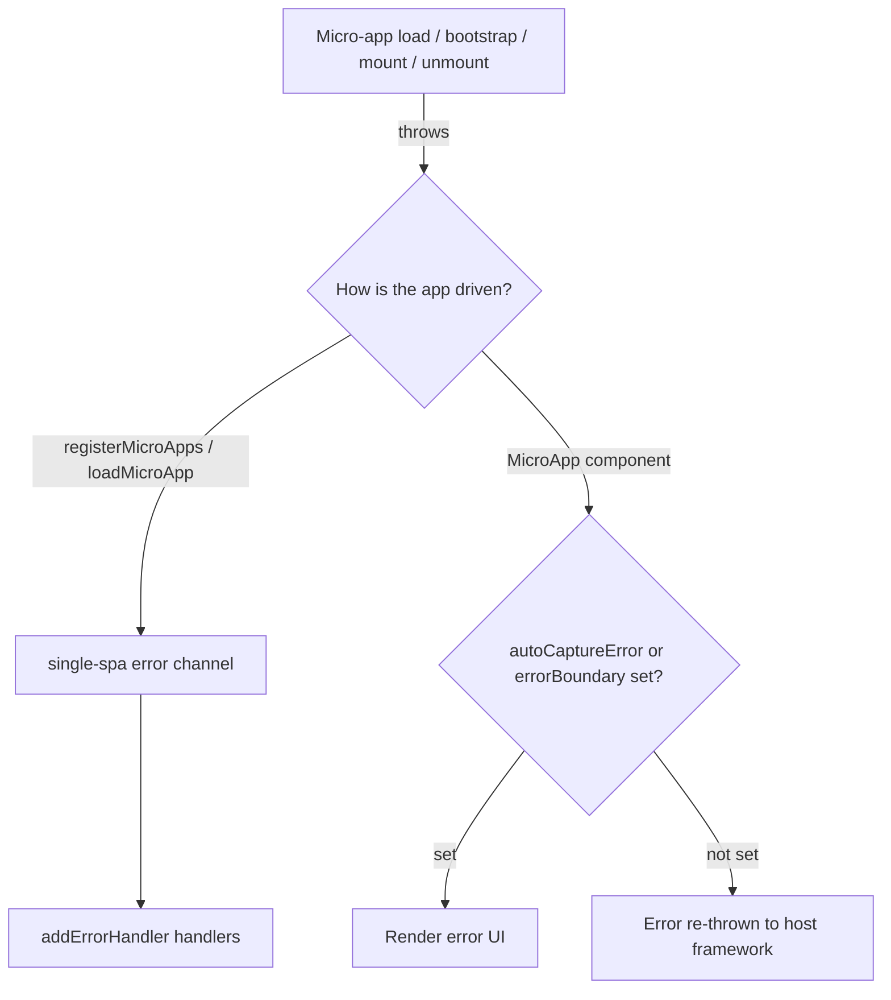

# Handle Loading and Runtime Errors

Most of the reasons a micro-app fails are outside the host's control: a bad deploy, a network hiccup, a misconfigured CORS header, a wrong lifecycle export. qiankun gives you two layers for surfacing and recovering from these errors — a global error handler for route-driven apps, and component-level error UI for `<MicroApp>`. This page walks through both, and lists the error messages you'll actually run into along with where each one is thrown.

## Two layers of error handling



- Route-driven and imperatively loaded apps (`registerMicroApps`, `loadMicroApp`) route all errors through single-spa. Register a handler with [`addErrorHandler`](/api/error-handling) and you're done.
- The `<MicroApp>` component ([React](/ecosystem/react), [Vue](/ecosystem/vue)) renders load / bootstrap / mount errors as UI when you opt in; otherwise it re-throws them as-is.

## Global handling: addErrorHandler / removeErrorHandler

`addErrorHandler` and `removeErrorHandler` are re-exported straight from single-spa. They receive every error single-spa throws while loading, bootstrapping, mounting, and unmounting apps — including errors thrown by qiankun's streaming loader, the JS sandbox, and the ESM module graph.

```ts [main/src/index.ts]
import { registerMicroApps, addErrorHandler, start } from 'qiankun';

registerMicroApps([
  {
    name: 'app1',
    entry: 'http://localhost:8000',
    container: document.getElementById('subapp-container')!,
    activeRule: '/app1',
  },
]);

addErrorHandler((err) => {
  // err.appOrParcelName — which app went down
  // err.message         — the underlying error message
  // (err as Error).stack — the call stack
  console.error(`[qiankun] ${err.appOrParcelName} failed:`, err);
  reportToMonitoring(err);
});

start();
```

The handler is global — it fires for any registered app that errors, so branch on `err.appOrParcelName` to handle individual apps differently. To remove a handler, pass the same reference you registered:

```ts
const handler = (err: Error) => reportToMonitoring(err);
addErrorHandler(handler);
// later
removeErrorHandler(handler);
```

::: info Errors from the ESM module graph and top-level await
For apps that run as native ES modules (`<script type="module">`, e.g. Vite), qiankun's ESM engine routes errors thrown while evaluating the module graph — and rejections from top-level `await` — back into single-spa's error channel, instead of letting them escape as an `unhandledrejection`. In other words, a throw in an ESM entry module reaches your `addErrorHandler` handlers just like a classic script failure would. See [ESM sandbox](/concepts/esm-sandbox).
:::

Once an app errors, single-spa puts it into a broken state. `loadMicroApp` returns a [`MicroApp`](/api/types) handle whose `getStatus()` returns `LOAD_ERROR` or `SKIP_BECAUSE_BROKEN` for the failed instance — useful when you drive apps imperatively and want to check status or retry.

## Component-level: `<MicroApp>` error UI

The `<MicroApp>` wrapper shows no error by default. You have to opt in, or errors are re-thrown into the host framework's render tree.

### React

Turn on the built-in placeholder UI with `autoCaptureError`, or pass a custom `errorBoundary` render prop to render real UI:

::: code-group

```tsx [Built-in placeholder]
import { MicroApp } from '@qiankunjs/react';

// default UI renders <div>{error.message}</div>
<MicroApp name="app1" entry="http://localhost:8000" autoCaptureError />
```

```tsx [Custom errorBoundary]
import { MicroApp } from '@qiankunjs/react';

<MicroApp
  name="app1"
  entry="http://localhost:8000"
  errorBoundary={(error) => (
    <div role="alert">
      <p>Failed to load app1: {error.message}</p>
      <button onClick={() => location.reload()}>Retry</button>
    </div>
  )}
/>
```

:::

### Vue

Use `autoCaptureError`, or provide an `#error-boundary` scoped slot:

::: code-group

```vue [Built-in placeholder]
<script setup>
import { MicroApp } from '@qiankunjs/vue';
</script>

<!-- default UI renders <div>{{ error.message }}</div> -->
<template>
  <micro-app name="app1" entry="http://localhost:8000" auto-capture-error />
</template>
```

```vue [Custom slot]
<script setup>
import { MicroApp } from '@qiankunjs/vue';
</script>

<template>
  <micro-app name="app1" entry="http://localhost:8000">
    <template #error-boundary="{ error }">
      <div role="alert">Failed to load app1: {{ error.message }}</div>
    </template>
  </micro-app>
</template>
```

:::

### Opt out, and errors are re-thrown

If neither `autoCaptureError` nor a custom error boundary is set, load / bootstrap / mount errors are re-thrown from the component rather than swallowed. Catch them at the framework layer:

::: code-group

```tsx [React error boundary]
import { Component } from 'react';
import { MicroApp } from '@qiankunjs/react';

class Boundary extends Component<{ children: React.ReactNode }, { error?: Error }> {
  state: { error?: Error } = {};
  static getDerivedStateFromError(error: Error) {
    return { error };
  }
  render() {
    if (this.state.error) return <div role="alert">{this.state.error.message}</div>;
    return this.props.children;
  }
}

export default function Page() {
  return (
    <Boundary>
      <MicroApp name="app1" entry="http://localhost:8000" />
    </Boundary>
  );
}
```

```vue [Vue errorCaptured]
<script>
import { MicroApp } from '@qiankunjs/vue';

export default {
  components: { MicroApp },
  errorCaptured(err) {
    console.error('micro-app error:', err);
    return false; // stop propagation
  },
};
</script>

<template>
  <micro-app name="app1" entry="http://localhost:8000" />
</template>
```

:::

::: tip Pick the right layer
`autoCaptureError` / `errorBoundary` present a failure to the user at component granularity; `addErrorHandler` centralizes reporting. The two are complementary — a production host usually wires up both: the global handler for monitoring, the component-level UI for user-facing recovery.
:::

## Common error sources and messages

The failures below come straight from the qiankun runtime. Recognizing the specific message makes debugging much faster.

| Symptom / message | Thrown from | Cause and fix |
| --- | --- | --- |
| `You should not include more than 1 entry scripts in a single HTML entry <url> !` | loader | Two external scripts are both marked `entry`. An HTML entry can have only one entry script. Check that your [bundler plugin](/ecosystem/bundler-plugin) marks a single entry chunk. |
| `You need to export lifecycle functions in <app> entry as neither globalLatestSetProp ... nor window['<app>'] export correctly` | `getLifecyclesFromExports` | The micro-app entry doesn't expose `bootstrap` / `mount` / `unmount`. See the export contract in [micro-app lifecycle and props](/concepts/lifecycle-and-props). |
| `The response body of entry <url> is empty!` | loader | The entry returned an empty body (a `204`, a redirect with no body, or a proxy that stripped the body). Confirm the entry URL actually returns the app's HTML. |
| `<url> [RESPONSE_ERROR_AS_STATUS_INVALID] <status> <statusText>` | `makeFetchThrowable` | The entry (or a resource) returned a non-2xx status. qiankun's enhanced `fetch` turns non-2xx responses into throws so the problem surfaces instead of loading a broken app. |
| CORS / network `TypeError: Failed to fetch` | browser `fetch` | The entry or one of its resources can't be reached, or the server didn't return `Access-Control-Allow-Origin`. qiankun loads everything through `fetch`, so cross-origin entries and resources all need CORS headers. |
| `failed to resolve the bare specifier '<spec>' ... no import map entry found in app <app>` | ESM engine | An ESM child app imported a bare specifier with no matching import map entry. Give the child app its own `<script type="importmap">`, or switch to a URL-like specifier. See [ESM sandbox](/concepts/esm-sandbox). |
| Styles missing after enabling style isolation | style transpiler | With [style isolation](/cookbook/enable-style-isolation) on, external stylesheets are re-fetched into blob `<link>`s so CSS `@scope` can wrap them; if a stylesheet request fails or is blocked by CORS, the app renders unstyled. Check the network panel for failed CSS requests. |

::: warning A missing lifecycle export is the most common failure
The lifecycle error surfaces after the entry loads successfully — the HTML and scripts fetch fine, qiankun just can't find `bootstrap` / `mount` / `unmount`. Usually the child app wasn't built as a library (UMD/ESM) with qiankun's lifecycle exports, or the entry script wasn't marked as the entry. Prepare the child app first: [Vite](/cookbook/prepare-a-vite-app) / [Webpack](/cookbook/prepare-a-webpack-app).
:::

## Retries for transient failures come built in

qiankun wraps the configured `fetch` as `makeFetchCacheable(makeFetchRetryable(makeFetchThrowable(fetch)))`. Transient network failures are retried automatically before an error is thrown, so you don't have to write your own retry logic for entry and resource fetches. Only once the retries are exhausted does the error reach `addErrorHandler` or a component error boundary. To customize this behavior, pass your own `fetch` via [`AppConfiguration`](/api/configuration).

## An ESM observability gotcha: blob: stack traces

In an ESM child app, qiankun rewrites each module and evaluates it from a `blob:` URL. As a result, an uncaught error's `error.stack` points at `blob:<host-origin>/<uuid>` rather than the original source file. The injected `//# sourceURL` only changes the name shown in DevTools — it doesn't change the URLs and line numbers in the stack.

::: danger Plan for source maps in production error reporting
Without source maps, your monitoring service can't map an ESM child app's stack frames back to real files. For any app running through the ESM sandbox, treat full source maps as a hard production requirement, not a nice-to-have. Have the child app emit source maps at build time and configure your reporting tool to consume them. Classic (UMD/global) child apps aren't affected — their `//# sourceURL` yields meaningful stack frames.
:::

## Related

- [addErrorHandler / removeErrorHandler](/api/error-handling) — API reference
- [`<MicroApp>` (React)](/ecosystem/react) and [`<MicroApp>` (Vue)](/ecosystem/vue)
- [Micro-app lifecycle and props](/concepts/lifecycle-and-props) — the export contract
- [ESM sandbox](/concepts/esm-sandbox) — blob URLs, import maps, source maps
- [Enable CSS style isolation](/cookbook/enable-style-isolation)
