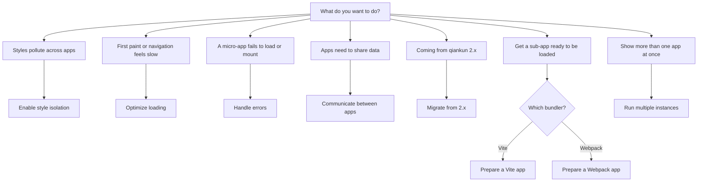

# Cookbook

This is the collection of hands-on recipes for the common jobs you'll do with qiankun v3. Every recipe is goal-first: it states what you're trying to achieve, then goes straight to the code, assuming you already know the surrounding concepts. If you want the reasoning behind a step rather than the step itself, follow the concept links inline.

## How to read a recipe

- Each recipe starts from a concrete goal (turn on a capability, get an app ready, handle a situation) rather than from the full surface of an API.
- Recipes are self-contained. They assume the framework is already installed and that you have a working main app and at least one micro-app. If you don't yet, start with [Getting started](/guide/getting-started) or the [tutorial](/tutorial/).
- Concepts are covered elsewhere. A recipe just points you to the relevant concept page ([the JS sandbox](/concepts/js-sandbox), [style isolation](/concepts/style-isolation), [HTML streaming loading](/concepts/html-entry-loading)) instead of re-explaining it.
- API details live in the [reference](/api/). Recipes show an option in a real scenario; the reference lists every field with its type and default.

## Recipes at a glance

| Recipe | Goal |
| --- | --- |
| [Enable CSS style isolation](/cookbook/enable-style-isolation) | Turn on `sandbox.styleIsolation` for a single app so a micro-app's CSS can't leak into the main app or its siblings. |
| [Optimize loading and preloading](/cookbook/optimize-loading) | Get the most out of the streaming loader, fetch caching, and automatic preload instead of relying on manual prefetch. |
| [Handle load and runtime errors](/cookbook/handle-errors) | Catch failures during loading and the lifecycle with `addErrorHandler` / `removeErrorHandler` and a per-app loader. |
| [Share state and communicate between apps](/cookbook/communicate-between-apps) | v3 no longer ships a built-in store; pass data and callbacks between the main app and micro-apps through `props`. |
| [Migrate from qiankun 2.x](/cookbook/migrate-from-2x) | Move a 2.x integration to v3: string `entry`, element `container`, per-app `configuration`, and the options that were removed. |
| [Make a Vite app qiankun-ready](/cookbook/prepare-a-vite-app) | Wire up the `@qiankunjs/bundler-plugin/vite` plugin and export lifecycles so a Vite app can run as a micro-app. |
| [Make a Webpack app qiankun-ready](/cookbook/prepare-a-webpack-app) | Add `QiankunWebpackPlugin` and export lifecycles so a Webpack app can run as a micro-app. |
| [Run multiple micro-app instances](/cookbook/run-multiple-instances) | Use `loadMicroApp` to mount the same or several micro-apps at once, and unmount each cleanly. |
| [Extend the sandbox with plugins](/cookbook/sandbox-plugins) | Write an isolation plugin so your own side effects are captured, released, and rebuilt along with the built-in ones. |
| [Use the sandbox standalone](/cookbook/standalone-sandbox) | Reach for `@qiankunjs/sandbox` on its own to isolate third-party scripts without loading a whole micro-app. |

## Quick routing

Not sure which recipe to open? Match it to your goal.

::: tip Use loadMicroApp by default
Recipes pass [`AppConfiguration`](/api/configuration) as the second argument to [`loadMicroApp`](/api/load-micro-app) by default. Route-driven apps put the same configuration in an app's `configuration` field for `registerMicroApps`; field definitions and defaults are maintained only in the configuration reference.
:::

::: warning v3 no longer ships a global-state store
qiankun 2.x offered `initGlobalState` / `onGlobalStateChange` / `setGlobalState`; v3 drops them. To share state, pass the values and callbacks down through `props` yourself — see [Share state and communicate between apps](/cookbook/communicate-between-apps).
:::

## Related

- [API reference overview](/api/) — every export and type.
- [Loading a micro-app instance](/concepts/architecture) — the `loadMicroApp` runtime model.
- [FAQ](/faq/index) — short answers to common questions.
