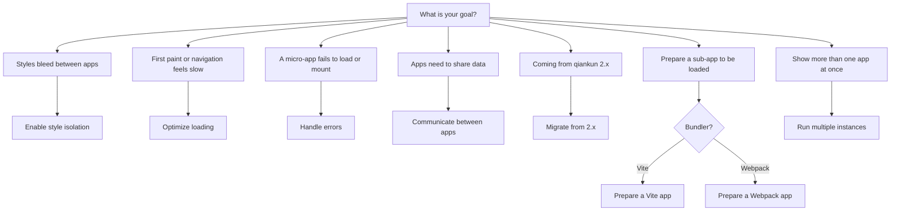

# Cookbook

Task-oriented recipes for common qiankun v3 jobs. Each recipe is goal-first: it states the outcome, shows the code, and assumes you already know the surrounding concepts. When you need the underlying model instead of a procedure, follow the concept links.

## How to read a recipe

- Every recipe starts from a concrete goal ("enable X", "make Y ready", "handle Z"), not from an API surface.
- Recipes are self-contained. They assume the framework is already installed and that you have a working main app and at least one micro-app. If you do not, start with [Getting started](/guide/getting-started) or the [tutorial](/tutorial/index).
- Concepts are covered elsewhere. A recipe links to the relevant concept page ([the JS sandbox](/concepts/js-sandbox), [Style isolation](/concepts/style-isolation), [HTML-entry streaming loading](/concepts/html-entry-loading)) rather than re-explaining it.
- API details live in the [reference](/api/index). Recipes show the option in context; the reference lists every field, type, and default.

## Recipes

| Recipe | Intent |
| --- | --- |
| [Enable CSS style isolation](/cookbook/enable-style-isolation) | Turn on per-app `styleIsolation` so a micro-app's CSS cannot leak into the main app or its siblings. |
| [Optimize loading and preloading](/cookbook/optimize-loading) | Get the most out of the streaming loader, fetch caching, and automatic preload instead of manual prefetch. |
| [Handle load and runtime errors](/cookbook/handle-errors) | Catch load and lifecycle failures with `addErrorHandler` / `removeErrorHandler` and per-app loaders. |
| [Share state and communicate between apps](/cookbook/communicate-between-apps) | Pass data and callbacks across the main app and micro-apps via `props`, since v3 ships no built-in store. |
| [Migrate from qiankun 2.x](/cookbook/migrate-from-2x) | Move a 2.x integration to v3: string `entry`, element `container`, per-app `configuration`, and removed options. |
| [Make a Vite app qiankun-ready](/cookbook/prepare-a-vite-app) | Wire the `@qiankunjs/bundler-plugin/vite` plugin and export lifecycles so a Vite app runs as a micro-app. |
| [Make a Webpack app qiankun-ready](/cookbook/prepare-a-webpack-app) | Add `QiankunWebpackPlugin` and export lifecycles so a Webpack app runs as a micro-app. |
| [Run multiple micro-app instances](/cookbook/run-multiple-instances) | Mount the same or several micro-apps at once with `loadMicroApp`, and unmount each cleanly. |

## Quick chooser

Not sure which recipe you need? Match your goal to a starting point.

::: tip Two ways to configure an app
Most recipes touch one of two configuration surfaces. Registered apps carry a per-app [`configuration`](/api/configuration) field on [`registerMicroApps`](/api/register-micro-apps); manually loaded apps take the same [`AppConfiguration`](/api/configuration) as the second argument to [`loadMicroApp`](/api/load-micro-app). Both accept exactly `fetch`, `streamTransformer`, `nodeTransformer`, `sandbox` (default `true`), `globalContext` (default `window`), and `styleIsolation` (default `false`).
:::

::: warning No global-state store in v3
qiankun 2.x shipped `initGlobalState` / `onGlobalStateChange` / `setGlobalState`. Version 3 does not. To share state, pass your own values and callbacks through `props` — see [Share state and communicate between apps](/cookbook/communicate-between-apps).
:::

## Related

- [API reference overview](/api/index) — every export and type.
- [Architecture overview](/concepts/architecture) — how `loadApp` wires fetch, sandbox, and loader together.
- [FAQ](/faq/index) — shorter answers to recurring questions.
