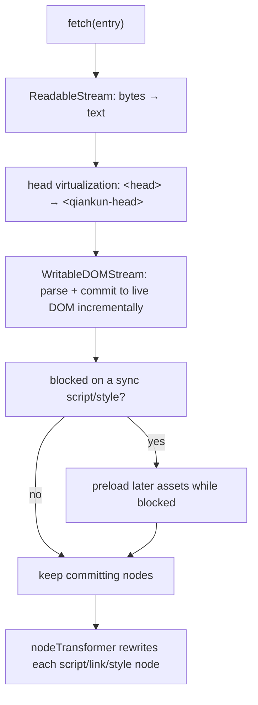

# Optimize loading and preloading

The goal is a fast first paint and warm caches for micro-apps, without reaching for the 2.x prefetch strategies that no longer exist in qiankun 3. In v3 most of this is automatic: the streaming HTML-entry loader commits DOM incrementally and preloads assets while it is blocked, and the decorated `fetch` makes every asset cacheable and retryable. This page explains what you get for free, what to stop configuring, and the few knobs that still matter.

## How v3 loads, in one glance



The entry HTML is never buffered whole. `loadEntry` pipes the response body straight into `writable-dom`, which parses and commits nodes as bytes arrive, blocks on synchronous scripts and stylesheets, and preloads other assets while it waits. See [HTML-entry streaming loading](/concepts/html-entry-loading) for the full pipeline.

## The v3 loading story

### Streaming, incremental commit

Because the loader streams, the sub-app's markup and above-the-fold styles reach the screen before the whole document (and its scripts) have downloaded. You do not opt into this — it is how every entry is loaded, for both [`registerMicroApps`](/api/register-micro-apps) and [`loadMicroApp`](/api/load-micro-app).

### The decorated fetch: cacheable, retryable, throwable

Every asset a micro-app pulls in goes through a `fetch` that `loadApp` wraps for you:

```ts
const enhancedFetch = makeFetchCacheable(makeFetchRetryable(makeFetchThrowable(fetch)));
```

- **cacheable** (outermost) deduplicates and caches responses, so the same URL requested by the entry, by a preload, or on a later remount is served once.
- **retryable** transparently retries transient network failures.
- **throwable** turns a non-2xx response into a thrown error, so a broken asset surfaces through [error handling](/cookbook/handle-errors) instead of loading a blank shell.

You can supply your own base `fetch` per app through `configuration.fetch` (for auth headers, for example); qiankun still wraps it with the three decorators. See [AppConfiguration](/api/configuration).

### `start()` warms the ESM lexer

Calling [`start`](/api/start) does more than boot single-spa. It also kicks off `prepareEsmLexer()`, which preloads the WebAssembly lexer that the [ESM sandbox](/concepts/esm-sandbox) uses to rewrite module scripts. Warming it at startup keeps the first ESM micro-app from paying that cost on its critical path.

::: tip Call start() early
`loadMicroApp` auto-invokes `start()` if you have not called it, but calling `start()` yourself as the shell boots means the lexer warm-up overlaps with your shell's own render instead of the first micro-app mount.
:::

## What not to use

The elaborate prefetch configuration from qiankun 2.x is gone. Do not port it.

::: danger Removed in v3
- `start({ prefetch: 'all' | [...] | fn })` — `start` accepts only single-spa's `StartOpts`, which is `{ urlRerouteOnly?: boolean }`. Any qiankun-specific option passed to `start` is ignored.
- The `PrefetchStrategy` type is still exported for backward compatibility, but no public API consumes it. It configures nothing.

The streaming loader with automatic preload replaces the entire strategy system.
:::

### `prefetchApps` is deprecated

`prefetchApps` is still exported, but only as a legacy escape hatch. It is marked `@deprecated` and logs a warning in development.

```ts
import { prefetchApps } from 'qiankun';

// Legacy only — prefer letting the streaming loader preload on demand.
prefetchApps([
  { name: 'app1', entry: '//localhost:7100' },
  { name: 'app2', entry: '//localhost:7101' },
]);
```

What it actually does, and its constraints:

| Aspect | Behavior |
| --- | --- |
| When it runs | Inside `requestIdleCallback` — it warms the cache only when the browser is idle. |
| What it fetches | The entry HTML, then each `script[src]` and `link[rel="stylesheet"]` it finds, through your `fetch`. |
| Offline | Skips entirely when `navigator.onLine` is false. |
| Save-Data / slow network | Skips on `navigator.connection.saveData`, or on a non-wifi/ethernet connection reporting 2g/3g. |
| Signature | `prefetchApps(apps: AppMetadata[], fetch?: typeof window.fetch)` — `AppMetadata` is `{ name, entry }`. |

::: warning Prefer the default path
Reach for `prefetchApps` only when you have a concrete reason to warm a specific app's cache ahead of navigation. In most apps the streaming loader plus the cacheable fetch already give you warm caches without it.
:::

## Practical tips

### Keep sub-app entries CORS-cacheable

The loader fetches entries and assets with `fetch`, so cross-origin sub-apps must send permissive CORS headers, and your caching headers should let the browser reuse responses. This matters twice over when [style isolation](/cookbook/enable-style-isolation) is on: external stylesheets are re-fetched and re-served as blob URLs, so a stylesheet without CORS headers is dropped rather than loaded unscoped.

### Rely on the modulepreload → fetch rewrite

Under the ESM path, a `<link rel="modulepreload">` (and `<link rel="preload" as="style">` under style isolation) is rewritten to `as="fetch"` with `crossorigin="anonymous"`. The reason: those assets are consumed by the pipeline's `fetch()`, not by a native browser preload, so a native `as="modulepreload"`/`as="style"` warm-up would sit in a separate cache and miss. The rewrite keeps the preload request matchable by the cacheable fetch. You do not configure this — just leave the preload hints your bundler emits in place.

### Keep exactly one entry script

An HTML entry may contain at most one `<script entry>`. A second one makes the loader throw a `QiankunError`. Beyond correctness, one entry script keeps the critical path predictable: the loader knows exactly which script resolves the app's lifecycles. Your bundler's qiankun plugin marks the entry script for you — see [@qiankunjs/bundler-plugin](/ecosystem/bundler-plugin).

### Let `loadMicroApp` memoize

`loadMicroApp` keys each load by `name` plus the container's XPath. Rendering the same app into the same DOM node again reuses the cached load and does not re-evaluate lifecycles — bootstrap becomes a no-op on remount. If you drive micro-apps imperatively (or through [`<MicroApp>`](/ecosystem/react)), reusing a stable container element for a given app name turns remounts into cheap operations instead of full reloads.

::: tip Multiple instances
For deliberately running the same app more than once at the same time, see [Run multiple micro-app instances](/cookbook/run-multiple-instances). Memoization is per `name`+container, so distinct containers load independently.
:::

## Measuring

### `runAfterFirstMounted` timing

`runAfterFirstMounted` fires once, on single-spa's `single-spa:first-mount` event. In development it also closes a `console.time` label around first mount, so you get a first-mount duration in the console for free. Use it as your marker for "the shell became interactive."

```ts
import { runAfterFirstMounted } from 'qiankun';

runAfterFirstMounted(() => {
  performance.mark('qiankun:first-mount');
  // hide your shell-level loading indicator, log a metric, etc.
});
```

See [setDefaultMountApp / runAfterFirstMounted](/api/effects) for the full reference.

### The browser network waterfall

Because loading is streaming, the DevTools Network panel is the most honest picture of what happens. Look for:

- The entry HTML response arriving and DOM committing before the response finishes (streaming in action).
- Preload requests firing while a blocking script downloads.
- Repeated URLs served from the fetch cache on remount rather than hitting the network again.
- `as: fetch` requests for assets your bundler emitted as `modulepreload`/`preload` — confirmation the rewrite landed.

A route change that shows no new network requests for an already-visited app is the memoization and fetch cache doing their job.

## Related

- [start](/api/start) — the only supported options, and the lexer warm-up.
- [prefetchApps (deprecated)](/api/prefetch-apps) — the legacy escape hatch in full.
- [HTML-entry streaming loading](/concepts/html-entry-loading) — the pipeline behind the automatic preload.
- [AppConfiguration](/api/configuration) — `fetch`, `streamTransformer`, `nodeTransformer`.
