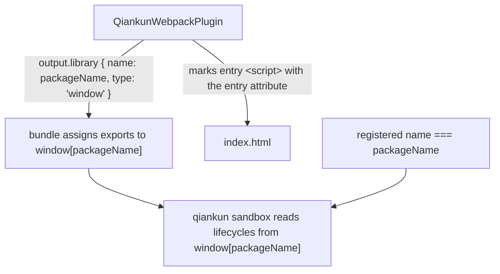

# Make a Webpack app qiankun-ready

This guide turns an existing Webpack application into a qiankun micro-app that loads through the **classic** path: the build publishes your lifecycle functions on a `window` global (a window-library bundle), and qiankun reads them from there. It works with both Webpack 4 and Webpack 5.

If you build with Vite instead, see [Make a Vite app qiankun-ready](/cookbook/prepare-a-vite-app) — Vite apps load through the [ESM sandbox](/concepts/esm-sandbox) and need no window library.

## What you will change

Four edits, none of which touch your app's business code:

1. Add `QiankunWebpackPlugin` and `html-webpack-plugin` to the Webpack config.
2. Export `bootstrap` / `mount` / `unmount` from your entry module.
3. Add permissive CORS to the dev server.
4. Make sure the registered qiankun `name` equals the library name (`packageName`).



## Install the plugin

The Webpack plugin is the default export of `@qiankunjs/bundler-plugin`. You also need `html-webpack-plugin` so the plugin can find and mark the entry script.

```bash
npm install @qiankunjs/bundler-plugin html-webpack-plugin --save-dev
```

## Configure Webpack

Add both plugins to your config. `QiankunWebpackPlugin` does two things:

- **Fixes the output library.** On Webpack 5 it sets `output.library = { name: packageName, type: 'window' }`; on Webpack 4 it sets `output.library = packageName`, `output.libraryTarget = 'window'`, `output.globalObject = 'window'`, and a unique `output.jsonpFunction`. Either way, the bundle assigns your entry module's exports onto `window[packageName]` — the global that qiankun's sandbox reads.
- **Marks the entry script.** It taps `html-webpack-plugin` and adds the `entry` attribute to the injected bundle's `<script>` in the emitted `index.html`. qiankun's loader keys on that attribute to pick the entry deterministically.

```js [webpack.config.js]
const HtmlWebpackPlugin = require('html-webpack-plugin');
const { QiankunWebpackPlugin } = require('@qiankunjs/bundler-plugin');

module.exports = {
  entry: './src/index.tsx',
  output: {
    // Let qiankun serve chunks from the sub-app's own origin.
    publicPath: 'auto',
    clean: true,
  },
  plugins: [
    new HtmlWebpackPlugin({ template: './src/index.html' }),
    new QiankunWebpackPlugin({ packageName: 'my-app' }),
  ],
  devServer: {
    port: 7102,
    // qiankun fetches your entry HTML and assets cross-origin — allow it.
    headers: { 'Access-Control-Allow-Origin': '*' },
    allowedHosts: 'all',
    hot: true,
  },
};
```

### The `packageName` option

`packageName` is the only option the plugin accepts, and it is the name of the `window` global your bundle publishes to.

| Option | Type | Default | Description |
| --- | --- | --- | --- |
| `packageName` | `string` | the `name` field of `./package.json` | Name of the output library global. The build assigns lifecycle exports to `window[packageName]`. |

If you omit `packageName`, the plugin reads it from your project's `package.json` `name` field. If that file is missing or has no `name`, the library name silently becomes an empty string and the global becomes `window['']`, which breaks lifecycle resolution. Set `packageName` explicitly, or make sure `package.json` has a `name`.

::: warning Do not fight the plugin's library config
`QiankunWebpackPlugin` **overwrites** `output.library`, `output.libraryTarget`, `output.globalObject`, and (on Webpack 4) `output.jsonpFunction`. Any conflicting library configuration you set will be replaced. Leave those fields to the plugin.
:::

::: info html-webpack-plugin is required for entry marking
Entry-script marking only runs if `html-webpack-plugin` is present in the `plugins` array. Without it, no `entry` attribute is added and qiankun cannot find the entry deterministically.
:::

## Export the lifecycle functions

Export async `bootstrap`, `mount`, and `unmount` from your entry module. With the `window` library target, Webpack publishes these exports on `window[packageName]` automatically — **do not hand-assign `window[packageName] = { ... }` yourself** for a Webpack build; the library target already does it.

`mount` receives the DOM node qiankun created for your app as `props.container`. Render into it, and fall back to the document for standalone runs. In standalone mode (opened directly in a browser, not hosted by qiankun) run the lifecycles yourself.

```tsx [src/index.tsx]
import React from 'react';
import { createRoot } from 'react-dom/client';
import type { Root } from 'react-dom/client';
import App from './App';
import './index.css';

declare global {
  interface Window {
    __POWERED_BY_QIANKUN__?: boolean;
  }
}

interface LifecycleProps {
  container?: Element;
}

let root: Root | undefined;

function render(props: LifecycleProps = {}) {
  // Resolve #root inside the qiankun container; fall back to the document when standalone.
  const container = props.container?.querySelector('#root') ?? document.getElementById('root');
  if (!container) return;

  root = createRoot(container);
  root.render(
    <React.StrictMode>
      <App />
    </React.StrictMode>,
  );
}

// QiankunWebpackPlugin sets output.library { name: 'my-app', type: 'window' },
// so these exports become window['my-app'] — no manual assignment needed.
export async function bootstrap() {
  console.log('[my-app] bootstrap');
}

export async function mount(props: LifecycleProps) {
  render(props);
}

export async function unmount(_props: LifecycleProps) {
  root?.unmount();
  root = undefined;
}

// Standalone mode: run the lifecycles ourselves.
if (!window.__POWERED_BY_QIANKUN__) {
  void bootstrap().then(() => mount({}));
}
```

`window.__POWERED_BY_QIANKUN__` is a flag qiankun sets inside the sandbox before mounting, so your entry can tell hosted from standalone execution. See [Micro-app lifecycle and props](/concepts/lifecycle-and-props) for the full lifecycle contract and the props each hook receives.

### The HTML template

Your `html-webpack-plugin` template needs only a mount node. Do not add the entry `<script>` yourself — `html-webpack-plugin` injects the bundle and `QiankunWebpackPlugin` adds the `entry` attribute to it.

```html [src/index.html]
<!doctype html>
<html lang="en">
  <head>
    <meta charset="UTF-8" />
    <meta name="viewport" content="width=device-width, initial-scale=1.0" />
    <title>My micro app</title>
    <style>
      /* Standalone page background only; inside qiankun the host owns the page. */
      body { margin: 0; }
    </style>
  </head>
  <body>
    <div id="root"></div>
  </body>
</html>
```

## Register in the main app

In the host, the registered `name` **must equal** the `packageName` you gave the plugin, because qiankun resolves the classic-path lifecycles from `window[name]`. The `entry` is the URL of the micro-app's dev server or deployed site (a string, not a config object).

```ts [main/src/register.ts]
import { registerMicroApps, start } from 'qiankun';

registerMicroApps([
  {
    // MUST match packageName → resolves window['my-app'].
    name: 'my-app',
    entry: '//localhost:7102',
    container: document.getElementById('subapp-container')!,
    activeRule: '/my-app',
  },
]);

start();
```

::: danger The name and packageName must match
qiankun reads the classic-path lifecycles from the global your bundle publishes. If the registered `name` is `'my-app'` but `packageName` is `'myApp'`, qiankun looks up `window['my-app']`, finds nothing, and throws when discovering lifecycles. Keep the two identical.
:::

See [registerMicroApps](/api/register-micro-apps) and [start](/api/start) for the full option reference, and [AppConfiguration](/api/configuration) for per-app `configuration` such as [`styleIsolation`](/cookbook/enable-style-isolation).

## Why the dev server needs CORS

Unlike the Vite plugin, `QiankunWebpackPlugin` does **not** configure the dev server for you. qiankun fetches your entry HTML and its assets from the host's origin, so the micro-app's server must allow cross-origin reads. Set both headers yourself:

- `headers: { 'Access-Control-Allow-Origin': '*' }` — lets the host fetch your entry and chunks.
- `allowedHosts: 'all'` — lets webpack-dev-server answer requests routed through the host.

Also keep `output.publicPath: 'auto'` so runtime chunk requests resolve against the micro-app's own origin rather than the host's.

::: warning Third-party scripts must be served with CORS too
Any external script your entry HTML references (vendored libraries, fonts loaded as scripts) must also be served with `Access-Control-Allow-Origin`. Public CDNs that omit CORS headers break qiankun's fetch. Vendor such assets locally and serve them from your CORS-enabled dev server.
:::

## Pitfalls

- **`window['']` breaks resolution.** No `packageName` and no `package.json` `name` means an empty library name. Set `packageName`, or ensure `package.json` has a `name`.
- **The registered `name` must equal `packageName`.** Mismatched values leave qiankun looking up a global that does not exist.
- **Do not override the plugin's library config.** `QiankunWebpackPlugin` owns `output.library` / `libraryTarget` / `globalObject` / `jsonpFunction`. Setting them yourself is either ignored or conflicts.
- **Do not hand-assign the window global for Webpack.** The `window` library target publishes your exports automatically; a manual `window[packageName] = { ... }` is redundant.
- **Only one entry script.** qiankun's loader throws a `QiankunError` if more than one `<script>` carries the `entry` attribute. Let the plugin mark exactly one, and do not add an `entry` script by hand in the template.
- **Always unmount cleanly.** Tear your app down in `unmount` (here, `root.unmount()` and null the ref) so remounts and multiple instances do not leak. See [Run multiple micro-app instances](/cookbook/run-multiple-instances).

## Related

- [@qiankunjs/bundler-plugin (Webpack & Vite)](/ecosystem/bundler-plugin) — full plugin reference.
- [Make a Vite app qiankun-ready](/cookbook/prepare-a-vite-app) — the ESM-sandbox counterpart.
- [The JS sandbox](/concepts/js-sandbox) — how classic bundles are isolated and how `window[packageName]` is read.
- [Migrate from qiankun 2.x](/cookbook/migrate-from-2x) — differences from the 2.x config-based setup.
