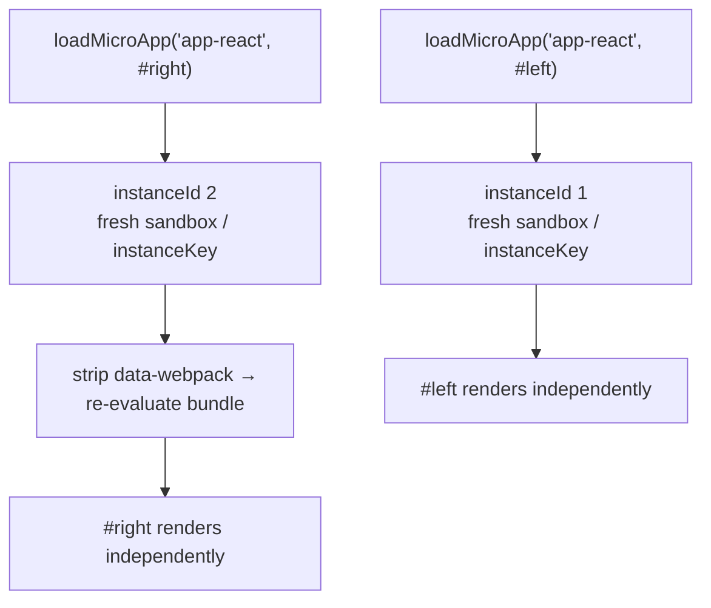

# Running Multiple Micro-App Instances at Once

`loadMicroApp` mounts a micro-app imperatively; it doesn't go through the route-driven `registerMicroApps` path. Each call builds its own sandbox and instance, so you can mount several different micro-apps at once, or even mount *the same* micro-app several times on one page. This page covers how to do that reliably, and how to tear every instance down cleanly.

Use this approach when your own UI state — tabs, modals, dashboards, widgets — decides whether a container should appear, rather than the URL. If you're assembling pages by route, [registerMicroApps](/api/register-micro-apps) with [start](/api/start) is the better fit.

## Mounting a micro-app imperatively

`loadMicroApp(app, configuration?, lifeCycles?)` returns a `MicroApp` handle (really a single-spa parcel). Mounting starts immediately on the call, and you get promises for `mount`, `unmount`, `update`, and each lifecycle stage to await.

```ts [main/src/mount-app.ts]
import { loadMicroApp } from 'qiankun';
import type { MicroApp } from 'qiankun';

const container = document.querySelector('#sub-app') as HTMLElement;

const app: MicroApp = loadMicroApp({
  name: 'app-react',
  entry: 'http://localhost:7101',
  container,
  props: { token: 'abc' },
});

// wait until it is on screen
await app.mountPromise;
```

`container` is an `HTMLElement`, `entry` is the micro-app's HTML address, and `props` is passed to the sub-app's lifecycles on every `mount`/`unmount`/`update`. If the framework hasn't been started yet, `loadMicroApp` calls `start()` for you, so that `pushState`/`replaceState` in the main app keep dispatching `popstate` correctly.

The handle exposes these members:

| Member | Type | Purpose |
| --- | --- | --- |
| `mount()` | `() => Promise<null>` | Mount again after an unmount. |
| `unmount()` | `() => Promise<null>` | Tear the instance down and release its side effects. |
| `update(props)` | `(props) => Promise<any>` | Push new props (only if the sub-app exports `update`). |
| `getStatus()` | `() => string` | The single-spa parcel status, e.g. `MOUNTED`, `UNMOUNTING`. |
| `loadPromise` / `bootstrapPromise` / `mountPromise` / `unmountPromise` | `Promise<null>` | Await a specific stage. |

For the full signature see [loadMicroApp](/api/load-micro-app), and for the options the second argument accepts see [AppConfiguration](/api/configuration).

## Mounting several different micro-apps at once

Every `loadMicroApp` call is independent. Give each app its own container element and you can mount them side by side.

```ts [main/src/dashboard.ts]
import { loadMicroApp } from 'qiankun';

const apps = [
  { name: 'app-react', entry: 'http://localhost:7101', container: document.querySelector('#pane-react') as HTMLElement },
  { name: 'app-vue',   entry: 'http://localhost:7102', container: document.querySelector('#pane-vue') as HTMLElement },
].map((app) => loadMicroApp(app));

// later, when the dashboard is dismissed
await Promise.all(apps.map((app) => app.unmount()));
```

Each call builds a fresh Proxy-membrane sandbox and its own `instanceId`, so these apps don't share global state and won't clobber each other's timers, listeners, or DOM patches.

## Mounting the same micro-app multiple times

You can also call `loadMicroApp` more than once with the same `name` and `entry`, mounting into *different* containers.

```ts [main/src/multi-instance.ts]
import { loadMicroApp } from 'qiankun';

const left = loadMicroApp({
  name: 'app-react',
  entry: 'http://localhost:7101',
  container: document.querySelector('#left') as HTMLElement,
});

const right = loadMicroApp({
  name: 'app-react',
  entry: 'http://localhost:7101',
  container: document.querySelector('#right') as HTMLElement,
});

await Promise.all([left.mountPromise, right.mountPromise]);
```

### What keeps the instances isolated

qiankun separates concurrent instances of the same app with a per-name instance counter:

- Each mount gets a monotonically increasing `instanceId` (produced by `genInstanceId`, kept on a non-enumerable `window.__agii__` map). The container is stamped with `data-name`, `data-instance-id` (when `instanceId > 1`), and `data-mount-times`.
- The classic JS sandbox gives each instance its own Proxy membrane; the [ESM sandbox](/concepts/esm-sandbox) gives each instance a unique `instanceKey`/compartment so its modules resolve through their own import map entry.
- For webpack-built apps, the second and later instances have `data-webpack` stripped from their `script[src]` nodes (`removeWebpackChunkCacheWhenAppHaveMultiInstance`). The webpack runtime keys its cache of already-loaded chunks off this attribute and skips re-execution on a hit; removing it forces the second instance to re-evaluate its own bundle instead of reusing the modules the first instance already ran.



## Memoization: reuse or create an instance

`loadMicroApp` memoizes already-loaded apps keyed by `` `${name}-${containerXPath}` ``. The container's XPath is computed once, on the first call, and becomes that instance's identity.

- **Different container ⇒ new instance.** A different XPath is a different key, so the app is loaded again and its lifecycles are re-evaluated. That's exactly what makes the multi-instance example above work.
- **Reuse the same container ⇒ cache hit, remount.** Rendering an app into a DOM node it previously occupied reuses the cached parcel configuration: `bootstrap` becomes a no-op and lifecycles aren't re-evaluated. Mounting still reloads the entry HTML, but *without* the scripts (they already ran), and just runs `mount(props)` again.

::: tip Keep each instance's container in a fixed position
The instance key comes from the container's XPath in the document, computed once and held constant for the app's whole lifetime. Put each instance's container at a stable, distinct spot in the DOM so the two instances resolve to different keys.
:::

## Serialization on the same container

If you mount several apps into the *same* container, qiankun runs them in series. When a new instance is about to mount onto a container that already holds one, its mount step first awaits the `unmountPromise` of every prior undamaged instance on that container, then renders. This keeps two apps from writing into the same node at the same time.

::: warning One live app per container at a time
Serialization means the *next* app waits for the previous one to finish unmounting — it does not run two apps side by side in the same node. To render concurrently, give each app its own container element.
:::

## Every handle owns its unmount

`loadMicroApp` doesn't clean up after itself. Every handle you get back is yours to `unmount()`.

```ts [main/src/lifecycle.ts]
const app = loadMicroApp({ name: 'app-react', entry, container });

// … when the app is no longer needed
await app.unmount();
```

Sandbox side effects are released by `unmount`. On `unmount`, each patcher's `free()` runs in turn: `patchInterval` clears every tracked interval and restores the native timers, `patchWindowListener` removes the listeners the app added, `patchHistoryListener` unhooks its history hooks, and the dynamic-append patcher tears out the injected nodes. The membrane then locks, the globals the app changed are restored, and the container DOM is emptied. Skip `unmount` and you leak timers, listeners, and DOM, and you break remount and multi-instance behavior.

::: danger ESM instances are only fully released on `unload`, and parcels have no `unload`
The ESM sandbox's `dispose()` — which revokes the instance's blob URL and unregisters its realm — is attached to single-spa's `unload` lifecycle, not `unmount`. `loadMicroApp` returns a parcel, and parcels have no `unload` semantics, so an ESM instance's engine, blob URL, and import map entry stick around after `unmount` until you drop every reference to the handle and let it be garbage-collected. In a long-lived shell that repeatedly creates ESM instances, import map entries pile up. Reuse the container (cache-hit remount) instead of creating a new instance where you can, and release handles once you're done with them.
:::

## ESM multi-instance caveats

Native ESM sub-apps have one extra limitation under true concurrency. The ESM engine attributes asynchronously created elements (for example, a `document.createElement` during evaluation) to the currently active sandbox through a single global lock. The synthetic specifier prefix keeps each instance's *module graph* isolated, but it doesn't fully solve element *attribution* when two ESM instances of the same app evaluate at the same moment.

::: warning Concurrent ESM instances need isolated containers
Running multiple concurrent instances of the same ESM (Vite-style) micro-app is a known v1 limitation. Keep each instance isolated in its own container and avoid overlapping their initial evaluation windows. If you really need many instances alive at once, a classic/UMD build is the more predictable route for now. See [ESM sandbox](/concepts/esm-sandbox) for the underlying mechanics.
:::

::: info No built-in cross-instance state
qiankun v3 ships no global state store — `initGlobalState`/`onGlobalStateChange` from 2.x are gone. Data flows to each instance through `props`, updated with `app.update(props)`. See [Sharing state and communicating between apps](/cookbook/communicate-between-apps).
:::

## Related

- [loadMicroApp](/api/load-micro-app) — the full API reference.
- [JS sandbox](/concepts/js-sandbox) — how per-instance isolation is built.
- [ESM sandbox](/concepts/esm-sandbox) — native `<script type="module">` execution and its multi-instance limits.
- [Micro-app lifecycle and props](/concepts/lifecycle-and-props) — what runs on mount, unmount, and remount.
