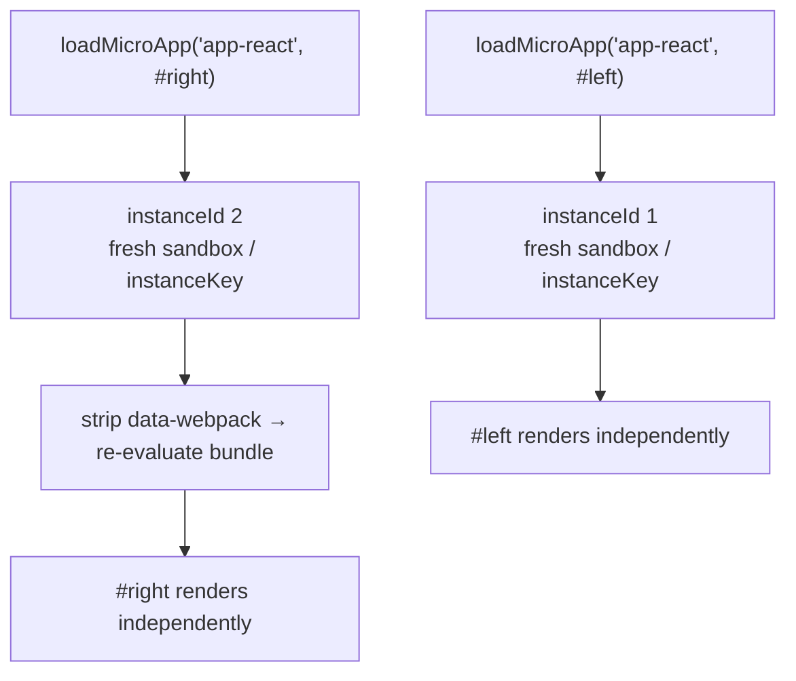

# Run multiple micro-app instances

`loadMicroApp` mounts a micro-app imperatively, outside of the route-driven `registerMicroApps` flow. Because each call builds its own sandbox and instance, you can mount several different micro-apps at once, or even mount the *same* micro-app more than once on the page. This guide shows how to do that safely and how to release every instance.

Use this approach when a container's presence is driven by your own UI state (tabs, modals, dashboards, widgets) rather than by the URL. For route-based composition, prefer [registerMicroApps](/api/register-micro-apps) with [start](/api/start).

## Mount an app imperatively

`loadMicroApp(app, configuration?, lifeCycles?)` returns a `MicroApp` handle (a single-spa parcel). It starts mounting immediately and gives you `mount`, `unmount`, `update`, and lifecycle promises to await.

```ts [main/src/mount-app.ts]
import { loadMicroApp } from 'qiankun';
import type { MicroApp } from 'qiankun';

const container = document.querySelector('#sub-app') as HTMLElement;

const app: MicroApp = loadMicroApp({
  name: 'app-react',
  entry: 'http://localhost:7101',
  container,
  props: { token: 'abc' },
});

// wait until it is on screen
await app.mountPromise;
```

`container` is an `HTMLElement`, `entry` is the HTML URL of the micro-app, and `props` are handed to the sub-app's lifecycles on every `mount`/`unmount`/`update`. `loadMicroApp` auto-invokes `start()` for you if the framework has not been started yet, so `pushState`/`replaceState` in the main app keeps dispatching `popstate` correctly.

The handle exposes:

| Member | Type | Purpose |
| --- | --- | --- |
| `mount()` | `() => Promise<null>` | Mount again after an unmount. |
| `unmount()` | `() => Promise<null>` | Tear the instance down and release its side effects. |
| `update(props)` | `(props) => Promise<any>` | Push new props (only if the sub-app exports `update`). |
| `getStatus()` | `() => string` | single-spa parcel status, e.g. `MOUNTED`, `UNMOUNTING`. |
| `loadPromise` / `bootstrapPromise` / `mountPromise` / `unmountPromise` | `Promise<null>` | Await a specific phase. |

See [loadMicroApp](/api/load-micro-app) for the full signature and [AppConfiguration](/api/configuration) for the options you can pass as the second argument.

## Mount several different apps concurrently

Each `loadMicroApp` call is independent. Give every app its own container element and you can mount them at the same time.

```ts [main/src/dashboard.ts]
import { loadMicroApp } from 'qiankun';

const apps = [
  { name: 'app-react', entry: 'http://localhost:7101', container: document.querySelector('#pane-react') as HTMLElement },
  { name: 'app-vue',   entry: 'http://localhost:7102', container: document.querySelector('#pane-vue') as HTMLElement },
].map((app) => loadMicroApp(app));

// later, when the dashboard is dismissed
await Promise.all(apps.map((app) => app.unmount()));
```

Every call builds a fresh Proxy-membrane sandbox and its own `instanceId`, so the apps do not share global state and cannot clobber each other's timers, listeners, or DOM patches.

## Mount the same app more than once

You can also call `loadMicroApp` with the same `name` and `entry` several times, into *different* containers.

```ts [main/src/multi-instance.ts]
import { loadMicroApp } from 'qiankun';

const left = loadMicroApp({
  name: 'app-react',
  entry: 'http://localhost:7101',
  container: document.querySelector('#left') as HTMLElement,
});

const right = loadMicroApp({
  name: 'app-react',
  entry: 'http://localhost:7101',
  container: document.querySelector('#right') as HTMLElement,
});

await Promise.all([left.mountPromise, right.mountPromise]);
```

### How isolation works across instances

Qiankun keeps concurrent instances of the same app apart through a per-name instance counter:

- Each mount gets a monotonically increasing `instanceId` (`genInstanceId`, kept on a non-enumerable `window.__agii__` map). The container is stamped with `data-name`, `data-instance-id` (when `instanceId > 1`), and `data-mount-times`.
- The classic JS sandbox gives each instance a distinct Proxy membrane; the [ESM sandbox](/concepts/esm-sandbox) gives each a unique `instanceKey`/compartment so its modules resolve through their own import-map entries.
- For webpack-built apps, the second and later instances have `data-webpack` stripped off their `script[src]` nodes (`removeWebpackChunkCacheWhenAppHaveMultiInstance`). Webpack's runtime caches loaded chunks keyed by that attribute and would skip re-execution; removing it forces the second instance to re-evaluate its bundle instead of reusing the first instance's already-run modules.



## Memoization: reuse vs. fresh instance

`loadMicroApp` memoizes the loaded app per `` `${name}-${containerXPath}` `` key. The container's XPath is computed once, at the first call, and used as the instance identity.

- **Different container ⇒ fresh instance.** A different XPath means a new key, so the app is loaded and its lifecycles are evaluated again. This is what makes the multi-instance example above work.
- **Same container reused ⇒ cached remount.** Rendering the same app into a DOM node it previously occupied reuses the cached parcel config: `bootstrap` becomes a no-op and lifecycles are not re-evaluated. The mount step reloads the entry HTML *without* scripts (they already ran) and just re-runs `mount(props)`.

::: tip Give distinct containers stable positions
The instance key is derived from the container's XPath in the document, computed once and held constant for the app's lifetime. Keep each instance's container at a stable, distinct position in the DOM so the two instances resolve to different keys.
:::

## Serialization on a shared container

If you mount more than one app into the *same* container, qiankun serializes them. When a new instance mounts onto a container that already has instances, its mount step first awaits the `unmountPromise` of every prior, non-broken instance on that container before rendering. This prevents two apps from writing into the same node concurrently.

::: warning One live app per container
Serialization means the *next* app waits for the previous one to finish unmounting — it does not run two apps in the same node side by side. For genuinely concurrent rendering, give each app its own container element.
:::

## Always unmount every handle

`loadMicroApp` does not clean up on its own. You are responsible for calling `unmount()` on every handle you hold.

```ts [main/src/lifecycle.ts]
const app = loadMicroApp({ name: 'app-react', entry, container });

// … when the app is no longer needed
await app.unmount();
```

Unmounting is what releases the sandbox side effects. On `unmount`, each patcher's `free()` runs: `patchInterval` clears every tracked interval and restores the native timers, `patchWindowListener` removes the listeners the app added, `patchHistoryListener` detaches its history hooks, and the dynamic-append patcher tears down injected nodes. The membrane then locks and restores any globals the app modified, and the container DOM is emptied. Skipping `unmount` leaks timers, listeners, and DOM, and breaks remount and multi-instance behavior.

::: danger ESM instances are only fully released on `unload`, and parcels have no `unload`
The ESM sandbox's `dispose()` — which revokes the instance's blob URLs and unregisters its realm — is wired to single-spa's `unload` lifecycle, not `unmount`. `loadMicroApp` returns a parcel, and parcels have no `unload` semantics, so an ESM instance's engine, blob URLs, and import-map entries linger after `unmount` until you drop every reference to the handle and let it be garbage-collected. In long-lived shells that repeatedly create ESM instances, this accumulates import-map entries. Reuse a container (cached remount) instead of creating a brand-new instance each time where you can, and release handles you are done with.
:::

## ESM multi-instance caveat

Native-ESM sub-apps have an additional limitation under true concurrency. The ESM engine attributes asynchronously created elements (for example `document.createElement` during evaluation) to the currently active sandbox via a single global lock. Synthetic-specifier prefixing keeps each instance's *module graph* isolated, but it does not fully solve element *ownership* when two ESM instances of the same app evaluate at the same moment.

::: warning Isolate containers for concurrent ESM instances
Running multiple concurrent instances of the same ESM (Vite-style) micro-app is a known v1 limitation. Prefer isolating each instance in its own container and avoid overlapping their initial evaluation. If you need many simultaneous instances, a classic/UMD build is currently the more predictable path. See [the ESM sandbox](/concepts/esm-sandbox) for the underlying mechanics.
:::

::: info No built-in cross-instance state
qiankun v3 ships no global state store — `initGlobalState`/`onGlobalStateChange` from 2.x do not exist. Pass data into each instance through `props` and update it with `app.update(props)`. See [Share state and communicate between apps](/cookbook/communicate-between-apps).
:::

## Related

- [loadMicroApp](/api/load-micro-app) — full API reference.
- [The JS sandbox](/concepts/js-sandbox) — how per-instance isolation is built.
- [The ESM sandbox](/concepts/esm-sandbox) — native `<script type="module">` execution and its multi-instance limits.
- [Micro-app lifecycle and props](/concepts/lifecycle-and-props) — what runs on mount, unmount, and remount.
