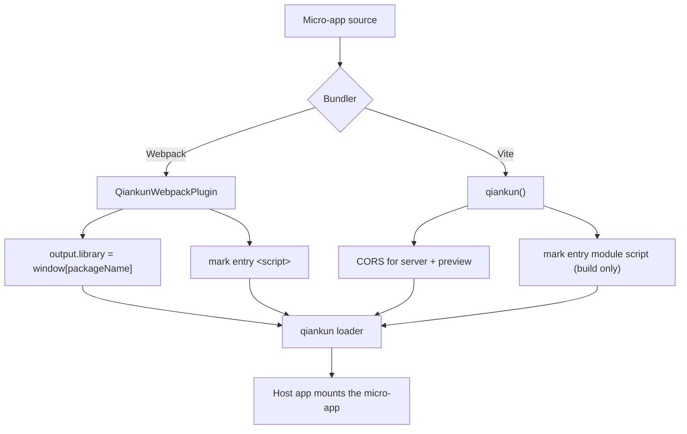

# @qiankunjs/bundler-plugin (Webpack & Vite)

Build-time plugins that make a micro-app's bundle loadable by qiankun. The package ships one plugin per bundler: a Webpack plugin that fixes the output library format and marks the entry `<script>`, and a Vite plugin that configures CORS and marks the entry module script. Install it as a devDependency of the **micro-app** — the host app does not need it.

::: info When you need this plugin
The plugin automates two things the qiankun loader relies on: exposing the app's lifecycle exports where the sandbox can read them, and tagging exactly one `<script>` with the `entry` attribute the [HTML-entry loader](/concepts/html-entry-loading) keys on. You can do both by hand, but the plugin keeps them correct across rebuilds.
:::

## Install

```bash
npm install @qiankunjs/bundler-plugin --save-dev
```

Peer dependencies are declared as **optional**, so you only install the bundler you actually use:

| Peer | Range | Optional |
| --- | --- | --- |
| `webpack` | `^4.0.0 \|\| ^5.0.0` | yes |
| `vite` | `>=5.0.0` | yes |

::: warning Pre-release
The package version is `0.0.1-rc.1`. The API is small and stable in shape, but treat it as release-candidate.
:::

## Exports

The package has three entry subpaths. The root and `./webpack` give you the Webpack plugin; `./vite` gives you the Vite plugin.

| Import path | Export | Kind |
| --- | --- | --- |
| `@qiankunjs/bundler-plugin` | `QiankunWebpackPlugin` (named **and** default), `QiankunWebpackPluginOptions` (type) | class |
| `@qiankunjs/bundler-plugin/webpack` | `QiankunWebpackPlugin` (named and default) | class |
| `@qiankunjs/bundler-plugin/vite` | `qiankun` (named and default) | function |

```js
// all three resolve to the SAME Webpack plugin
const { QiankunWebpackPlugin } = require('@qiankunjs/bundler-plugin');
const { QiankunWebpackPlugin } = require('@qiankunjs/bundler-plugin/webpack');
import QiankunWebpackPlugin from '@qiankunjs/bundler-plugin/webpack';

// the Vite plugin lives ONLY at the /vite subpath
import { qiankun } from '@qiankunjs/bundler-plugin/vite';
```

::: warning No auto-detecting entry
The root import resolves to the **Webpack** plugin. There is no combined or auto-detecting entry — a Vite app must import from `@qiankunjs/bundler-plugin/vite`.
:::

## Webpack plugin — `QiankunWebpackPlugin`

A standard Webpack plugin (implements `apply(compiler)`) that works with both Webpack 4 and Webpack 5. It detects the major version from `compiler.webpack?.version` at build time — you do not configure it.

```js
new QiankunWebpackPlugin(options?: QiankunWebpackPluginOptions)
```

### Options

```ts
interface QiankunWebpackPluginOptions {
  packageName?: string;
}
```

| Option | Type | Default | Description |
| --- | --- | --- | --- |
| `packageName` | `string` | the `name` field of `./package.json` (`''` if missing/unreadable) | Global name the built bundle assigns its lifecycle exports to (`window[packageName]`). |

The default is resolved by reading `package.json` from the current working directory and returning its `name`. If that file cannot be read or parsed, the name resolves to an empty string.

::: danger Empty package name breaks resolution
If `packageName` is not provided and `package.json` is missing or has no `name`, the library name becomes `''` and the app's exports land on `window['']`, which qiankun cannot resolve. Either pass `packageName` explicitly or make sure `package.json` has a `name`.

The name you use here must match the `name` you register the micro-app under in the host's [registerMicroApps](/api/register-micro-apps) call. In the examples the Webpack app is registered as `'webpack-app'` and built with the same library name.
:::

### What `apply()` does

**1. Fixes the output library format.** So the bundle assigns its lifecycle exports onto `window[packageName]` — the "classic" export mechanism the [JS sandbox](/concepts/js-sandbox) reads.

| | Webpack 5 | Webpack 4 |
| --- | --- | --- |
| `output.library` | `{ name: packageName, type: 'window' }` | `packageName` |
| `output.libraryTarget` | — | `'window'` |
| `output.globalObject` | — | `'window'` |
| `output.jsonpFunction` | — | `` `webpackJsonp_${packageName}` `` |

**2. Marks the entry `<script>`.** It taps `html-webpack-plugin`, finds the entry chunk's emitted JS file, and adds the boolean `entry` attribute to the matching `<script>` in the generated HTML (falling back to the last script tag if no match is found). The result is `<script ... entry></script>`, which the loader uses to pick the entry deterministically.

::: warning Entry marking requires html-webpack-plugin
The entry-marking step only runs when `html-webpack-plugin` is present in the plugins array. Without it, no HTML is emitted to mark and the step is silently skipped.
:::

The marking is **idempotent**: if any script already carries an `entry` attribute, the plugin leaves the HTML untouched.

### CORS is your responsibility

Unlike the Vite plugin, the Webpack plugin does **not** configure the dev server. qiankun fetches the micro-app's HTML and assets cross-origin, so you must add permissive CORS to `devServer` yourself.

### Example: `webpack.config.js`

```js
const HtmlWebpackPlugin = require('html-webpack-plugin');
const { QiankunWebpackPlugin } = require('@qiankunjs/bundler-plugin');

module.exports = (env, argv) => {
  const isProduction = argv.mode === 'production';
  return {
    entry: './src/index.tsx',
    output: {
      publicPath: 'auto',
      clean: true,
      filename: isProduction ? '[name].[contenthash:8].js' : '[name].js',
    },
    plugins: [
      new HtmlWebpackPlugin({ template: './src/index.html' }),
      new QiankunWebpackPlugin(),
    ],
    devServer: {
      port: 7102,
      // qiankun fetches cross-origin — the plugin does NOT set this for you
      headers: { 'Access-Control-Allow-Origin': '*' },
      allowedHosts: 'all',
      hot: true,
    },
  };
};
```

The micro-app itself exports lifecycles; with the `window` library target they land on `window[packageName]` automatically, so you do **not** assign `window[...]` by hand:

```tsx [src/index.tsx]
export async function bootstrap() {}
export async function mount(props: { container?: Element }) {
  const el = props.container?.querySelector('#root') ?? document.getElementById('root');
  // ...render into el
}
export async function unmount(props: { container?: Element }) {
  // ...tear down
}

// standalone (not hosted) mode only — the plugin provides the window[...] binding under qiankun
if (!window.__POWERED_BY_QIANKUN__) {
  void bootstrap().then(() => mount({}));
}
```

See [Make a Webpack app qiankun-ready](/cookbook/prepare-a-webpack-app) for the end-to-end walkthrough.

## Vite plugin — `qiankun()`

A zero-argument plugin factory. qiankun loads Vite apps **natively through its [ESM sandbox](/concepts/esm-sandbox)** in both dev and production — there is no SystemJS or legacy transform. The plugin only handles loading plumbing.

```ts
qiankun(): Plugin
```

::: warning Takes no options
`qiankun()` is called with no arguments. Do not invent options — there are none.
:::

### What it does

**1. Sets permissive CORS** for both the dev server and preview server, so the host can fetch the entry HTML and the module graph cross-origin:

```ts
{
  server:  { cors: true, headers: { 'Access-Control-Allow-Origin': '*' } },
  preview: { cors: true, headers: { 'Access-Control-Allow-Origin': '*' } },
}
```

**2. Marks the entry module script** via a `transformIndexHtml` hook (`order: 'post'`) — but **only in built HTML**. It finds the `<script type="module" src=...>` whose source matches the entry chunk and adds the `entry` attribute (`<script type="module" ... entry>`), falling back to the last module script if none matches. Like the Webpack plugin, it is idempotent and skips if an `entry` attribute is already present.

::: info Dev is intentionally not marked
During `vite dev` there is no build chunk, so the hook returns the HTML unchanged. Two reasons this is fine: the ESM engine resolves the entry by its **lifecycle exports** at dev time, and Vite strips unknown attributes during its dev HTML transform anyway. Entry marking only happens on build.
:::

### Example: `vite.config.ts`

```ts
import { defineConfig } from 'vite';
import react from '@vitejs/plugin-react';
import { qiankun } from '@qiankunjs/bundler-plugin/vite';

export default defineConfig({
  plugins: [react(), qiankun()],
  server: { port: 7100, strictPort: true },
});
```

CORS and entry marking are both handled by the plugin; you typically only set a `server.port`. The micro-app exports its lifecycles as native ESM — no UMD or library wrapping:

```ts [src/main.tsx]
export async function bootstrap() {}
export async function mount(props: { container?: Element }) {
  const el = props.container?.querySelector('#root') ?? document.getElementById('root');
  // ...render into el
}
export async function unmount(props: { container?: Element }) {
  // ...tear down
}
```

And the HTML entry (dev serves this as-is; the built copy gets the `entry` attribute added by the plugin):

```html [index.html]
<div id="root"></div>
<script type="module" src="/src/main.tsx" entry></script>
```

See [Make a Vite app qiankun-ready](/cookbook/prepare-a-vite-app) for the full setup, and [create-qiankun](/ecosystem/create-qiankun) to scaffold an app with this wiring already in place.

## Webpack vs Vite at a glance

| | Webpack plugin | Vite plugin |
| --- | --- | --- |
| Import | `@qiankunjs/bundler-plugin` (or `/webpack`) | `@qiankunjs/bundler-plugin/vite` |
| Call | `new QiankunWebpackPlugin({ packageName? })` | `qiankun()` (no options) |
| Loading path | classic (`window` library) | native ESM sandbox |
| Fixes output library | yes (`window` target) | no (native ESM exports are the lifecycles) |
| Marks entry script | yes (needs `html-webpack-plugin`) | yes, **built HTML only** |
| Configures CORS | no — add it to `devServer` yourself | yes — `server` and `preview` |



## Gotchas

- **Only one entry script.** qiankun's loader throws a `QiankunError` if more than one `<script>` carries the `entry` attribute. Both plugins are idempotent and skip when an `entry` attribute already exists, so let the plugin own the marking rather than adding your own.
- **Do not fight the overwritten library config.** The Webpack plugin overwrites `output.library` / `libraryTarget` / `globalObject` (and `jsonpFunction` on Webpack 4). Any conflicting library configuration you set will be replaced.
- **The registered name must match the library name.** The `packageName` (Webpack) determines the `window[...]` key qiankun reads; it must equal the `name` you pass to [registerMicroApps](/api/register-micro-apps).
- **Serve third-party assets with CORS.** qiankun fetches every asset cross-origin. Vendor libraries locally or serve them from an origin that sends `Access-Control-Allow-Origin` — public CDNs without CORS headers will break the fetch.
- **Rebuild the plugin during local development.** Examples consume the built `dist` of `@qiankunjs/bundler-plugin`; if you edit the plugin, rebuild packages before running them.
