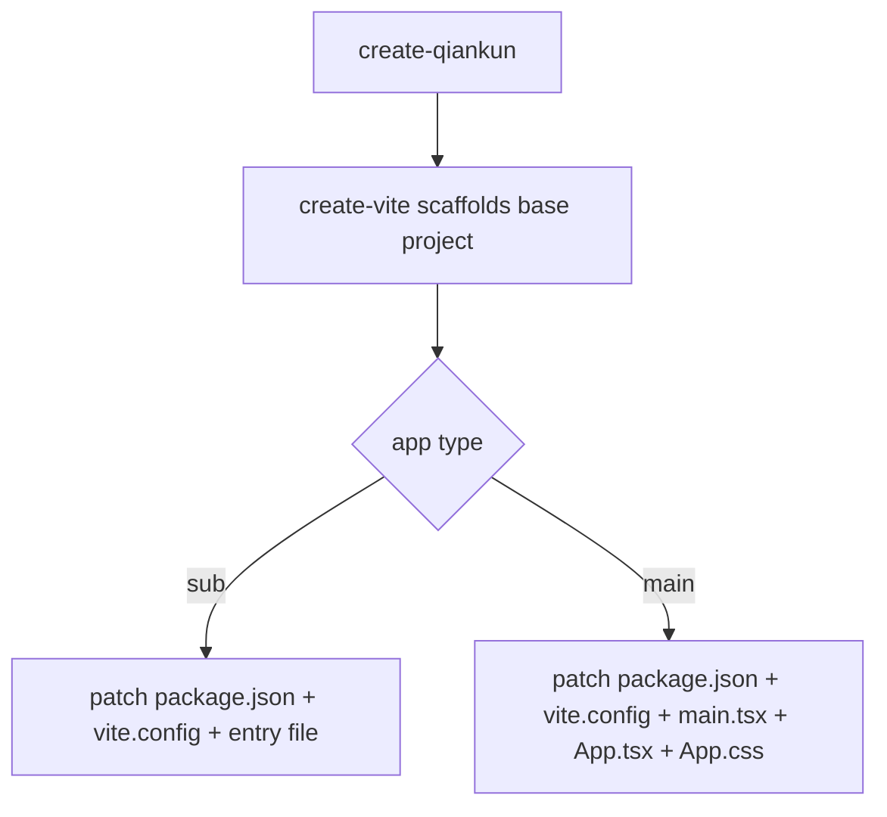
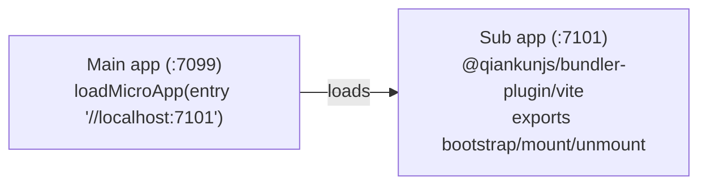

# create-qiankun

`create-qiankun` is the official scaffolder for qiankun 3.0. It generates a [Vite](https://vite.dev) project — either a main app or a sub app — and patches the generated output to wire in qiankun. Because qiankun v3 loads Vite apps natively through its [ESM sandbox](/concepts/esm-sandbox), there is no dedicated SystemJS or "qiankun build mode": the ordinary `dev`, `build`, and `preview` outputs are already loadable as-is.

## Purpose

The scaffolder does two things:

1. Delegates to upstream [`create-vite`](https://github.com/vitejs/vite/tree/main/packages/create-vite) to produce a standard React or Vue project.
2. Overwrites a small set of files (`package.json`, `vite.config.*`, the entry file, and — for main apps — `App.tsx`/`App.css`) so the project is qiankun-ready out of the box.

A generated sub app exposes qiankun lifecycles and stays runnable standalone. A generated main app comes preconfigured to load that sub app. The two default ports are matched so they connect without further configuration.

## Requirements

- Node.js `>=20.19` (required by Vite).

## Invocation

Run the scaffolder with your package manager's create/exec command:

::: code-group

```bash [npm]
npx create-qiankun@latest
```

```bash [yarn]
yarn create qiankun@latest
```

```bash [pnpm]
pnpm dlx create-qiankun@latest
```

:::

With no arguments, the CLI prompts interactively for the app type, name, and — for sub apps — the template. You can also pass any of these on the command line to skip the corresponding prompt.

```bash
# scaffold a React + TypeScript sub app named "my-app"
npx create-qiankun@latest my-app --type sub --template react-ts

# scaffold the main app
npx create-qiankun@latest my-main --type main
```

## CLI arguments and flags

| Argument | Alias | Values | Default | Applies to |
| --- | --- | --- | --- | --- |
| `<app-name>` (positional) | — | must match `/^[a-z0-9-]+$/` | prompted | both |
| `--type` | `-T` | `main` \| `sub` | `sub` | both |
| `--template` | `-t` | `react-ts` \| `react` \| `vue-ts` \| `vue` | prompted | sub only |

### App name

The positional app name must contain only lowercase letters, digits, and hyphens. It becomes the `package.json` `name` and, for sub apps, the global key the lifecycles are published under (`window[appName]`, see below). An invalid name is rejected with:

```
App name can only contain lowercase letters, numbers, and hyphens
```

When omitted, the prompt defaults to `qiankun-main-app` for a main app or `qiankun-sub-app` for a sub app.

### App type

`--type` (or `-T`) selects `main` or `sub`. Sub is the default when nothing is specified. An unrecognized value exits with `Invalid type: ...`.

### Template

`--template` (or `-t`) selects the framework template for a **sub app** only. Available templates:

| Value | Description |
| --- | --- |
| `react-ts` | React + TypeScript |
| `react` | React |
| `vue-ts` | Vue + TypeScript |
| `vue` | Vue |

::: warning Main apps are always React + TypeScript
The template only applies to sub apps. A main app is always scaffolded as `react-ts`. Passing `--template` together with `--type main` is a hard error:

```
The --template option is only supported for sub apps.
Please remove --template when using --type main.
```

Note also that passing `--template` implies a sub app, so it skips the app-type prompt.
:::

## Interactive prompts

When the relevant flag is not supplied, the CLI prompts for it:

- **App type** — a select between `Main App (主应用)` and `Sub App (子应用)`. Skipped when either `--type` or `--template` is passed.
- **App name** — a text input validated against `/^[a-z0-9-]+$/`. Skipped when a positional name is passed.
- **Template** — a select over the four templates above. Only shown for sub apps; skipped when `--template` is passed or when the app type is main.

Cancelling any prompt prints `Operation cancelled` and exits.

## Target directory (workspace-aware)

Before generating, the CLI checks whether the **parent** of the current directory contains a `pnpm-workspace.yaml`:

- Inside a pnpm workspace, the app is generated into `<workspaceRoot>/packages/<app-name>`.
- Otherwise, it is generated into `<cwd>/<app-name>`.

If the target directory already exists, the CLI exits with `Directory ... already exists`. The `cd` line in the next-steps output reflects the resolved path (`packages/<app-name>` inside a workspace, else `<app-name>`).

## What it generates

The base project is produced by `create-vite` with its standard template, then create-qiankun overwrites specific files.



### Sub app

A sub app is patched in three steps.

**`package.json`** — the name is set to your app name, and qiankun dependencies are added. Versions are fixed strings, not resolved ranges (this is an RC-era scaffolder):

| Dependency | Location | Version |
| --- | --- | --- |
| `qiankun` | `dependencies` | `rc` |
| `@qiankunjs/react` or `@qiankunjs/vue` | `dependencies` | `latest` |
| `@qiankunjs/bundler-plugin` | `devDependencies` | `rc` |

The framework binding ([`@qiankunjs/react`](/ecosystem/react) or [`@qiankunjs/vue`](/ecosystem/vue)) is added for convenience even though the generated entry file does not import it — it is there for you to use.

**`vite.config.ts`** — imports the framework plugin and the qiankun [bundler plugin](/ecosystem/bundler-plugin), and sets the dev server port to `7101`.

::: code-group

```ts [react-ts]
import { defineConfig } from 'vite';
import react from '@vitejs/plugin-react';
import { qiankun } from '@qiankunjs/bundler-plugin/vite';

// https://vite.dev/config/
export default defineConfig({
  plugins: [react(), qiankun()],
  server: {
    // matches the sub-app entry preconfigured in a create-qiankun main app,
    // adjust it per app when you scaffold multiple sub apps
    port: 7101,
  },
});
```

```ts [vue-ts]
import { defineConfig } from 'vite';
import vue from '@vitejs/plugin-vue';
import { qiankun } from '@qiankunjs/bundler-plugin/vite';

// https://vite.dev/config/
export default defineConfig({
  plugins: [vue(), qiankun()],
  server: {
    // matches the sub-app entry preconfigured in a create-qiankun main app,
    // adjust it per app when you scaffold multiple sub apps
    port: 7101,
  },
});
```

:::

**Entry file** (`src/main.tsx` / `src/main.ts`) — replaced with a qiankun-lifecycle entry. It exports `bootstrap`, `mount`, and `unmount`, and when running under qiankun it publishes them on `window[appName]`; otherwise it renders itself standalone.

::: code-group

```tsx [react]
import React from 'react';
import ReactDOM from 'react-dom/client';
import App from './App';
import './index.css';

const appName = 'my-app';
let root: ReactDOM.Root | undefined;

function render(props: { container?: Element } = {}) {
  const container = props.container?.querySelector('#root') ?? document.getElementById('root');
  if (!container) return;

  root = ReactDOM.createRoot(container);
  root.render(
    <React.StrictMode>
      <App />
    </React.StrictMode>,
  );
}

export async function bootstrap() {
  return Promise.resolve();
}

export async function mount(props: { container?: Element }) {
  render(props);
}

export async function unmount(props: { container?: Element }) {
  if (root) {
    root.unmount();
    root = undefined;
  }
  const container = props.container?.querySelector('#root') ?? document.getElementById('root');
  if (container) {
    container.innerHTML = '';
  }
}

declare global {
  interface Window {
    __POWERED_BY_QIANKUN__?: boolean;
    [key: string]: unknown;
  }
}

if (window.__POWERED_BY_QIANKUN__) {
  window[appName] = { bootstrap, mount, unmount };
} else {
  render();
}
```

```ts [vue]
import { createApp } from 'vue';
import App from './App.vue';
import './style.css';

const appName = 'my-app';
let app: ReturnType<typeof createApp> | undefined;

function render(props: { container?: Element } = {}) {
  const container = props.container?.querySelector('#app') ?? document.getElementById('app');
  if (!container) return;

  app = createApp(App);
  app.mount(container);
}

export async function bootstrap() {
  return Promise.resolve();
}

export async function mount(props: { container?: Element }) {
  render(props);
}

export async function unmount(props: { container?: Element }) {
  if (app) {
    app.unmount();
    app = undefined;
  }
  const container = props.container?.querySelector('#app') ?? document.getElementById('app');
  if (container) {
    container.innerHTML = '';
  }
}

declare global {
  interface Window {
    __POWERED_BY_QIANKUN__?: boolean;
    [key: string]: unknown;
  }
}

if (window.__POWERED_BY_QIANKUN__) {
  window[appName] = { bootstrap, mount, unmount };
} else {
  render();
}
```

:::

::: info
`__POWERED_BY_QIANKUN__` is a global qiankun sets on the sandboxed window while the app runs inside a container. The entry uses it to decide between standalone rendering and lifecycle export. See [Micro-app lifecycle and props](/concepts/lifecycle-and-props) for how these hooks are called. For non-TypeScript templates the `declare global` block is omitted; everything else is identical.

The default `create-vite` `App` component is left in place for sub apps — you build your UI from there.
:::

### Main app

A main app is always `react-ts` and is patched in five steps.

**`package.json`** — sets the name and adds `qiankun` at version `rc` to `dependencies`. No bundler plugin or framework binding is added, since the main app does not build a micro-app bundle.

**`vite.config.ts`** — a plain React config on port `7099`. The qiankun bundler plugin is not applied to the main app.

```ts
import { defineConfig } from 'vite';
import react from '@vitejs/plugin-react';

export default defineConfig({
  plugins: [react()],
  server: {
    port: 7099,
  },
});
```

**`src/main.tsx`** — a normal React root render, followed by a commented-out route-based alternative using [`registerMicroApps`](/api/register-micro-apps) and [`start`](/api/start):

```tsx
import React from 'react';
import ReactDOM from 'react-dom/client';
import App from './App';
import './index.css';

ReactDOM.createRoot(document.getElementById('root')!).render(
  <React.StrictMode>
    <App />
  </React.StrictMode>,
);

// ============================================================
// Alternative: Route-based micro-app loading
// Uncomment the following code to use registerMicroApps + start
// instead of the manual loadMicroApp approach in App.tsx
// ============================================================
//
// import { registerMicroApps, start } from 'qiankun';
//
// registerMicroApps([
//   {
//     name: 'sub-app',
//     entry: '//localhost:7101',
//     container: '#micro-app-container',
//     activeRule: '/sub-app',
//   },
// ]);
//
// start();
```

**`src/App.tsx`** — the wiring showcase. It loads the sub app manually with [`loadMicroApp`](/api/load-micro-app), tracks the mount promise for loading/error UI, and unmounts on cleanup:

```tsx
import { useEffect, useRef, useState } from 'react';
import { loadMicroApp } from 'qiankun';
import type { MicroApp } from 'qiankun';
import './App.css';

function App() {
  const containerRef = useRef<HTMLDivElement>(null);
  const microAppRef = useRef<MicroApp | null>(null);
  const [loading, setLoading] = useState(false);
  const [error, setError] = useState<string | null>(null);

  useEffect(() => {
    let isUnmounted = false;

    if (!containerRef.current) return;

    setLoading(true);
    setError(null);

    microAppRef.current = loadMicroApp(
      {
        name: 'sub-app',
        entry: '//localhost:7101',
        container: containerRef.current,
      },
      // sandbox is on by default; kept explicit so you know where to configure it.
      // styleIsolation: true additionally scopes the sub-app css with @scope
      { sandbox: true },
    );

    microAppRef.current.mountPromise
      .then(() => {
        if (!isUnmounted) {
          setLoading(false);
        }
      })
      .catch((err: unknown) => {
        if (!isUnmounted) {
          setError(err instanceof Error ? err.message : 'Failed to load micro app');
          setLoading(false);
        }
      });

    return () => {
      isUnmounted = true;
      microAppRef.current?.unmount();
      microAppRef.current = null;
    };
  }, []);

  return (
    <div className="main-app">
      <header className="main-app-header">
        <h1>Qiankun Main App</h1>
      </header>
      <main className="main-app-content">
        {loading && <div className="loading">Loading micro app...</div>}
        {error && <div className="error">Error: {error}</div>}
        <div ref={containerRef} id="micro-app-container" />
      </main>
    </div>
  );
}

export default App;
```

**`src/App.css`** — styles for the header, content, `.loading`/`.error` states, and `#micro-app-container`.

::: tip styleIsolation and @scope
The generated `App.tsx` comment points at the two options qiankun accepts here. `sandbox` (default `true`) enables the [JS sandbox](/concepts/js-sandbox); `styleIsolation: true` additionally scopes the sub app's CSS with the runtime [`@scope`](/concepts/style-isolation) strategy. These are the only two fields the scaffolded example sets — see [AppConfiguration](/api/configuration) for the full set.
:::

## How main and sub connect

The two generated projects are preconfigured to work together:



- The sub app runs its own Vite dev server on port **7101** and exposes qiankun lifecycles.
- The main app runs on port **7099** and loads the sub app from `//localhost:7101`.

The sub app's default port and the main app's hardcoded entry are intentionally matched. To scaffold multiple sub apps, change each one's `server.port` (a comment in the generated `vite.config` notes this) and add the matching `loadMicroApp`/`registerMicroApps` entries in the main app. See [Run multiple micro-app instances](/cookbook/run-multiple-instances).

## Next steps output

After generation the CLI prints `Done!` followed by the commands to run. For a sub app:

```bash
cd my-app
pnpm install
pnpm dev              # Run standalone (loadable by qiankun as-is)
pnpm build            # Build (the ESM output is qiankun-ready)
```

For a main app the last two lines are the plain `pnpm dev` / `pnpm build`. The `cd` path is `packages/<app-name>` when generated inside a pnpm workspace.

::: info No SystemJS build mode
Unlike qiankun 2.x, which required a UMD/library build configuration, v3 loads the Vite ESM output natively via the [ESM sandbox](/concepts/esm-sandbox). The standard `dev`, `build`, and `preview` outputs are all qiankun-ready. To retrofit an existing app instead of scaffolding a new one, see [Make a Vite app qiankun-ready](/cookbook/prepare-a-vite-app).
:::

## Related

- [@qiankunjs/bundler-plugin](/ecosystem/bundler-plugin) — the Vite and Webpack plugins the sub app uses.
- [loadMicroApp](/api/load-micro-app) and [registerMicroApps](/api/register-micro-apps) — the two loading modes shown in the generated main app.
- [Getting started](/guide/getting-started) and the [Tutorial](/tutorial/index) — build the same setup step by step.
