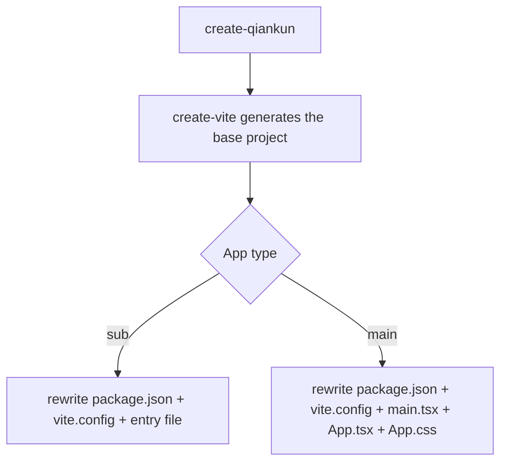
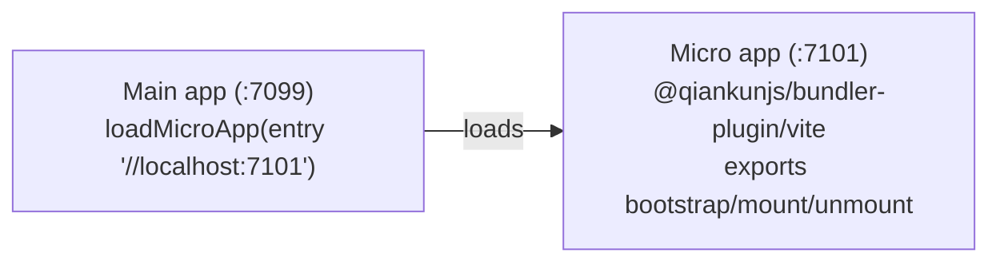

# create-qiankun

`create-qiankun` is the official scaffolder for qiankun 3.0. It generates a [Vite](https://vite.dev) project — either a main app or a micro app — and then rewrites the output to wire in what qiankun needs. qiankun v3 loads Vite apps natively through the [ESM sandbox](/concepts/esm-sandbox), so there's no separate SystemJS bundle and no "qiankun build mode": the ordinary `dev`, `build`, and `preview` output is loadable as-is.

## What it does

The scaffolder does two things:

1. It delegates the base project to the upstream [`create-vite`](https://github.com/vitejs/vite/tree/main/packages/create-vite), producing a standard React or Vue project.
2. It overwrites a handful of files (`package.json`, `vite.config.*`, the entry file, plus `App.tsx`/`App.css` for the main app) so the project is qiankun-ready out of the box.

The generated micro app exports the qiankun lifecycle while keeping the ability to run standalone. The generated main app comes preconfigured to load that micro app. The default ports on both sides line up, so they connect without any config changes.

## Requirements

- Node.js `>=20.19` (Vite's requirement).

## Running it

Use your package manager's create/exec command:

::: code-group

```bash [npm]
npx create-qiankun@latest
```

```bash [yarn]
yarn create qiankun@latest
```

```bash [pnpm]
pnpm dlx create-qiankun@latest
```

:::

With no arguments, the CLI asks interactively for the app type, name, and (for a micro app) template. Each of these can also be given on the command line, which skips the corresponding prompt.

```bash
# scaffold a React + TypeScript sub app named "my-app"
npx create-qiankun@latest my-app --type sub --template react-ts

# scaffold the main app
npx create-qiankun@latest my-main --type main
```

## CLI arguments and options

| Argument | Alias | Values | Default | Applies to |
| --- | --- | --- | --- | --- |
| `<app-name>` (positional) | — | must match `/^[a-z0-9-]+$/` | prompted | both |
| `--type` | `-T` | `main` \| `sub` | `sub` | both |
| `--template` | `-t` | `react-ts` \| `react` \| `vue-ts` \| `vue` | prompted | sub app only |

### App name

The positional app name may contain only lowercase letters, digits, and hyphens. It becomes the `name` in `package.json`; for a micro app it's also the key the lifecycle attaches to on the global (`window[appName]`, see below). An invalid name is rejected outright:

```
App name can only contain lowercase letters, numbers, and hyphens
```

If omitted, the main app defaults to `qiankun-main-app` and the micro app to `qiankun-sub-app`.

### App type

`--type` (or `-T`) chooses between `main` and `sub`, defaulting to `sub`. An unrecognized value exits with `Invalid type: ...`.

### Template

`--template` (or `-t`) selects the framework template, for **micro apps** only. The choices are:

| Value | Description |
| --- | --- |
| `react-ts` | React + TypeScript |
| `react` | React |
| `vue-ts` | Vue + TypeScript |
| `vue` | Vue |

::: warning The main app is always React + TypeScript
The template only applies to micro apps. The main app is always generated as `react-ts`. Passing `--template` together with `--type main` is a hard error:

```
The --template option is only supported for sub apps.
Please remove --template when using --type main.
```

Also, passing `--template` implies a micro app, so the app-type prompt is skipped.
:::

## Interactive prompts

For any option not given on the command line, the CLI asks for it:

- **App type** — choose between `Main App (主应用)` and `Sub App (子应用)`. Skipped when `--type` or `--template` is passed.
- **App name** — a text input, validated against `/^[a-z0-9-]+$/`. Skipped when the positional name is already given.
- **Template** — pick one of the four templates above. Only asked for micro apps; skipped when `--template` is passed or the app type is main.

Cancelling any prompt prints `Operation cancelled` and exits.

## Target directory (workspace-aware)

Before generating, the CLI checks the **parent** of the current directory for a `pnpm-workspace.yaml`:

- Inside a pnpm workspace, the app is generated at `<workspaceRoot>/packages/<app-name>`.
- Otherwise, it's generated at `<cwd>/<app-name>`.

If the target directory already exists, the CLI exits with `Directory ... already exists`. The `cd` line in the follow-up output uses the resolved path (`packages/<app-name>` inside a workspace, `<app-name>` otherwise).

## What gets generated

The base project comes from `create-vite` using its standard templates, then create-qiankun overwrites specific files.



### Micro app

The micro app is rewritten in three steps.

**`package.json`** — set `name` to your app name and add the qiankun dependencies. The versions are hardcoded strings rather than resolved ranges (this being an RC-stage scaffolder):

| Dependency | Location | Version |
| --- | --- | --- |
| `qiankun` | `dependencies` | `rc` |
| `@qiankunjs/react` or `@qiankunjs/vue` | `dependencies` | `latest` |
| `@qiankunjs/bundler-plugin` | `devDependencies` | `rc` |

The framework binding ([`@qiankunjs/react`](/ecosystem/react) or [`@qiankunjs/vue`](/ecosystem/vue)) is added for convenience — the generated entry file doesn't import it, but it's there for when you need it.

**`vite.config.ts`** — import the framework plugin and qiankun's [bundler plugin](/ecosystem/bundler-plugin), and set the dev server port to `7101`.

::: code-group

```ts [react-ts]
import { defineConfig } from 'vite';
import react from '@vitejs/plugin-react';
import { qiankun } from '@qiankunjs/bundler-plugin/vite';

// https://vite.dev/config/
export default defineConfig({
  plugins: [react(), qiankun()],
  server: {
    // matches the sub-app entry preconfigured in a create-qiankun main app,
    // adjust it per app when you scaffold multiple sub apps
    port: 7101,
  },
});
```

```ts [vue-ts]
import { defineConfig } from 'vite';
import vue from '@vitejs/plugin-vue';
import { qiankun } from '@qiankunjs/bundler-plugin/vite';

// https://vite.dev/config/
export default defineConfig({
  plugins: [vue(), qiankun()],
  server: {
    // matches the sub-app entry preconfigured in a create-qiankun main app,
    // adjust it per app when you scaffold multiple sub apps
    port: 7101,
  },
});
```

:::

**Entry file** (`src/main.tsx` / `src/main.ts`) — replaced with an entry that exports the qiankun lifecycle. It exports `bootstrap`, `mount`, and `unmount`; when running under qiankun it publishes them to `window[appName]`, otherwise it renders itself standalone.

::: code-group

```tsx [react]
import React from 'react';
import ReactDOM from 'react-dom/client';
import App from './App';
import './index.css';

const appName = 'my-app';
let root: ReactDOM.Root | undefined;

function render(props: { container?: Element } = {}) {
  const container = props.container?.querySelector('#root') ?? document.getElementById('root');
  if (!container) return;

  root = ReactDOM.createRoot(container);
  root.render(
    <React.StrictMode>
      <App />
    </React.StrictMode>,
  );
}

export async function bootstrap() {
  return Promise.resolve();
}

export async function mount(props: { container?: Element }) {
  render(props);
}

export async function unmount(props: { container?: Element }) {
  if (root) {
    root.unmount();
    root = undefined;
  }
  const container = props.container?.querySelector('#root') ?? document.getElementById('root');
  if (container) {
    container.innerHTML = '';
  }
}

declare global {
  interface Window {
    __POWERED_BY_QIANKUN__?: boolean;
    [key: string]: unknown;
  }
}

if (window.__POWERED_BY_QIANKUN__) {
  window[appName] = { bootstrap, mount, unmount };
} else {
  render();
}
```

```ts [vue]
import { createApp } from 'vue';
import App from './App.vue';
import './style.css';

const appName = 'my-app';
let app: ReturnType<typeof createApp> | undefined;

function render(props: { container?: Element } = {}) {
  const container = props.container?.querySelector('#app') ?? document.getElementById('app');
  if (!container) return;

  app = createApp(App);
  app.mount(container);
}

export async function bootstrap() {
  return Promise.resolve();
}

export async function mount(props: { container?: Element }) {
  render(props);
}

export async function unmount(props: { container?: Element }) {
  if (app) {
    app.unmount();
    app = undefined;
  }
  const container = props.container?.querySelector('#app') ?? document.getElementById('app');
  if (container) {
    container.innerHTML = '';
  }
}

declare global {
  interface Window {
    __POWERED_BY_QIANKUN__?: boolean;
    [key: string]: unknown;
  }
}

if (window.__POWERED_BY_QIANKUN__) {
  window[appName] = { bootstrap, mount, unmount };
} else {
  render();
}
```

:::

::: info
`__POWERED_BY_QIANKUN__` is a global flag qiankun sets on the sandbox window when the app runs inside a container. The entry uses it to decide whether to render standalone or export the lifecycle. For how these hooks get called, see [Micro-app lifecycle and props](/concepts/lifecycle-and-props). Non-TypeScript templates drop the `declare global` block but are otherwise identical.

The micro app keeps `create-vite`'s default `App` component — you build your own UI starting from there.
:::

### Main app

The main app is always `react-ts`, rewritten in five steps.

**`package.json`** — set `name` and add `qiankun` at version `rc` to `dependencies`. No bundler plugin and no framework binding, because the main app doesn't build the micro app's output.

**`vite.config.ts`** — a plain React config on port `7099`. qiankun's bundler plugin isn't needed on the main app.

```ts
import { defineConfig } from 'vite';
import react from '@vitejs/plugin-react';

export default defineConfig({
  plugins: [react()],
  server: {
    port: 7099,
  },
});
```

**`src/main.tsx`** — a plain React root render, followed by a commented-out route-based alternative using [`registerMicroApps`](/api/register-micro-apps) plus [`start`](/api/start):

```tsx
import React from 'react';
import ReactDOM from 'react-dom/client';
import App from './App';
import './index.css';

ReactDOM.createRoot(document.getElementById('root')!).render(
  <React.StrictMode>
    <App />
  </React.StrictMode>,
);

// ============================================================
// Alternative: Route-based micro-app loading
// Uncomment the following code to use registerMicroApps + start
// instead of the manual loadMicroApp approach in App.tsx
// ============================================================
//
// import { registerMicroApps, start } from 'qiankun';
//
// registerMicroApps([
//   {
//     name: 'sub-app',
//     entry: '//localhost:7101',
//     container: '#micro-app-container',
//     activeRule: '/sub-app',
//   },
// ]);
//
// start();
```

**`src/App.tsx`** — the wiring boilerplate. It loads the micro app manually with [`loadMicroApp`](/api/load-micro-app), watches the mount promise to drive the loading/error UI, and unmounts on cleanup:

```tsx
import { useEffect, useRef, useState } from 'react';
import { loadMicroApp } from 'qiankun';
import type { MicroApp } from 'qiankun';
import './App.css';

function App() {
  const containerRef = useRef<HTMLDivElement>(null);
  const microAppRef = useRef<MicroApp | null>(null);
  const [loading, setLoading] = useState(false);
  const [error, setError] = useState<string | null>(null);

  useEffect(() => {
    let isUnmounted = false;

    if (!containerRef.current) return;

    setLoading(true);
    setError(null);

    microAppRef.current = loadMicroApp(
      {
        name: 'sub-app',
        entry: '//localhost:7101',
        container: containerRef.current,
      },
      // sandbox is on by default; kept explicit so you know where to configure it.
      // styleIsolation: true additionally scopes the sub-app css with @scope
      { sandbox: true },
    );

    microAppRef.current.mountPromise
      .then(() => {
        if (!isUnmounted) {
          setLoading(false);
        }
      })
      .catch((err: unknown) => {
        if (!isUnmounted) {
          setError(err instanceof Error ? err.message : 'Failed to load micro app');
          setLoading(false);
        }
      });

    return () => {
      isUnmounted = true;
      microAppRef.current?.unmount();
      microAppRef.current = null;
    };
  }, []);

  return (
    <div className="main-app">
      <header className="main-app-header">
        <h1>Qiankun Main App</h1>
      </header>
      <main className="main-app-content">
        {loading && <div className="loading">Loading micro app...</div>}
        {error && <div className="error">Error: {error}</div>}
        <div ref={containerRef} id="micro-app-container" />
      </main>
    </div>
  );
}

export default App;
```

**`src/App.css`** — styles for the header, the content area, the `.loading`/`.error` states, and `#micro-app-container`.

::: tip styleIsolation and @scope
The comment in the generated `App.tsx` points at the two options qiankun accepts here. `sandbox` (default `true`) enables the [JS sandbox](/concepts/js-sandbox); `styleIsolation: true` additionally scopes the micro app's styles with the runtime [`@scope`](/concepts/style-isolation) strategy. The scaffolded example sets only these two fields — for the full set, see [AppConfiguration](/api/configuration).
:::

## How the main app and micro app connect

The two generated projects are configured to work together from the start:



- The micro app runs its own Vite dev server on port **7101** and exposes the qiankun lifecycle.
- The main app runs on port **7099** and loads the micro app from `//localhost:7101`.

The micro app's default port and the entry hardcoded in the main app are matched on purpose. To scaffold multiple micro apps, change each one's `server.port` (the generated `vite.config` has a comment reminding you of this) and add a matching `loadMicroApp`/`registerMicroApps` entry in the main app. See [Running multiple micro-app instances](/cookbook/run-multiple-instances).

## What to run next

Once generation finishes, the CLI prints `Done!` followed by the commands to run. For a micro app:

```bash
cd my-app
pnpm install
pnpm dev              # Run standalone (loadable by qiankun as-is)
pnpm build            # Build (the ESM output is qiankun-ready)
```

For the main app, the last two lines are a plain `pnpm dev` / `pnpm build`. When generated inside a pnpm workspace, the `cd` path is `packages/<app-name>`.

::: info No SystemJS build mode
qiankun 2.x needed a UMD/library build config; v3 is different — it loads Vite's ESM output natively through the [ESM sandbox](/concepts/esm-sandbox). The ordinary `dev`, `build`, and `preview` output is all qiankun-ready. If you're converting an existing app rather than starting a new one, see [Making a Vite app qiankun-ready](/cookbook/prepare-a-vite-app).
:::

## Related reading

- [@qiankunjs/bundler-plugin](/ecosystem/bundler-plugin) — the Vite and Webpack plugins the micro app uses.
- [loadMicroApp](/api/load-micro-app) and [registerMicroApps](/api/register-micro-apps) — the two loading approaches shown in the generated main app.
- [Getting started](/guide/getting-started) and the [tutorial](/tutorial/) — building the same setup step by step.
