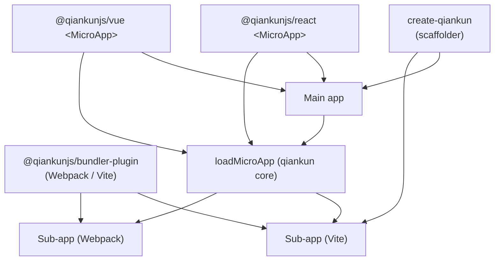

# Ecosystem overview

Beyond the core `qiankun` package, the project ships a small set of official companion packages that cover scaffolding, bundler integration, and framework component bindings. This page maps out what each one is, its current pre-release version, and when to reach for it.

All companion packages are published as pre-release (`rc`) alongside qiankun 3.0, and their APIs may still shift before the stable release.

## Package map

| Package | Version | Kind | Reach for it when… |
| --- | --- | --- | --- |
| [`create-qiankun`](/ecosystem/create-qiankun) | `0.0.1-rc.2` | CLI scaffolder | You want a ready-to-run main app or sub-app wired for qiankun, generated on top of Vite. |
| [`@qiankunjs/bundler-plugin`](/ecosystem/bundler-plugin) | `0.0.1-rc.1` | Build plugin (Webpack + Vite) | You are preparing a micro-app's build so qiankun can load it — marking the entry script and fixing the output library. |
| [`@qiankunjs/react`](/ecosystem/react) | `0.0.1-rc.14` | React component | You mount micro-apps declaratively from React with a `<MicroApp>` component instead of calling `loadMicroApp` by hand. |
| [`@qiankunjs/vue`](/ecosystem/vue) | `0.0.1-rc.2` | Vue component | You mount micro-apps declaratively from Vue (2 or 3) with a `<MicroApp>` component. |

::: info Internal package
`@qiankunjs/ui-shared` (`0.0.1-rc.1`) is an internal package shared by the React and Vue bindings. It defines the common prop types and the `mountMicroApp`/`updateMicroApp`/`unmountMicroApp` helpers around `loadMicroApp`. It is not meant to be imported directly by applications — depend on `@qiankunjs/react` or `@qiankunjs/vue` instead.
:::

## Where each package fits



The core `qiankun` package (`registerMicroApps`, `start`, `loadMicroApp`) is always the runtime. The companion packages sit at the edges: `create-qiankun` bootstraps projects, `@qiankunjs/bundler-plugin` prepares a sub-app's build output, and the `<MicroApp>` bindings wrap `loadMicroApp` for a component-driven mounting model.

## create-qiankun — scaffolding

`create-qiankun` is the recommended getting-started path. It generates a main app or a sub-app as a Vite project, then patches the generated files to wire in qiankun (entry lifecycles, the Vite plugin, and dependencies).

```bash
# npm
npx create-qiankun@latest

# yarn
yarn create qiankun@latest

# pnpm
pnpm dlx create-qiankun@latest
```

It supports React and Vue sub-app templates (with or without TypeScript); the main app is always React + TypeScript. Because qiankun v3 loads Vite apps natively through its ESM sandbox, the generated `dev`/`build`/`preview` outputs are already qiankun-compatible — there is no dedicated SystemJS build mode.

See [create-qiankun](/ecosystem/create-qiankun) for the full CLI reference and what it generates.

## @qiankunjs/bundler-plugin — build integration

`@qiankunjs/bundler-plugin` prepares a micro-app's build so qiankun's loader can pick up its entry deterministically. Install it as a dev dependency:

```bash
npm install @qiankunjs/bundler-plugin --save-dev
```

The package name is `@qiankunjs/bundler-plugin`. There is no `@qiankunjs/webpack-plugin` package — the single package covers both bundlers through subpath exports.

| Import path | Export | Bundler |
| --- | --- | --- |
| `@qiankunjs/bundler-plugin` | `QiankunWebpackPlugin` (named and default) | Webpack 4 / 5 |
| `@qiankunjs/bundler-plugin/webpack` | `QiankunWebpackPlugin` | Webpack 4 / 5 |
| `@qiankunjs/bundler-plugin/vite` | `qiankun()` (named and default) | Vite (>= 5) |

::: code-group

```js [webpack.config.js]
const HtmlWebpackPlugin = require('html-webpack-plugin');
const { QiankunWebpackPlugin } = require('@qiankunjs/bundler-plugin');

module.exports = {
  plugins: [
    new HtmlWebpackPlugin({ template: './src/index.html' }),
    new QiankunWebpackPlugin(),
  ],
};
```

```ts [vite.config.ts]
import { defineConfig } from 'vite';
import { qiankun } from '@qiankunjs/bundler-plugin/vite';

export default defineConfig({
  plugins: [qiankun()],
});
```

:::

The Webpack plugin fixes the output library (so lifecycle exports land on `window[packageName]`) and marks the entry `<script>` in the emitted HTML; it accepts a single `packageName` option. The Vite plugin marks the entry module script in built HTML and configures permissive CORS for dev and preview; it takes no options.

See [@qiankunjs/bundler-plugin](/ecosystem/bundler-plugin) for the complete option and behavior reference, and the cookbook guides for [Webpack](/cookbook/prepare-a-webpack-app) and [Vite](/cookbook/prepare-a-vite-app) apps.

## @qiankunjs/react and @qiankunjs/vue — the `<MicroApp>` component

Both bindings expose a single `MicroApp` component that wraps `loadMicroApp`. You give it a `name` and an `entry`, and it handles mount, update on prop change, and unmount on teardown for you.

::: code-group

```tsx [React]
import { MicroApp } from '@qiankunjs/react';

export default function Page() {
  return <MicroApp name="app1" entry="http://localhost:7101" />;
}
```

```vue [Vue]
<script setup>
import { MicroApp } from '@qiankunjs/vue';
</script>

<template>
  <micro-app name="app1" entry="http://localhost:7101" />
</template>
```

:::

Both share the same core props — `name`, `entry`, `settings` (an [AppConfiguration](/api/configuration)), `lifeCycles`, `autoSetLoading`, `autoCaptureError`, `wrapperClassName`, `className` — plus optional loader and error-boundary customization. The React binding forwards any extra prop to the sub-app; the Vue binding uses a dedicated `appProps` object for that. The React `MicroApp` requires `react`/`react-dom` >= 16.9; the Vue `MicroApp` is built on `vue-demi` and supports both Vue 2 and Vue 3.

Reach for these when you mount micro-apps at specific points in a component tree (manual mode). For URL-driven, route-based mounting, use [`registerMicroApps`](/api/register-micro-apps) + [`start`](/api/start) from the core package instead.

See [`<MicroApp>` for React](/ecosystem/react) and [`<MicroApp>` for Vue](/ecosystem/vue) for the full props, slots, and ref reference.

## Related

- [API reference overview](/api/index) — the core `qiankun` runtime APIs the bindings and plugins build on.
- [Getting started](/guide/getting-started) — install and run your first main app and micro-app.
- [Make a Vite app qiankun-ready](/cookbook/prepare-a-vite-app) and [Make a Webpack app qiankun-ready](/cookbook/prepare-a-webpack-app) — bundler-plugin in context.
