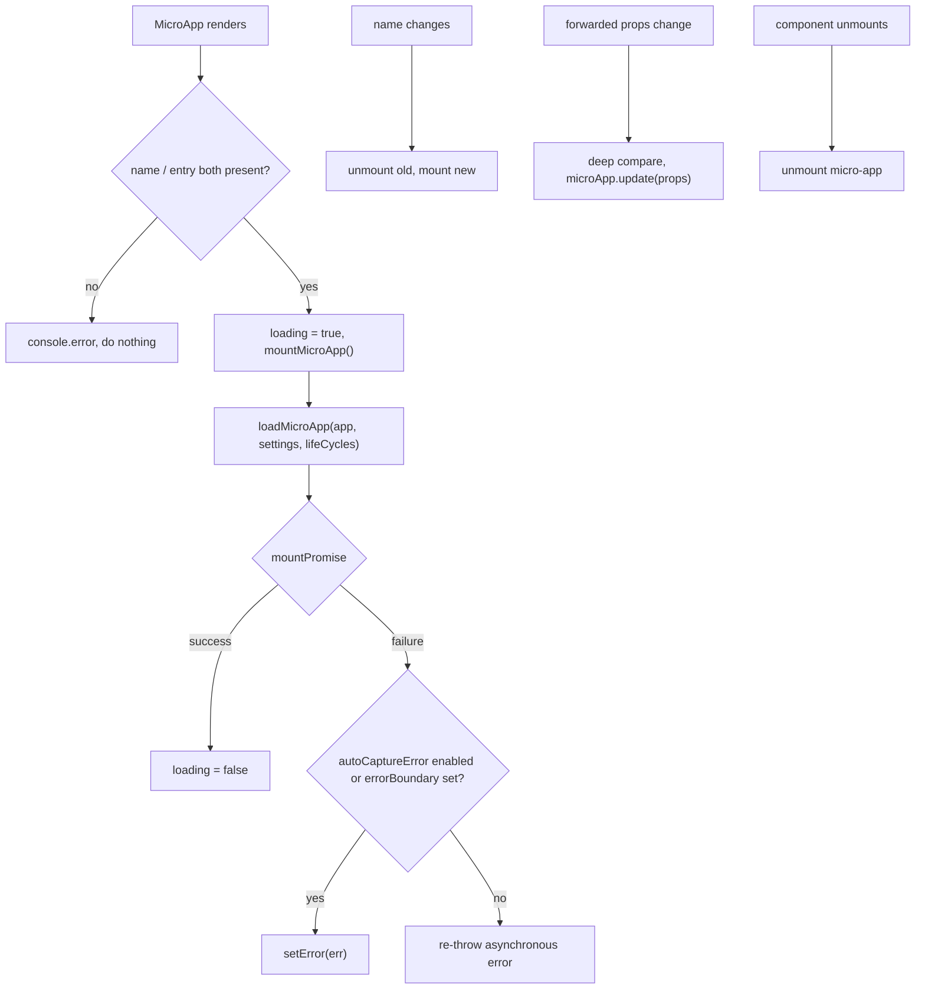

# The `<MicroApp>` component for React (@qiankunjs/react)

`@qiankunjs/react` gives you a `MicroApp` component that mounts a qiankun micro-app into your React component tree. It wraps [`loadMicroApp`](/api/load-micro-app) and ties the whole lifecycle — mount, update, unmount — to the component's own lifecycle and re-renders, so you never have to reach for that imperative API yourself.

Use it when the host is a React SPA and you want to drop a micro-app in as an ordinary component (on a route, inside a panel) rather than registering it globally with [`registerMicroApps`](/api/register-micro-apps).

The package also exports [`MicroAppLink`](#micro-app-link) for host route navigation, documented below.

## Installation

```bash
npm install @qiankunjs/react@rc qiankun@rc
```

The peer dependencies are `react` and `react-dom`, both required at `>=16.9.0`.

## Route navigation with MicroAppLink {#micro-app-link}

`MicroAppLink` provides host navigation for apps registered with [`registerMicroApps`](/api/register-micro-apps). After the host registers its micro-apps and calls [`start`](/api/start), clicking a link changes the URL through single-spa's `navigateToUrl`. The registered `activeRule` determines which micro-apps mount or unmount. The link does not load micro-apps itself.

```tsx
import { MicroAppLink, type MicroAppLinkProps } from '@qiankunjs/react';
import { useRef } from 'react';

export default function Navigation() {
  const linkRef = useRef<HTMLAnchorElement>(null);
  const appLink: MicroAppLinkProps = {
    to: '/app1',
    className: 'nav-link',
    activeClassName: 'is-active',
  };

  return (
    <nav>
      <MicroAppLink {...appLink} ref={linkRef}>App one</MicroAppLink>
      <MicroAppLink to="/app2/settings" replace>App two settings</MicroAppLink>
    </nav>
  );
}
```

| Prop | Type | Description |
| --- | --- | --- |
| `to` | `string` | **Required.** Target URL, rendered as the link's `href`. |
| `replace` | `boolean` | Whether to replace the current history entry. Defaults to `false`, adding a new entry on navigation. |
| `className` | `string` | CSS class for the link. |
| `activeClassName` | `string` | CSS class appended when the current URL matches the target URL prefix. No class is appended by default. |
| `children` | `ReactNode` | Link content. |
| `ref` | `Ref<HTMLAnchorElement>` | Points to the rendered `<a>` element. |

`MicroAppLinkProps` is exported from the package entry point. Native anchor props other than those consumed by the component, including `target`, `rel`, `download`, `aria-*`, `data-*`, and event handlers, are forwarded to `<a>`. `to` supplies `href`.

The component calls the provided `onClick` first. It intercepts only a left click on a same-origin HTTP(S) link when the event has not been canceled with `preventDefault()`, no Ctrl / Meta / Shift / Alt modifier is pressed, and the effective `target` is empty or `_self` (an omitted target follows the page's `<base target>` setting). Such clicks navigate within the current page. External links, download links, other browsing targets, and modified clicks retain browser behavior. With `replace`, the component uses `history.replaceState` and dispatches `popstate` to notify routing listeners.

For `activeClassName`, the component resolves the target URL and compares its `pathname + search + hash` with the start of the corresponding current URL string. For example, `to="/app1"` matches both `/app1/settings` and `/app10`, and `to="/"` matches every path. Query parameters and hashes in `to` participate in the same prefix comparison. This is a string comparison without route parameter parsing. For exact matching, the host can set `className` and `aria-current` itself.

## Basic usage

The only required props are `name` and `entry`, where `entry` is the URL of the micro-app's HTML entry.

```tsx
import { MicroApp } from '@qiankunjs/react';

export default function Page() {
  return <MicroApp name="app1" entry="http://localhost:8000" />;
}
```

The component renders a container `<div>` and mounts the micro-app into it; when the component unmounts, the micro-app unmounts with it.

::: warning name and entry are required
If either `name` or `entry` is missing, the component just logs `the name and entry of MicroApp is needed` and does nothing — it does not throw. Make sure you always pass both.
:::

## Props

```ts
import { type MicroApp } from 'qiankun';

// The exported component type
type Props = SharedProps & SharedSlots<React.ReactNode> & Record<string, unknown>;
```

That trailing `Record<string, unknown>` is deliberate: **any prop that isn't one of the reserved props listed below is forwarded to the micro-app as-is, becoming its props**. There's no separate `appProps` here — the extra props _are_ the micro-app's props.

### Reserved props

| Prop | Type | Default | Description |
| --- | --- | --- | --- |
| `name` * | `string` | — | The name of this micro-app instance. Changing it unmounts the current instance and creates a new one. |
| `entry` * | `string` | — | The micro-app's HTML entry URL. |
| `settings` | [`AppConfiguration`](/api/configuration) | — | Loader / sandbox configuration passed through to `loadMicroApp`. |
| `lifeCycles` | [`LifeCycles`](/api/lifecycles) | — | Host-provided lifecycle hooks for this instance, such as `beforeLoad` and `beforeMount`. |
| `autoSetLoading` | `boolean` | `false` | Render the built-in loader and clear it automatically once the app is mounted. |
| `autoCaptureError` | `boolean` | `false` | Render the built-in error boundary instead of throwing loading errors outward. |
| `wrapperClassName` | `string` | — | Class prepended to the wrapper element. Only takes effect when a loader or error boundary is active. |
| `className` | `string` | — | Class prepended to the mount container element. |
| `loader` | `(loading: boolean) => ReactNode` | — | Render-prop slot for a custom loading UI. |
| `errorBoundary` | `(error: Error) => ReactNode` | — | Render-prop slot for a custom error UI. |

`*` = required.

Every other prop is deep-compared on each render and then forwarded to the micro-app. See [Passing props to the micro-app](#passing-props-to-the-micro-app).

::: info Reserved fields are not forwarded
Every prop the component owns — `name`, `entry`, `settings`, `lifeCycles`, `autoSetLoading`, `autoCaptureError`, `loader`, `errorBoundary`, `wrapperClassName`, and `className` — is consumed by the component and stripped off before the props reach the micro-app.
:::

## Passing props to the micro-app {#passing-props-to-the-micro-app}

Any non-reserved prop is forwarded to the micro-app and delivered to its `bootstrap`/`mount`/`update` lifecycles.

```tsx
<MicroApp
  name="app1"
  entry="http://localhost:8000"
  // forwarded to the micro-app as props
  userId={42}
  theme="dark"
  onEvent={(e) => console.log(e)}
/>
```

Inside the micro-app, these values show up on the `props` of each lifecycle:

```ts
export async function mount(props) {
  console.log(props.userId, props.theme);
}
```

When these props change, the component deep-compares them with lodash's `isEqual` and calls `microApp.update(props)` on the running app — the micro-app is not remounted. And the update only actually runs when the app's status is `MOUNTED`.

::: tip Remount vs update
Changing `name` unmounts the current instance and creates a new one. Changing another forwarded prop only attempts an in-place `update`. Changing `entry`, `settings`, or `lifeCycles` alone does not create a new instance. To reset completely, change `name` or give the component a new `key`.
:::

## Loading state

The internal loading flag starts out `true` and is cleared once the app's `mountPromise` settles, whether it resolves or fails. That happens regardless of `autoSetLoading` — the flag only selects the built-in indicator, so gating the state on it would leave a custom `loader` spinning forever. Without a loading slot there is simply nothing to render for the state.

### Built-in loader

```tsx
<MicroApp name="app1" entry="http://localhost:8000" autoSetLoading />
```

The built-in loader is just a placeholder that renders the literal text `loading...`. For a real UI, pass your own `loader`.

### Custom loader

```tsx
<MicroApp
  name="app1"
  entry="http://localhost:8000"
  loader={(loading) => <Spinner spinning={loading} />}
/>
```

A custom `loader` works on its own and takes precedence over the built-in indicator, so `autoSetLoading` is redundant next to it. `wrapperClassName` only takes effect when a loading or error slot is active, because that is when the component renders the positioned wrapper element.

## Error handling

By default, errors from loading, bootstrap, and mount are re-thrown from the asynchronous loading flow. Configure the built-in or custom error UI to prevent an unhandled promise rejection.

::: danger Handle asynchronous loading errors
With neither `autoCaptureError` nor `errorBoundary` set, the component re-throws asynchronous loading errors. A React error boundary cannot catch an error thrown from a promise callback, so configure this component's own error UI.
:::

### Built-in error boundary

```tsx
<MicroApp name="app1" entry="http://localhost:8000" autoCaptureError />
```

The built-in boundary renders a bare `<div>` containing `error.message`. For production UI, pass your own `errorBoundary`.

### Custom error boundary

```tsx
<MicroApp
  name="app1"
  entry="http://localhost:8000"
  errorBoundary={(error) => <ErrorPanel message={error.message} />}
/>
```

### Loading and error together

```tsx
<MicroApp
  name="app1"
  entry="http://localhost:8000"
  autoSetLoading
  autoCaptureError
/>
```

For a more systematic treatment of error handling, see [Handling loading and runtime errors](/cookbook/handle-errors) and [addErrorHandler / removeErrorHandler](/api/error-handling).

## Getting the running app through a ref

The component is a `forwardRef`. The forwarded ref points at the running micro-app handle — a Parcel from `@qiankunjs/single-spa` (the `MicroApp` type in `qiankun`, re-exported by `@qiankunjs/react` as `MicroAppType`) — so you can read its status and await its lifecycle promises.

```tsx
import { useRef } from 'react';
import { MicroApp } from '@qiankunjs/react';
import { type MicroAppType } from '@qiankunjs/react';

function Page() {
  const microAppRef = useRef<MicroAppType>(undefined);

  const logStatus = () => {
    console.log(microAppRef.current?.getStatus());
  };

  return (
    <>
      <button type="button" onClick={logStatus}>Check status</button>
      <MicroApp
        name="app1"
        entry="http://localhost:8000"
        autoSetLoading
        ref={microAppRef}
      />
    </>
  );
}
```

### The ref handle

The handle is single-spa's Parcel interface:

| Member | Type | Description |
| --- | --- | --- |
| `getStatus()` | `() => Status` | The current lifecycle status (see below). |
| `mount()` | `() => Promise<null>` | Mount the app. |
| `unmount()` | `() => Promise<null>` | Unmount the app. |
| `update?(props)` | `(props) => Promise<unknown>` | Push new props (present only if the app exports an `update` lifecycle). |
| `loadPromise` | `Promise<null>` | Resolves when the source code has finished loading. |
| `bootstrapPromise` | `Promise<null>` | Resolves when the app has finished bootstrapping. |
| `mountPromise` | `Promise<null>` | Resolves when the app has finished mounting. |
| `unmountPromise` | `Promise<null>` | Resolves when the app has finished unmounting. |

`getStatus()` returns one of: `NOT_LOADED`, `LOADING_SOURCE_CODE`, `NOT_BOOTSTRAPPED`, `BOOTSTRAPPING`, `NOT_MOUNTED`, `MOUNTING`, `MOUNTED`, `UPDATING`, `UNMOUNTING`, `UNLOADING`, `SKIP_BECAUSE_BROKEN`, `LOAD_ERROR`.

::: warning Let the component manage the lifecycle
The ref is for reading status and awaiting promises. Don't call its `mount()`/`unmount()` yourself — the component owns mount / update / unmount, and it also guards against concurrent unmount and remount. Calling those by hand tends to corrupt that state.
:::

## Passing configuration

Loader- and sandbox-related options all go through `settings`, an [`AppConfiguration`](/api/configuration).

```tsx
<MicroApp
  name="app1"
  entry="http://localhost:8000"
  settings={{ sandbox: { styleIsolation: true } }}
/>
```

`settings` is handed to `loadMicroApp` as-is — the component defaults nothing on your behalf. For what `sandbox.styleIsolation` actually enables, see [Style isolation](/concepts/style-isolation); for `sandbox` itself, see [The JS sandbox](/concepts/js-sandbox).

## Lifecycle hooks

Host lifecycle hooks are passed via `lifeCycles` and apply only to the instance created by this component. Each hook may be a single function or an array of functions.

```tsx
<MicroApp
  name="app1"
  entry="http://localhost:8000"
  lifeCycles={{
    beforeMount: async (app) => console.log('before mount', app.name),
    afterMount: async (app) => console.log('mounted', app.name),
  }}
/>
```

For the full list of hooks and their signatures, see [Lifecycle hooks](/api/lifecycles).

## Styling hooks

The component always attaches two classes you can target in CSS:

| Element | Class |
| --- | --- |
| Wrapper (rendered only when a loader or error boundary is active) | `qiankun-micro-app-wrapper` |
| Mount container (always rendered) | `qiankun-micro-app-container` |

```css
.qiankun-micro-app-wrapper {
  position: relative; /* already applied inline; add your own layout here */
}

.qiankun-micro-app-container {
  min-height: 240px;
}
```

`wrapperClassName` and `className` are **prepended** to these two classes, so both your own class and qiankun's hook class end up on the element.

## How it works under the hood



- Mounting is keyed on `name`; changing it remounts a brand-new app.
- Prop updates are driven by a deep comparison of the forwarded props and go through `microApp.update`.
- When the instance status is `MOUNTED`, the component marks it as unmounting before teardown so prop updates do not race with unmount.

## Related

- [loadMicroApp](/api/load-micro-app) — the facade API this component wraps.
- [AppConfiguration](/api/configuration) — the shape of `settings`.
- [Lifecycle hooks](/api/lifecycles) — the shape of `lifeCycles`.
- [The `<MicroApp>` component for Vue](/ecosystem/vue) — the Vue version (note: Vue passes app props through a dedicated `appProps` object).
- [Running multiple micro-app instances at once](/cookbook/run-multiple-instances)
