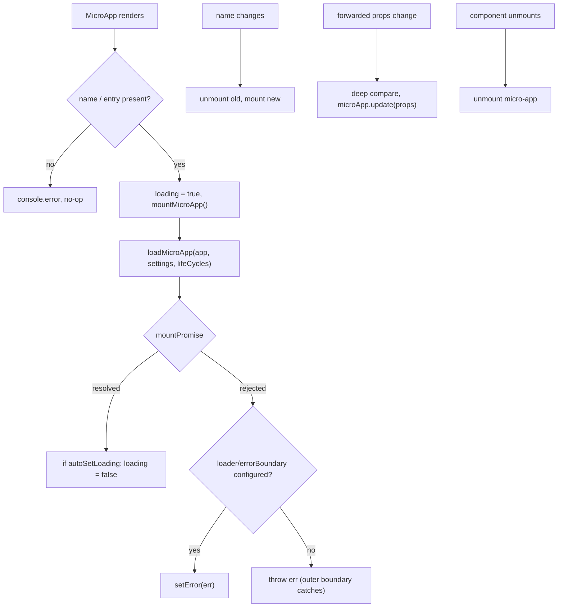

# &lt;MicroApp&gt; for React (@qiankunjs/react)

`@qiankunjs/react` provides a `MicroApp` component that mounts a qiankun micro-app inside your React tree. It wraps [`loadMicroApp`](/api/load-micro-app), managing mount, update, and unmount as the component lives and re-renders, so you never call the imperative API by hand.

Use this when the main app is a React SPA and you want to embed a micro-app as an ordinary component (for example on a route or in a panel), rather than registering it globally with [`registerMicroApps`](/api/register-micro-apps).

## Installation

```bash
pnpm add @qiankunjs/react qiankun
```

Peer dependencies: `react` and `react-dom` `>=16.9.0`.

## Basic usage

`name` and `entry` are the only required props. `entry` is the URL of the micro-app's HTML entry.

```tsx
import { MicroApp } from '@qiankunjs/react';

export default function Page() {
  return <MicroApp name="app1" entry="http://localhost:8000" />;
}
```

The component renders a container `<div>` and mounts the micro-app into it. When the component unmounts, the micro-app is unmounted automatically.

::: warning name and entry are required
If either `name` or `entry` is missing, the component logs `the name and entry of MicroApp is needed` and does nothing — it does not throw. Make sure both are always provided.
:::

## Props

```ts
import { type MicroApp } from 'qiankun';

// The exported component type
type Props = SharedProps & SharedSlots<React.ReactNode> & Record<string, unknown>;
```

The `Record<string, unknown>` part is deliberate: **any prop you pass that is not one of the reserved props below is forwarded to the micro-app as its props**. There is no separate `appProps` — extra props _are_ the app props.

### Reserved props

| Prop | Type | Default | Description |
| --- | --- | --- | --- |
| `name` * | `string` | — | Unique micro-app name. Changing it remounts a fresh micro-app. |
| `entry` * | `string` | — | HTML entry URL of the micro-app. |
| `settings` | [`AppConfiguration`](/api/configuration) | — | Loader/sandbox configuration passed through to `loadMicroApp`. |
| `lifeCycles` | [`LifeCycles`](/api/lifecycles) | — | Global lifecycle hooks (`beforeLoad`, `beforeMount`, …) for this micro-app. |
| `autoSetLoading` | `boolean` | `false` | Render the built-in loader and auto-clear it once the app is mounted. |
| `autoCaptureError` | `boolean` | `false` | Render the built-in error boundary instead of re-throwing load errors. |
| `wrapperClassName` | `string` | — | Class prepended to the wrapper element. Only takes effect when a loader or error boundary is active. |
| `className` | `string` | — | Class prepended to the mount container element. |
| `loader` | `(loading: boolean) => ReactNode` | — | Render-prop slot for a custom loading UI. |
| `errorBoundary` | `(error: Error) => ReactNode` | — | Render-prop slot for a custom error UI. |

`*` = required.

Every other prop is deep-compared across renders and forwarded to the micro-app. See [passing props](#passing-props-to-the-micro-app).

::: info Reserved names cannot be forwarded
Because `name`, `entry`, `settings`, `lifeCycles`, `wrapperClassName`, and `className` are consumed by the component, they are stripped before props reach the micro-app. Do not rely on receiving them inside the sub-app.
:::

## Passing props to the micro-app

Any non-reserved prop is forwarded to the micro-app and delivered to its `bootstrap`/`mount`/`update` lifecycles.

```tsx
<MicroApp
  name="app1"
  entry="http://localhost:8000"
  // forwarded to the micro-app as props
  userId={42}
  theme="dark"
  onEvent={(e) => console.log(e)}
/>
```

Inside the micro-app the values arrive on the lifecycle `props`:

```ts
export async function mount(props) {
  console.log(props.userId, props.theme);
}
```

When these props change, the component deep-compares them (lodash `isEqual`) and calls `microApp.update(props)` on the running app — the micro-app is not remounted. An update only runs while the app's status is `MOUNTED`.

::: tip Remount vs update
Changing `name` remounts a brand-new micro-app. Changing any forwarded prop triggers an in-place `update`. If you want a hard reset, change (or `key`) the `name`.
:::

## Loading state

The internal loading flag starts as `true`. It is only auto-cleared — via `setLoading(false)` on the app's `mountPromise` — when `autoSetLoading` is enabled. Without a loader configured, nothing renders for the loading state anyway, so this flag has no visible effect.

### Built-in loader

```tsx
<MicroApp name="app1" entry="http://localhost:8000" autoSetLoading />
```

The built-in loader is a placeholder that renders the literal text `loading...`. For real UI, provide a custom `loader`.

### Custom loader

```tsx
<MicroApp
  name="app1"
  entry="http://localhost:8000"
  loader={(loading) => <Spinner spinning={loading} />}
/>
```

When a `loader` prop is supplied you do not need `autoSetLoading` — the presence of the slot activates the loading UI. `wrapperClassName` only applies when a loader or error boundary is active, because only then does the component render a positioned wrapper element.

## Error handling

By default, load, bootstrap, and mount errors are **re-thrown** — they are not swallowed. You must catch them with an outer React error boundary, or opt in to the built-in/custom error UI.

::: danger Uncaptured errors propagate
Without `autoCaptureError` or a custom `errorBoundary`, a failed load throws during render and will crash the subtree unless an ancestor React error boundary catches it.
:::

### Built-in error boundary

```tsx
<MicroApp name="app1" entry="http://localhost:8000" autoCaptureError />
```

The built-in boundary renders a bare `<div>` containing `error.message`. Provide a custom `errorBoundary` for production UI.

### Custom error boundary

```tsx
<MicroApp
  name="app1"
  entry="http://localhost:8000"
  errorBoundary={(error) => <ErrorPanel message={error.message} />}
/>
```

### Auto loading and error together

```tsx
<MicroApp
  name="app1"
  entry="http://localhost:8000"
  autoSetLoading
  autoCaptureError
/>
```

For a broader treatment of error strategy, see [Handle load and runtime errors](/cookbook/handle-errors) and [addErrorHandler / removeErrorHandler](/api/error-handling).

## Accessing the running app via ref

The component is a `forwardRef`. The forwarded ref resolves to the running micro-app handle — a single-spa Parcel (`MicroApp` type from `qiankun`) — so you can read its status and await its lifecycle promises.

```tsx
import { useRef, useEffect } from 'react';
import { MicroApp } from '@qiankunjs/react';
import { type MicroApp as MicroAppType } from 'qiankun';

function Page() {
  const microAppRef = useRef<MicroAppType>();

  useEffect(() => {
    // e.g. 'MOUNTING' | 'MOUNTED' | 'LOAD_ERROR' | ...
    console.log(microAppRef.current?.getStatus());
  }, []);

  return <MicroApp name="app1" entry="http://localhost:8000" ref={microAppRef} />;
}
```

### The ref handle

The handle is single-spa's Parcel interface:

| Member | Type | Description |
| --- | --- | --- |
| `getStatus()` | `() => Status` | Current lifecycle status (see below). |
| `mount()` | `() => Promise<null>` | Mount the app. |
| `unmount()` | `() => Promise<null>` | Unmount the app. |
| `update?(props)` | `(props) => Promise<unknown>` | Push new props (present only if the app exports an `update` lifecycle). |
| `loadPromise` | `Promise<null>` | Resolves when source code has loaded. |
| `bootstrapPromise` | `Promise<null>` | Resolves when the app has bootstrapped. |
| `mountPromise` | `Promise<null>` | Resolves when the app has mounted. |
| `unmountPromise` | `Promise<null>` | Resolves when the app has unmounted. |

`getStatus()` returns one of: `NOT_LOADED`, `LOADING_SOURCE_CODE`, `NOT_BOOTSTRAPPED`, `BOOTSTRAPPING`, `NOT_MOUNTED`, `MOUNTING`, `MOUNTED`, `UPDATING`, `UNMOUNTING`, `UNLOADING`, `SKIP_BECAUSE_BROKEN`, `LOAD_ERROR`.

::: warning Let the component own the lifecycle
The ref lets you read status and await promises. Avoid calling `mount()`/`unmount()` on it manually — the component manages mount/update/unmount for you and guards against concurrent unmount and remount. Manual calls can desync that state.
:::

## Passing configuration

Loader and sandbox options go through `settings`, which is an [`AppConfiguration`](/api/configuration).

```tsx
<MicroApp
  name="app1"
  entry="http://localhost:8000"
  settings={{ sandbox: true, styleIsolation: true }}
/>
```

The component always forces `globalContext: window` and merges your `settings` on top before calling `loadMicroApp`. See [Style isolation](/concepts/style-isolation) for what `styleIsolation` enables, and [The JS sandbox](/concepts/js-sandbox) for `sandbox`.

## Lifecycle hooks

Pass framework-level hooks via `lifeCycles`. They are merged (appended, not replaced) with any global hooks and run around this micro-app's load/mount/unmount.

```tsx
<MicroApp
  name="app1"
  entry="http://localhost:8000"
  lifeCycles={{
    beforeMount: async (app) => console.log('before mount', app.name),
    afterMount: async (app) => console.log('mounted', app.name),
  }}
/>
```

See [Lifecycle hooks](/api/lifecycles) for the full hook set and signatures.

## Styling hooks

The component always applies two class names you can target from CSS:

| Element | Class |
| --- | --- |
| Wrapper (rendered only when a loader or error boundary is active) | `qiankun-micro-app-wrapper` |
| Mount container (always rendered) | `qiankun-micro-app-container` |

```css
.qiankun-micro-app-wrapper {
  position: relative; /* already applied inline; add your own layout here */
}

.qiankun-micro-app-container {
  min-height: 240px;
}
```

`wrapperClassName` and `className` are _prepended_ to these classes, so you get both your class and the qiankun hook.

## How it behaves under the hood



- Mounting is keyed on `name`; changing it remounts a fresh app.
- Prop updates are keyed on a deep comparison of the forwarded props and routed through `microApp.update`.
- Unmount waits for the app's `mountPromise` before unmounting and guards concurrent teardown, so remounts and multiple instances stay consistent.

## Related

- [loadMicroApp](/api/load-micro-app) — the facade API this component wraps.
- [AppConfiguration](/api/configuration) — the shape of `settings`.
- [Lifecycle hooks](/api/lifecycles) — the shape of `lifeCycles`.
- [&lt;MicroApp&gt; for Vue](/ecosystem/vue) — the Vue equivalent (note: Vue passes app props via a dedicated `appProps` object).
- [Run multiple micro-app instances](/cookbook/run-multiple-instances)
