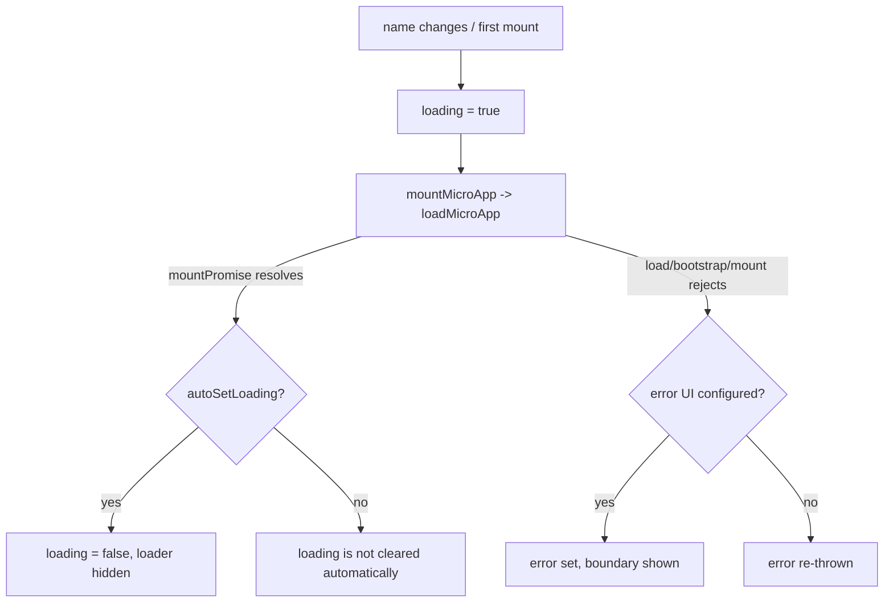

# `<MicroApp>` for Vue (@qiankunjs/vue)

`@qiankunjs/vue` provides a `MicroApp` component that loads, mounts, updates, and unmounts a qiankun micro-app declaratively — the whole lifecycle is tied to the component's own lifecycle. It is a thin, reactive wrapper over [`loadMicroApp`](/api/load-micro-app) from the `qiankun` facade.

The component is built on [`vue-demi`](https://github.com/vueuse/vue-demi), so a single build runs under both Vue 2 and Vue 3.

## Installation

```bash
npm install @qiankunjs/vue@rc qiankun@rc
```

`vue` is a peer dependency with the range `^2.0.0 || >=3.0.0`. Under Vue 2 you also need `@vue/composition-api` installed (the component uses the Composition API through `vue-demi`).

::: tip Prerequisite
The `MicroApp` component calls `loadMicroApp` directly, so you do not need `registerMicroApps` or `start` for it. You still need [`start`](/api/start) if you also use route-based registration elsewhere in the same app. See [Micro-app lifecycle and props](/concepts/lifecycle-and-props) for how mount and update map to single-spa.
:::

## Basic usage

```vue
<script setup>
import { MicroApp } from '@qiankunjs/vue';
</script>

<template>
  <micro-app name="app1" entry="http://localhost:8000" />
</template>
```

`name` and `entry` are the only required props. `name` identifies the current instance, and `entry` is the micro-app's HTML entry URL. When either is missing, the component logs an error and does nothing; it does not throw.

The component renders a single container `<div>` (class `qiankun-micro-app-container`) into which the micro-app is streamed. No wrapper element is added unless a loader or error boundary is active — see [Loading and error UI](#loading-and-error-ui).

## Props

| Prop | Type | Default | Description |
| --- | --- | --- | --- |
| `name` | `string` | — | **Required.** The name of this micro-app instance; changing it remounts the component. |
| `entry` | `string` | — | **Required.** HTML entry URL of the micro-app. |
| `settings` | `AppConfiguration` | `{ sandbox: true }` | Loader/sandbox configuration forwarded to `loadMicroApp`. See [AppConfiguration](/api/configuration). |
| `lifeCycles` | `LifeCycles` | `undefined` | Host-provided lifecycle hooks for this instance: `beforeLoad`, `beforeMount`, `afterMount`, `beforeUnmount`, and `afterUnmount`. Each field accepts a function or an array of functions. See [Lifecycle hooks](/api/lifecycles). |
| `autoSetLoading` | `boolean` | `false` | Render the built-in loading indicator while the micro-app loads. |
| `autoCaptureError` | `boolean` | `false` | Render the built-in error boundary when loading fails. |
| `wrapperClassName` | `string` | `undefined` | Extra class on the wrapper element. Only takes effect when a loader or error boundary is active. |
| `className` | `string` | `undefined` | Extra class on the mount container element. |
| `appProps` | `object` | `undefined` | Props passed through to the micro-app. This is the only channel for passing data to the sub-app in the Vue binding. |

::: info `settings` default differs from React
The Vue binding defaults `settings` to `{ sandbox: true }`. The [React binding](/ecosystem/react) has no `settings` default — nothing is defaulted on your behalf there. Either way `sandbox` defaults to `true` at the facade level, so the two bindings behave the same unless you pass something else.
:::

::: warning Pass application data through `appProps`
Unlike the React binding, the Vue binding does not forward arbitrary attributes to the micro-app. Put application data inside `appProps`. The current implementation also forwards `autoSetLoading`, `autoCaptureError`, and the `appProps` object itself; application code should not depend on these component-control fields.
:::

### `settings` (AppConfiguration)

`settings` accepts the same object as the second argument of [`loadMicroApp`](/api/load-micro-app). The full shape is documented in [AppConfiguration](/api/configuration); the fields are exactly `fetch`, `streamTransformer`, `nodeTransformer`, and `sandbox` (default `true`). Style isolation, extra globals, the incubator context, and isolation plugins all live inside the `sandbox` object.

```vue
<template>
  <micro-app
    name="app1"
    entry="http://localhost:8000"
    :settings="{ sandbox: { styleIsolation: true } }"
  />
</template>
```

To turn the JS sandbox off for a specific micro-app, pass `:settings="{ sandbox: false }"`. See [The JS sandbox](/concepts/js-sandbox) and [Style isolation](/concepts/style-isolation).

## Passing props to the micro-app (`appProps`)

Put the data the sub-app should receive inside `appProps`:

```vue
<script setup>
import { reactive } from 'vue';
import { MicroApp } from '@qiankunjs/vue';

const appProps = reactive({ userId: 42, theme: 'dark' });
</script>

<template>
  <micro-app name="app1" entry="http://localhost:8000" :appProps="appProps" />
</template>
```

These reach the micro-app as the `props` argument of its exported lifecycles:

```ts
// inside the micro-app
export async function mount(props) {
  console.log(props.userId); // 42
}
```

`appProps` is **deep-watched**. Mutating a nested value (for example `appProps.theme = 'light'`) triggers `microApp.update(props)` on the running instance, provided the micro-app exposes an `update` lifecycle, its status is `MOUNTED`, and it is not being unmounted. See [Share state and communicate between apps](/cookbook/communicate-between-apps).

::: tip Updates only fire after mount
`update` is serialized after the mount promise resolves, and only when the parcel status is `MOUNTED`. Intermediate prop changes during mounting are not guaranteed to produce a separate update for every change.
:::

## Loading and error UI

Both the loading indicator and the error boundary are opt-in. When neither is enabled and no slots are provided, the component renders only the bare container `<div>`. When any of `autoSetLoading`, `autoCaptureError`, the `#loader` slot, or the `#error-boundary` slot is present, the component instead renders a wrapper element (class `qiankun-micro-app-wrapper`) that holds the loader/error nodes alongside the container.



### Auto loading and error capture

Enable the built-in indicators with the boolean props:

```vue
<script setup>
import { MicroApp } from '@qiankunjs/vue';
</script>

<template>
  <micro-app
    name="app1"
    entry="http://localhost:8000"
    autoSetLoading
    autoCaptureError
  />
</template>
```

The built-ins are intentionally minimal: the default loader renders the text `loading...`, and the default error boundary renders a `<div>` containing `error.message`. For anything production-grade, use the slots below.

::: info Initial loading state
The Vue binding initializes `loading` to `false` (the React binding starts at `true`). The flag is set to `true` while the micro-app loads and cleared on the mount promise — but it is only auto-cleared when `autoSetLoading` is enabled. Without `autoSetLoading` no loader is rendered anyway.
:::

### Custom loader slot

Provide a `#loader` scoped slot to render your own indicator. The component passes the `loading` boolean directly to the slot; it is `true` while loading and `false` once loading ends.

```vue
<script setup>
import CustomLoader from '@/components/CustomLoader.vue';
import { MicroApp } from '@qiankunjs/vue';
</script>

<template>
  <micro-app name="app1" entry="http://localhost:8000" autoSetLoading>
    <template #loader="loading">
      <custom-loader :loading="loading" />
    </template>
  </micro-app>
</template>
```

A `#loader` slot takes precedence over the built-in loader. Keep `autoSetLoading` enabled if the component should automatically set `loading` to `false` when `mountPromise` resolves.

### Custom error boundary slot

Provide an `#error-boundary` scoped slot to render your own error UI. The component passes the `Error` instance directly to the slot, which is rendered only after an error occurs.

```vue
<script setup>
import CustomErrorBoundary from '@/components/CustomErrorBoundary.vue';
import { MicroApp } from '@qiankunjs/vue';
</script>

<template>
  <micro-app name="app1" entry="http://localhost:8000">
    <template #error-boundary="error">
      <custom-error-boundary :error="error" />
    </template>
  </micro-app>
</template>
```

### Uncaptured errors are re-thrown

If you do **not** enable `autoCaptureError` and do **not** provide an `#error-boundary` slot, load, bootstrap, and mount errors are re-thrown from the asynchronous loading flow. Configure the built-in or custom error UI to prevent an unhandled promise rejection.

::: warning
Enabling `autoCaptureError` or supplying an `#error-boundary` slot switches error handling from "throw" to "render". Choose one strategy per micro-app; do not rely on an outer `errorCaptured` for errors you have already routed into a boundary. See [Handle load and runtime errors](/cookbook/handle-errors).
:::

## Remounting and the exposed handle

The component watches `name` to trigger remounting: changing it unmounts the current micro-app and creates a new instance. Changing `entry`, `settings`, or `lifeCycles` alone does not create a new instance. Unmount is automatic when the component is destroyed (`onBeforeUnmount`), and it awaits the in-flight mount promise before unmounting so concurrent mount/unmount cycles stay ordered.

The running micro-app instance is exposed on the component instance under two names, `microApp` and `microAppRef` (both point at the same [`MicroApp`](/api/types) parcel handle). Reach it through a template ref:

```vue
<script setup>
import { ref, onMounted } from 'vue';
import { MicroApp } from '@qiankunjs/vue';

const microAppComp = ref();

onMounted(() => {
  // parcel handle: getStatus(), mountPromise, unmount(), update(), ...
  console.log(microAppComp.value?.microApp?.getStatus());
});
</script>

<template>
  <micro-app ref="microAppComp" name="app1" entry="http://localhost:8000" />
</template>
```

The handle is a Parcel from `@qiankunjs/single-spa`, qiankun's vendored fork. Its `getStatus()` returns one of `NOT_LOADED`, `LOADING_SOURCE_CODE`, `NOT_BOOTSTRAPPED`, `BOOTSTRAPPING`, `NOT_MOUNTED`, `MOUNTING`, `MOUNTED`, `UPDATING`, `UNMOUNTING`, `UNLOADING`, `SKIP_BECAUSE_BROKEN`, or `LOAD_ERROR`. The full type is in the [Types reference](/api/types).

::: tip Let the component own the lifecycle
Prefer driving the micro-app through props (`name`, `appProps`) rather than calling `unmount()`/`update()` on the handle yourself. The component serializes unmounts and guards concurrent updates internally; manual calls can race with that bookkeeping.
:::

## CSS hooks

The class names are identical to the React binding. Two stable hooks are always applied, and your `wrapperClassName` / `className` are prepended when provided.

| Element | Always-applied class | Extra class from prop |
| --- | --- | --- |
| Wrapper (only when a loader or error boundary is active) | `qiankun-micro-app-wrapper` | `wrapperClassName` |
| Mount container | `qiankun-micro-app-container` | `className` |

```css
/* target every micro-app mount container */
.qiankun-micro-app-container {
  min-height: 320px;
}

/* target the wrapper that holds loader + error UI */
.qiankun-micro-app-wrapper {
  position: relative;
}
```

Because the wrapper element only exists when a loader or error boundary is active, `wrapperClassName` has no effect on a plain `<micro-app>` with no loading/error UI.

## Full example

```vue
<script setup>
import { reactive } from 'vue';
import { MicroApp } from '@qiankunjs/vue';
import Spinner from '@/components/Spinner.vue';
import ErrorPanel from '@/components/ErrorPanel.vue';

const appProps = reactive({ userId: 42 });
</script>

<template>
  <micro-app
    name="app1"
    entry="http://localhost:8000"
    :settings="{ sandbox: { styleIsolation: true } }"
    :appProps="appProps"
    autoSetLoading
    wrapperClassName="my-wrapper"
    className="my-container"
  >
    <template #loader="loading">
      <spinner v-if="loading" />
    </template>
    <template #error-boundary="error">
      <error-panel :message="error.message" />
    </template>
  </micro-app>
</template>
```

## See also

- [`<MicroApp>` for React](/ecosystem/react) — the React binding and how its prop model differs.
- [loadMicroApp](/api/load-micro-app) — the facade API this component wraps.
- [AppConfiguration](/api/configuration) — the shape of `settings`.
- [Micro-app lifecycle and props](/concepts/lifecycle-and-props) — mount/update/unmount semantics.
- [Run multiple micro-app instances](/cookbook/run-multiple-instances) — mounting several micro-apps at once.
