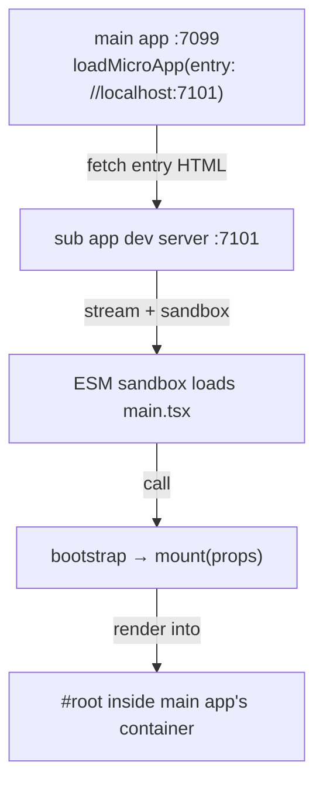

# Getting started

This tutorial takes you from an empty directory to two running dev servers — a main (host) app that loads a sub (micro) app in the browser — using the official `create-qiankun` scaffolder. By the end you will have a working micro-frontend and a clear picture of what qiankun wired up for you.

If you would rather assemble everything by hand to understand each moving part, follow the [hand-built tutorial](/tutorial/) instead.

## Prerequisites

- **Node.js `>=20.19`.** This is required by Vite, which every scaffolded app uses for its dev server and build.
- **A modern browser.** qiankun v3 relies on Proxy, streaming fetch, and dynamically injected import maps. Chromium-based browsers and Safari work out of the box.

::: warning Firefox and the ESM sandbox
Firefox does not yet support dynamically injected import maps, which the ESM sandbox depends on. Micro-apps loaded through the ESM path (Vite apps) do not run under Firefox today. Classic (UMD/window-library) micro-apps are unaffected. Use a Chromium browser or Safari while following this tutorial.
:::

## Scaffold with create-qiankun

`create-qiankun` generates a Vite project and patches it so it is qiankun-ready. You run it once per app — once for the main app, once for each sub app.

Run it with your package manager of choice:

::: code-group

```bash [npm]
npx create-qiankun@latest
```

```bash [yarn]
yarn create qiankun@latest
```

```bash [pnpm]
pnpm dlx create-qiankun@latest
```

:::

With no arguments the CLI is interactive and prompts for:

1. **App type** — `Main App (主应用)` or `Sub App (子应用)`. Defaults to sub app when nothing is chosen.
2. **App name** — becomes the `package.json` name and, for sub apps, the `window[appName]` global key. It must match `/^[a-z0-9-]+$/` — lowercase letters, digits, and hyphens only. Defaults are `qiankun-main-app` and `qiankun-sub-app`.
3. **Template** — asked for sub apps only: `React + TypeScript` (`react-ts`), `React` (`react`), `Vue + TypeScript` (`vue-ts`), or `Vue` (`vue`). Main apps are always React + TypeScript.

::: tip Where the app is written
If the parent of your current directory contains a `pnpm-workspace.yaml`, the app is generated into `<workspace-root>/packages/<app-name>`. Otherwise it lands in `<cwd>/<app-name>`. The printed `cd` next-step reflects the real path. If the target directory already exists, the CLI stops with an error.
:::

### Create the main app

The main app is the host that mounts micro-apps. It is always React + TypeScript and runs on **port 7099**.

You can drive the prompts non-interactively:

```bash
npx create-qiankun@latest main-app --type main
```

- `--type` / `-T` — `main` or `sub`.
- Passing a positional name skips the name prompt.
- `--template` is rejected together with `--type main` (main apps are always `react-ts`).

### Create the sub app

The sub app is the micro-app that gets loaded. Pick any supported framework; it runs on **port 7101**, which is the entry the generated main app already points at.

```bash
npx create-qiankun@latest sub-app --template react-ts
```

- `--template` / `-t` — `react-ts`, `react`, `vue-ts`, or `vue`. Passing it implies a sub app.

Run both commands from the same directory so the two projects sit side by side.

## Install and run

Each generated project is a standalone Vite app with its own dependencies. Install and start both dev servers — use two terminals, or start each in the background.

::: code-group

```bash [sub-app]
cd sub-app
pnpm install
pnpm dev   # serves on http://localhost:7101
```

```bash [main-app]
cd main-app
pnpm install
pnpm dev   # serves on http://localhost:7099
```

:::

Start the sub app first so its dev server is live when the main app tries to load it, then open **http://localhost:7099**. The main app renders its own shell and mounts the sub app inside a container element.

If you open the sub app on its own at **http://localhost:7101**, it renders standalone — the generated entry file self-renders when it is not powered by qiankun (more on that below).

## How the main app loads the sub app

The generated `main-app/src/App.tsx` mounts the sub app imperatively with `loadMicroApp` inside a `useEffect`, after the container element exists:

```tsx [main-app/src/App.tsx]
import { loadMicroApp, type MicroApp } from 'qiankun';
import { useEffect, useRef } from 'react';

export default function App() {
  const containerRef = useRef<HTMLDivElement>(null);
  const microAppRef = useRef<MicroApp>();

  useEffect(() => {
    microAppRef.current = loadMicroApp(
      { name: 'sub-app', entry: '//localhost:7101', container: containerRef.current! },
      { sandbox: true }, // sandbox on by default; set styleIsolation: true to add CSS @scope isolation
    );

    return () => {
      void microAppRef.current?.unmount();
    };
  }, []);

  return <div ref={containerRef} id="micro-app-container" />;
}
```

The three arguments that matter:

| Argument | What it is |
| --- | --- |
| `name` | The micro-app's identity. It must match the global the sub app exposes (`window['sub-app']`). |
| `entry` | A URL string pointing at the sub app's HTML entry — here the dev server root `//localhost:7101`. |
| `container` | The `HTMLElement` the app mounts into (not a selector string in v3). |

`loadMicroApp` returns a `MicroApp` handle. Always call `unmount()` on cleanup — the effect's teardown does this so remounts and multiple instances stay clean.

::: info loadMicroApp vs registerMicroApps
`loadMicroApp` mounts an app imperatively — you decide when. For route-driven mounting where qiankun activates apps based on the URL, use [`registerMicroApps`](/api/register-micro-apps) + [`start`](/api/start) instead. The generated `main-app/src/main.tsx` includes a commented-out example of the route-based approach. See [loadMicroApp](/api/load-micro-app) for the full API.
:::

## What the scaffolder wired for you

The value of `create-qiankun` is the sub-app plumbing. Two files make an ordinary Vite app loadable by qiankun.

### The Vite config

The sub app's `vite.config.ts` adds the qiankun bundler plugin alongside the framework plugin, and pins the dev port to 7101:

```ts [sub-app/vite.config.ts]
import { qiankun } from '@qiankunjs/bundler-plugin/vite';
import react from '@vitejs/plugin-react';
import { defineConfig } from 'vite';

export default defineConfig({
  plugins: [react(), qiankun()],
  server: { port: 7101 },
});
```

`qiankun()` takes no arguments. It sets permissive CORS headers on the dev and preview servers (the main app fetches the entry HTML and module graph cross-origin) and marks the entry `<script>` in the built HTML. There is no SystemJS or UMD build mode in v3 — qiankun loads the app's native ESM output directly through its [ESM sandbox](/concepts/esm-sandbox), so `dev`, `build`, and `preview` are all qiankun-ready as they are. See [@qiankunjs/bundler-plugin](/ecosystem/bundler-plugin) for details.

### The entry file

The sub app's `src/main.tsx` exports the qiankun lifecycle functions and only self-renders when running standalone:

```tsx [sub-app/src/main.tsx]
import React from 'react';
import ReactDOM from 'react-dom/client';
import App from './App';
import './index.css';

declare global {
  interface Window {
    __POWERED_BY_QIANKUN__?: boolean;
  }
}

let root: ReactDOM.Root | undefined;

function render(props: { container?: Element } = {}) {
  const container = props.container?.querySelector('#root') ?? document.getElementById('root');
  if (!container) return;
  root = ReactDOM.createRoot(container);
  root.render(
    <React.StrictMode>
      <App />
    </React.StrictMode>,
  );
}

export async function bootstrap() {}
export async function mount(props: { container?: Element }) {
  render(props);
}
export async function unmount() {
  root?.unmount();
  root = undefined;
}

if (window.__POWERED_BY_QIANKUN__) {
  window['sub-app'] = { bootstrap, mount, unmount };
} else {
  render();
}
```

The pieces that make this work under qiankun:

- **`bootstrap` / `mount` / `unmount`** are the [lifecycle hooks](/concepts/lifecycle-and-props) qiankun calls. `mount` receives props including the host `container`; the app resolves its mount node inside that container (`props.container?.querySelector('#root')`), falling back to the global document when standalone.
- **`window.__POWERED_BY_QIANKUN__`** is set by qiankun at runtime inside the sandbox. When present, the module publishes its lifecycles on `window['sub-app']` (the classic-mode fallback); otherwise it renders itself so the app still works on its own.
- **`unmount`** tears the app down completely so it can be remounted cleanly.

A Vue sub app follows the same shape: it mounts into `#app`, and `unmount` calls `app.unmount()`.



## Next steps

- **Build it yourself.** The [hand-built tutorial](/tutorial/) walks through creating a [micro-app](/tutorial/build-the-micro-app), a [main app](/tutorial/build-the-main-app), and [connecting them](/tutorial/run-and-verify) without the scaffolder.
- **Understand the runtime.** Read the [architecture overview](/concepts/architecture), then the [JS sandbox](/concepts/js-sandbox), [HTML-entry streaming](/concepts/html-entry-loading), and [style isolation](/concepts/style-isolation).
- **Look up an API.** The [API reference](/api/) documents [registerMicroApps](/api/register-micro-apps), [start](/api/start), [loadMicroApp](/api/load-micro-app), and [AppConfiguration](/api/configuration).
- **Prepare an existing app.** See the cookbook recipes for making a [Vite app](/cookbook/prepare-a-vite-app) or a [Webpack app](/cookbook/prepare-a-webpack-app) qiankun-ready.
