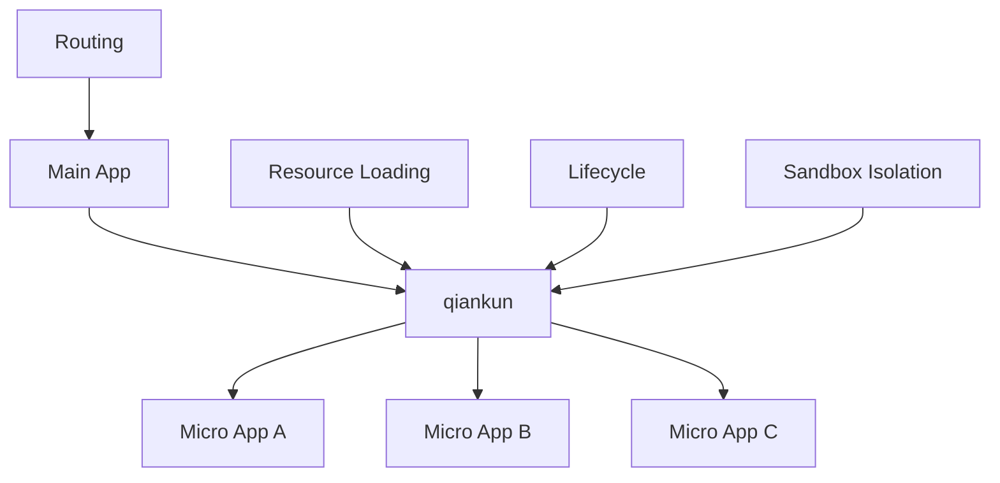

# What is qiankun?

qiankun is a micro-frontend implementation library based on [single-spa](https://github.com/single-spa/single-spa), designed to help you build a production-ready micro-frontend architecture system more simply and painlessly.

## 🎯 Core Philosophy

The core design philosophy of qiankun is **decentralized runtime**, which means:

- Main application and micro applications are independent applications
- Micro applications have complete autonomy
- Micro applications do not affect each other

## 🏗️ Architecture



qiankun is based on the following core capabilities:

### 🔄 Lifecycle Management
Each micro application has a complete lifecycle:
- **bootstrap** - Application initialization
- **mount** - Application mounting
- **unmount** - Application unmounting
- **update** - Application update (optional)

### 🛡️ Sandbox Isolation
- **JS Isolation** - Provides multiple sandbox solutions to ensure JS between applications do not affect each other
- **CSS Isolation** - Achieves style isolation through style scoping or Shadow DOM

### 📡 Resource Loading
- **HTML Entry** - Load micro applications through HTML as entry
- **Preloading** - Supports application resource preloading to improve user experience
- **Caching** - Intelligent resource caching strategy

## 💡 What is Micro-Frontend?

Micro-frontends are a way for multiple teams to build modern web applications together through independent release of features.

### Problems with Traditional Monolithic Applications

```bash
┌─────────────────────────────────────┐
│         Monolithic Frontend         │
│  ┌─────┐ ┌─────┐ ┌─────┐ ┌─────┐    │
│  │Mod A│ │Mod B│ │Mod C│ │Mod D│    │
│  └─────┘ └─────┘ └─────┘ └─────┘    │
│      Tightly coupled, hard to       │
│            maintain                 │
└─────────────────────────────────────┘
```

### Micro-Frontend Architecture

```bash
┌─────────────────────────────────────┐
│            Main Application         │
│  ┌─────┐ ┌─────┐ ┌─────┐ ┌─────┐    │
│  │App A│ │App B│ │App C│ │App D│    │
│  └─────┘ └─────┘ └─────┘ └─────┘    │
│   Independent development, deploy,   │
│        technology agnostic          │
└─────────────────────────────────────┘
```

## 🎯 Use Cases

qiankun is particularly suitable for the following scenarios:

- **Large Enterprise Applications** - Multi-team collaborative development
- **Technology Stack Migration** - Progressive upgrade of legacy systems
- **Feature Modularization** - Independent development and deployment of feature modules
- **Third-party Integration** - Integration of external applications or services

## 🚀 Get Started

Ready to start using qiankun? Check out our [Quick Start](/guide/quick-start) guide to build your first micro-frontend application in minutes!

## 📚 Learn More

- [Core Concepts](/guide/concepts) - Understand qiankun's design principles
- [Main Application](/guide/main-app) - How to configure the main application
- [Micro Application](/guide/micro-app) - How to transform existing applications 