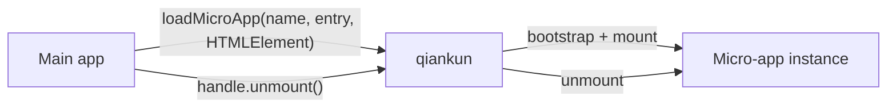

# What is qiankun

qiankun is a micro-frontend framework built on [single-spa](https://github.com/single-spa/single-spa). It lets independently developed and deployed front-end applications share one page while keeping control of their own technology and release cycles.

In practice, a main app gives qiankun a micro-app's HTML entry and an `HTMLElement`. qiankun loads the application, mounts it into that container, and gives the main app a handle for controlling its lifetime.

## What problem does it solve?

Micro-frontends are useful when the boundaries of a large product also need to become development and deployment boundaries. A team can own one micro-app, release it independently, and migrate its technology without requiring every other team to move at the same time.

A useful micro-frontend setup usually has these properties:

- **Independent delivery.** Each micro-app can be built and deployed on its own schedule.
- **Framework independence.** React, Vue, Angular, and plain JavaScript applications can coexist.
- **Runtime composition.** Applications are combined in the browser instead of one shared build.
- **Practical isolation.** JavaScript and, when enabled, styles are kept within useful boundaries.

This architecture adds operational and runtime complexity. If one team can comfortably maintain and release a single application, a router with code splitting is usually simpler.

## The two roles

- The **main app** owns the page shell and decides when a micro-app should be present.
- A **micro-app** is a normal front-end application that also exposes `bootstrap`, `mount`, and `unmount` lifecycle functions.

The recommended starting point is [`loadMicroApp`](/api/load-micro-app). It works for page regions, dialogs, tabs, and other cases where application code controls the lifetime directly:

```ts
const microApp = loadMicroApp({
  name: 'sub-app',
  entry: '//localhost:7101',
  container,
});

// When this part of the page is removed:
await microApp.unmount();
```

Here, `container` is an `HTMLElement`. The returned `MicroApp` handle is the main app's way to observe or end this particular instance.



If URL matching should completely determine activation, qiankun also provides the route-driven [`registerMicroApps`](/api/register-micro-apps) and [`start`](/api/start) APIs. They are an alternative orchestration model, not a prerequisite for `loadMicroApp`.

## Why not an iframe?

An iframe provides a separate document and strong isolation, but that boundary also makes integrated experiences harder: routing, overlays, shared page layout, and direct communication all need extra coordination.

qiankun mounts a micro-app into the main page instead. The applications share the page's document, while qiankun provides a [JavaScript sandbox](/concepts/js-sandbox) and optional [style isolation](/concepts/style-isolation). This favors applications that should behave like parts of one product. An iframe can still be the better choice when strict document or security boundaries matter most.

## When qiankun is a good fit

- Several teams own distinct areas of one product and need independent releases.
- A large application is being migrated incrementally.
- Applications built with different frameworks need to appear in one page.
- The main app needs to mount more than one instance or place an app outside route-level pages.

## qiankun 3

qiankun 3 keeps the HTML-entry and lifecycle model while adding a rewritten runtime with native ESM support. If you are upgrading from 2.x, read [Migrate from qiankun 2.x](/cookbook/migrate-from-2x) for the changed defaults and types.

The runtime requires a modern browser. ESM-sandbox applications currently need a browser that supports dynamically injected import maps; see [The ESM sandbox](/concepts/esm-sandbox) before choosing browser targets.

Ready to try it? Follow [Getting started](/guide/getting-started), or use the [manual tutorial](/tutorial/) to build both applications yourself.
