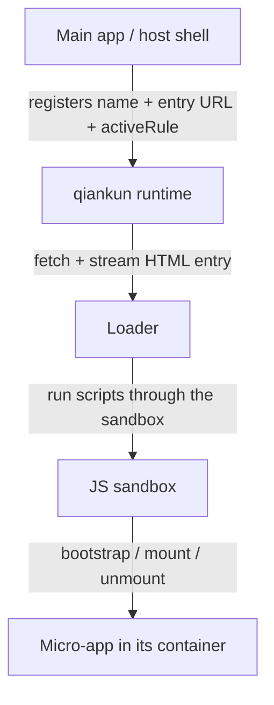

# What is qiankun

qiankun is a micro-frontend framework built on top of [single-spa](https://github.com/single-spa/single-spa). It lets several independently built and independently deployed front-end applications coexist on a single page, and be mounted and unmounted at runtime — without rebuilding them into one bundle and without giving up the isolation that keeps them from interfering with each other.

## The problem qiankun solves

A large product often grows past what one codebase, one framework version, or one team can comfortably own. Micro-frontends split that product into smaller applications that ship on their own schedule, while the browser still presents them as one coherent experience.

Doing this by hand is deceptively hard. Two apps loaded into the same page share one `window`, one `document`, and one set of global CSS. Their scripts overwrite each other's globals, their timers and event listeners leak after navigation, and their stylesheets bleed across boundaries. qiankun exists to make the "one page, many apps" model safe: it loads each micro-app from its own HTML entry, gives it an isolated view of the global environment, and cleans everything up when the app unmounts.

qiankun does not replace your build tool, your router, or your state library. It is the runtime layer that decides which micro-app is active, loads it, isolates it, and tears it down.

## Mental model

There are two roles in a qiankun system:

- The **main app** (also called the host or shell) owns the page shell — the top-level layout, navigation, and routing. It runs qiankun and decides which micro-app should be active for a given URL or interaction.
- Each **micro-app** is a normal front-end app that additionally exports three lifecycle functions — `bootstrap`, `mount`, and `unmount` — so qiankun can drive it.

The main app references each micro-app by the URL of its **HTML entry** and by a target **container** element on the page. qiankun fetches that HTML, runs the micro-app's scripts inside a sandbox, and calls `mount(props)` to render it into the container. When the micro-app is no longer active, qiankun calls `unmount(props)` and reverses the side effects the app introduced.



You wire the main app up with [`registerMicroApps`](/api/register-micro-apps) for route-driven apps, or [`loadMicroApp`](/api/load-micro-app) for manually controlled ones, and then call [`start`](/api/start). Both APIs take the micro-app's `name`, its `entry` URL string, and the `container` element. Route-driven apps also take an `activeRule` that tells qiankun when the app should be active. See [Getting started](/guide/getting-started) and the [tutorial](/tutorial/index) for the end-to-end flow.

## When to use qiankun

qiankun fits when independently owned front-ends need to share one page:

- **Incremental migration.** You want to rewrite a legacy app screen by screen — for example, moving a jQuery or AngularJS app to React — while both halves stay live in production.
- **Multiple teams, one product.** Separate teams own separate areas of a large application and need to build, test, and deploy on independent schedules without a shared monorepo release train.
- **Mixed frameworks or build tools.** Parts of the product are React, others are Vue, others are plain HTML. qiankun runs them side by side regardless of how each was built.
- **A stable shell around evolving apps.** A long-lived host provides the navigation and layout while the inner apps come and go.

qiankun is less useful when a single team ships a single app on a single stack. In that case a plain router and component-level code splitting are simpler and impose no isolation cost. Reach for micro-frontends when the boundaries between apps are organizational and deployment boundaries, not just UI boundaries.

## What is new in v3

qiankun 3.0 keeps the same public model — register or load micro-apps by HTML entry and let them export lifecycles — but rewrites the runtime underneath. The four pillars are covered in depth under Core Concepts:

- **Streaming HTML-entry loader.** The entry HTML is parsed and committed to the DOM incrementally as bytes arrive, rather than being buffered whole. The micro-app's `<head>` is virtualized into a `<qiankun-head>` element inside the container so its injected styles and scripts never leak into the real `document.head`. See [HTML-entry streaming loading](/concepts/html-entry-loading).
- **Proxy-membrane JS sandbox.** Each micro-app gets an isolated `window`/`document` view built with a `Proxy` membrane. Global writes, timers, event listeners, and history changes are tracked per app and reverted on unmount. See [the JS sandbox](/concepts/js-sandbox).
- **`@scope`-based style isolation.** Style isolation is built on the native CSS `@scope` rule. When enabled, a micro-app's styles are scoped to its container; external stylesheets are re-fetched and served as scoped blob-URL `<link>`s so the same wrapping applies. See [style isolation](/concepts/style-isolation).
- **Native ESM-sandbox execution.** qiankun can run a micro-app's native `<script type="module">` graph — including Vite apps in dev — through the same sandbox membrane, with no bundler step and no iframe. See [the ESM sandbox](/concepts/esm-sandbox).

For the whole picture of how these pieces fit together, read the [architecture overview](/concepts/architecture).

## Coming from qiankun 2.x

If you have used qiankun 2.x, the shape of the API is familiar but several defaults and types changed. The most important differences to know up front:

| Concern | qiankun 2.x | qiankun 3.0 |
| --- | --- | --- |
| `entry` | string URL or `{ scripts, styles }` object | string URL only |
| `container` | selector string or element | `HTMLElement` instance |
| Sandbox option | `sandbox: boolean \| { strictStyleIsolation, experimentalStyleIsolation }` | `sandbox: boolean` (default `true`) |
| Style isolation | Shadow DOM / experimental scoping, via the `sandbox` object | separate `styleIsolation: boolean` using CSS `@scope` |
| Global state | built-in store (`initGlobalState` / `onGlobalStateChange`) | no built-in store; pass your own methods via `props` |
| Prefetch | `prefetch` strategies on `start` | streaming loader auto-preloads; `prefetchApps` is deprecated |
| Framework config | passed to `start` | passed per app via `configuration` / `loadMicroApp` |

::: warning Breaking: entry and container types
`entry` is now strictly a string, and `container` is now strictly an `HTMLElement` — a CSS selector string such as `'#subapp'` is no longer accepted. Pass an element, for example `document.getElementById('subapp')`.
:::

::: info No built-in global state store
qiankun 3.0 does not ship `initGlobalState`, `setGlobalState`, or `onGlobalStateChange`. To communicate between apps, pass your own callbacks or a shared store through each app's `props`. See [Share state and communicate between apps](/cookbook/communicate-between-apps).
:::

For a step-by-step upgrade, see [Migrate from qiankun 2.x](/cookbook/migrate-from-2x).

## Requirements and compatibility

qiankun 3.0's runtime relies on modern browser primitives. Because it streams the HTML entry, drives isolation through a `Proxy` membrane, and executes scripts from blob URLs, it needs a browser that supports `Proxy`, `TransformStream`, and `URL.createObjectURL`. qiankun exposes [`isRuntimeCompatible`](/api/is-runtime-compatible) so you can probe the current browser before starting:

```ts
import { isRuntimeCompatible } from 'qiankun';

if (isRuntimeCompatible()) {
  // safe to registerMicroApps / start
}
```

::: info ESM sandbox and Firefox
The native ESM-sandbox path relies on dynamically injected import maps. Chromium 133+ and Safari 18.4+ support this natively; Firefox does not enable multiple dynamic import maps by default yet, so ESM micro-apps are not supported there without additional configuration. Classic (bundled/UMD) micro-apps are unaffected. See [the ESM sandbox](/concepts/esm-sandbox) for details.
:::

Ready to build something? Continue to [Getting started](/guide/getting-started), or work through the [tutorial](/tutorial/index) to build a main app and a micro-app from scratch.
