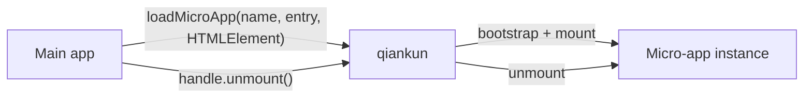

# What is qiankun

qiankun is a micro-frontend framework built on [single-spa](https://github.com/single-spa/single-spa). It lets independently developed and deployed front-end applications share one page while keeping control of their own technology and release cycles.

In practice, a main app gives qiankun a micro-app's HTML entry and an `HTMLElement`. qiankun loads the application, mounts it into that container, and gives the main app a handle for controlling its lifetime.

## What problem does it solve?

Micro-frontends share their theoretical foundation with microservices: Conway's law. A system's architecture mirrors the communication structure of the organization that builds it. Once enough teams work on one system that coordination becomes the dominant cost, splitting it into independently owned sub-systems — each with its dependencies contained inside — tends to work better than trying to communicate harder. Micro-frontends are fundamentally about the engineering problems of organization and collaboration, not about any single technical problem.

A useful micro-frontend setup usually has these properties:

- **Independent delivery.** Each micro-app can be built and deployed on its own schedule.
- **Framework independence.** React, Vue, Angular, and plain JavaScript applications can coexist.
- **Runtime composition.** Applications are combined in the browser instead of one shared build.
- **Practical isolation.** JavaScript is isolated between applications by default; with style isolation enabled, styles are contained within each application's boundary as well.

The flip side: this architecture adds operational and runtime complexity, and not every system is worth that cost. You probably do not need micro-frontends when:

- every component of the system is developed and maintained by one small team that has full say over all of it;
- reworking the existing system directly pays off more than running old and new systems side by side;
- the parts of the system are inherently coupled and inseparable — splitting would cost more than fixing.

In those cases, a router with code splitting is usually the simpler choice. For the full argument about when micro-frontends are and are not worth it, read [You May Not Need Micro-Frontends](https://zhuanlan.zhihu.com/p/391248835) (in Chinese) by qiankun's author.

## The two roles

- The **main app** owns the page shell and decides when a micro-app should be present.
- A **micro-app** is a normal front-end application that also exposes `bootstrap`, `mount`, and `unmount` lifecycle functions.

The recommended starting point is [`loadMicroApp`](/api/load-micro-app). It works for page regions, dialogs, tabs, and other cases where application code controls the lifetime directly:

```ts
const microApp = loadMicroApp({
  name: 'sub-app',
  entry: '//localhost:7101',
  container,
});

// When this part of the page is removed:
await microApp.unmount();
```

Here, `container` is an `HTMLElement`. The returned `MicroApp` handle is the main app's way to observe or end this particular instance.



If URL matching should completely determine activation, qiankun also provides the route-driven [`registerMicroApps`](/api/register-micro-apps) and [`start`](/api/start) APIs. They are an alternative orchestration model, not a prerequisite for `loadMicroApp`.

## Why not an iframe?

If user experience were not a concern, an iframe would be close to the perfect micro-frontend solution: it is the browser's native hard isolation, and style or JavaScript isolation simply stop being problems. Its biggest weakness is that this isolation cannot be crossed — application contexts cannot be shared, which surfaces as product-experience problems:

- **URLs do not stay in sync.** Refreshing loses the iframe's routing state, back/forward buttons stop working, and page state cannot be shared as a link.
- **UI does not compose; the DOM is not shared.** Picture a modal with a mask opening inside an iframe that occupies a quarter of the screen — while the product wants it centered against the whole browser window, and re-centered on resize.
- **Global context is fully isolated; memory is not shared.** Communication and data sync need extra bridges, and passing the main app's login state into a cross-origin sub-app is hard.
- **It is slow.** Every entry into a sub-app rebuilds a full browser context and reloads its resources.

Of these, URL sync is solvable and slowness can be tolerated, but the isolated context is hard to work around and the non-shared DOM is close to unsolvable — and those last two hurt product experience the most.

So qiankun mounts a micro-app into the main page instead. The applications share the page's document, while a [JavaScript sandbox](/concepts/js-sandbox) and optional [style isolation](/concepts/style-isolation) rebuild just enough isolation inside the shared environment. This favors applications that should behave like parts of one product. An iframe can still be the better choice when strict document or security boundaries matter most. For the full discussion, read [Why Not Iframe](https://www.yuque.com/kuitos/gky7yw/gesexv) (in Chinese) by qiankun's author.

## When qiankun is a good fit

- Several teams own distinct areas of one product and need independent releases.
- The old system cannot be retired while new requirements keep coming: new features have to be integrated into existing applications incrementally, not through a rewrite.
- Applications built with different frameworks need to appear in one page.
- The main app needs to mount more than one instance or place an app outside route-level pages.
- The parts of the system have clear service boundaries, and you want complexity contained per unit so differences in delivery pace and code decay do not spread across systems.

## qiankun 3

qiankun 3 keeps the HTML-entry and lifecycle model while adding a rewritten runtime with native ESM support. If you are upgrading from 2.x, read [Migrate from qiankun 2.x](/cookbook/migrate-from-2x) for the changed defaults and types.

The runtime requires a modern browser. ESM-sandbox applications currently need a browser that supports dynamically injected import maps; see [Browser support](/guide/browser-support) before choosing browser targets.

Ready to try it? Follow [Getting started](/guide/getting-started), or use the [manual tutorial](/tutorial/) to build both applications yourself.
