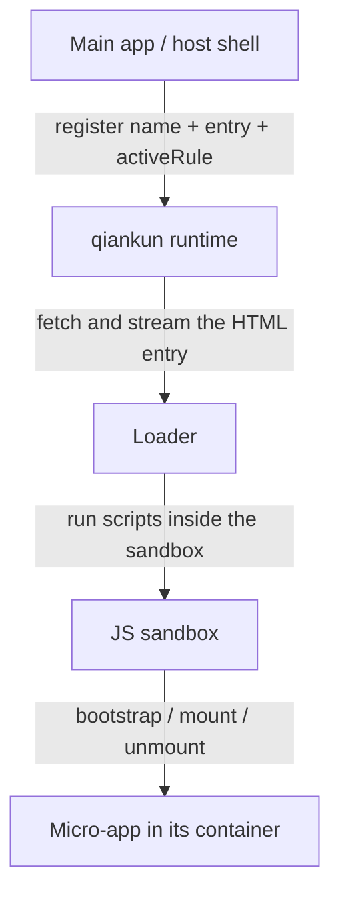

# What is qiankun

qiankun is a micro-frontend framework built on [single-spa](https://github.com/single-spa/single-spa). It lets several independently developed and independently deployed front-end applications coexist on one page, mounting and unmounting at runtime — without bundling them into one bundle, and without losing the isolation that keeps them apart.

In one sentence: qiankun assembles a handful of front-end applications into a single whole, inside the browser.

## What is a micro-frontend

Micro-frontends bring the microservices idea to the front end: a large front-end application is split into several small ones that can be developed and deployed independently, then composed into a complete product at runtime.

Most front-end projects start as one repo, one stack, one team, because that is the least hassle. The problems grow in later. The codebase keeps swelling until newcomers take forever to find their way around. More people means everyone crowds onto the same release train and queues to ship. The stack gets frozen on the day the project started — the framework you picked three years ago is now painful to replace. And sometimes you have to live with legacy: an AngularJS system you want to move to React screen by screen, without stopping to rewrite.

These are organizational and collaboration problems more than technical ones. The micro-frontend answer is to split the application by team and by domain into independent parts, so each part gets the final say over itself. In practice that comes down to a few points:

- **Independent development and deployment.** Each micro-app has its own repo, build, and release cadence. Changing one app does not require rebuilding or redeploying the others.
- **Framework agnostic.** The main app should not dictate which framework a micro-app uses. React, Vue, Angular, even plain HTML can coexist.
- **Runtime integration.** The apps are composed in the browser, not stitched into one bundle at build time — that is what makes independent deployment possible.
- **Mutual isolation.** One app's styles, globals, or runtime errors should not affect another.

Micro-frontends solve a problem of **scale**, and the price is extra complexity. If one team can comfortably maintain your app on a single stack, you probably do not need them. The split pays off only when the boundaries between apps line up with **team and deployment boundaries**.

## Why not iframes

When people think "isolate several apps on one page", the first idea is almost always an iframe. It comes with the most thorough isolation there is — a separate `window`, `document`, styles, and script environment, with no way for a sub-app to escape.

If iframes were enough, qiankun would have no reason to exist. The catch is that this thorough isolation is also its biggest problem: it isolates so hard that "many apps behaving like one product" stops working.

- **URL state is out of sync.** Routing inside an iframe never reaches the address bar: a refresh loses the sub-app's current location, the browser's back/forward buttons cannot see the iframe's history, and there is no way to share a link to a specific inner page.
- **UI cannot cross the boundary.** A dialog or overlay that should center on the whole page can only center inside the little iframe box; a sub-app's dropdowns and tooltips get clipped the moment they extend past the visible area.
- **Slow, and prone to blank screens.** Every iframe makes the browser rebuild a whole context and re-download, parse, and execute its resources; shared dependencies cannot be reused, so switching often blanks out first.
- **Over-isolated, so communication gets harder.** An iframe splits the `document` too. Cross-iframe communication has to go through `postMessage` — even passing an object means serializing it; sharing cookies or `localStorage` takes extra work; and a trivial interaction like closing an inner popup from the outside has to be wired up by hand.

qiankun's approach is to isolate where isolation is needed and stay connected everywhere else. A micro-app is **not** put in an iframe; it mounts directly into a container element on the main app's page and shares the same `document`. That makes all the problems caused by a split `document` — URL desync, UI that can't cross the boundary, hard communication — simply go away. Isolation is left to the runtime: the [JS sandbox](/concepts/js-sandbox) gives each micro-app its own `window` view through a `Proxy` membrane, and [style isolation](/concepts/style-isolation) scopes styles to each container using the native CSS `@scope` rule. You get the isolation you need without giving up any of the convenience of the apps actually being on one page.

## Two roles

There are only two roles in a qiankun system:

- The **main app** (also called the host or shell) owns the page shell — top-level layout, navigation, routing. qiankun runs inside it and decides which micro-app should be active for a given URL or interaction.
- A **micro-app** is a normal front-end app that additionally exports three lifecycle functions — `bootstrap`, `mount`, `unmount` — so qiankun can drive it.

The main app references a micro-app by two things: its **HTML entry URL** and a **container** element on the page. qiankun fetches that HTML, runs the micro-app's scripts inside a sandbox, and calls `mount(props)` to render it into the container. When the micro-app is no longer needed, qiankun calls `unmount(props)` and reverses the side effects it introduced.



There are two ways to wire it up: register route-driven apps with [`registerMicroApps`](/api/register-micro-apps), load manually controlled ones with [`loadMicroApp`](/api/load-micro-app), then call [`start`](/api/start). For the end-to-end flow, see [Getting started](/guide/getting-started) and the [hand-built tutorial](/tutorial/).

## When to use it

qiankun fits when several independently owned front-ends need to share one page:

- **Incremental migration.** Move a jQuery or AngularJS app to React screen by screen, while both halves stay live in production.
- **Multiple teams, one product.** Separate teams own separate areas of a large app and need to build, test, and deploy independently, without being tied to a shared release train.
- **Mixed frameworks or build tools.** Parts are React, parts are Vue, parts are plain HTML — qiankun runs them side by side.

If it is one team, one stack, one app, a plain router with code splitting is simpler and imposes no isolation cost.

## What's different in v3

qiankun 3.0 keeps the same public model — register or load micro-apps by HTML entry and let them export lifecycles — but rewrites the runtime underneath: a streaming HTML loader, a `Proxy`-membrane JS sandbox, style isolation built on the native CSS `@scope` rule, and native ESM execution. Each of these is covered in depth under [Core Concepts](/concepts/architecture).

If you are coming from 2.x, the shape of the API is familiar, but several defaults and types changed. For the exact differences and upgrade steps, see [Migrate from qiankun 2.x](/cookbook/migrate-from-2x).

## Runtime requirements

The 3.0 runtime relies on some newer browser primitives (`Proxy`, `TransformStream`, `URL.createObjectURL`, and so on), so it needs a reasonably modern browser. qiankun exposes [`isRuntimeCompatible`](/api/is-runtime-compatible) to probe the current browser before you start:

```ts
import { isRuntimeCompatible } from 'qiankun';

if (isRuntimeCompatible()) {
  // safe to registerMicroApps / start
}
```

::: info The ESM sandbox and Firefox
The native ESM-sandbox path relies on dynamically injected import maps. Chromium 133+ and Safari 18.4+ support them natively; Firefox does not enable multiple dynamic import maps by default yet, so micro-apps loaded through the ESM path (such as Vite apps) do not run there. Classic (UMD) micro-apps are unaffected. See [the ESM sandbox](/concepts/esm-sandbox) for details.
:::

Ready to build something? Head to [Getting started](/guide/getting-started), or work through the [tutorial](/tutorial/) to build a main app and a micro-app from scratch.
