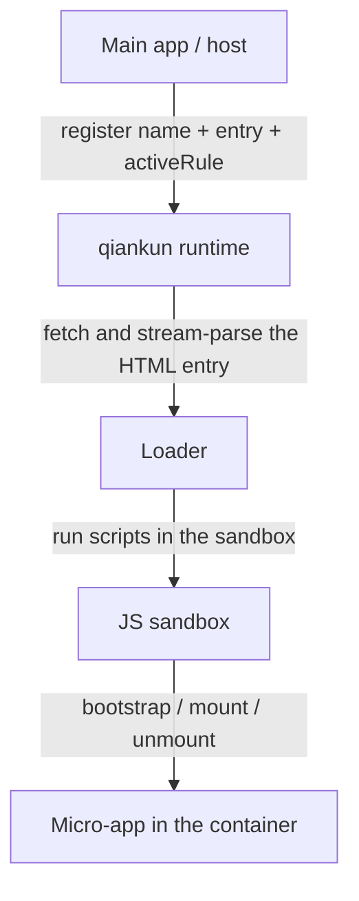

# What is qiankun

qiankun is a micro-frontend framework built on [single-spa](https://github.com/single-spa/single-spa). It lets several independently developed, independently deployed frontend applications live on the same page, mounting and unmounting them at runtime as needed — without bundling them into one bundle, and without losing the isolation between them.

In one sentence: qiankun assembles a handful of frontend applications into a single whole, inside the browser.

## What it solves

Once a product grows large enough, it tends to outgrow what a single codebase, a single framework version, or a single team can comfortably hold. The micro-frontend idea is to split the product into several smaller applications, each shipping at its own pace, while to the user they still look like one coherent page.

Once you actually try it, you find it isn't that simple. Load two applications into the same page and they share one `window`, one `document`, and one set of global CSS. Their scripts overwrite each other's globals; timers and event listeners linger after an app has been switched away; styles cross boundaries and pollute one another. The point of qiankun is to make "one page, many applications" hold up: each micro-app loads from its own HTML address, gets an isolated global environment, and has the side effects it left behind cleaned up on unmount.

qiankun doesn't replace your build tooling, router, or state library. It's the runtime layer — deciding which micro-app should be active right now, loading it in, isolating it, and tearing it down at the right moment.

## Two roles

A qiankun system has only two roles:

- **Main app** (also called the host): it owns the page shell — the top-level layout, navigation, and routing. qiankun runs inside the main app, which decides which micro-app should be active for a given URL or interaction.
- **Micro-app**: an ordinary frontend application that additionally exports three lifecycle functions — `bootstrap`, `mount`, and `unmount` — so qiankun can drive it.

The main app references a micro-app through two things: its **HTML entry address** and a **container** element on the page. qiankun fetches that HTML, runs the micro-app's scripts in a sandbox, and calls `mount(props)` to render it into the container. When the micro-app is no longer needed, qiankun calls `unmount(props)` and reverses, one by one, the side effects it introduced.



There are two ways to wire it up: route-driven apps register with [`registerMicroApps`](/api/register-micro-apps), manually controlled ones load with [`loadMicroApp`](/api/load-micro-app), and finally you call [`start`](/api/start). Both APIs take the micro-app's `name`, `entry` address, and `container` element; the route-driven one also takes an `activeRule` that tells qiankun when the app should be active. For the end-to-end flow, see [Getting Started](/guide/getting-started) and the [step-by-step tutorial](/tutorial/).

## When to use it

qiankun earns its keep when several frontends, each with its own owner, need to share one page:

- **Incrementally modernizing a legacy project.** You want to migrate an old jQuery or AngularJS app to React one screen at a time, with both the old and new halves running in production during the migration.
- **Multiple teams, one product.** Different teams own different areas of one large application and need to build, test, and release on their own, without being tied to a shared release train.
- **Mixed frameworks or build tools.** Some modules in the product are React, some Vue, some plain HTML. However they were originally built, qiankun can run them side by side.
- **A stable shell around evolving apps.** A long-lived host provides navigation and layout, while the apps inside it come and go.

Conversely, if it's one team, one tech stack, one application, qiankun probably isn't worth it. In that case plain routing plus component-level code splitting is simpler and carries no isolation overhead. The real value of micro-frontends shows up when the application boundaries are themselves **organizational and deployment boundaries**, not just UI boundaries.

## What's different in v3

qiankun 3.0 keeps the same outward model — register or load micro-apps by HTML entry, have them export lifecycles, just as before — but the runtime underneath is a rewrite: a streaming HTML loader, a JS sandbox based on a `Proxy` membrane, style isolation built on native CSS `@scope`, and native ESM execution. The background on each of these is covered in [Core Concepts](/concepts/architecture).

If you're coming from 2.x, the APIs still look familiar, but a number of defaults and types have changed. For the specific differences and upgrade steps, go straight to [Migrating from qiankun 2.x](/cookbook/migrate-from-2x) — we won't rehash them here.

## Runtime requirements

The 3.0 runtime relies on some newer browser capabilities (`Proxy`, `TransformStream`, `URL.createObjectURL`, and others), so it needs a reasonably recent browser. qiankun ships [`isRuntimeCompatible`](/api/is-runtime-compatible), which you can use to probe the current browser before starting:

```ts
import { isRuntimeCompatible } from 'qiankun';

if (isRuntimeCompatible()) {
  // safe to registerMicroApps / start
}
```

::: info ESM sandbox and Firefox
The native ESM sandbox path relies on dynamically injected import maps. Chromium 133+ and Safari 18.4+ support this natively; Firefox hasn't yet enabled multiple dynamic import maps by default, so micro-apps that go through the ESM path (Vite apps, for example) can't run there for now. Micro-apps integrated the classic bundled (UMD) way are unaffected. See [ESM sandbox](/concepts/esm-sandbox) for details.
:::

Ready to get your hands dirty? Head to [Getting Started](/guide/getting-started), or follow the [tutorial](/tutorial/) to build a main app plus a micro-app from scratch.
