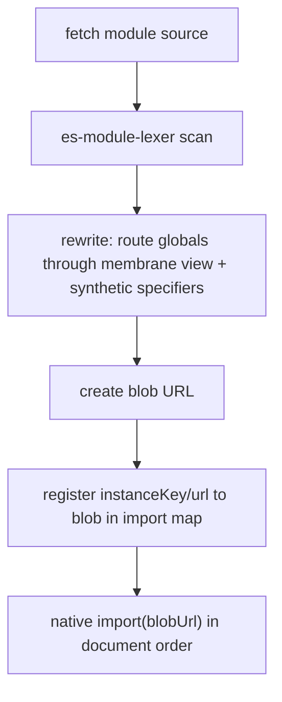

# ESM sandbox internals

> This page documents the ESM execution engine for maintainers. For user-facing behavior, see [Native ESM support](/concepts/esm-sandbox). For the design rationale, see the [ESM sandbox RFC](https://github.com/umijs/qiankun/blob/next/docs/rfcs/esm-sandbox.md).

Modern micro-apps ship native ES modules. A Vite dev server serves one `<script type="module">` per source file, wires them together with `import`/`export`, and relies on the browser's native module loader. qiankun's classic sandbox — which wraps source in `with (this) { … }` and reads the app's exports from the last global the script assigned — cannot run that code at all: `with` is a `SyntaxError` under ESM's forced strict mode, and lifecycle functions come from `export`, not from writes to `window`.

The ESM sandbox is qiankun v3's answer. `EsmSandboxEngine` runs a micro-app's native ES module graph through the same [JS sandbox](/concepts/js-sandbox) membrane — no bundler, no iframe, and no build-time plugin. The native ESM loader still owns instantiation and evaluation, so top-level `await`, circular dependencies, live bindings, and hoisting all behave exactly as they would without qiankun.

## Why a separate engine

The classic path and the ESM path solve fundamentally different problems:

| | Classic | ESM |
| --- | --- | --- |
| Source wrapping | `with (this) { … }` blob | top-of-module `const/let { … } = __qk_view` destructuring |
| Global coverage | explicit `window` access and bare names already present on the sandbox or host global | only names in the per-module destructuring set (base = `esmDestructurableGlobals`) |
| Implicit global write `foo = 1` | an existing global name resolves through the Proxy; a completely new undeclared name can escape to the real global | strict-mode `ReferenceError` — never reaches the set trap |
| Lifecycle discovery | `sandbox.latestSetProp` (a `window` write) | the entry module's `export`s / `export default { … }` |
| Remount | top level does not re-run; retained lifecycle functions are called again | top level does not re-run; `import(sameBlob)` returns the same namespace |
| Module identity | direct blob URL | synthetic specifier → import map → blob URL |

Rather than reinvent module resolution, the engine reuses three existing pieces: the streaming [HTML-entry loader](/concepts/html-entry-loading), the Proxy membrane, and the browser's own module loader. It only inserts itself between fetch and evaluation.

## What triggers it

The engine exists only when `sandbox` is enabled (its default). It is constructed per micro-app instance inside `loadApp`, alongside the membrane. With `sandbox: false` there is no ESM sandbox and no membrane at all.

Dispatch happens by DOM node type in the loader's streaming pipeline (`packages/shared/src/assets-transpilers/module.ts`):

- **`<script type="module">`** (with `src` or inline) is routed to the engine. The transpiler removes the `src` attribute and stashes it on `data-src`, stamping `data-esm="true"`, so the browser's native loader never fetches or executes the original URL — which would bypass the sandbox entirely.
- **`<script type="importmap">`** is parsed by qiankun itself. The element's `type` is rewritten to `qiankun-importmap` so the browser never merges the sub-app's map into the host document's import map.
- **Classic `<script>` / `text/javascript`** continues through the classic transpiler (the `with (this)` blob path). Mixing classic and ESM scripts in one HTML entry is supported.

## The technique

For each module the engine performs a runtime source rewrite driven by a WASM lexer, then hands the result to the native loader:



1. **Fetch** the module through the decorated `fetch` (cacheable → retryable → throwable).
2. **Scan** it with [`es-module-lexer`](https://github.com/guybedford/es-module-lexer), a WASM lexer warmed once at `start()` time via `prepareEsmLexer()`.
3. **Rewrite** the source so that:
   - references to sandboxed globals are destructured from the membrane view at the top of the module (`const { window, document, … } = __qk_view`);
   - each static import specifier is replaced with a synthetic specifier of the form `` `${instanceKey}/${resolvedUrl}` ``;
   - `import.meta` becomes a local object preserving the real `url`, and `import()` becomes a sandbox-aware `__qk_dynamic_import(...)`.
4. **Map** each synthetic specifier to a blob URL through a dynamically injected, document-level `<script type="importmap">`.
5. **Evaluate** with native `import(blobUrl)` in document order.

Because instantiation stays with the native loader, the engine never re-implements module semantics — it only redirects where each module's source and its globals come from.

### How globals are rewritten

The rewrite does not wrap the module in a proxy scope. Instead it scans the source for identifiers that appear in the base global set and destructures just those from the membrane view:

- Stable objects (`window`, `document`, and the rest of the base set) are bound with `const { … } = __qk_view`. Property access on them stays live because the object itself is the proxied view.
- Live-bindable dunder flags (`__X__`, e.g. `__VUE_OPTIONS_API__`) are bound with `let` and tracked, so that when the sandbox records a write to such a global later, already-evaluated modules see the fresh value.

The header is bootstrapped by importing a per-instance runtime module — `import { __qk_view, __qk_resolve, __qk_dynamic_import, __qk_track } from "<instanceKey>/__runtime__"` — rather than by reading `globalThis` or calling `eval`. Using import bindings avoids a temporal-dead-zone `ReferenceError` and keeps the sandbox compatible with CSP: the only added requirement is `script-src blob:`, never `'unsafe-eval'`.

## Execution order

Loading and evaluation are deliberately split around the HTML stream:

- **During streaming**, each module script calls `loadModuleScript(...)` synchronously in document order. This immediately kicks off the async transpile (fetch → lexer → rewrite → recursively pre-fetch dependencies in parallel) but defers evaluation. Every task is queued.
- **After the stream ends**, the loader calls `sealAndExecute()`. It returns `true` when module scripts existed — the signal that the loader should await the ESM entry namespace instead of the classic `latestSetProp`. It then awaits each queued record, flushes fresh import-map entries, and calls native `import(blobUrl)` for each module in order.

### Choosing the entry namespace

Once all modules have run, the engine selects which module namespace carries the lifecycle functions:

1. If a module carried an explicit `entry` attribute, that module's namespace is the entry, and its failure rejects the whole app.
2. Otherwise the first executed namespace that looks like a lifecycle object (or whose `.default` does) wins — matching a Vite entry that does `export default { bootstrap, mount, unmount }`.
3. Otherwise the **last** executed namespace is used, matching a single `<script type="module">` HTML.

A non-entry module that throws, including through rejected top-level `await`, is logged to `console.error` and skipped; it does not immediately fail the app because a Classic application may incidentally contain an unrelated module script. A failure in an explicitly marked entry rejects entry loading. Without an explicit entry, `loadApp` validates the selected successful namespace and fails later if no valid lifecycle object remains. That load failure enters single-spa's global handler for a route-registered application, while `loadMicroApp` exposes it through the instance lifecycle promises instead.

## Import maps

The engine works with two layers of import map, and they never mix:

- **The sub-app's own map** (`<script type="importmap">`) is parsed into an internal table (`bareSpecifier → absolute URL`) and used only to resolve the sub-app's bare specifiers. Only the `imports` field is honored — `scopes` is parsed, warned about, and ignored in v1.
- **The injected runtime map** maps `<instanceKey>/<absoluteUrl>` to the blob URL the browser actually imports.

Native import maps are document-level, append-only, and first-wins on conflict. Isolation between instances therefore rests entirely on the instance key:

```
instanceKey = `__qk_${appName}_${instanceId}_${++instanceSeq}__`
```

`instanceSeq` is a global monotonic counter that is **never reused**, so a retired key can never collide with a live entry. Only fresh entries are appended; a genuine collision on the same specifier with a different target logs a `console.error` (the browser silently keeps the first).

::: info Long-lived shells accumulate entries
Because import-map entries are irrevocable in a real document, a shell that repeatedly loads and unloads micro-apps accumulates dead entries — unbounded string growth over the page's lifetime. This is a documented v1 limitation.
:::

## Realm bridge and redeclaration probing

The rewritten blobs run in the real global scope, so a bare `__qk_*` reference in the wrong place would reach the real global and escape the membrane. Two defenses guard the bridge:

- **The realm accessor** that returns a module's membrane view is installed under a per-copy, crypto-random key on `globalThis`, and is further indexed by an unguessable per-instance token that is inlined only inside that instance's own runtime-module blob. The membrane also blacklists `__qk_*` names as defense in depth. User code that tries to import any `__qk_`-prefixed synthetic specifier is rejected with a `QiankunError`. (Indirect escapes such as `(0, eval)('globalThis')` remain possible, exactly as in the classic sandbox, and are explicitly out of scope.)
- **Redeclaration probing** handles the case where the injected `const { window, … }` header would collide with a module's own top-level `const window = …`, which is a parse-time `SyntaxError`. Because import-map entries are irrevocable once flushed, the engine must catch this *before* flushing. It imports a probe blob whose runtime specifier is swapped to a never-registered target: parsing surfaces the redeclaration error while resolution is guaranteed to fail afterward, so the module never actually evaluates. The offending identifier is extracted, added to an exclusion set, and the module is rewritten again.

## Vite dev specifics

The engine is designed to run a Vite dev server's native ESM output directly. See [Make a Vite app qiankun-ready](/cookbook/prepare-a-vite-app) for the sub-app setup.

- **`/@vite/client` is stubbed.** The stub keeps `updateStyle`/`removeStyle` (routed to the virtual head through the proxied `document`) but returns a no-op hot context and never opens the HMR WebSocket.
- **HMR is actively disabled, not passively degraded.** The real Vite client's HMR host is a serve-time literal, so its WebSocket *would* connect from inside the sandbox and trigger a destructive full-page `location.reload()`. Disabling it is deliberate — during development, edit and reload manually.
- **React Fast Refresh** requires its preamble to run before component modules; ordering matters for it to initialize correctly.

::: warning CSS-as-JS can be lost on remount
Vite serves CSS as JS modules that inject styles at the module top level. Because remount does not re-run top-level code (see below) while unmount clears the virtual head, such styles can disappear on the second mount. This is a known conflict tracked in the ESM-sandbox RFC.
:::

## Lifecycle and caching

The ESM sandbox retains its module graph across mount/unmount, which changes one important assumption compared with the classic sandbox:

- **Remount does not re-run top-level code.** `import(sameBlobUrl)` returns the *same* module namespace, so a module's top level executes exactly once — only `mount(props)` runs again. Any per-mount state (the app instance, a store, a router) must be created inside `mount()`, not at module scope. Classic applications should follow the same lifecycle discipline: qiankun also reuses their discovered lifecycle functions without re-running entry scripts on remount.
- **`dispose()` is tied to single-spa's `unload`, not `unmount`.** Full teardown — revoking every blob URL the engine created and unregistering the realm — happens only on `unload`. Because `loadMicroApp` parcels have no `unload` semantics, their engine lingers until the caller drops the reference, the same gap the classic sandbox has with no explicit destroy hook.

```js [micro-app/src/index.js]
let app;

export async function bootstrap() {
  // Runs once. Safe for one-time setup only.
}

export async function mount(props) {
  // Runs on every (re)mount — create per-instance state here.
  app = createApp(props.container);
  app.render();
}

export async function unmount(props) {
  app.unmount();
  app = null;
}
```

For the full lifecycle contract, see [Micro-app lifecycle and props](/concepts/lifecycle-and-props).

## Limitations

The ESM sandbox trades some classic-sandbox behaviors for native module semantics. Document these for your sub-app authors:

- **Implicit global writes throw.** `foo = 1` without `var`/`window.` is a `ReferenceError` in a strict ESM module — it never reaches the membrane's set trap. Code that relied on implicit globals being sandboxed breaks instead.
- **Only base-set globals are membraned.** Just the names in each module's destructuring set — a subset of `esmDestructurableGlobals` — route through the membrane. Value- or getter-typed globals that a one-off snapshot cannot represent (`innerWidth`, `devicePixelRatio`, `length`, `name`, `status`, `event`, …) fall back to the real global and cannot be cleaned up on unmount.
- **Typed imports are passthrough in v1.** `import x from '...' with { type: 'json' | 'css' }`, WASM, and similar are mapped straight to the original URL and loaded natively, without instance isolation, with a one-time `console.warn`. They require correct MIME types and CORS from the sub-app server. Relative specifiers in *typed dynamic* imports resolve against the blob URL — use absolute URLs.
- **Firefox needs a flag.** Multiple dynamically-injected import maps require `dom.multiple_import_maps.enabled`, off by default in Firefox. The current runtime does not provide a shimmed execution path, so applications that require default Firefox support must use the Classic delivery path.
- **Observability regresses without source maps.** Uncaught errors' `error.stack` points at `blob:<host-origin>/<uuid>`; `//# sourceURL` only changes the DevTools display name, not the stack URL or line numbers. Production error reporting cannot directly map ESM sub-app frames to real files, so source maps become a production necessity rather than a nicety.

## See also

- [The JS sandbox](/concepts/js-sandbox) — the Proxy membrane the ESM engine reuses
- [HTML-entry streaming loading](/concepts/html-entry-loading) — the pipeline that dispatches module scripts
- [Architecture overview](/concepts/architecture) — how the pieces fit together
- [Make a Vite app qiankun-ready](/cookbook/prepare-a-vite-app) — sub-app setup for native ESM
