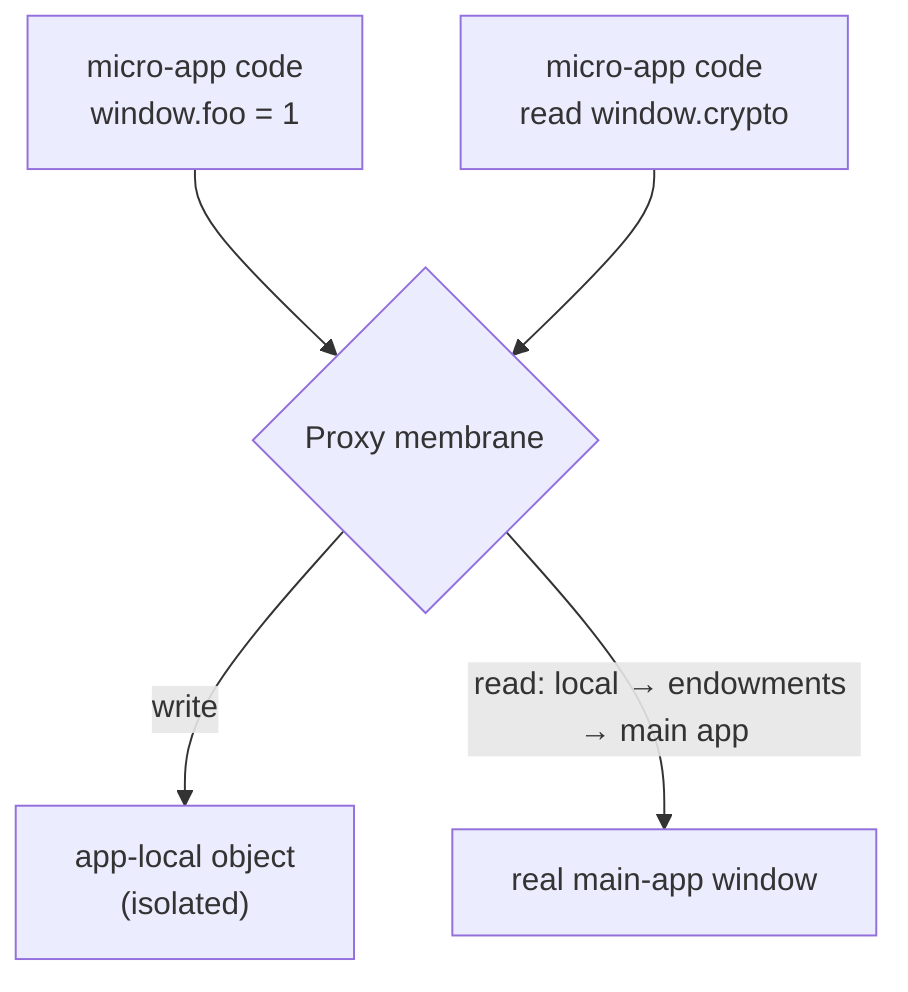

# JS sandbox internals

> This page documents the sandbox implementation for maintainers. For the user-facing guarantees, responsibilities, and limits, see [JavaScript isolation](/concepts/js-sandbox).

qiankun runs several micro-apps on one page at the same time. Without isolation, anything an app hangs on `window.axios`, a `setInterval` it forgot to clear, a stray `window.addEventListener('resize', …)` — all of it leaks into the main app and every other micro-app. Worse, it stays there after the app unmounts. The JS sandbox plugs that hole: it gives each micro-app its own virtual global scope, and reverts every side effect the app leaves behind once it's gone.

This page is about the model itself — what it isolates, where it deliberately doesn't, and the one switch you'll ever touch. It's background: you don't need to read it to wire up a micro-app, because the sandbox is on by default.

## The model, from the outside

Every micro-app gets its own virtual `window` (`globalThis` and `self` point at the same object). It behaves like the real thing, with one deliberate asymmetry that is the whole point of the design:

- **Explicit global writes are local.** When an app runs `window.foo = 1`, the value lands on that app's own local object. The real `window` never sees it, and neither does another micro-app.
- **Classic top-level declarations stay in the wrapper.** A top-level `var foo` is scoped to the Compartment's wrapper function; it does not become a property of either the proxied or real `window`.
- **Reads fall through.** When an app reads a global it never set — `window.localStorage`, `window.crypto`, `document` — the lookup checks its local object first, then the handful of built-in values (endowments) qiankun injects, then falls through to the real main-app `window`. So the app still sees the real browser environment.

The result: each app has a namespace that looks complete but can't pollute anything outside it.



The asymmetry runs in only one direction. An app can't pollute the main app by writing, but it can still **read** anything on the real main-app `window` that it hasn't shadowed. The sandbox governs side effects, not security.

## Two parts working together

The sandbox has two pieces, both under `packages/sandbox`.

### The membrane

The membrane (`core/membrane`) is a `Proxy` wrapping the main-app `window` — internally called the *incubator context*. Its proxy traps implement the read/write asymmetry above, and that proxied object is the `window` your app sees. This is exactly the view qiankun hands your micro-app: the `global` argument your lifecycle hooks receive is the membrane, and the runtime markers qiankun injects (`__POWERED_BY_QIANKUN__`, `__INJECTED_PUBLIC_PATH_BY_QIANKUN__`) are set on it, which is why your app reads them off its own `window`.

### The compartment

The membrane controls explicit `window.x` access, but a Classic UMD script also contains bare global references such as `React` and top-level declarations such as `var foo`. A Proxy alone cannot control lexical name resolution, so the Compartment (`core/compartment`) wraps the source before it runs, roughly like this:

```js
;(function () {
  with (this) {
    const { Array, /* …destructured intrinsics… */ } = this;
    /* original script source */
  }
}).bind(window.__compartment_globalThis__<N>__)();
```

`with (this)` routes a bare reference through the proxied `window` when that name already exists on the sandbox target or host global; top-level declarations remain local to the wrapper function. A completely new undeclared assignment such as `foo = 1` does not match the membrane's `has` trap and can escape to the real global in a sloppy-mode Classic script. Applications must avoid implicit globals and use declarations or explicit `window.foo` writes instead. qiankun runs the wrapped source through a **blob URL**, and the `<N>` suffix gives each instance a separate Compartment slot.

Only classic scripts take this path. `<script type="module">` is handled by the [ESM sandbox](/concepts/esm-sandbox), a separate engine that reads the **same** membrane view (via `sandbox.getEsmGlobalsView()`) but rewrites modules with a lexer instead of wrapping them in `with`. Both paths share the one global namespace for a given app.

## What gets isolated

### Global identity

Redirecting `window.x` isn't enough on its own — an app can also reach the real global through `self`, `globalThis`, `top`, and `parent`. The sandbox redefines these so they all resolve to the sandbox realm rather than the main app:

| Identity | Behavior in the sandbox |
| --- | --- |
| `window`, `self` | Return the realm global (the membrane). |
| `globalThis` | Returns the realm global. |
| `top`, `parent` | Return the realm global — **unless** the main-app page is itself embedded in an iframe (see [Boundaries and escape hatches](#boundaries-and-escape-hatches)). |
| `document` | Starts as the real `document`; a patcher redirects DOM operations into the app's container. |
| `hasOwnProperty`, `eval` | Given sandbox-safe definitions. |

### Side effects, and their `free()`

Beyond identity, the sandbox tracks stateful side effects through **isolation plugins** (`packages/sandbox/src/patchers`). The ones below are the built-in preset; your own plugins run after them, and [Extend the sandbox with plugins](/cookbook/sandbox-plugins) documents the protocol. Each plugin overrides a set of APIs on the sandbox global and returns a `free()` closure. On unmount, every `free()` runs, undoing the side effect it caused and restoring the native function; it also returns a `rebuild` that reapplies the override on the next mount.

| Patcher | Intercepts | Applied at |
| --- | --- | --- |
| `patchInterval` | `setInterval` / `clearInterval` — `free()` clears any still-live timers | mount |
| `patchWindowListener` | `window.addEventListener` / `removeEventListener` — clears leftover listeners | mount |
| `patchHistoryListener` | history-driven listeners | mount |
| `patchStandardSandbox` (dynamicAppend) | `appendChild` / `insertBefore` for `<script>` / `<style>` / `<link>` — redirects them into the app's container instead of the real `document.head` | bootstrap **and** mount |

Because every side effect is reverted through its `free()`, unmounting an app really does return the page to its pre-mount state — which is exactly why you **must** unmount. Skip it and you leak the timers, listeners, and injected DOM that `free()` was supposed to clean up, breaking remount and multi-instance.

## What's let through on purpose

A few globals are deliberately **not** isolated — the membrane writes them straight through to the real main-app `window`. It's a whitelist (`core/membrane`):

```ts
const globalVariableWhiteList = ['System', '__cjsWrapper', /* + dev-only */];
```

- `System` and `__cjsWrapper` are always let through. They exist to work around the SystemJS indirect-`eval` escape, and must be visible on the real window for module loading to resolve correctly.
- In development only — when `NODE_ENV` is `test` / `development`, or `window.__QIANKUN_DEVELOPMENT__` is set — the whitelist also lets through `__REACT_ERROR_OVERLAY_GLOBAL_HOOK__`, `event`, `$RefreshReg$`, and `$RefreshSig$`. These are React/Vite HMR and error-overlay hooks; letting them reach the main app is what makes fast refresh work in dev.

::: warning Don't use the whitelist as a cross-app state channel
These names really are written to the real `window` and shared across apps. Treat the table as an implementation detail of module loading and dev tooling, not as a legitimate channel for passing values between apps. To share data between apps, use props (see [Sharing state and communicating between apps](/cookbook/communicate-between-apps)).
:::

## Native bindings and direct pass-through

Some browser APIs must keep their original `this`. Calling `fetch` through the Proxy detaches it from `window` and throws `Illegal invocation`. The sandbox handles this by rebinding such native functions to the real window before the app ever touches them (its `useNativeWindowForBindingsProps` set), so `window.fetch(...)` inside the sandbox works as usual.

Separately, `requestAnimationFrame` and `cancelAnimationFrame` pass straight through to the main app through the `whitelistBOMAPIs` set. The sandbox does not track or cancel pending callbacks, so a micro-app that owns an animation loop must call `cancelAnimationFrame` during `unmount`.

## Multiple instances

At the sandbox layer, micro-apps share nothing. Every trip through `loadApp` creates a **brand-new `StandardSandbox`** — its own membrane, its own local object — so loading the same app twice, or two different apps, runs each in a fully independent global namespace.

Each load takes an `instanceId` from a per-app counter (`genInstanceId(appName)`): the first instance is `1`, the second is `2`, and so on. Two details make repeated instances work:

- The compartment's `<N>` counter guarantees each instance gets its own `__compartment_globalThis__<N>__` slot, so their wrapped classic scripts don't overwrite one another.
- When `instanceId > 1`, qiankun clears that app's webpack chunk cache (`removeWebpackChunkCacheWhenAppHaveMultiInstance`), so the second instance re-executes the bundle in its own sandbox instead of reusing the modules the first instance already cached.

::: danger Unmount every instance
Multiple instances rely entirely on each patcher's `free()` to release listeners, timers, and injected DOM. Miss one instance and its side effects stay live, breaking the next mount. If you're holding a `loadMicroApp` handle, call `unmount()` on it.
:::

For the hands-on recipe, see [Running multiple micro-app instances](/cookbook/run-multiple-instances).

## Lifecycle: active and inactive

The sandbox follows single-spa's mount / unmount:

- On **mount**, `sandbox.active()` **unlocks** the membrane. The rebuilds from the bootstrap phase are replayed, the mount-time patchers are installed, and dynamic stylesheets are reattached.
- On **unmount**, each patcher's `free()` runs first (collecting the rebuilds for next time), then `sandbox.inactive()` **locks** the membrane. While locked, global writes from the app are ignored (with a warning in dev).

::: info No snapshot diffing
Some sandbox approaches snapshot every property on `window` at mount and diff it back at unmount. qiankun v3 does **not** do this. Isolation comes from never touching the real `window` in the first place, so there's nothing to diff back. A `SnapshotSandbox` type does exist in the enum, but it has no implementation — `createSandbox` always constructs a `StandardSandbox`, in both the `Proxy`-present and `Proxy`-absent branches. In practice the v3 sandbox **requires** `Proxy`; there's no fallback path.
:::

## Boundaries and escape hatches

The sandbox is honest about where it ends. Get these straight before you rely on it for isolation:

- **Reading untouched main-app globals is allowed.** An app can read anything on the real `window` it hasn't shadowed. Isolation is one-way (it blocks writes in, not reads out).
- **`top` / `parent` escape when the main app is nested.** If the qiankun main-app page is itself embedded in an iframe, `top` and `parent` return the *real* top / parent window, not the sandbox realm — this is intentional, so apps inside a nested main app can still reach the outer frame.
- **Indirect `eval` caveat.** There's a known limitation: indirect `eval` inside the membrane lets SystemJS reach outside the sandbox scope. This is why `System` is whitelisted rather than isolated.
- **`onGlobalSet` is one-way.** The engine only observes writes routed through the membrane. If the main app writes directly to the real `window` after an app's modules have already evaluated, the app's already-captured global bindings won't refresh.

## The one public switch

There's a single external option, on [`AppConfiguration`](/api/configuration):

| Option | Type | Default | Description |
| --- | --- | --- | --- |
| `sandbox` | `boolean` | `true` | Enables the JS sandbox. Set it to `false` to run the app directly in the main app's real global scope. |

```ts
import { registerMicroApps } from 'qiankun';

registerMicroApps([
  {
    name: 'app1',
    entry: 'https://app1.example.com',
    container: document.getElementById('subapp')!,
    activeRule: '/app1',
    configuration: {
      sandbox: true, // default — usually you can omit it
    },
  },
]);
```

::: warning `sandbox: false` also turns off ESM isolation
The ESM sandbox engine is only constructed when `sandbox` is on. Turn the sandbox off and both ESM-sandbox execution and the classic-script export mechanism stop working too; the app then shares the real global with the main app, with no isolation at all. Unless you have a specific reason, leave it on.
:::

::: info What changed from qiankun 2.x
In v3, `sandbox` is a `boolean | SandboxConfiguration`. The 2.x object form — `sandbox: { strictStyleIsolation }` / `sandbox: { experimentalStyleIsolation }`, and Shadow DOM–based style isolation — is **gone**. CSS isolation is the boolean [`sandbox.styleIsolation`](/concepts/style-isolation), implemented with the CSS `@scope` at-rule. See [Migrating from qiankun 2.x](/cookbook/migrate-from-2x).
:::

## Related reading

- [ESM sandbox](/concepts/esm-sandbox) — how `<script type="module">` is isolated through the same membrane.
- [Style isolation](/concepts/style-isolation) — the CSS-side counterpart to JS isolation, built on `@scope`.
- [Architecture overview](/concepts/architecture) — where the sandbox sits in the loading pipeline.
- [Micro-app lifecycle and props](/concepts/lifecycle-and-props) — mount / unmount, and why unmounting matters.
- [AppConfiguration](/api/configuration) — the full per-app option reference.
