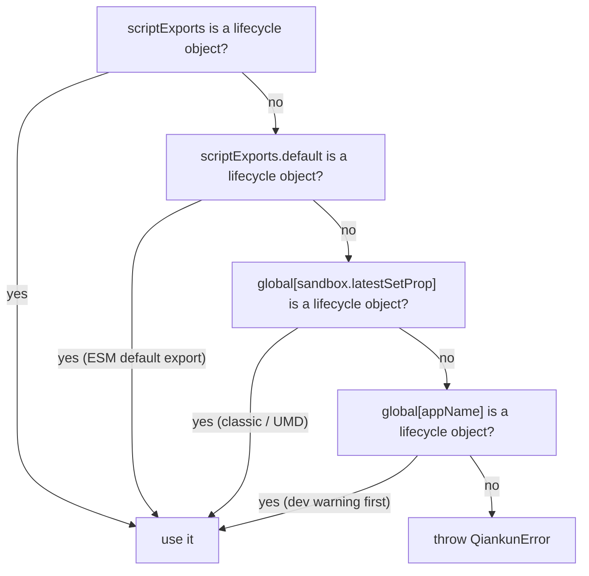
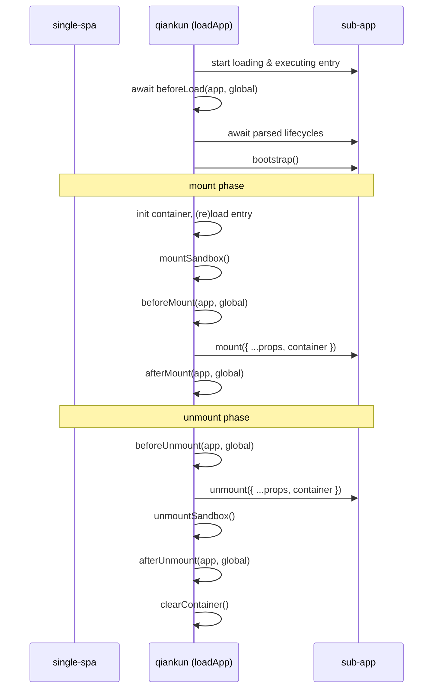

# Lifecycle resolution internals

> This page documents lifecycle discovery and orchestration for maintainers. For the user-facing contract, see [Micro-app lifecycle and props](/concepts/lifecycle-and-props).

A qiankun micro-app is not loaded by importing a module and calling a known function. Instead the main app hands qiankun an HTML entry, qiankun executes it inside a sandbox, and then it has to _discover_ the lifecycle functions the sub-app exported and drive them at the right moments. This page explains that contract: what a sub-app must export, how qiankun finds it, how qiankun's own hooks differ from the sub-app's lifecycles, and how props and runtime flags reach the sub-app.

If you only want to know _how_ to export lifecycles from your app, the [tutorial](/tutorial/build-the-micro-app) and the [Vite](/cookbook/prepare-a-vite-app) / [Webpack](/cookbook/prepare-a-webpack-app) guides are more direct. This page is the underlying model.

## The micro-app export contract

Every qiankun micro-app must expose an object with three functions — `bootstrap`, `mount`, `unmount` — plus an optional `update`:

```ts
export async function bootstrap() {
  // one-time setup, runs once before the first mount
}

export async function mount(props) {
  // render your app into props.container
}

export async function unmount(props) {
  // tear your app's view down
}

// optional
export async function update(props) {
  // only invoked for loadMicroApp parcels, when props change
}
```

Internally qiankun validates the shape with `isLifecycleObject`, which requires `bootstrap`, `mount`, and `unmount` to all be functions. `update` is optional and is only attached to the running parcel when it is actually a function.

Each lifecycle is a `(props) => Promise<void>`. The full type is `MicroAppLifeCycles` in `packages/qiankun/src/types.ts`:

```ts
type MicroAppLifeCycles = FlattenArrayValue<ParcelLifeCycles<{ container: HTMLElement }>>;
// => { bootstrap; mount; unmount; update? }
```

qiankun accepts this object in two shapes depending on how the entry script runs:

- **Classic / UMD** — the entry `<script entry src=...>` assigns a global whose value is `{ bootstrap, mount, unmount, update? }`. qiankun reads it back from the sandbox.
- **ESM** (`<script type="module">`) — the entry module either `export`s named `bootstrap` / `mount` / `unmount`, or does `export default { bootstrap, mount, unmount }`.

The two execution paths are covered in depth in [the JS sandbox](/concepts/js-sandbox) and [the ESM sandbox](/concepts/esm-sandbox). What matters here is that both ultimately produce a lifecycle object that qiankun can find.

## How qiankun discovers the lifecycles

After the entry finishes executing, qiankun does not assume a fixed export location. `getLifecyclesFromExports` (`packages/qiankun/src/core/loadApp.ts`) resolves the lifecycle object using an ordered fallback — the first match wins:



Step by step:

1. **`scriptExports` itself** — if the value the entry resolved to already satisfies `isLifecycleObject`, use it directly. This is the ESM named-export case (`export function mount…`).
2. **`scriptExports.default`** — the ESM `export default { bootstrap, mount, unmount }` case.
3. **`global[sandbox.latestSetProp]`** — the classic path. `latestSetProp` is the last global key the entry script wrote through the sandbox membrane, so a UMD bundle that does `window.myApp = { bootstrap, mount, unmount }` is discovered here. See [the JS sandbox](/concepts/js-sandbox) for what `latestSetProp` is.
4. **`global[appName]`** — a last-resort fallback that looks up a global named after the app. qiankun logs a development warning before trying this, because relying on it usually means your bundler's `output.library` is misconfigured.
5. **Otherwise** — qiankun throws a `QiankunError` telling you it could not find lifecycle functions on either `latestSetProp` or `window[appName]`.

::: tip Configure your bundler's library output
The classic path depends on your bundle exposing its lifecycles as a UMD global. [`@qiankunjs/bundler-plugin`](/ecosystem/bundler-plugin) marks the entry script and fixes `output.library` for you. If you hit the step-5 error, that is almost always the missing piece. ESM apps do not need this — their exports are read from the module namespace directly.
:::

## Framework lifecycle hooks vs. micro-app lifecycles

There are two distinct sets of "lifecycles", and it is easy to conflate them.

**The sub-app's own lifecycles** are the `bootstrap` / `mount` / `unmount` / `update` functions above. The sub-app author writes them; qiankun discovers and calls them.

**The framework lifecycle hooks** are the optional `LifeCycles` object the _main app_ passes to [`registerMicroApps`](/api/register-micro-apps) or [`loadMicroApp`](/api/load-micro-app). They let the shell observe every app's transitions:

```ts
type LifeCycleFn<T> = (app: LoadableApp<T>, global: WindowProxy) => Promise<void>;

type LifeCycles<T> = {
  beforeLoad?: LifeCycleFn<T> | Array<LifeCycleFn<T>>;
  beforeMount?: LifeCycleFn<T> | Array<LifeCycleFn<T>>;
  afterMount?: LifeCycleFn<T> | Array<LifeCycleFn<T>>;
  beforeUnmount?: LifeCycleFn<T> | Array<LifeCycleFn<T>>;
  afterUnmount?: LifeCycleFn<T> | Array<LifeCycleFn<T>>;
};
```

| | Sub-app lifecycles | Framework hooks (`LifeCycles`) |
| --- | --- | --- |
| Who writes them | The micro-app author | The main app |
| Names | `bootstrap` / `mount` / `unmount` / `update?` | `beforeLoad` / `beforeMount` / `afterMount` / `beforeUnmount` / `afterUnmount` |
| Signature | `(props) => Promise<void>` | `(app, global) => Promise<void>` |
| Second argument | — | `global` — the **sandboxed `WindowProxy`**, not the sub-app's exports |
| Where declared | Exported from the entry | Passed to `registerMicroApps` / `loadMicroApp` |

The critical detail: a framework hook's second argument is the sandboxed `WindowProxy` for that app — the same proxied `window` the sub-app sees — not the sub-app's exported lifecycle object. Full reference in [Lifecycle hooks](/api/lifecycles).

Each hook may be a single function or an array; qiankun runs them sequentially with `execHooksChain`, and the built-in addons' hooks are concatenated _before_ your hooks (see [runtime flags](#runtime-flags-on-the-proxied-window) below).

## When each hook runs

`beforeLoad` and the rest do not all run at the same phase. `loadApp` starts loading the entry, then runs and awaits `beforeLoad` before it awaits the parsed entry lifecycles; entry loading can therefore overlap the hook. The other four run inside the parcel's single-spa mount and unmount arrays, around the sub-app's own `mount` / `unmount`:



The mount array, in order: initialize the container and (on remount) reload the entry HTML → activate the sandbox → `beforeMount` hooks → the sub-app's `mount({ ...props, container })` → `afterMount` hooks. The unmount array mirrors it: `beforeUnmount` → the sub-app's `unmount({ ...props, container })` → deactivate the sandbox → `afterUnmount` → empty the container.

One consequence worth calling out: on a **remount**, qiankun reloads the entry HTML but with all `<script>` nodes stripped out (via `getPureHTMLStringWithoutScripts`). The scripts already executed on the first mount; re-running them would double-execute the app. So the DOM is rebuilt but the JS is not re-fetched or re-run — the sub-app's `mount()` is called again against the freshly rebuilt container.

## How props and state reach the sub-app

qiankun does not ship a built-in cross-app state store. State flows in through single-spa's `customProps` plus one qiankun-injected field.

::: warning No initGlobalState in v3
The qiankun 2.x global-state API — `initGlobalState`, `onGlobalStateChange`, `setGlobalState`, `MicroAppStateActions` — **does not exist in v3**. For inter-app communication, pass callbacks and shared objects through `props`, or use your own store / event bus. See [Share state and communicate between apps](/cookbook/communicate-between-apps).
:::

You declare the props when registering or loading an app:

::: code-group

```ts [registerMicroApps]
import { registerMicroApps } from 'qiankun';

registerMicroApps([
  {
    name: 'app1',
    entry: '//localhost:7100',
    container: document.getElementById('subapp-container')!,
    activeRule: '/app1',
    props: {
      user: currentUser,
      onEvent: (payload) => { /* ... */ },
    },
  },
]);
```

```ts [loadMicroApp]
import { loadMicroApp } from 'qiankun';

const micro = loadMicroApp({
  name: 'app1',
  entry: '//localhost:7100',
  container: document.getElementById('subapp-container')!,
  props: { user: currentUser },
});
```

:::

Those `props` become single-spa `customProps`, injected into every lifecycle call. On top of that, qiankun always injects `container: HTMLElement` — the DOM node the sub-app should render into — into the props passed to `mount` and `unmount`. So each lifecycle receives your `customProps` merged with single-spa's standard props (`name`, `singleSpa`, `mountParcel`, …) and qiankun's `container`:

```ts
export async function mount(props) {
  const { container, user } = props;
  // render into the qiankun-provided node, never a hard-coded global selector
  root = createRoot(container.querySelector('#root'));
  root.render(<App user={user} />);
}
```

::: danger Render into props.container, not document
Because the sub-app runs inside a virtualized DOM view, it must mount into `props.container`, not a hard-coded `document.getElementById(...)` on the real page. Hard-coding a global selector breaks isolation and multi-instance rendering. See [Run multiple micro-app instances](/cookbook/run-multiple-instances).
:::

For `loadMicroApp`, the returned [`MicroApp`](/api/types) handle also exposes `update(props)`, which invokes the sub-app's `update` lifecycle if it exported one — the one lifecycle route for pushing new props into an already-mounted app.

## Runtime flags on the proxied window

Before mounting, qiankun's two built-in addons set a pair of flags on the sub-app's **proxied** `window`. Because the sub-app reads `window` through the sandbox membrane, these appear as ordinary globals to it:

| Flag | Set by | Value | Purpose |
| --- | --- | --- | --- |
| `__POWERED_BY_QIANKUN__` | `engineFlag` addon | `true` | Lets the sub-app detect it is running under qiankun |
| `__INJECTED_PUBLIC_PATH_BY_QIANKUN__` | `runtimePublicPath` addon | origin + directory of `entry` | The runtime public path for the sub-app's dynamic assets |

The `engineFlag` addon sets `__POWERED_BY_QIANKUN__ = true` in `beforeLoad` / `beforeMount` and `delete`s it in `beforeUnmount`. The `runtimePublicPath` addon sets `__INJECTED_PUBLIC_PATH_BY_QIANKUN__` in `beforeLoad` (and again in `beforeMount` on remount), restoring it on unmount.

A sub-app typically branches on the first flag at startup:

```ts
if (window.__POWERED_BY_QIANKUN__) {
  // qiankun will call bootstrap/mount/unmount; don't self-render here
} else {
  // standalone: render immediately
  render();
}
```

For Webpack apps, wiring `__INJECTED_PUBLIC_PATH_BY_QIANKUN__` into `__webpack_public_path__` is what lets lazy-loaded chunks resolve against the right origin. The [Webpack guide](/cookbook/prepare-a-webpack-app) shows the exact snippet.

## Remount vs. unload semantics

qiankun distinguishes single-spa's `unmount` (hide the app, keep it warm) from `unload` (full teardown). The difference matters because the classic and ESM paths behave differently on remount.

**Remount (mount after unmount).** The app's DOM is cleared on unmount and rebuilt on the next mount, and the sandbox is deactivated then reactivated. The reloaded HTML has its script nodes removed, so the lifecycle object discovered during the first load is reused on both execution paths: neither classic entry code nor ESM top-level module code runs again. Only `mount(props)` runs again.

::: warning Create disposable state inside mount()
Because top-level code does not run again, a sub-app that instantiates its framework app or view state at the top level will not re-create it on remount. Create the app instance _inside_ `mount()` and dispose it in `unmount()`.
:::

For a cached remount (same app, same container), qiankun also replaces `bootstrap` with a no-op so one-time setup never runs twice.

**Unload (full teardown).** Only on single-spa's `unload` lifecycle does qiankun dispose the ESM realm: `EsmSandboxEngine.dispose()` revokes every blob URL the engine created and unregisters the instance's realm. After unload, the next activation re-runs `loadApp` from scratch with a fresh engine. `dispose()` is wired to `unload`, **not** `unmount` — so an unmounted-but-not-unloaded ESM app keeps its realm and namespaces resident.

::: info loadMicroApp exposes no unload
The public handle returned by `loadMicroApp` does not expose single-spa's `unload` lifecycle. Always call `unmount()` on handles you no longer need, but do not treat it as full ESM-engine disposal. See [Run multiple micro-app instances](/cookbook/run-multiple-instances).
:::

## See also

- [registerMicroApps](/api/register-micro-apps) and [loadMicroApp](/api/load-micro-app) — the two entry points and their `props`.
- [Lifecycle hooks (LifeCycles)](/api/lifecycles) — full reference for the framework-level hooks.
- [AppConfiguration](/api/configuration) — `sandbox`, `styleIsolation`, and the rest of the per-app options.
- [The JS sandbox](/concepts/js-sandbox) and [The ESM sandbox](/concepts/esm-sandbox) — the execution paths behind classic vs. ESM discovery.
- [Migrate from qiankun 2.x](/cookbook/migrate-from-2x) — what changed, including the removed global-state API.
