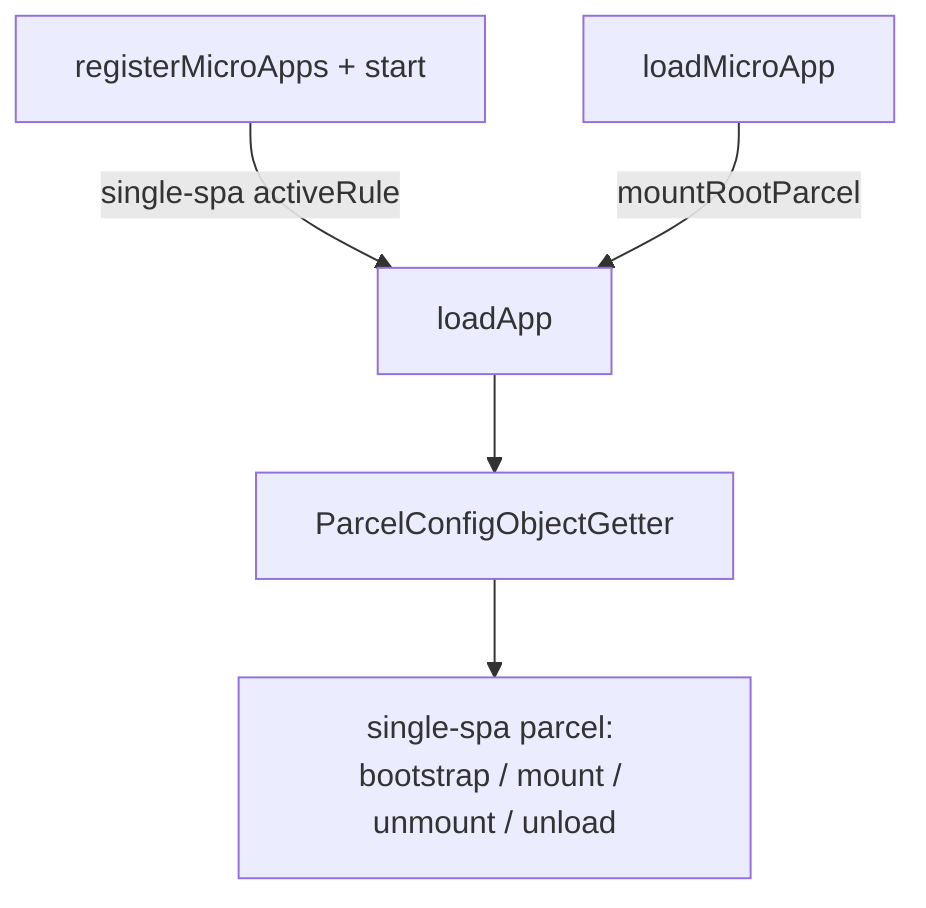
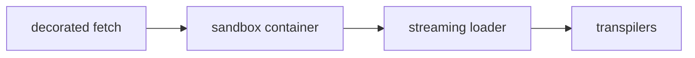
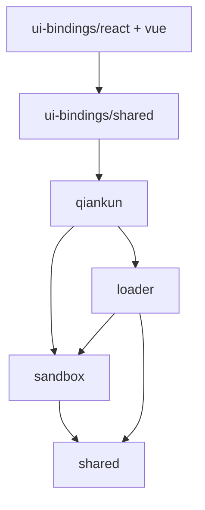

# Runtime orchestration internals

> This page documents runtime implementation details for maintainers. For the user-facing model, see [Loading a micro-app instance](/concepts/architecture).

This page explains how qiankun v3 loads and runs a micro-app end to end: the orchestration, the per-app pipeline, the two script execution paths, and how the internal packages fit together. It is background reading — you do not need any of it to use qiankun, but it makes the behaviour of the public API predictable when you debug a load, a mount, or a sandbox side effect.

## The big picture

Everything that turns an HTML entry into a running, sandboxed micro-app happens inside one orchestrator: `loadApp` (`packages/qiankun/src/core/loadApp.ts`). It runs the loading work once and returns a factory that produces a [single-spa](https://single-spa.js.org/) parcel configuration bound to single-spa's mount/unmount pipeline.

There are two ways into that orchestrator, and they differ only in what decides when an app becomes active:

- **Route-driven** — [`registerMicroApps`](/api/register-micro-apps) registers each app with single-spa under an `activeRule`, and [`start`](/api/start) begins routing. single-spa activates and deactivates apps as the URL changes; you never call mount yourself.
- **Imperative** — [`loadMicroApp`](/api/load-micro-app) mounts one app immediately into a container you supply and hands back a `MicroApp` handle (a single-spa parcel) with `mount` and `unmount` you drive by hand.



Both paths converge on `loadApp`, so the per-app pipeline below is identical regardless of how you started the app.

## The per-app pipeline

For each micro-app, `loadApp` wires four stages in order. Each stage is owned by a different internal package.



### 1. Decorated fetch

The `fetch` you pass in [`AppConfiguration`](/api/configuration) (default `window.fetch`) is wrapped in three decorators from `@qiankunjs/shared`:

```ts
const enhancedFetch = makeFetchCacheable(makeFetchRetryable(makeFetchThrowable(fetch)));
```

Read from the inside out: `makeFetchThrowable` throws when the response status is outside `200–399`, `makeFetchRetryable` provides a limited retry budget shared by that wrapped fetch instance when the inner fetch throws, and `makeFetchCacheable` (outermost) dedupes and caches. The retry layer does not classify errors as transient, so both network errors and invalid HTTP responses can consume the budget; it does not guarantee a retry for every failed request. This `enhancedFetch` is used for the entry HTML, resources that qiankun actively fetches for transformation—such as sandboxed Classic scripts, ESM modules, and isolated styles—and the script-stripped HTML reload on remount. Browser-native requests such as images and non-isolated stylesheets do not pass through it.

### 2. Sandbox container

When `sandbox` is `true` or an object (the default is `true`), `createSandbox` (`packages/sandbox`) builds a Proxy-membrane view of `window` and `document`. `loadApp` then runs the app against `sandboxInstance.globalThis` (the proxied window) instead of the real global, so the app reads and writes its own isolated globals. See [the JS sandbox](/concepts/js-sandbox) for how the membrane works and how patchers clean up side effects on unmount.

The container also constructs the ESM engine (covered below) — the engine only exists inside the `if (sandbox)` branch, so turning the sandbox off also disables native ESM execution.

### 3. Streaming loader

`loadEntry(entry, container, opts)` (`packages/loader`) fetches the entry HTML and pipes it — as a real `ReadableStream`, not a buffered string — through decode, an optional `streamTransformer`, head virtualization (`<head>` → `<qiankun-head>` so the sandbox can treat it as a virtual head), and finally `writable-dom`, which commits nodes to live DOM incrementally as bytes arrive. See [HTML-entry streaming loading](/concepts/html-entry-loading).

### 4. Transpilers

Before any script, link, or style node reaches live DOM, the loader runs it through a `nodeTransformer`. The default calls `transpileAssets` (`packages/shared/src/assets-transpilers`), which rewrites each node: classic scripts are wrapped and pointed at a sandbox-scoped blob URL, module scripts are marked and routed to the ESM engine, and — when [style isolation](/concepts/style-isolation) is enabled — styles and links are rewritten for CSS `@scope`.

## Two execution paths

Which path a script takes is decided per node by its type, and a single HTML entry may mix both.

| | Classic | ESM |
| --- | --- | --- |
| Trigger | `<script entry>` (UMD/global) | `<script type="module">` |
| Execution | source wrapped and run via a blob URL scoped to the membrane | `EsmSandboxEngine` fetches, lexer-rewrites, and evaluates modules |
| App export | `sandbox.latestSetProp` — the last global the entry script assigned | the entry module's `export`s (or `export default { … }`) |

**Classic** scripts are the UMD/global model from qiankun 2.x. The entry script's source is wrapped and executed through a blob URL scoped to the sandbox membrane; qiankun reads the app's lifecycle object from `sandbox.latestSetProp`, the last global the script set.

**ESM** scripts (`<script type="module">`) are handled by `EsmSandboxEngine` (`packages/shared/src/esm-sandbox`). Modules are fetched through the enhanced fetch, rewritten with a WASM lexer so their global reads and writes route through the membrane, given synthetic specifiers via a dynamically injected `<script type="importmap">`, and evaluated in document order. The native ESM loader still owns instantiation and evaluation, so top-level `await`, circular dependencies, and live bindings are preserved. This path is what makes an unbundled Vite dev server work under the sandbox. See [the ESM sandbox](/concepts/esm-sandbox).

::: info Firefox and dynamically injected import maps
The ESM path relies on dynamically injected import maps, which Firefox does not enable by default. Chrome/Edge 133+ and Safari 18.4+ support them natively. The ESM-sandbox e2e tests are annotated as expected failures on Firefox rather than skipped.
:::

## Internal package dependency graph

qiankun v3 is a pnpm monorepo. The public entry point is the `qiankun` package; the others are internal layers it composes. The dependency graph is strictly one-directional:



- `qiankun` — the facade: public APIs plus `loadApp` orchestration.
- `loader` — the streaming HTML-entry loader.
- `sandbox` — the Proxy-membrane JS isolation.
- `shared` — transpilers, fetch decorators, module resolver, and the ESM-sandbox engine.
- `ui-bindings` — the `<MicroApp>` components for [React](/ecosystem/react) and [Vue](/ecosystem/vue), built on `qiankun`.

::: warning These are internal packages
Only the `qiankun` package (and the `@qiankunjs/react` / `@qiankunjs/vue` bindings) are public API. `loader`, `sandbox`, and `shared` are implementation detail — their exports can change between releases. Depend on the documented [API reference](/api/), not on internal packages.
:::

## The end-to-end load lifecycle

Putting the stages together, here is what `loadApp` does for a single micro-app from configuration to teardown.

1. **Resolve config defaults.** `fetch = window.fetch` (then decorated), `sandbox = true`, `nodeTransformer = defaultNodeTransformer`. When `sandbox` is an object, its own defaults apply too: `incubatorContext = window` and `styleIsolation` off. See [AppConfiguration](/api/configuration) for the full field list.
2. **Initialize the container.** The container is emptied and stamped with `data-name`, `data-version`, and `data-sandbox-cfg`. `data-mount-times` appears after the same loaded app is mounted again (its value is the mount count), while `data-instance-id` is added to the second and later `loadApp` instances with the same app name. The `instanceId` comes from a per-name counter and distinguishes [multiple instances](/cookbook/run-multiple-instances) of the same app.
3. **Create the sandbox and ESM engine.** When `sandbox` is on, the Proxy membrane is built and the `EsmSandboxEngine` is constructed with the app name, instance id, entry URL, and the enhanced fetch.
4. **Stream the entry.** `loadEntry` runs the HTML through the streaming pipeline and transpilers; classic and module scripts are dispatched to their respective paths. Module scripts are collected during streaming and executed in document order once the stream seals.
5. **Discover lifecycles.** `getLifecyclesFromExports` resolves `{ bootstrap, mount, unmount, update }` with a fallback chain: the exports object itself, then its `default`, then `global[latestSetProp]` (classic), then `window[appName]`. If none is a valid lifecycle object it throws. `update` is optional. See [Micro-app lifecycle and props](/concepts/lifecycle-and-props).
6. **Assemble addons and user hooks.** Two built-in addons set `__POWERED_BY_QIANKUN__` and `__INJECTED_PUBLIC_PATH_BY_QIANKUN__` on the proxied global; your [lifecycle hooks](/api/lifecycles) (`beforeLoad`, `beforeMount`, `afterMount`, `beforeUnmount`, `afterUnmount`) are concatenated after them. `beforeLoad` runs in the `loadApp` body; the rest run inside the parcel's mount/unmount arrays.
7. **Return the parcel.** The factory produces a single-spa `ParcelConfigObject`. On **mount**, in order: (re)init the container → mount the sandbox → `beforeMount` → the app's `mount({ ...props, container })` → `afterMount`. On **unmount**: `beforeUnmount` → the app's `unmount(...)` → unmount the sandbox → `afterUnmount` → clear the container. On **unload** (full teardown only): the ESM engine's `dispose()` revokes its blob URLs and releases its realm.

::: info Mount, unmount, and unload are different
`unmount` deactivates an app but keeps its sandbox and ESM module namespaces alive so a remount is cheap — for ESM apps, a remount re-runs only `mount(props)`, not top-level module code. `unload` (single-spa's full teardown) is what actually disposes the ESM engine and its blob URLs. This is why modern-framework apps should create their app instance inside `mount()`, not at module top level.
:::

## start() side effects

Beyond beginning single-spa routing, [`start`](/api/start) has one qiankun-specific side effect: it warms the ESM engine's WASM lexer via `prepareEsmLexer()`, so the first ESM micro-app does not pay the lexer initialization cost on its critical path. `start` is idempotent and accepts only single-spa's `{ urlRerouteOnly }`.

[`loadMicroApp`](/api/load-micro-app) auto-calls `start()` if you have not called it yet. This is deliberate: it ensures the main app's `pushState`/`replaceState` correctly dispatch `popstate` so routing stays consistent even in a purely imperative setup.

## Where to go next

- [HTML-entry streaming loading](/concepts/html-entry-loading) — the streaming pipeline, head virtualization, and script classification.
- [The JS sandbox](/concepts/js-sandbox) — the Proxy membrane, patchers, and the free/rebuild side-effect protocol.
- [The ESM sandbox](/concepts/esm-sandbox) — how native `<script type="module">` runs through the membrane without a bundler.
- [Style isolation](/concepts/style-isolation) — CSS `@scope` and blob-link stylesheet rewriting.
- [Micro-app lifecycle and props](/concepts/lifecycle-and-props) — the lifecycle contract a micro-app must export and the props it receives.
- [API reference overview](/api/) — the complete public API surface.
