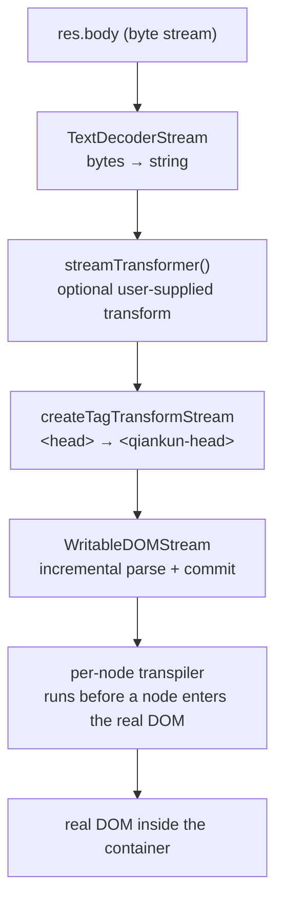

# Streaming HTML-entry internals

> This page documents the streaming loader for maintainers. For the user-facing contract, see [HTML entry](/concepts/html-entry-loading).

qiankun doesn't ask you to maintain a manifest of scripts and styles for each micro-app. You hand it a single address — the micro-app's `index.html` — and it takes it from there: fetch the HTML, parse it as a stream, transpile each resource node inside, and commit them into the container incrementally. This page explains how that pipeline runs, what the entry HTML has to satisfy, and which known rough edges the mechanism has.

## What HTML entry means

An `entry` in qiankun is just a plain string — the URL of the micro-app's HTML document.

```ts
import { loadMicroApp } from 'qiankun';

const container = document.getElementById('subapp-container');
if (!container) throw new Error('subapp-container not found');

const microApp = loadMicroApp(
  {
    name: 'app-react',
    entry: 'http://localhost:7101', // the micro-app's index.html
    container,
  },
);
```

That one URL is the entire integration. qiankun treats the HTML document as the single source of truth: whatever `<script>`, `<link>` and `<style>` the document declares is what the micro-app runs. You don't keep a separate list of JS/CSS bundles in sync with your build output. A fresh page session, or another load after the runtime cache misses, reads the new hashed filenames from the latest `index.html`; a same-page remount may reuse the cached entry and lifecycles and is not a deployment-refresh mechanism.

That's the HTML-entry model: qiankun consumes the same HTML the browser would have consumed, except it routes the resources inside into the sandbox and transpilers rather than dropping them straight into the real document. The whole flow is driven by `loadEntry(entry, container, opts)` in `packages/loader/src/index.ts`.

## Why streaming

Servers have always been able to stream HTML back — on a weak connection you can watch a page paint in chunks, because the browser starts rendering before the full document arrives. But that payoff only lands on the first screen, and it depends on the server. The second screen — say a route change that loads a new page — never sees it.

Before qiankun 3.0, loading a micro-app was a serial path: download the whole HTML first, then use a regex to pick `<script>` and `<link>` out of a big block of text, then process them one at a time. Even when the web server behind it supported streaming responses, this approach couldn't use them.

v3 swaps the loading core for **client-side streaming rendering**: consume the HTML response stream while writing processed nodes into an already-loaded document. So both the first screen and the second screen get the streaming benefit. Two concrete things come out of it.

**Faster.** Stylesheets and scripts are extracted as the stream arrives and inserted into the document tree the moment they're processed. As soon as an external script shows up in one frame of the stream, it can be captured and executed right away, instead of waiting for the entire HTML to come back and then regex-matching a big block of text — the same route the browser takes natively for the first screen. Parsing also moves from regex to native DOM traversal (`writable-dom`), which is faster again.

::: tip A benchmark
Rendering a 500K HTML document, the old approach averaged about 500ms; streaming brings it down to about 300ms — roughly 40% faster.
:::

**Fewer bugs.** The old approach ran scripts by hand with `eval`. But once a script doesn't execute along the browser's native path, the events bound to its `<script>` element don't fire properly, and the sandbox has to fill the gap itself — dispatch `onload` by hand on success, `onerror` by hand on failure. The small differences between hand-rolled simulation and native browser handling threw off a hard-to-track bug now and then. v3 inserts script nodes straight into the DOM and lets the browser execute them (classic scripts wrapped as blob URLs, module scripts via the [ESM sandbox](/concepts/esm-sandbox)), so this class of bug is gone at the source.

For how this pipeline is put together and what each stage does, read on.

## The streaming pipeline

qiankun doesn't download the whole HTML document, parse it into a string, and insert it all at once. It builds a real `ReadableStream` chain: as bytes arrive off the network, the HTML is parsed and committed into the real DOM at the same time.

Given `res = await fetch(entry)` (where `fetch` is a wrapped `window.fetch`, see [below](#the-decorated-fetch)), the response body flows through these stages in turn:



In code the chain looks like this (`packages/loader/src/index.ts`):

```ts
res.body
  .pipeThrough(new TextDecoderStream())        // bytes → string
  .pipeThrough(streamTransformer())            // optional, only if you supply one
  .pipeThrough(createTagTransformStream(...))  // <head> → <qiankun-head>
  .pipeTo(new WritableDOMStream(container, null, (clone) => { /* per-node hook */ }));
```

Each stage owns one job:

| Stage | Responsibility |
| --- | --- |
| `TextDecoderStream` | Decode the raw bytes into a stream of UTF-8 strings. |
| `streamTransformer` | Optional. A user-supplied `() => TransformStream<string, string>` (the `streamTransformer` option on [AppConfiguration](/api/configuration)) that rewrites the raw HTML text before it's parsed — for example, replacing hard-coded URLs. |
| `createTagTransformStream` | String-level tag rewriting. Used for [head virtualization](#head-virtualization). |
| `WritableDOMStream` | A fork of `writable-dom` (`packages/loader/src/writable-dom/`). Parses incoming HTML incrementally, blocks on synchronous scripts and stylesheets to preserve order, and preloads other resources while blocked. |

Because the write side writes into the container as chunks arrive, the micro-app's DOM starts taking shape before the full document has downloaded — the same progressive behavior the browser gives a top-level navigation.

### The per-node transpiler

The third argument to `WritableDOMStream` is a callback invoked once for **every node right before it moves from the detached parse document into the real DOM**. That timing is the point: a node is rewritten while still inert, so a `<script>` never executes and a `<link>` never fires a request against the real document before qiankun has had a chance to act.

Inside this callback, qiankun calls `nodeTransformer(clone, transformerOpts)`. The default node transpiler (`defaultNodeTransformer`) hands the work to `transpileAssets`, which dispatches by tag name:

- `SCRIPT` → `transpileScript` — classic scripts are wrapped and pointed at a blob URL scoped inside the sandbox; module scripts are tagged `data-esm="true"` and handed to the [ESM sandbox](/concepts/esm-sandbox) engine.
- `LINK` → `transpileLink` — external stylesheets and preloads, rewritten when [style isolation](/concepts/style-isolation) is on.
- `STYLE` → `transpileStyle` — transpiled only when `sandbox.styleIsolation` is on, otherwise passed through as-is.

If you want to intercept nodes yourself, you can pass a custom `nodeTransformer` through [AppConfiguration](/api/configuration), though the default already covers script, link and style.

## Head virtualization

A micro-app's `index.html` has a `<head>`. If qiankun inserted that `<head>` as-is and the micro-app then called `document.head.appendChild(...)` at runtime (frameworks do this constantly — injecting styles, preloading chunks), those nodes would land in the **real** `document.head` and leak between apps.

To avoid that, qiankun rewrites the head tags at the **string level**, before any DOM is built. `createTagTransformStream` is configured with exactly two replacement rules (`packages/loader/src/index.ts`):

```ts
{ tag: '<head>',  alt: '<qiankun-head>' }
{ tag: '</head>', alt: '</qiankun-head>' }
```

So the micro-app's `<head>...</head>` becomes a custom `<qiankun-head>...</qiankun-head>` element that lands **inside the app container**. The tag name is literally `qiankun-head` (`packages/sandbox/src/consts.ts`).

The sandbox's dynamic-append patch then treats `<qiankun-head>` as the app's virtual head: when the sub-app appends to `document.head`, the patch redirects the node into `container.querySelector('qiankun-head')` (`packages/sandbox/src/patchers/dynamicAppend/common.ts`) rather than the real `document.head`. That confines runtime head appends to the app container, and they're cleaned up along with the app on unmount.

The replacement mechanism buffers stream chunks and runs one `String.prototype.replace` against the first occurrence. If a chunk boundary happens to cut a `<head>` tag in half, the transform holds the buffer until the next chunk completes it; once the replacement hits, it flushes and clears the buffer.

## The entry-script convention

With so many scripts in an HTML file, qiankun needs to know which one is the micro-app's entry — the script that exports the [lifecycle functions](/concepts/lifecycle-and-props) (`bootstrap`, `mount`, `unmount`). That script is identified by an `entry` attribute.

```html
<script src="/app.js" entry></script>
```

qiankun enforces a few rules during streaming parse (`packages/loader/src/index.ts`):

- **Exactly one entry script.** If a second external script also carries the `entry` attribute, `loadEntry` throws:

  > `QiankunError: You should not include more than 1 entry scripts in a single HTML entry`

- **Only external scripts can be the entry.** For a script to count as "external" it must carry a `src` or `data-src` attribute. An inline script (no `src`/`data-src`) can never be the entry.

Three classification helpers govern this:

| Helper | Condition |
| --- | --- |
| `isExternalScript` | `tagName === 'SCRIPT'` and has `src` or `data-src` |
| `isEntryScript` | is an external script and has the `entry` attribute |
| `isDeferScript` | is an external script and has the `defer` attribute |

In practice you almost never add the `entry` attribute by hand. [@qiankunjs/bundler-plugin](/ecosystem/bundler-plugin) marks the correct entry script for you at build time, for both Webpack and Vite.

::: tip Where the attribute comes from
In a Webpack UMD build the entry attribute lands on the runtime/main bundle; in a Vite ESM build it lands on the `<script type="module">`. Both plugins handle this — you don't touch `index.html` by hand.
:::

### Entry resolution: classic path vs ESM path

An entry script takes one of two execution paths, decided per script:

- **Classic path** (`<script src="..." entry>`, UMD/global build). qiankun binds `onload`/`onerror` to the script. When it finishes loading, the entry is resolved out of the sandbox — see [How the app's exports are discovered](#how-the-app-s-exports-are-discovered) below.
- **ESM path** (`<script type="module" ... entry>`). After transpilation the script carries `data-esm="true"` and is left **inert** — qiankun doesn't set its `src` for the browser to execute. Execution is driven instead by `EsmSandboxEngine`, and the completion signal comes back through the engine's `entryNamespacePromise`. For how modules are fetched, rewritten and evaluated, see the [ESM sandbox](/concepts/esm-sandbox).

Module scripts don't execute mid-stream. Once the HTML stream ends, qiankun calls `esmEngine.sealAndExecute()` and runs every module script in document order. This mirrors how the browser defers `type="module"` scripts until after the document has parsed.

## Defer scripts, and preloading while blocked

`WritableDOMStream` blocks on synchronous scripts and stylesheets to keep execution order, but it doesn't stall on everything. While it waits on one resource, it **preloads other resources** it has already seen in the stream, so the network stays busy.

Scripts marked `defer` (external + `defer` attribute) get special treatment: each defer script gets a `Deferred`, threaded into an internal queue (`prepareDeferredQueue`), so it settles only after the entry HTML has fully ended — again aligning with native `defer` semantics: deferred scripts execute in order after parsing completes.

## How the app's exports are discovered

Once execution finishes, qiankun has to read the micro-app's lifecycle object out of whatever the entry produced. The two paths read it differently:

- **Classic path.** The entry script assigns a global (a UMD build assigns `window.<libraryName> = { bootstrap, mount, unmount }`). The sandbox membrane records the **last** global the script set as `latestSetProp`. When the classic entry script's `load` event fires, `onEntryLoaded()` resolves the loader's promise with `sandbox.globalThis[sandbox.latestSetProp]`. The ordering here is deliberate — qiankun captures `latestSetProp` before invoking any listener the app itself attached, so the value can't be overwritten out from under it.
- **ESM path.** The lifecycle object is the **entry module's namespace**. The engine resolves `entryNamespacePromise` with the module namespace (named exports `bootstrap`/`mount`/`unmount`, or a single `export default { ... }`).

If the stream ends with **no explicit `entry` script found**, qiankun falls back:

- If there are ESM module scripts, the engine first selects the first executed namespace that contains valid lifecycles. If none does, it falls back to the **last** successfully executed module, which covers a typical Vite `index.html` with one `<script type="module" src="/src/main.ts">`.
- Otherwise it falls back to the classic path's `latestSetProp`.

The resolved value is then handed to `getLifecyclesFromExports`, which accepts, in order: the object itself, its `.default`, the `latestSetProp` global, and `window[appName]`. For the full resolution order and what the exported object should look like, see [Micro-app lifecycle and props](/concepts/lifecycle-and-props).

::: warning Empty response body
If the entry response has no body, `loadEntry` throws `QiankunError: The response body of entry ... is empty`. A blank response or a 204 is not a valid micro-app entry.
:::

### The decorated fetch

The entry — and every resource the transpilers re-fetch — goes through a decorated `window.fetch`, composed like this:

```ts
makeFetchCacheable(makeFetchRetryable(makeFetchThrowable(fetch)));
```

Cacheable is outermost, so repeated requests to the same URL are deduplicated. Retryable is inside it and maintains a limited retry budget for the wrapped fetch instance. Throwable is innermost and throws when response status is outside `200–399`. You can replace the underlying `fetch` via the `fetch` option on [AppConfiguration](/api/configuration); whatever you pass in, qiankun still wraps it with these three decorators.

## Known rough edges

The streaming loader is an ambitious idea shipped as a pragmatic implementation, and a few corners are worth knowing up front.

- **Head replacement is a plain first-occurrence string replace.** The `<head>` → `<qiankun-head>` rewrite is a plain `String.prototype.replace` against the first occurrence. A `FIXME` in the source notes that non-standard HTML chunks without a `<head>` tag aren't handled. Standard documents emitted by real bundlers are fine; hand-written or unusual HTML may fail to virtualize its head.
- **Body virtualization isn't implemented.** The matching `<body>` → `<qiankun-body>` replacement exists in the source but is commented out, and head/body auto-completion is off. Only the head is virtualized; body content is committed straight into the container.
- **`sandbox: false` disables the classic export mechanism.** It's the sandbox membrane that records `latestSetProp`, and the ESM engine only exists when the sandbox is on. Under `sandbox: false` there's neither `latestSetProp` nor ESM sandbox execution, so lifecycle discovery is left to the `window[appName]` compatibility fallback. See [JS sandbox](/concepts/js-sandbox).

## Further reading

- [Architecture overview](/concepts/architecture) — where the loader sits in the overall load lifecycle.
- [JS sandbox](/concepts/js-sandbox) — the membrane that records `latestSetProp` and scopes dynamic head appends.
- [ESM sandbox](/concepts/esm-sandbox) — how `type="module"` entries are fetched, rewritten and executed.
- [Style isolation](/concepts/style-isolation) — how `<link>` and `<style>` nodes are transpiled during streaming.
- [Micro-app lifecycle and props](/concepts/lifecycle-and-props) — the export contract an entry must satisfy.
- [@qiankunjs/bundler-plugin](/ecosystem/bundler-plugin) — marks the entry script for you at build time.
