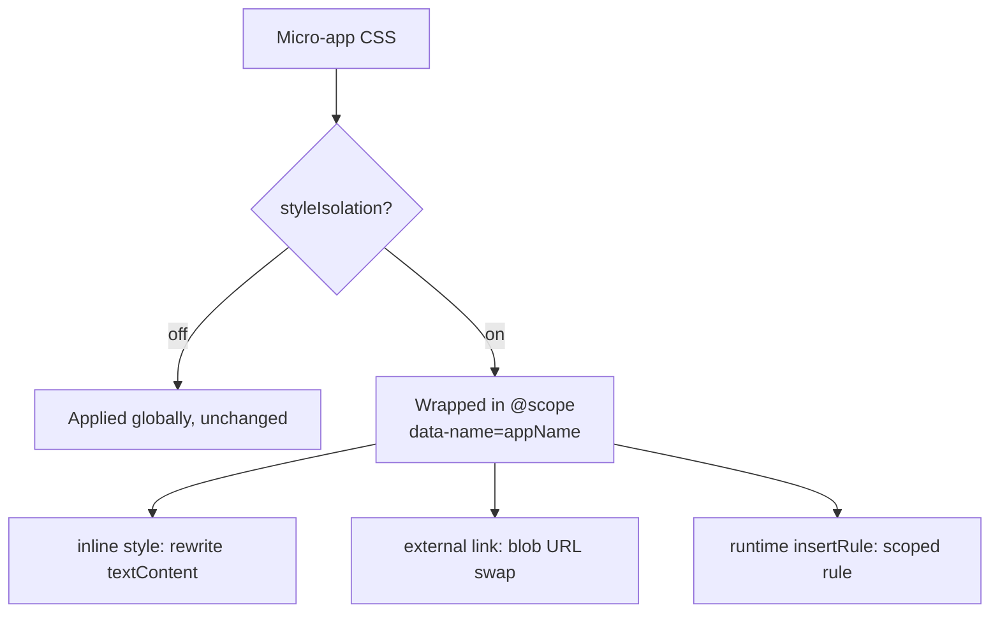

# Style isolation internals

> This page documents the style-rewriting implementation for maintainers. For the user-facing behavior and constraints, see [Style isolation](/concepts/style-isolation).

Style isolation keeps a micro-app's CSS from leaking into the main app or its siblings. In qiankun v3 this is an opt-in, runtime mechanism built on the native CSS [`@scope`](https://developer.mozilla.org/en-US/docs/Web/CSS/@scope) at-rule — not Shadow DOM. When you enable it, every stylesheet a micro-app ships is rewritten so its rules only match inside that app's container.

This page explains what the mechanism does, why it is shaped the way it is, and where its limits are. To turn it on, see [AppConfiguration](/api/configuration) and the how-to at [Enable CSS style isolation](/cookbook/enable-style-isolation).

## What it is

Set `sandbox: { styleIsolation: true }` on an app's configuration and qiankun wraps that app's CSS in an `@scope` block bound to the app container:

```css
@scope ([data-name="your-app"]) {
  /* the app's rules, rewritten */
}
```

The scope root is always `[data-name="<appName>"]`. qiankun stamps every app container with a `data-name` attribute equal to the registered app name, and derives the selector from it. This is not user-customizable — there is no option to pass your own scope root. Because the wrapping happens at the CSS level rather than by mounting the app into a shadow tree, the micro-app's DOM stays in the main document: global libraries, portals, and `document`-level queries continue to work the way the [JS sandbox](/concepts/js-sandbox) expects.

Isolation is one-directional in intent: it prevents a micro-app's declared rules from applying outside its container. It does not sandbox styles the main app or the browser default stylesheet push *into* the micro-app.



Style isolation is off by default. If you never set `sandbox.styleIsolation`, `<style>` and `<link>` nodes pass through the loader untouched.

## Inline `<style>`

For an inline `<style>` element, qiankun reads its `textContent`, transforms it, and writes the scoped result back into the same node. Beyond the surrounding `@scope` wrapper, the transform does several things that plain wrapping would get wrong:

- **`@font-face` and `@namespace` are hoisted out** of the `@scope` block and kept global. Scoping a `@font-face` breaks font loading, and `@namespace` must be document-level, so both are lifted back to the top of the sheet.
- **`@keyframes` are renamed** with a per-app prefix — `__qk_<appName>_<name>` — and every `animation` / `animation-name` reference is rewritten to match. This stops two apps that both define a `spin` keyframe from clobbering each other, since `@scope` scopes selectors but not the global keyframe namespace.
- **Relative `url(...)` values are not rebased for inline styles.** The current inline-style path does not pass a stylesheet base URL to the transformer. Use absolute, `data:`, or `blob:` URLs when the host and micro-app do not share the same document base.
- **`@import` is recursively inlined.** Each imported sheet is fetched through the app's decorated `fetch`, transformed the same way, and spliced in, deduplicated against a visited set. Use absolute import URLs in inline styles because this path does not resolve them against the micro-app entry.

Because inlining `@import` can require network round-trips, qiankun clears the `<style>`'s `textContent` synchronously first, then fills in the scoped CSS once everything resolves. That prevents the unscoped source from applying globally during the fetch window.

## External `<link rel="stylesheet">`

Native `@scope` can only wrap CSS text you control, but the browser loads an external stylesheet opaquely — there is no hook to wrap it as it arrives. So under style isolation qiankun stops the browser from loading the `<link>` natively and takes over fetching itself, using what the codebase calls the blob-link approach:

1. Resolve the `href` against the base URL, then **remove the `href` attribute** and stash the original under `data-href`. With no `href`, the browser never loads the unscoped stylesheet.
2. **Fetch the CSS** through the app's decorated `fetch`, then run it through the same `@scope` wrapping transform used for inline styles.
3. **Serve it as a `blob:` URL** on the *same* `<link>` element: the wrapped CSS becomes a `Blob`, and its object URL is set back as the element's `href`.

Unlike the inline-style path, the external stylesheet transform receives the resolved stylesheet URL as its base. Relative `url(...)` and `@import` references are therefore resolved against the external stylesheet URL before the scoped CSS is applied.

Node identity is preserved deliberately — qiankun swaps only the `href`, never the element. That keeps every native `<link>` semantic intact for free: `media`, `disabled`, `title`, and the entry in `document.styleSheets` stay live; the streaming loader's "a pending stylesheet blocks later scripts" bookkeeping still sees a normal pending link whose `load` fires when the blob href lands; and any `onload` / `onerror` handlers an app attaches to a dynamically injected `<link>` keep working.

If the fetch or the transform fails, no blob `href` is ever set — so the element would never emit an event on its own. qiankun manually dispatches an `error` event on the link and **drops the stylesheet** rather than falling back to loading it unscoped. Dropping it is the deliberate choice: a stylesheet that cannot be scoped is not allowed to leak globally.

Transformed sheets are cached by URL and then by app-scope key, and concurrent fetches for the same URL are deduplicated, so the same external stylesheet shared across apps is fetched and transformed only as many times as it has distinct scope roots.

## Runtime CSSOM

Styles inserted programmatically at runtime never pass through the loader, so qiankun intercepts them at the CSSOM level. When style isolation is active, `CSSStyleSheet.prototype.insertRule` is monkey-patched (ref-counted, installed while any style-isolated app is live and removed when the last one unmounts). If the sheet's owning node carries a style-isolation config, the incoming rule text is scoped — wrapped in `@scope`, with the same keyframe renaming — before it reaches the native `insertRule`.

This synchronous path skips rules that are already `@scope`-wrapped and keeps `@font-face` / `@namespace` global, matching the static transform. It is what keeps CSS-in-JS libraries and frameworks that build stylesheets at runtime scoped along with everything else.

## Preload rewrites

A response preloaded through `<link rel="preload" as="style">` can only be reused by a native stylesheet request. With style isolation enabled, the transpiler consumes the stylesheet through `fetch()` instead, so the original preload would go to waste. qiankun therefore rewrites the link to `as="fetch"` and adds `crossorigin="anonymous"` unless it already uses `use-credentials`, allowing the later `fetch()` to reuse the warm-up response.

Separately, whenever the [ESM sandbox](/concepts/esm-sandbox) is active, qiankun rewrites `rel="modulepreload"` to `rel="preload" as="fetch"` because the engine imports rewritten blob URLs instead of the original module URL. This rewrite does not depend on style isolation. The original modulepreload credentials behavior is preserved through the `crossorigin` setting.

## Requirements and limits

::: warning Requires native CSS `@scope`
The implementation contains no polyfill and no fallback. It relies entirely on the browser supporting the CSS `@scope` at-rule. In a browser without `@scope`, the wrapping rule is inert and styles are not isolated. `@scope` is a recent addition to browsers; verify support against your target matrix before depending on it.
:::

::: warning External sheets must be CORS-fetchable
Because external stylesheets are re-fetched through `fetch` and served as `blob:` URLs, a cross-origin sheet must return proper CORS headers. If it cannot be fetched, qiankun drops it — the stylesheet silently disappears (with a console warning) rather than loading unscoped. Serve micro-app stylesheets with CORS enabled, or the isolated app will render unstyled.
:::

::: info Known edge cases
- **`@font-face` collisions.** Font-face rules are intentionally kept global so fonts load correctly. Two apps that declare the same `font-family` name can therefore collide. Use distinct font-family names per app.
- **Dynamically constructed keyframe names.** Keyframe renaming is a static text transform. If your JS builds an animation name by string concatenation at runtime (rather than writing it literally in CSS), the reference is not rewritten and the animation may not resolve.
:::

::: tip Difference from qiankun 2.x
v3 style isolation is the `@scope` + blob-link mechanism described here, toggled by a single boolean. The 2.x options `sandbox.strictStyleIsolation` and `sandbox.experimentalStyleIsolation` (Shadow DOM based) do not exist in v3. The only knob is `sandbox.styleIsolation`. See [Migrate from qiankun 2.x](/cookbook/migrate-from-2x).
:::

## The public knob

| Option | Type | Default | Description |
| --- | --- | --- | --- |
| `sandbox.styleIsolation` | `boolean` | `false` | Enable runtime CSS isolation via `@scope` wrapping. When enabled, all of the micro-app's styles are scoped to its container (`[data-name="<appName>"]`). |

`styleIsolation` is a per-app field inside the `sandbox` object of the app configuration. Pass it as the second argument to [loadMicroApp](/api/load-micro-app):

```ts
import { loadMicroApp } from 'qiankun';

const container = document.getElementById('subapp-viewport');
if (!container) throw new Error('subapp-viewport not found');

const microApp = loadMicroApp(
  {
    name: 'react-app',
    entry: '//localhost:7101',
    container,
  },
  {
    sandbox: { styleIsolation: true },
  },
);
```

For the full field list see [AppConfiguration](/api/configuration); for a task-oriented walkthrough see [Enable CSS style isolation](/cookbook/enable-style-isolation).
