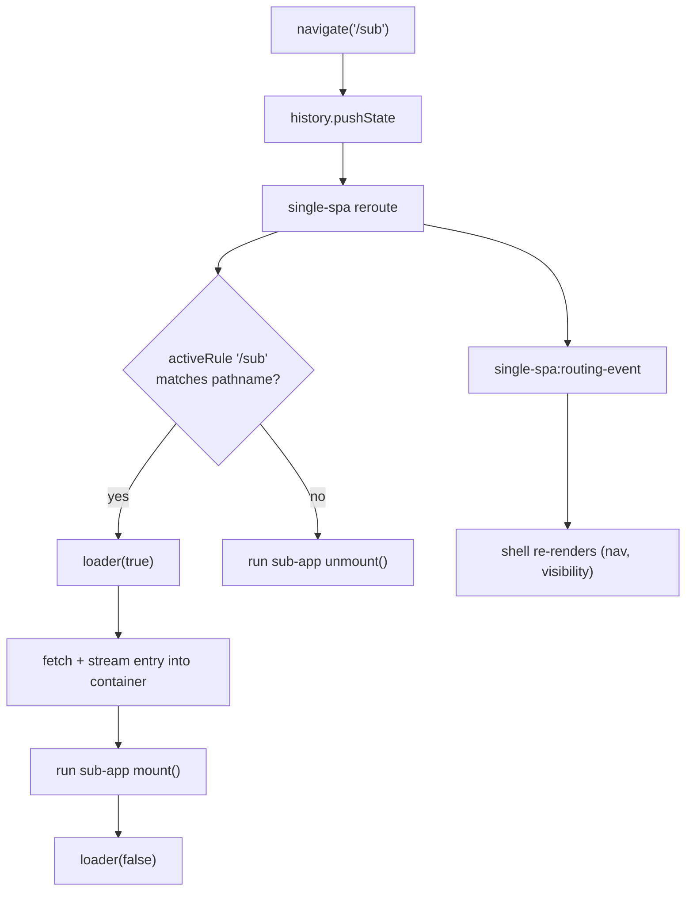

# Step 2 — Build the main app

In [Step 1](/tutorial/build-the-micro-app) you exposed a micro-app on `//localhost:7100`. Now you will build the **main app** (the host, also called the shell): a plain Vite app that registers the micro-app, decides when it is active based on the URL, and renders it into a container it owns.

By the end of this page you will have a host that:

- registers the micro-app with [`registerMicroApps`](/api/register-micro-apps) and boots qiankun with [`start`](/api/start),
- owns one persistent container element the micro-app mounts into,
- drives mount/unmount from the URL with a few lines of hand-rolled routing,
- shows a loading indicator while the micro-app is being fetched and mounted.

::: info The host is not a micro-app
The main app is an ordinary application. It does **not** use `@qiankunjs/bundler-plugin`, and its HTML entry script carries **no** `entry` attribute — that attribute is only for apps that will themselves be loaded by qiankun. See [Make a Vite app qiankun-ready](/cookbook/prepare-a-vite-app) for the sub-app side.
:::

## Create the host Vite app

Scaffold a normal React + Vite app. The only plugins it needs are the ones you would use in any Vite app.

::: code-group

```bash [terminal]
npm create vite@latest main -- --template react-ts
cd main
npm install qiankun
```

```ts [main/vite.config.ts]
import react from '@vitejs/plugin-react';
import { defineConfig } from 'vite';

export default defineConfig({
  // plain react() — no qiankun bundler plugin, the host is not a micro-app
  plugins: [react()],
  server: {
    port: 7099,
    strictPort: true,
  },
});
```

:::

The HTML entry is a standard Vite SPA entry. Note there is no `entry` attribute on the script tag.

```html [main/index.html]
<!doctype html>
<html lang="en">
  <head>
    <meta charset="UTF-8" />
    <title>qiankun host</title>
  </head>
  <body>
    <div id="root"></div>
    <!-- a normal SPA entry: no `entry` attribute here -->
    <script type="module" src="/src/main.tsx"></script>
  </body>
</html>
```

## Register the micro-apps

Registration is the core of the host. Call [`registerMicroApps`](/api/register-micro-apps) with one entry per micro-app, then call [`start`](/api/start) exactly once.

```ts [main/src/register.ts]
import { registerMicroApps, start } from 'qiankun';

let registered = false;

export function registerAll(
  container: HTMLElement,
  onLoading: (name: string, loading: boolean) => void,
): void {
  // guard against double-invoke — React StrictMode runs effects twice in dev
  if (registered) return;
  registered = true;

  registerMicroApps([
    {
      name: 'react', // must match the window global the sub-app exposes
      entry: '//localhost:7100', // the sub-app dev server root (its index.html)
      container, // the persistent host element captured at registration time
      activeRule: '/sub', // qiankun mounts this app while the path starts with /sub
      loader: (loading) => onLoading('react', loading),
      configuration: {
        sandbox: true, // Proxy-membrane JS sandbox (default true)
        styleIsolation: true, // runtime CSS @scope isolation (default false)
      },
    },
  ]);

  start();
}
```

Each entry in the array is a `RegistrableApp`. The fields used here:

| Field | Type | Description |
| --- | --- | --- |
| `name` | `string` | Unique app name. Must match the sub-app's exposed window global / library name (see below). |
| `entry` | `string` | URL of the sub-app's HTML entry. A plain string in v3 — always an HTML URL. |
| `container` | `HTMLElement` | The DOM element the app mounts into. An element instance, not a selector. |
| `activeRule` | `string \| fn \| Array` | single-spa activity rule. When it matches `location.pathname`, the app mounts; otherwise it unmounts. |
| `loader` | `(loading: boolean) => void` | Called with `true` before mount and `false` after — drive your loading UI here. |
| `configuration` | `AppConfiguration` | Per-app options. See [AppConfiguration](/api/configuration). |

::: tip configuration is per-app in v3
In qiankun 3.0 there is no global config passed through `start()`. `start` takes only `{ urlRerouteOnly? }` (single-spa's option). Everything else — `sandbox`, `styleIsolation`, `fetch`, `globalContext`, `nodeTransformer`, `streamTransformer` — lives on the per-app `configuration` object. The full set is documented in [AppConfiguration](/api/configuration).
:::

### Why `name` must match the sub-app's global

When qiankun finishes loading a classic (UMD/global) micro-app, it discovers the app's lifecycle functions. The final fallback in that lookup is `window[name]` — the global keyed by the registered `name`. So a mismatch means qiankun cannot find `bootstrap`/`mount`/`unmount` and throws.

Concretely, if you register `name: 'react'`, the sub-app must expose its lifecycles as `window['react']` (for the classic path) or export them from its ESM entry module. If your bundler sets a library name — for example `@qiankunjs/bundler-plugin` for Webpack emits `output.library = { name: 'webpack-app', type: 'window' }` — then the registered `name` must equal that library name (`'webpack-app'`), which is often different from the route.

::: warning `name` is the app identity, not the route
`name` and `activeRule` are independent. It is fine for an app named `webpack-app` to activate on `/webpack`. Keep `name` aligned with the sub-app's global; use `activeRule` for the URL.
:::

## Provide one persistent container

qiankun captures the `container` **element reference** at registration time and reuses it for every mount and unmount of that app. That leads to one hard rule.

::: danger The container must never be unmounted or keyed
Render a single container `<div>` once and keep it in the DOM for the lifetime of the host. Do not conditionally render it, do not put it behind a route, and do not give it a React `key` that changes — any of these swaps the element for a new one, and qiankun will keep writing into the stale, detached node. The visible symptom is a micro-app that "mounts" but never appears.
:::

Capture the element with a ref and register only once it exists in the DOM.

```tsx [main/src/App.tsx]
import { useEffect, useRef, useState } from 'react';
import { registerAll } from './register';
import { usePathname } from './router';

export default function App() {
  const pathname = usePathname();
  const containerRef = useRef<HTMLDivElement>(null);
  const [loading, setLoading] = useState(false);

  // register once the container exists; registerAll self-guards, so
  // StrictMode's double effect is harmless
  useEffect(() => {
    if (containerRef.current) {
      registerAll(containerRef.current, (_name, isLoading) => setLoading(isLoading));
    }
  }, []);

  const onSub = pathname.startsWith('/sub');

  return (
    <div>
      <nav>{/* navigation goes here — see below */}</nav>

      {/* the container stays mounted forever — qiankun holds this exact element */}
      <div ref={containerRef} id="subapp-container" hidden={!onSub} />

      {loading && <p>loading micro-app…</p>}
      {!onSub && <p>Pick a micro-app from the nav.</p>}
    </div>
  );
}
```

::: tip Hide, do not remove
When no micro-app is active you can hide the container (`hidden`, `display: none`, zero height) but you must not remove it from the tree. Hiding keeps the same element reference alive; removing it breaks the next mount.
:::

## Wire up routing

qiankun is built on [single-spa](https://github.com/single-spa/single-spa): as the URL changes, single-spa re-evaluates every app's `activeRule` and mounts or unmounts accordingly. You do not need a routing library for this — you need two things:

1. a way to **change** the URL (`history.pushState`), and
2. a way to **react** to URL changes so your own shell UI (active nav item, container visibility) stays in sync.

For the second part, listen to both `popstate` (browser back/forward) and `single-spa:routing-event` (emitted by single-spa after every reroute, including the ones triggered by `pushState`).

```ts [main/src/router.ts]
import { useSyncExternalStore } from 'react';

// single-spa patches pushState and emits its routing event after each reroute;
// listening to both keeps the shell in sync with every navigation
function subscribe(callback: () => void) {
  window.addEventListener('popstate', callback);
  window.addEventListener('single-spa:routing-event', callback);
  return () => {
    window.removeEventListener('popstate', callback);
    window.removeEventListener('single-spa:routing-event', callback);
  };
}

export function usePathname(): string {
  return useSyncExternalStore(subscribe, () => window.location.pathname);
}

export function navigate(path: string): void {
  if (window.location.pathname !== path) {
    window.history.pushState(null, '', path);
  }
}
```

Navigation then is just a `pushState`; qiankun does the rest.

```tsx [main/src/App.tsx (nav)]
import { navigate } from './router';

// inside <nav>:
<button type="button" onClick={() => navigate('/sub')}>
  Open micro-app
</button>
<button type="button" onClick={() => navigate('/')}>
  Home
</button>
```

Clicking **Open micro-app** pushes `/sub`, single-spa sees `activeRule: '/sub'` now match, and it mounts the app into your container. Clicking **Home** pushes `/`, the rule no longer matches, and single-spa unmounts the app and runs its `unmount` lifecycle.

The end-to-end flow:



## Drive the loading UI

Each registered app can take a `loader` callback. qiankun calls it with `true` immediately before mounting and `false` once mount resolves, so it is the natural hook for a spinner or skeleton. You already wired it in `register.ts`; the host just turns that signal into UI.

```tsx [main/src/App.tsx (loading)]
// onLoading was passed into registerAll and stored in state:
const [loading, setLoading] = useState(false);

useEffect(() => {
  if (containerRef.current) {
    registerAll(containerRef.current, (_name, isLoading) => setLoading(isLoading));
  }
}, []);

// …later in the render:
{loading && <p>loading micro-app…</p>}
```

With more than one micro-app, key the loading state by `name` so each app shows its own indicator:

```tsx
const [loadingApps, setLoadingApps] = useState<Record<string, boolean>>({});

registerAll(containerRef.current, (name, isLoading) => {
  setLoadingApps((prev) => (prev[name] === isLoading ? prev : { ...prev, [name]: isLoading }));
});
```

::: tip Inspect what qiankun writes on the container
When an app mounts, qiankun stamps its container with data attributes you can read for diagnostics: `data-name` (the app name), `data-version` (the qiankun version), and `data-sandbox-cfg` (the serialized sandbox config). They are handy for building a status badge in the shell.
:::

## Boot the host

Render `App` as usual. No qiankun-specific wiring is needed in the entry file — registration happens inside `App`'s effect.

```tsx [main/src/main.tsx]
import { StrictMode } from 'react';
import { createRoot } from 'react-dom/client';
import App from './App';

createRoot(document.getElementById('root')!).render(
  <StrictMode>
    <App />
  </StrictMode>,
);
```

Because `registerAll` guards itself with the `registered` flag, StrictMode's intentional double-invocation of effects does not register the apps twice or call `start()` twice. `start()` is idempotent on its own, but keeping registration behind a single guard is the clean pattern.

## Recap

- The host is a plain Vite app — no bundler plugin, no `entry` attribute on its script.
- `registerMicroApps([...])` declares each app; `start()` runs once to activate them.
- One container element is captured at registration and must live forever — never keyed, never unmounted.
- `name` must match the sub-app's exposed global / library name; `activeRule` drives mount/unmount from the URL.
- Routing is `history.pushState` plus listeners on `popstate` and `single-spa:routing-event`.
- `loader(loading)` gives you the mount/unmount signal for a loading indicator.

Next, [Step 3 — Connect, run, and verify](/tutorial/run-and-verify) starts both dev servers and confirms the micro-app mounts, unmounts, and stays isolated inside the sandbox.
